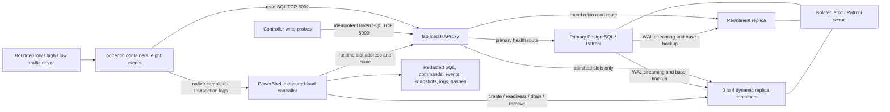

# Phase 4: isolated dynamic replica scaler

See the [scaling decisions and replication investigation](SCALING_REPLICATION_INVESTIGATION.md) for component responsibilities, exact decision timestamps/thresholds, dataflow, scale-in safety and the replication-slot evidence gap.

**New verification completed:** [returned-row slot results](SLOT_VERIFICATION_RESULTS.md) document run `phase4-20260908T231619712-a9cb57ed`: four actual slot absences verified, 41 replication samples, primary logs retained through elastic1 cleanup and 23 passing slot/mutation tests. This closes the gap **for the new run only**; the original historical run remains slot unavailable/not verified. No physical disk reclamation is claimed.

For blog readers asking whether production needs the same scripts, see the [production FAQ and deployment alternatives](PRODUCTION_FAQ.md). A production controller is required for demand-based scaling, but it need not be this custom lab runner.

This is a bounded demonstration, **not a production autoscaler**. It creates its own run-specific network, etcd, Patroni scope, primary, permanent replica and HAProxy. It does not use Compose or change the existing Phase 3 cluster. No host ports are published. All container/network/volume names start with `phase4-`.

## Run prerequisites and parameters

- Windows PowerShell **7.2+**, Docker Desktop in Linux-container mode, and bind-mount access to this checkout. No host Python, WSL, image build, package install or image pull is required.
- Existing local images: `postgres-patroni-ha-pg-node-1:latest`, `quay.io/coreos/etcd:v3.5.15`, `haproxy:2.9-alpine`. The node image must contain Patroni, PostgreSQL 16 clients, curl and the writable postgres-owned directories from the existing Dockerfile.
- Run [run-lab.ps1](run-lab.ps1) with PowerShell 7 (`pwsh -NoProfile -File` followed by its path). Docker must already be running. The runner validates HAProxy inside its pinned image when actually executed.
- Parameters: `NodeImage`, `EtcdImage`, `ProxyImage`; `TrafficDurationSeconds=1200` (per driver, hard bound); `ReadyTimeoutSeconds=180`; `CommandTimeoutSeconds=60`; `CooldownSeconds=15`; `LabTimeoutSeconds=1800`; `NodeMemoryMB=512`; `SlotAbsenceTimeoutSeconds=120` (30–600).
- Allow **10–20 minutes**, depending on reconciliation, storage, base backups and verbose log copying. The default overall experiment deadline is 30 minutes, plus bounded final evidence capture. Increase traffic and lab deadlines together on slower hosts. A query error, unknown state or reconciliation timeout fails the run; it never counts as verified absence.
- Maximum database allocation is six × 512 MiB, plus 256 MiB etcd, 128 MiB HAProxy, 256 MiB live traffic and Docker overhead. Existing clusters consume additional memory; an 8 GiB Docker VM is recommended. Verbose SQL/pgbench logging needs ample disk space.

## Experiment and independent policy

1. Start primary; confirm leader and SQL writable before creating the permanent replica. Seed 100,000 deterministic immutable fixture rows and an empty token-primary-key events table in database `postgres` using admin `postgres`.
2. Drive 2 offered TPS for at least 15 seconds, then 100 offered TPS / eight clients. Each transaction reconnects to HAProxy's replica route.
3. Controller reads **completed native pgbench transaction logs**, not offered load. Two samples strictly above 20 TPS create the next elastic replica, sequentially, up to four. Two samples strictly below 5 TPS remove one. A 15-second cooldown follows each completed action. Neither stage nor offered rate is a controller argument.
4. Every elastic node is a real dynamic `docker run`, with its own named volume and `nofailover=true`. Admission requires Patroni running/replica, streaming membership, known zero-byte lag, recovery SQL, fixture count/hash and HAProxy health. Runtime slot addresses come from narrowly formatted Docker IP inspection, not DNS guesses.
5. Four admitted replicas must be confirmed before the driver holds high load for at least 20 more seconds and lowers demand. Low traffic continues until all four are removed, then at least 10 more seconds.
6. Removal checks baseline safety, fixture/token agreement and target nofailover/replica, drains sessions to `scur=0`, enters maintenance and rechecks safety. SIGTERM shutdown precedes **full** Docker and PostgreSQL log copying. Only then is the container removed, without `-v`; absence and retained volume are verified.
7. [Read-only slot observation](slot-observation.ps1) captures returned `pg_replication_slots`, `pg_stat_replication` and live-replica `pg_stat_wal_receiver` rows at baseline, each admission readiness, pre-drain/pre-stop/post-stop/post-remove, bounded reconciliation and final state. Actual slot names come from sender PID/member and receiver-slot correlation, not guessed name normalization. Every sample validates the same primary identity/timeline and an active permanent-replica slot with healthy streaming receiver. No manual slot/DCS deletion is performed.
8. Successful scale-in now also requires the exact target slot to be absent in a successful SELECT within the configured window, followed by remaining-node data agreement. Results separate `containerRemoved`, `dataAgreementVerified`, `slotAbsentVerified` and preconditions/timestamps. Primary logs are archived after final observation. WAL bytes retained by a slot are measured separately; absence does not prove physical disk reclamation. Older evidence is not retroactively upgraded.

[traffic.sh](traffic.sh) uses `PGDATABASE=postgres` and explicit `pgbench --debug` (short `-d` means debug, not database). It runs natural 10-second batches; SIGTERM requests that the shell stop after the current batch flushes. The runner allows 30 seconds and requires traffic exit 0. Each batch gets distinct transaction-log filenames. [read.sql](read.sql) uses a fixed random seed and random indexed ranges, returning server address and recovery status. pgbench normally discards result rows; expanded SQL appears in debug logs and server SQL logs. Routing CSV and explicit SQL snapshots provide complementary evidence.

## Topology and dataflow

The fixture and token-event schema are separate from all existing lab databases. The scaler maintains **one** permanent replica, not the three-replica Phase 3 baseline. At peak this isolated stack has one primary plus five replicas. Elastic nodes are never admitted to the write backend. A newly created container remains out of routing until data/role/lag checks pass; removal goes through drain, zero sessions, maintenance, revalidation, graceful stop, log archive, container removal and volume-preservation check.

## Execution and verification

- VS Code task **Phase 4: isolated dynamic replica scaling LAB** runs the runner with `TrafficDurationSeconds=900`; this is a driver deadline, not a scale trigger.
- [validate-static.ps1](validate-static.ps1) tests parser/config invariants, controller hysteresis/cooldown/bounds, live-file sharing, native metric windows, command pipe capture, redaction, timeout evidence and HAProxy acknowledgement handling without starting Docker.
- [verify-evidence.ps1](verify-evidence.ps1) takes `-EvidencePath` for a completed run and optionally `-Live`. It verifies every manifest hash/length and file coverage, scans for the runner's credential format, checks measured action thresholds, peak routing, drain/maintenance events, final fixture/token equality and complete transaction records, and rejects client error signatures. Live checks inspect only that run's resources and verify retained elastic volumes and clean client exits. Reports are outside the immutable raw evidence.
- [verify-slot-evidence.ps1](verify-slot-evidence.ps1) independently reconstructs active-to-absent slot outcomes from returned SQL/REST commands, checks lifecycle ordering, primary continuity, baseline health, data/token evidence, SQL errors and the final primary archive. Historical evidence without these captures reports **unavailable/not verified**, writing a separate slot-audit report rather than overwriting the original report. [test-slot-observation.ps1](test-slot-observation.ps1) runs offline mocks; optional `-EvidencePath` adds in-memory evidence mutation tests.

## Evidence and retention

Each invocation exclusively creates a new run directory under the evidence folder. Tracking follows [.gitignore](.gitignore); this experiment does not change that policy:

- LF-normalized source copies, including the existing entrypoint and the new template; never a rendered password-bearing Patroni config or environment file.
- `commands.jsonl`: timestamp, exact redacted argv/stdin, exit, stdout, stderr, timeout and duration. Concurrent output reads avoid pipe deadlocks. Timeout kills the local CLI process tree; the remote action might already have happened, so inspect retained resource state.
- `sql.jsonl`: every controller SQL input, target and outcome. Traffic SQL lives in the copied workload plus pgbench debug/server logs, not as one JSON entry per transaction.
- Metrics, controller evaluations, lifecycle/driver events, roles/routing, fixture hashes and token snapshots; resource observations; raw transaction logs; full redacted server archives.
- `result.json`, narrowly scoped `resources.json`, and SHA-256 `manifest.json` excluding itself. A failed final archive makes the run unsuccessful, even if scaling completed.

Writes always pass through the own proxy primary route. Ambiguous write outcomes retry the **same** token, using conflict-safe insertion. Before removal and at final validation, every replica must contain exactly the primary's complete expected token set and fixture hash.

Success leaves primary, permanent replica, etcd and proxy running; names are printed and recorded. Elastic containers are removed but all named volumes remain. Traffic containers are stopped and retained for inspection. Failure stops traffic and archives what it can, but **does not tear down database resources**: a slot may remain ready, draining or in maintenance. Review the result and inventory before manual cleanup; do not use broad prune commands. No automatic rollback, teardown or resource adoption is attempted.

Random alphanumeric lab passwords exist only in process memory and Docker container metadata. All evidence replaces exact password values, including copied SQL logs; no full environment inspect is performed. During `docker cp`, raw log files can briefly exist before redaction. Anyone with Docker/host access can retrieve credentials; this is not a secret-management design. Retained PostgreSQL volumes contain the database itself and are outside the evidence redaction boundary. Local `docker exec` as image user postgres can use local trust authentication for later examination; passwords are deliberately not recoverable from evidence.

## Limitations / validation status

- Original Docker execution results are in [RESULTS.md](RESULTS.md); the new slot-verified run and its preserved failed attempt are in [SLOT_VERIFICATION_RESULTS.md](SLOT_VERIFICATION_RESULTS.md). Reports alone are not a substitute for retained raw artifacts.
- Samples use a trailing 10-second transaction-timestamp window ending two seconds in the past. Windows readers allow `ReadWrite | Delete`. Native pgbench buffering can undercount recent/low-rate completions; overlapping windows and debug I/O mean this is demonstrative rather than an unbiased capacity metric. No offered-rate fallback exists. A stopped driver fails the run instead of inducing scale-in.
- Observation polling uses blocking `docker stats --no-stream`, not sleeps. Actions and evidence collection are synchronous; sample cadence is variable and controller decisions pause during base backups/archives. The driver is a separate function, not a production concurrent service.
- Primary/base can technically fail over, but this experiment expects the original primary to remain writable and aborts on role changes. It injects no failures and does not demonstrate HA of the single etcd/proxy, durable HAProxy runtime state, CPU-based scaling, latency SLOs or production pooling.
- Elastic stopped-container logs are complete through shutdown; final running baseline logs are a live, non-atomic copy. Log files are not truncated by the runner, but disk-full/OOM/external deletion can invalidate evidence. SQL text logging is intentionally costly and inappropriate as a production default.
- One bounded up/down cycle; no reusable-volume rejoin or resource cleanup controller. Every invocation creates a fresh isolated stack. Earlier attempts and their data are retained, so repeated runs consume additional resources.