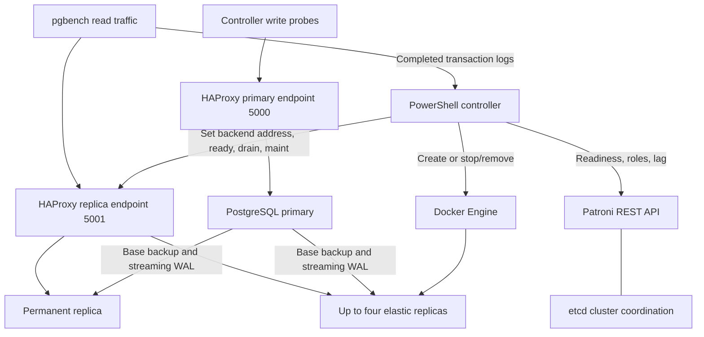

# Phase 4 — scaling decisions and replication investigation

Analysis date: **9 September 2026**. Historical run: **phase4-20260908T173358240-1efd4a87**, executed **8 September 2026**. All times below are **UTC** (add 05:30 for IST). This analysis uses retained artifacts; no workload was replayed and no current database state is substituted for historical observations.

## 1. Which component makes each decision?

| Component | Responsibility | Does NOT do |
|---|---|---|
| PowerShell `Controller()` in [runner](run-lab.ps1#L392-L405) | Evaluates measured completed TPS, consecutive-sample counters, cooldown and replica bounds; calls `Add-Elastic()` or `Remove-Elastic()`. | Does not delegate load-based scaling to Patroni, Docker or HAProxy. |
| `Traffic-Driver()` and [traffic generator](traffic.sh) | Produces low/high/low synthetic demand; pgbench writes native transaction logs and expanded SQL debug traces. | Offered TPS and experiment stage are not inputs to `Controller()`. |
| `Measured-TPS()` in [runner](run-lab.ps1#L365-L391) | Counts completed transaction records in a timestamp window. | Does not use CPU, RAM, query latency or connection count as scaling triggers. |
| Docker Engine, invoked by the runner | Creates unique replica containers and named volumes from the existing image; stops/removes containers when instructed. | Does not independently autoscale or create additional physical hosts. |
| Patroni + etcd | Manage cluster membership/leadership and replication configuration; Patroni reconciles physical replication slots on PostgreSQL. etcd stores distributed coordination state, not application rows. | Do not decide how many read replicas to create from traffic measurements. |
| PostgreSQL | Takes/receives base backups, streams and replays WAL, serves primary writes and replica reads, implements replication slots. | Does not turn replicas into independent writable shards. |
| HAProxy | Health-checks primary/replica roles and balances eligible new read connections. Runner controls elastic address/admission/drain through its runtime API. | Does not inspect SQL to split reads/writes and does not move an existing connection to a new server. |

This is a **synchronous, bounded lab controller**, not a persistent production service. It performs one up/down experiment with at most four elastic replicas. After the script exits it makes no further load-based decisions. Source/config used for the historical run are preserved in the [source snapshot](evidence/phase4-20260908T173358240-1efd4a87/source/run-lab.ps1).

## 2. When does scaling happen, and why?

At metric collection time `t`, the runner uses the interval **(t − 12 seconds, t − 2 seconds]**. Completed TPS equals the number of valid completed transaction records in this 10-second interval divided by 10. The two-second offset reduces live log-buffering effects. Invalid/failed/skipped records are not counted as completions.

| Rule | Exact behavior |
|---|---|
| Scale out | At least two consecutive controller evaluations with measured TPS **strictly greater than 20**, fewer than four active elastic replicas, and cooldown satisfied. Creates one replica per action. |
| Scale in | At least two consecutive evaluations with TPS **strictly less than 5**, at least one active elastic replica, and cooldown satisfied. Removes the most recently admitted active replica first. |
| Middle band | Values **5 through 20 inclusive** reset both counters and do not trigger scaling. |
| Cooldown | At least **15 seconds after the action function returns**, including its snapshot/data-agreement work. It is not measured from container creation or from the initial decision timestamp. Counters reset after that action. |
| During cooldown | Evaluations and counters are recorded, but actions are suppressed until eligible. |
| Bounds | Baseline is one primary plus one permanent replica. Elastic range 0–4; total PostgreSQL containers 2–6. Permanent nodes are never scale-in candidates. |

Monitoring is **not a fixed 10-second scheduler**. Work such as Docker resource sampling, write probes, snapshots, readiness and archives determines evaluation cadence; sample windows can overlap. Two qualifying evaluations do not prove two independent 10-second intervals. The loop collects a metric, then performs a write probe and snapshot before calling the controller: the recorded metric can therefore precede the decision by several seconds.

The traffic driver offers 2 TPS initially, then 100 TPS with eight clients. It lowers demand to 2 TPS only after all four elastic replicas are admitted, all five replicas have served proxy traffic, and a high-load steady interval of at least 20 seconds has elapsed. This controls the experiment, but **actual measured completions** control scale actions. Completions alone are an imperfect production signal: falling throughput can mean overload/failure rather than falling demand. The lab checks traffic-driver liveness but does not solve that production ambiguity.

### Exact historical decisions

Times are rounded to milliseconds for display; full precision is retained in the [machine-readable action report](reports/phase4-20260908T173358240-1efd4a87.json). Completion means the `elastic-admitted` or `elastic-removed` event, not a replication-slot deletion event. Later snapshot work may postpone the start of cooldown.

| Action | Replica | Decision UTC | Admission/removal UTC | Measured TPS | Decision to event (s) |
|---|---|---|---|---:|---:|
| Out | elastic1 | 17:34:57.776 | 17:35:08.733 | 60.0 | 10.957 |
| Out | elastic2 | 17:35:27.424 | 17:35:40.057 | 56.5 | 12.633 |
| Out | elastic3 | 17:36:04.485 | 17:36:18.802 | 63.8 | 14.317 |
| Out | elastic4 | 17:36:41.666 | 17:36:58.248 | 56.0 | 16.582 |
| In | elastic4 | 17:38:25.701 | 17:38:39.226 | 1.4 | 13.525 |
| In | elastic3 | 17:38:59.762 | 17:39:11.028 | 2.4 | 11.266 |
| In | elastic2 | 17:39:33.061 | 17:39:43.290 | 2.6 | 10.229 |
| In | elastic1 | 17:40:02.071 | 17:40:12.249 | 2.6 | 10.178 |

Audit chain: [native-window metrics](evidence/phase4-20260908T173358240-1efd4a87/metrics.jsonl) → [every policy evaluation and counters](evidence/phase4-20260908T173358240-1efd4a87/decisions.jsonl) → [decision/admission/removal events](evidence/phase4-20260908T173358240-1efd4a87/events.jsonl) → [Docker commands with results and durations](evidence/phase4-20260908T173358240-1efd4a87/commands.jsonl). A command's end time is its UTC start plus recorded duration.

## 3. Replication and dataflow during scale-out

1. The controller creates a real container with a unique Patroni name, private-network identity and named persistent volume. Elastic members have `nofailover=true`.
2. Patroni bootstraps a replica with PostgreSQL base backup, then configures streaming replication. The primary generates WAL; replicas receive/replay changes. [Captured configuration](evidence/phase4-20260908T173358240-1efd4a87/source/patroni-template.yml) enables `use_slots`, 16 WAL senders and 16 replication slots, with a 5-second Patroni loop and 30-second TTL.
3. [Readiness checks](run-lab.ps1#L216-L230) require Patroni role `replica`, state `running`, cluster membership `streaming`, a known **zero-byte** reported lag, SQL recovery role, and 100,000 fixture rows with the expected hash. Unknown lag is not treated as zero.
4. Only then does [admission](run-lab.ps1#L290-L307) assign the inspected container IP to a predeclared disabled HAProxy slot, mark it ready, and wait for `UP`. This is dynamic container creation with bounded/preallocated proxy slots, not arbitrary unlimited backend discovery.
5. Snapshots check token agreement. The driver separately verifies all replicas actually served proxy connections. At peak all five replica backends were `UP`; connection counters are recorded in the [results](RESULTS.md#measured-scaling-actions).

All client writes still go to the primary. Elastic replicas receive the resulting changes through WAL, **not direct client write connections**. The configuration does not enable Patroni synchronous mode; point-in-time zero lag and token agreement are not a guarantee of synchronous commits, zero RPO under failure, or immediate read-after-write consistency on every replica. HAProxy's replica health/lag check complements admission but cannot guarantee zero lag forever.

## 4. Replication safety during scale-in

[Removal logic](run-lab.ps1#L309-L335) acts in this order:

1. Select the last active elastic replica; verify the permanent replica and target are ready.
2. Require primary/replica fixture and token agreement in a **before-removal snapshot**.
3. Drain HAProxy connections and wait for `scur=0`, then place the slot in maintenance.
4. Recheck target recovery/nofailover status and permanent-replica readiness immediately before stopping.
5. Send SIGTERM; require the container stopped with exit 0 and without OOM termination.
6. Copy full stopped-node PostgreSQL and Docker logs. On failure, retain the container rather than claim successful removal.
7. Remove the container **without deleting its named volume**; verify container absence and retained volume, then capture remaining-node agreement.

**A Docker volume, a HAProxy backend slot and a PostgreSQL replication slot are three different resources.** The first is retained data storage; the second remains a disabled routing entry; the third can retain WAL on the primary until PostgreSQL/Patroni releases it. Removing a container does not itself demonstrate that its replication slot was removed.

The runner does not explicitly call `pg_drop_replication_slot()` in this sequence and does not wait for slot absence. Patroni's separate reconciliation handles managed slots. If an abandoned slot remains, retained WAL can consume primary disk space. Graceful shutdown proves neither slot deletion nor WAL reclamation, so both deserve explicit post-removal measurement.

## 5. What the historical slot logs actually captured

The primary logs identify the relevant SQL session as **`app=Patroni heartbeat`, PID 77**. These are PostgreSQL statement/duration logs, **not query result sets**. CSV and stderr versions of the same log are duplicate representations, not independent observations.

### Conditional slot-creation statements

Each statement calls `pg_create_physical_replication_slot(..., true)` **only if the named physical slot does not already exist**. The following timestamps establish logged creation/reconciliation requests, not captured returned rows:

| Slot suffix | Statement UTC | Primary log evidence |
|---|---|---|
| base | 17:34:13.561 | [Creation request](evidence/phase4-20260908T173358240-1efd4a87/serverlogs/phase4-20260908T173358240-1efd4a87-primary-20260908T174031877-611d80/pg_log/postgresql-2026-09-08_173408.log#L59) |
| elastic1 | 17:35:03.560 | [Creation request](evidence/phase4-20260908T173358240-1efd4a87/serverlogs/phase4-20260908T173358240-1efd4a87-primary-20260908T174031877-611d80/pg_log/postgresql-2026-09-08_173408.log#L289) |
| elastic2 | 17:35:33.568 | [Creation request](evidence/phase4-20260908T173358240-1efd4a87/serverlogs/phase4-20260908T173358240-1efd4a87-primary-20260908T174031877-611d80/pg_log/postgresql-2026-09-08_173408.log#L409) |
| elastic3 | 17:36:08.534 | [Creation request](evidence/phase4-20260908T173358240-1efd4a87/serverlogs/phase4-20260908T173358240-1efd4a87-primary-20260908T174031877-611d80/pg_log/postgresql-2026-09-08_173408.log#L548) |
| elastic4 | 17:36:48.534 | [Creation request](evidence/phase4-20260908T173358240-1efd4a87/serverlogs/phase4-20260908T173358240-1efd4a87-primary-20260908T174031877-611d80/pg_log/postgresql-2026-09-08_173408.log#L699) |

Full names use prefix `phase4_20260908t173358240_1efd4a87_`. Patroni also logs inventory queries against `pg_replication_slots`, but their returned rows are not in the captured controller SQL/snapshot records.

### Conditional slot-cleanup statements after container removal

| Slot | Container removal event UTC | Cleanup statement UTC | Statement duration (ms) | Evidence |
|---|---|---|---:|---|
| elastic4 | 17:38:39.226 | 17:39:08.563 | 18.897 | [Statement and duration](evidence/phase4-20260908T173358240-1efd4a87/serverlogs/phase4-20260908T173358240-1efd4a87-primary-20260908T174031877-611d80/pg_log/postgresql-2026-09-08_173408.log#L1177-L1178) |
| elastic3 | 17:39:11.028 | 17:39:43.556 | 8.342 | [Statement and duration](evidence/phase4-20260908T173358240-1efd4a87/serverlogs/phase4-20260908T173358240-1efd4a87-primary-20260908T174031877-611d80/pg_log/postgresql-2026-09-08_173408.log#L1325-L1326) |
| elastic2 | 17:39:43.290 | 17:40:13.514 | 6.634 | [Rotated-log statement and duration](evidence/phase4-20260908T173358240-1efd4a87/serverlogs/phase4-20260908T173358240-1efd4a87-primary-20260908T174031877-611d80/pg_log/postgresql-2026-09-08_174000.log#L55-L56) |
| elastic1 | 17:40:12.249 | Not found in retained primary log window | — | Last archived primary text-log record: 17:40:31.793 |

The three statements occur approximately **29–33 seconds after** their container-removal events. This supports asynchronous reconciliation rather than cleanup inside the runner's container-removal command. It does **not** establish a fixed cleanup SLA or prove a particular timer caused the delay. The elastic1 archive ends about 19.5 seconds after removal; its eventual cleanup is unknown from these artifacts.

The logged cleanup SQL selects the named slot and its `active` flag, invokes `pg_drop_replication_slot(slot_name)` **only for `WHERE NOT active`**, then selects `active` and a `dropped` flag. The duration record indicates statement completion, but a conditional query can complete without deleting anything. No returned `(active, dropped)` row was captured. Therefore **do not report `active=false, dropped=true`, three proven deletions, or all slots absent** from these records.

**Conclusion:** the gap is narrowed, not closed. There is direct evidence of Patroni issuing conditional cleanup for three elastic slots, including elastic2 in a rotated log. There is still **no captured before/after slot inventory proving successful cleanup for all four removals**. Successful container removal, replication agreement and artifact verification in the original report remain valid; they are not slot-cleanup verification.

## 6. First additions for a future run (not executed in this investigation)

1. Capture timestamped **returned rows**, not only SQL text, from the current primary before admission, after streaming readiness, before drain, after stop and after removal. Include `pg_replication_slots` fields `slot_name`, `slot_type`, `active`, `active_pid`, `restart_lsn`, `wal_status`, `safe_wal_size`, and retained-WAL bytes computed with `pg_wal_lsn_diff(pg_current_wal_lsn(), restart_lsn)`. Preserve null values rather than treating them as zero.
2. Capture `pg_stat_replication` sender states, application names, `sync_state`, sent/write/flush/replay LSNs; capture `pg_stat_wal_receiver` on each available replica. Correlate slot `active_pid` with sender PID and Patroni member name; record the primary identity and timeline at every sample.
3. After removal, observe slot absence over a bounded reconciliation window and record every query/result, elapsed time and timeout. Confirm the permanent replica's slot and streaming health remain intact. Do not force-drop a slot merely to make verification pass.
4. Retain primary logs through that observation window, across rotation. Measure WAL/disk retention separately: slot disappearance alone does not prove immediate filesystem reclamation.
5. Distinguish `containerRemoved`, `dataAgreementVerified`, `slotAbsentVerified` and `walRetentionObserved` in the result and verifier. A timeout or missing result is an explicit evidence gap, not inferred success.

Historical logs and the original manifest remain unmodified. A new live query could document today's state, but cannot reconstruct missing before/after rows from this run.