# PostgreSQL High Availability with Patroni, etcd and HAProxy

## A lab build that was tested by killing the primary

A single PostgreSQL server is one power cut away from an outage. This guide builds the usual open source answer to that problem, then breaks it on purpose to find out whether it really works.

The cluster has three PostgreSQL nodes managed by Patroni, one etcd node holding the leader lock, and HAProxy giving the application one address to connect to. Everything runs in Docker on a single machine.

Every timestamp, log line, WAL position and row count in this document comes from a real test run on 29 August 2026. Nothing has been made up or filled in for illustration. Where a number is specific to this environment, the text says so.

### Source code

All configuration files and test scripts referred to in this document are in the public repository:

**https://github.com/rameshsraj/pgandpatroni**

The Patroni build is in the `postgres-patroni-ha` folder. This document explains what each piece does and what happened when it was tested. It does not reproduce the files themselves, so please read them in the repository if you plan to adapt them.

### Where the numbers come from

The raw captured output for this run is committed to the repository under `postgres-patroni-ha/test-results`, in four folders: `before-failover`, `failover-events`, `after-failover` and `after-recovery`. Every output block in this document can be traced back to a file there, and the container logs include the full Patroni log with millisecond timestamps.

Two honest caveats about that evidence.

The captured HAProxy log has no timestamps, because HAProxy writes these particular messages without them. The order of events and the exact reason codes are therefore verified, but the few seconds attributed to HAProxy noticing the change are derived from the configured three second check interval rather than measured.

The moment the primary container was stopped, given below as 14:51:58, comes from the command output at the time. It is the one figure in the failover timeline that is not in a log file. Everything after it is.

### The scripts and the captured run are not an exact match

This is worth saying before the command list, because it would be easy to assume a tighter link than exists.

Three things do not line up. The failover script in the repository writes a marker row whose text ends with a timestamp, but the captured row has no timestamp in it. The recovery script writes a marker row of its own, and no such row exists in the captured table at all. The row that does exist for the replica test is not written by any script in the repository. On top of that, the state capture script writes sixteen files per snapshot, while the committed snapshots contain ten, one of which no script produces.

The conclusion is that the scripts were revised after this run, or parts of the run were done by hand. The captured output is genuine, and it agrees with itself everywhere it can be cross checked. What cannot be claimed is that running these scripts today produces exactly the files shown here.

So read the commands in the next section as the way to reproduce this lab, not as a transcript of the original session.

### What the test showed

| Question | Result from this run |
|---|---|
| Did the cluster fail over on its own? | Yes. Node pg-node-1 promoted itself with nobody touching it. |
| How long until a new primary existed? | About 33 seconds. Thirty of those seconds were the leader lock timeout. |
| How long until write traffic followed it? | About 36 seconds from the moment the primary was stopped. |
| Did the application connection string change? | No. It stayed as port 5000 on localhost throughout. |
| Was any committed data lost? | No. Every row survived. The PostgreSQL timeline moved from 1 to 2. |
| Did the failed primary rejoin? | Yes, in about 1.5 seconds, as a replica with zero lag. It did not need pg_rewind, and Section 14 explains why. |
| Did losing a replica cause a failover? | No, and writes carried on without a pause. |

### What this document covers

- Which component solves which problem, and which problems each component does not solve.
- Why the leader lock is kept in etcd rather than inside PostgreSQL.
- Why a healthy HAProxy dashboard is supposed to show some servers as DOWN.
- What happens to connections that are already open when a failover starts. The honest answer catches people out.
- When a failed primary needs pg_rewind to rejoin, and when it does not. In this run it did not, which is the more common case than the write ups suggest.

### Who this is for

Anyone who runs PostgreSQL and has been asked what happens if the database goes down. You need to be comfortable with Docker, a terminal and basic SQL. No previous Patroni experience is needed.

### An important limit on scope

This is a laboratory build. Five containers on one Docker host, with a single etcd node, is a good way to learn the mechanics and a bad way to run a production database. The section on production considerations lists what has to change before anyone depends on it.

---

## Table of Contents

1. [Overview](#1-overview)
2. [Architecture](#2-architecture)
3. [Prerequisites](#3-prerequisites)
4. [Component Versions](#4-component-versions)
5. [Configuration Summary](#5-configuration-summary)
6. [The Commands, Start to Finish](#6-the-commands-start-to-finish)
7. [Starting the Cluster](#7-starting-the-cluster)
8. [Database Setup](#8-database-setup)
9. [Replication Validation](#9-replication-validation)
10. [How the Failover Was Tested](#10-how-the-failover-was-tested)
11. [Failover Event Timeline](#11-failover-event-timeline)
12. [Failover Timing and Tuning](#12-failover-timing-and-tuning)
13. [Post-Failover Verification](#13-post-failover-verification)
14. [Why the Row ID Jumped](#14-why-the-row-id-jumped)
15. [Old Primary Recovery](#15-old-primary-recovery)
16. [Replica Failure Test](#16-replica-failure-test)
17. [Final Cluster State](#17-final-cluster-state)
18. [Connection Path Explained](#18-connection-path-explained)
19. [Failover Internals](#19-failover-internals)
20. [Existing Connections During Failover](#20-existing-connections-during-failover)
21. [Problems Hit While Building This](#21-problems-hit-while-building-this)
22. [Cleanup](#22-cleanup)
23. [Production Considerations](#23-production-considerations)
24. [Questions and Answers](#24-questions-and-answers)
25. [Validation Checklist](#25-validation-checklist)
26. [Closing Notes](#26-closing-notes)

---

## 1. Overview

The environment is built from four components, each with one job.

**PostgreSQL 16.4** is the database engine. It stores the data, runs the queries, and ships its write ahead log to the replicas.

**Patroni 3.3.2** is the high availability manager. It runs next to PostgreSQL on every node and decides which node is the primary. It starts PostgreSQL, promotes it, demotes it, and rebuilds replicas when needed.

**etcd 3.5.15** is the distributed configuration store. Patroni keeps the leader lock and the cluster state there.

**HAProxy 2.9** is the connection router. It gives clients one stable address and sends them to whichever node is currently the primary.

Everything runs under Docker Compose on a single Docker host.

---

## 2. Architecture

This section covers the components, the ports, and the paths between them. It is worth reading before the operational sections.

### 2.1 The problem this architecture solves

A single PostgreSQL server is a single point of failure. If it crashes, the database is unavailable until somebody restarts it, and any writes that were not flushed to disk may be gone. There is no automatic recovery.

This architecture removes that single point of failure. Several copies of the database stay in step with each other. If the primary stops, one of the copies takes over on its own, with no manual work and no change to the connection string on the application side.

There are four separate problems to solve here:

1. **Keeping more than one copy of the data.** This is done by PostgreSQL streaming replication.
2. **Noticing that the primary has died, and choosing a replacement.** This is done by Patroni together with etcd.
3. **Actually promoting the chosen replica.** This is done by Patroni.
4. **Sending application traffic to whichever node is currently the primary.** This is done by HAProxy.

Each component handles one of these. There is no overlap, which is useful when something breaks, because the split tells you where to look.

### 2.2 Component overview

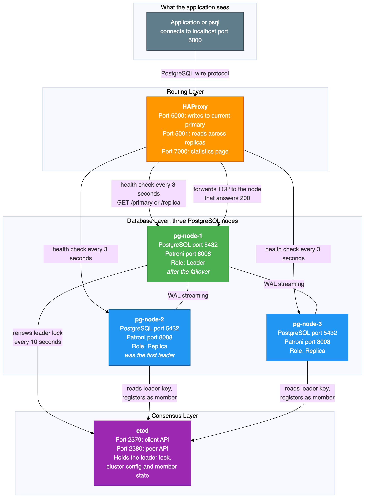{width=6.02in height=8.20in}

### 2.3 PostgreSQL, the database engine

PostgreSQL is the database itself: tables, indexes, data, SQL processing, transactions and constraints. It runs on all three nodes, but only one node accepts writes at any moment. The other two are read only replicas.

What PostgreSQL does here:

- Stores the application data.
- Processes SQL from the application.
- Maintains the write ahead log, which is a sequential record of every change made to the database.
- Sends those log records to the replicas over streaming replication. This is how the replicas keep up.
- On a replica, replays incoming log records so the same changes are applied locally.
- Runs replicas in hot standby mode, which means they can answer read only queries while they are still receiving replication data.

What PostgreSQL does not do:

- It does not decide which node is the primary. It has no idea that a cluster exists.
- It does not fail over. If the primary dies, PostgreSQL on a replica simply waits for more log data. It will not promote itself.
- It does not route connections. It listens on port 5432 and serves whatever connects.

| Port | Protocol | Purpose |
|------|----------|---------|
| 5432 | PostgreSQL wire protocol over TCP | Database connections |

Some PostgreSQL terms that appear throughout this document:

**Write ahead log, usually shortened to WAL in the tools themselves.** Every insert, update, delete and schema change is written to this log before it is applied to the data files. Replication is built on top of it, because a replica receives and replays exactly the same records.

**Timeline.** A counter that increases by one every time a replica is promoted. Timeline 1 is the original primary. Timeline 2 means one promotion has happened. This test moved from timeline 1 to timeline 2.

**Log sequence number.** A position in the log stream. Comparing the sent, written, flushed and replayed positions between primary and replica tells you how far behind a replica is.

**The pg_is_in_recovery function.** Returns true on a replica and false on the primary. This is how you check a node's role from SQL.

**The pg_stat_replication view.** A view on the primary that lists every connected replica, its state, and how far behind it is.

**The pg_rewind tool.** Rewinds a former primary's data directory back to the point before it diverged from the current primary. This lets a failed primary rejoin as a replica without copying the entire database again.

### 2.4 Patroni, the high availability manager

Patroni is a Python program that runs next to PostgreSQL on every node. It stores no data and runs no SQL of its own. Its job is to manage the PostgreSQL instance and to coordinate with the other nodes through etcd.

What Patroni does:

**First time setup.** When the cluster starts for the first time, one Patroni instance wins a lock in etcd and creates the PostgreSQL data directory. The other instances see that a leader already exists, copy the leader's data with a base backup, and start PostgreSQL as replicas.

**Leader lock management.** The current leader has to renew its lock in etcd every ten seconds. If it fails to renew before the thirty second timeout expires, the lock becomes available to the other nodes.

**Health monitoring.** Patroni watches the local PostgreSQL process. If PostgreSQL stops, Patroni tries to restart it. If it cannot, Patroni gives up the leader lock.

**Election and promotion.** When the leader lock expires, the surviving Patroni instances race to take it. The winner promotes its local PostgreSQL from replica to primary.

**Demotion and recovery.** When a former primary comes back, Patroni sees that another node holds the lock. It runs pg_rewind to bring the local data directory back in line, then starts PostgreSQL as a replica of the new leader.

**A small HTTP API.** Patroni answers on port 8008 and reports the node's current role. HAProxy uses this for health checks.

**Configuration management.** Patroni writes the PostgreSQL configuration files, the host based authentication file, and the standby signal files. You do not edit those by hand, because Patroni will overwrite them.

What Patroni does not do:

- It does not store application data. It is a management process, not a database.
- It does not route client connections. Applications never connect to Patroni.
- It does not provide the consensus itself. It relies on etcd for that.

| Port | Protocol | Purpose |
|------|----------|---------|
| 8008 | HTTP | Health check endpoint for HAProxy, and cluster status queries |

The API endpoints that matter in this build:

| Endpoint | Returns 200 when | Returns 503 when | Used by |
|----------|------------------|------------------|---------|
| GET /primary | This node is the primary | This node is a replica | The HAProxy primary backend |
| GET /replica | This node is a replica | This node is the primary | The HAProxy replica backend |
| GET /health | PostgreSQL is running and healthy | PostgreSQL is down | The Docker health check |
| GET /patroni | Always, returning full node state | Not applicable | Diagnostics |

The Patroni settings used here:

| Setting | Value | What it means |
|---------|-------|---------------|
| scope | pg-ha-cluster | The cluster name. Every Patroni instance with the same scope belongs to the same cluster. |
| name | pg-node-1, pg-node-2, pg-node-3 | A unique name for each node. It must differ on every node. |
| namespace | /service/ | The key prefix Patroni uses inside etcd. |
| ttl | 30 seconds | How long the leader lock stays valid. If the leader does not renew inside this window, the lock expires and other nodes may take it. |
| loop_wait | 10 seconds | How often the Patroni main loop runs. Each pass checks PostgreSQL, renews the lock if this node is the leader, and looks for changes in etcd. |
| retry_timeout | 10 seconds | How long Patroni keeps retrying etcd and PostgreSQL operations before giving up. |
| maximum_lag_on_failover | 1048576 bytes, which is 1 MB | A replica must be within this many bytes of the primary to be allowed to take over. This stops a badly lagging replica from being promoted and losing data. |
| use_pg_rewind | true | When a former primary rejoins, use pg_rewind instead of a full base backup. Recovery is far faster. |
| use_slots | true | Use replication slots, so the primary does not throw away log segments that a replica still needs. |

### 2.5 etcd, the distributed configuration store

etcd is a key value store with strong consistency guarantees. In this build it answers one question that matters more than any other: which node is the leader?

Patroni nodes do not talk to each other to elect a leader. They all talk to etcd instead. etcd guarantees that only one node can hold the leader lock at a time, because creating the key is an atomic operation.

What Patroni keeps in etcd, under the key prefix for this cluster:

| Key | Content | Purpose |
|-----|---------|---------|
| leader | The name of the current leader | The leader lock. Whichever node created this key is the primary. It expires after the timeout. |
| initialize | A cluster initialisation token | Stops two nodes from creating a data directory at the same time during first startup. |
| config | Cluster wide PostgreSQL configuration | Shared settings, so all nodes agree. |
| members/pg-node-1 | Connection details, state, timeline and log position for that node | Each node registers itself so the others know how to reach it. |
| members/pg-node-2 | The same, for node 2 | |
| members/pg-node-3 | The same, for node 3 | |

How the leader lock actually works:

1. A Patroni node starts and checks etcd for an existing leader key.
2. If there is no leader key, or the old one has expired, the node tries to create one with its own name and a thirty second lifetime.
3. etcd allows only one of those creates to succeed. The node that wins becomes the leader.
4. The leader has to renew the key before it expires. It renews every ten seconds, so it gets three attempts inside the thirty second window.
5. If the leader stops renewing, because it crashed or lost the network or PostgreSQL died, the key expires at the thirty second mark.
6. The other nodes notice the missing key on their next pass through the loop and race to create a new one.

There is one more safety behaviour worth knowing. If the current leader loses its lock, for example because it can no longer reach etcd, Patroni on that node demotes PostgreSQL straight away. It will not keep accepting writes without a valid lock. That is what stops two nodes from both believing they are the primary.

**Why production uses an odd number of etcd nodes.** etcd uses the Raft consensus algorithm, which needs a majority of nodes to agree before any write is accepted. Three etcd nodes survive one failure. Five survive two. An even number buys you nothing, because four nodes still only survive one failure, the majority being three either way. A single etcd node survives nothing at all. If it fails, no election can happen and the PostgreSQL cluster is frozen in whatever state it was in. This lab uses one etcd node for simplicity and accepts that limit.

| Port | Protocol | Purpose |
|------|----------|---------|
| 2379 | HTTP | Client API. This is where Patroni connects. |
| 2380 | HTTP | Peer API, for etcd to etcd traffic. Unused with a single node. |

### 2.6 HAProxy, the connection router

HAProxy is a TCP load balancer. It gives the application one address that never changes: port 5000 for writes and port 5001 for reads. HAProxy works out which PostgreSQL node is the right one and forwards the TCP connection there.

What HAProxy does:

- Listens on port 5000 for write traffic and port 5001 for read traffic.
- Every three seconds, sends an HTTP health check to each node's Patroni API on port 8008.
- For the primary backend it calls GET /primary. Only the current primary answers 200, so write traffic goes there.
- For the replica backend it calls GET /replica. Only replicas answer 200, and read traffic is spread across them.
- After a failover, the next health check finds that the old primary no longer answers 200 and a different node now does, so the routing is updated. In this test that took about three seconds.
- When HAProxy marks a server as down, it closes any TCP connections that were still open to that server.

What HAProxy does not do:

- It does not decide who the primary is. It only reports what Patroni tells it.
- It does not keep existing connections alive across a failover. Connections to the old primary are broken.
- It does not replicate data, manage PostgreSQL, or talk to etcd.
- It does not understand SQL. It forwards raw bytes. As far as PostgreSQL is concerned, the connection comes from HAProxy, not from the application.

| Port | Protocol | Reachable from the host | Purpose |
|------|----------|-------------------------|---------|
| 5000 | TCP, PostgreSQL wire protocol | Yes | The read and write endpoint |
| 5001 | TCP, PostgreSQL wire protocol | Yes | The read only endpoint |
| 7000 | HTTP | Yes | The HAProxy statistics page |

**Reading the HAProxy status page without being alarmed.** There are two separate backend pools, and each one health checks a different Patroni endpoint. A node marked DOWN in one pool is not broken. It simply is not playing the role that the pool is looking for.

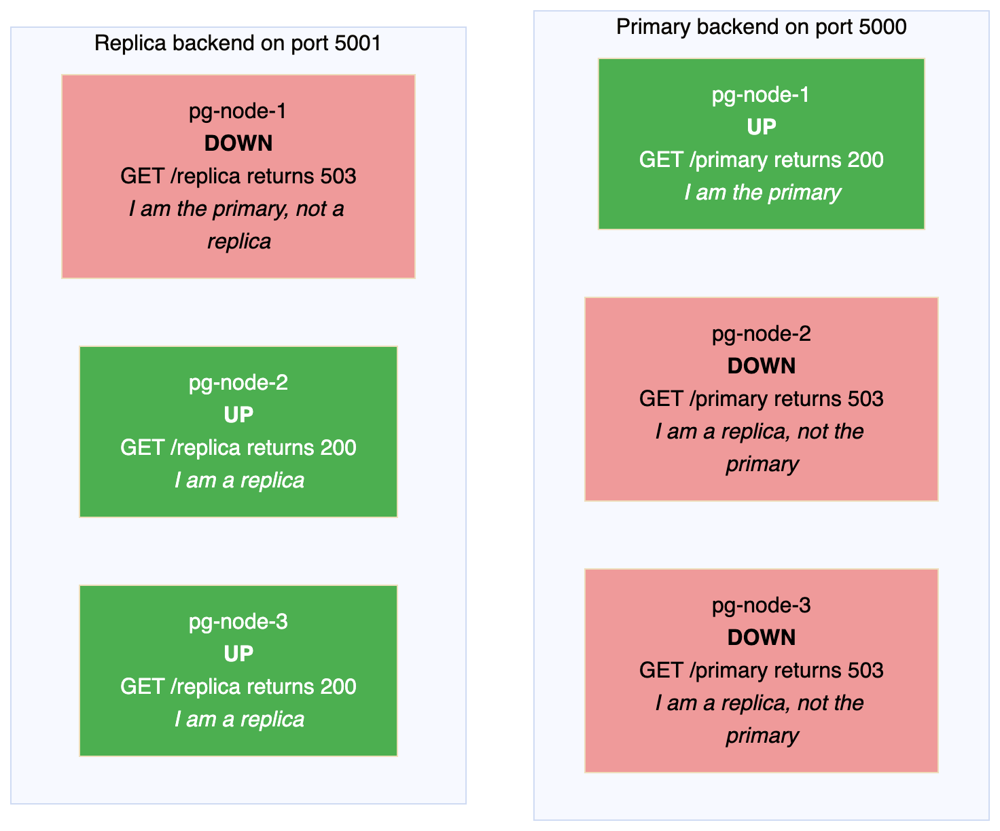{width=6.30in height=5.24in}

In a healthy three node cluster you will always see one server up and two down in the primary pool, and two up and one down in the replica pool. The down entries are not faults. They are proof that role based routing is working.

### 2.7 Communication map

This diagram shows every path between the components, with the port numbers.

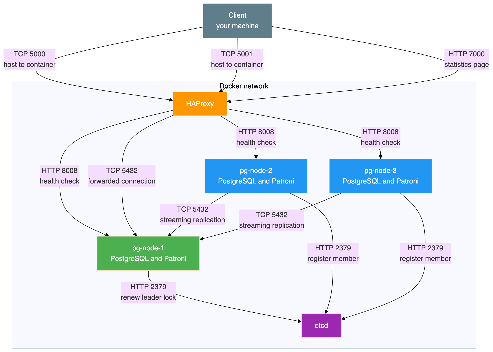{width=6.30in height=4.50in}

Every port in one table:

| Port | Listener | Protocol | Who connects to it | Reachable from the host |
|------|----------|----------|--------------------|-------------------------|
| 5000 | HAProxy | TCP | Application or psql | Yes. This is the write endpoint. |
| 5001 | HAProxy | TCP | Application or psql | Yes. This is the read endpoint. |
| 7000 | HAProxy | HTTP | A browser | Yes |
| 5432 | PostgreSQL on each node | TCP | HAProxy, and the other PostgreSQL nodes for replication | No. Internal only. |
| 8008 | Patroni on each node | HTTP | HAProxy for health checks, and the Patroni command line tool | No. Internal only. |
| 2379 | etcd | HTTP | Patroni on all three nodes | No. Internal only. |
| 2380 | etcd | HTTP | Other etcd nodes. Unused here. | No. Internal only. |

Note that PostgreSQL port 5432 and the Patroni port 8008 are deliberately not published to the host. All client access goes through HAProxy.

### 2.8 What each node runs inside

Every database container runs two processes side by side. Patroni is the parent, and it starts and manages PostgreSQL.

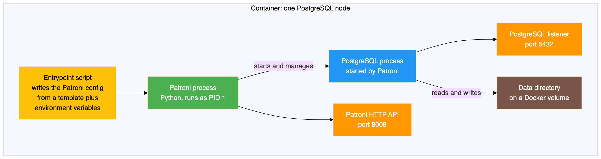{width=6.30in height=1.67in}

When a container starts:

1. The entrypoint script writes the Patroni configuration file, filling in the values that differ between nodes.
2. Patroni starts as the main process.
3. Patroni asks etcd whether a leader exists and whether the cluster has been initialised.
4. If this is the first node, Patroni creates the data directory, starts PostgreSQL, and takes the leader lock.
5. If another node is already the leader, Patroni copies that node's data with a base backup and starts PostgreSQL as a replica.
6. Patroni then enters its main loop, running every ten seconds.

### 2.9 How the data stays in step

Streaming replication is what keeps the replicas synchronised. It works at the level of the write ahead log, not at the level of SQL statements. A replica receives and replays exactly the same low level changes that the primary made.

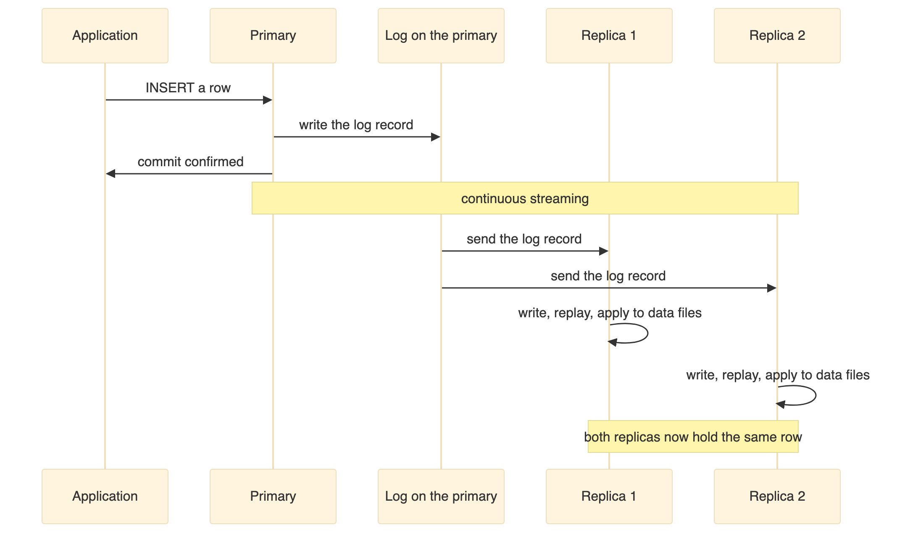{width=6.30in height=3.71in}

This cluster uses asynchronous replication, which the tools report as a synchronisation state of async. That means:

- The primary commits a transaction and tells the client it succeeded straight away.
- The log records travel to the replicas in the background.
- There is a very short window, usually a few milliseconds, in which the primary has committed something the replicas have not received yet.
- If the primary is destroyed inside that window, that transaction is lost, because no replica ever saw it.

Synchronous replication is possible and Patroni supports it, but it adds latency to every write, because the primary has to wait for a replica to confirm before it can commit. This lab uses asynchronous replication for simplicity.

The health indicators to watch:

| Indicator | Meaning | Healthy value |
|-----------|---------|---------------|
| sent position | How far the primary has sent to this replica | Matches the primary's current position |
| write position | How far the replica has written to disk | Matches the sent position |
| flush position | How far the replica has flushed to disk | Matches the write position |
| replay position | How far the replica has applied to its data files | Matches the flush position |
| state | Connection state | The value streaming means healthy |
| sync state | Synchronisation mode | The value async in this build |

When all four positions match, the replication lag is zero.

### 2.10 The states the cluster moves through

This diagram shows the transitions that were actually observed during the test.

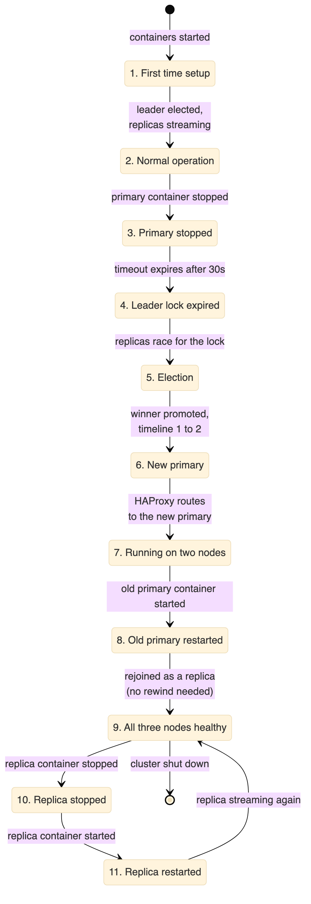{width=2.83in height=8.20in}

### 2.11 What this architecture does not protect against

This setup has real limits, and it is better to be clear about them.

| Situation | Protected | Why |
|-----------|-----------|-----|
| One PostgreSQL node fails | Yes | Patroni promotes a replica |
| Application needs a stable address | Yes | HAProxy provides one |
| Loss of committed transactions | Mostly | Replicas are very close to real time, but asynchronous replication leaves a tiny window |
| All nodes fail together | No | Every container runs on one Docker host |
| etcd fails | No | There is only one etcd node, so no election can happen |
| Disk corruption | No | Corruption is replicated to the replicas along with everything else |
| Somebody drops a table by accident | No | The change is replicated to all nodes immediately |
| Data centre failure | No | Everything is on one machine |
| Network partition creating two primaries | Partly | The lock in etcd stops two primaries existing, because a leader that loses the lock demotes itself |

The important line in that table is the one about dropping a table. Replication is not a backup. Three synchronised copies of a mistake are still a mistake.

---

## 3. Prerequisites

| Software | Purpose | Version |
|---|---|---|
| Docker Desktop or Docker Engine | Container runtime | Version 4 or later |
| Docker Compose | Service orchestration | Version 2, which ships with Docker Desktop |
| Git | To clone the repository | Any recent version |
| psql | PostgreSQL client, optional | Any version |

The client is optional because you can run psql inside any of the containers instead of installing it on the host.

The environment runs five containers: one etcd, three PostgreSQL nodes and one HAProxy. Give Docker at least 4 GB of memory. The default allocation is usually enough.

This build was tested on Docker Desktop on Windows, where Linux containers run inside a small virtual machine and all Docker commands work normally from PowerShell. The same files work on macOS and Linux.

---

## 4. Component Versions

These versions were tested together on 29 August 2026 and worked.

| Component | Version | Image |
|---|---|---|
| PostgreSQL | 16.4 | postgres:16.4-bookworm |
| Patroni | 3.3.2 | Installed with pip into a custom image |
| etcd | 3.5.15 | quay.io/coreos/etcd:v3.5.15 |
| HAProxy | 2.9 | haproxy:2.9-alpine |
| Python | 3.11 | Included in the Debian base image |

PostgreSQL 16.4 was the current stable release in the 16 series. Patroni 3.3.2 supports PostgreSQL 16 and includes the etcd version 3 client. etcd 3.5.15 is a stable release providing the version 3 API that this Patroni client needs. HAProxy 2.9 is a stable release.

One version detail caused a real problem during the build. etcd 3.5 has the older version 2 API switched off by default, so Patroni has to be installed and configured for the version 3 API. The section on problems hit while building this explains what went wrong and how it was fixed.

---

## 5. Configuration Summary

The repository holds the actual files. This section explains what they set up and why, so you can read them with some context.

### 5.1 How the containers are wired together

All five services sit on one Docker bridge network and find each other by service name, so there are no hard coded IP addresses anywhere.

etcd starts first. The three database nodes wait for the etcd health check to pass before they start. HAProxy starts after the three database containers have been created, although it does not wait for them to be healthy, because it runs its own health checks anyway.

Each database node has its own Docker volume for its data directory. Volumes are never shared between nodes. Three nodes means three independent copies of the data.

Only three ports are published to the host: 5000 for writes, 5001 for reads and 7000 for the statistics page.

Every service is set to restart unless it has been stopped deliberately. This matters during the test, because it is the reason a stopped container stays stopped until it is started again by hand.

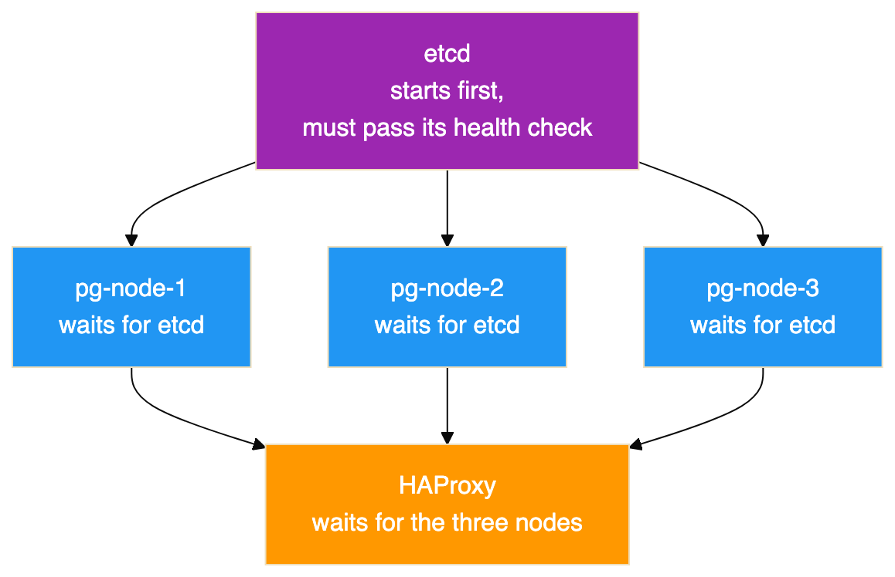{width=6.30in height=4.07in}

The three database nodes start at the same time once etcd is ready. Whichever one takes the leader lock first creates the database, and the other two copy it.

### 5.2 Credentials

The repository includes an example environment file. Copy it to a real one before starting the cluster, and change the values. The example file is deliberately committed with obvious lab only values, and the real file is excluded from version control.

The variables define three separate accounts, which is a habit worth keeping even in a lab.

| Variable | Used by | Purpose |
|---|---|---|
| Superuser name and password | Patroni | The PostgreSQL superuser Patroni uses to manage the cluster |
| Replication user and password | Patroni and PostgreSQL | Authenticates streaming replication between nodes |
| Application user and password | Your application | The account the application connects with |
| Application database name | Your application | The database the application uses |

No values are printed in this document on purpose. Do not reuse the ones in the repository. Generate your own, and in production keep them in a secrets manager rather than a file on disk.

One practical note if you fork this repository. Patroni prints its rendered configuration at startup, so the captured container logs under `test-results` contain those lab passwords in plain text. That is fine for a disposable lab whose credentials are already public, but it is worth remembering before you point the same setup at anything you care about.

### 5.3 The PostgreSQL settings Patroni applies

One template is shared by all three nodes, and the entrypoint script fills in the values that differ. The settings below are the ones that matter for high availability.

| Setting | Value | Why it is set |
|---|---|---|
| wal_level | replica | Required for streaming replication |
| hot_standby | on | Lets replicas answer read queries |
| wal_log_hints | on | Required for pg_rewind to work |
| max_wal_senders | 5 | How many replication connections the primary will accept |
| max_replication_slots | 5 | How many replication slots can exist |
| max_connections | 100 | The PostgreSQL default. A replica will refuse to start if this is lower than on the primary. |
| max_worker_processes | 8 | Background worker limit, with the same constraint as max_connections |
| hot_standby_feedback | on | Replicas tell the primary which rows their running queries still need, so cleanup on the primary does not cancel queries on the replica |

Three of these deserve more explanation, because they are the ones people get wrong.

**The wal_log_hints setting is not optional in this design.** The pg_rewind tool has to identify every page that the diverged server changed. Without hint logging, or without data checksums, that information is not in the log and pg_rewind refuses to run. A failed primary would then only be able to rejoin by copying the whole database. On a large database that is the difference between a few seconds and several hours.

**Replication slots protect replicas, and can fill your disk.** Without a slot, a primary will happily delete log segments that a disconnected replica still needs, and that replica can never catch up. With a slot, the primary keeps those segments. The risk is the mirror image: a slot belonging to a replica that is never coming back will hold log files forever and eventually fill the disk. Watch the replication slot view and remove slots for decommissioned nodes.

**The maximum lag setting is a data loss limit, not a performance setting.** A replica more than 1 MB behind is not allowed to be promoted, on the grounds that promoting it would quietly throw away more data than you agreed to lose. Set it too high and you trade durability for availability. Set it to zero and you may find no candidate is eligible at all.

Two settings only apply the very first time the cluster is created. The data directory is created with UTF8 encoding and with data checksums switched on. Checksums let PostgreSQL notice silent disk corruption when it reads a page, at a small cost in CPU. They can only be turned on at creation time, so this is the only chance you get. They also satisfy the pg_rewind page tracking requirement on their own.

**A word about anything under the bootstrap section of the Patroni configuration.** Those values are used once, when the cluster is first created. Editing them later and restarting changes nothing, because Patroni has already copied them into etcd. To change them afterwards you use the Patroni command line tool to edit the live configuration. This is the most common reason people believe Patroni is ignoring their configuration file.

### 5.4 Two settings to change before production

The template permits password authenticated connections from any address. That is acceptable on an isolated Docker network and unacceptable anywhere real. Restrict the allowed source ranges, and prefer the scram-sha-256 password method over the older md5 method.

The template also logs every statement and the duration of every statement. That is exactly what you want in a lab where the point is to watch what the cluster does. In production it is both a performance problem and a security problem, because it produces enormous log volume under load and writes query parameters, which may include personal data, to disk in plain text. Log only slow statements, for example anything over one second, and reduce statement logging to schema changes only.

### 5.5 How HAProxy decides where to send traffic

HAProxy has two listeners. The one on port 5000 sends traffic to whichever node Patroni reports as the primary, checking the GET /primary endpoint. The one on port 5001 sends traffic to nodes that report themselves as replicas, checking GET /replica. Both check port 8008 rather than the database port, so they test the actual role rather than whether a port happens to be open.

No load balancing algorithm is set for the replica pool, so HAProxy uses its default, which is round robin across the healthy replicas.

Two details in the server options set the real detection speed:

- A server is only marked down after three consecutive failed checks. With checks every three seconds, a genuinely dead node takes about nine seconds to be removed. That delay is deliberate, and it stops one dropped packet from moving traffic around.
- A recovering server has to pass two consecutive checks before it is used again.

In the failover recorded here, the old primary was marked down by a connection timeout while the new primary was marked up by a successful check on the very next pass, which is why routing changed in about three seconds rather than nine.

There is also an option that closes existing sessions to a server when that server is marked down. This is a deliberate choice to fail quickly. Clients get an immediate error they can retry, instead of a connection that looks alive but will never answer.

**One caution about the read port.** Reading from replicas is genuinely useful, but this cluster replicates asynchronously. A client that writes on port 5000 and immediately reads on port 5001 may not see its own write. Send anything that needs to read its own writes to port 5000, and keep port 5001 for reporting and dashboards that can tolerate data a few milliseconds old.

---

## 6. The Commands, Start to Finish

This section is the runbook. Every command below is taken from the scripts and the README in the repository, in the order you would run them. Read the previous note about the scripts and the captured run before treating this as a transcript.

The scripts expect to be run from the root of the `postgres-patroni-ha` folder.

### Build the environment

```bash
git clone https://github.com/rameshsraj/pgandpatroni.git
cd pgandpatroni/postgres-patroni-ha

cp .env.example .env      # then edit .env and change every password
docker compose build
docker compose up -d
```

Give it 15 to 30 seconds before the next step.

### Check the cluster came up

```bash
docker exec pg-node-1 patronictl -c /etc/patroni/patroni.yml list
```

There is also a wrapper that prints the Patroni list, the container status, the etcd health and the HAProxy backend states in one go:

```bash
bash scripts/cluster-status.sh
```

### Create the application database and sample data

```bash
bash scripts/database-test.sh
```

That script connects through HAProxy on port 5000, so it always reaches whichever node is currently the primary. It creates the database, grants the application user its privileges, creates the three tables, and inserts the sample rows.

### Take a snapshot before breaking anything

```bash
bash scripts/capture-state.sh before-failover
```

The label becomes the folder name under `test-results`. The script collects the container status, the Patroni list, the etcd health and key contents, the HAProxy statistics, the role of each node, the replication view, the row counts, the sample rows, the connection details, and the last hundred log lines from all five containers.

### Run the failover test

```bash
bash scripts/failover-test.sh
```

This is the interesting one, and it is worth knowing what it does rather than treating it as a black box:

1. Finds the current leader by parsing the Patroni list, rather than assuming which node it is.
2. Captures the before state.
3. Records the time, then stops the leader's container with `docker stop`.
4. Polls the Patroni list every two seconds, for up to sixty seconds, until a different node reports itself as leader.
5. Retries a connection through HAProxy on port 5000 until it succeeds, which is how the routing delay is observed.
6. Prints the node it reached, the row counts, and the marker rows.
7. Inserts a new marker row to prove the new primary accepts writes.
8. Captures the after state and prints a summary with the two intervals.

The point of step 1 is that the first leader is chosen by a race and is not predictable. In the captured run it was node 2.

### Bring the failed node back

```bash
bash scripts/recovery-test.sh pg-node-2
```

Pass the name of the node that was stopped. The script starts the container, waits for the Patroni health endpoint to answer, prints the cluster list, confirms the node reports itself as a replica, shows the replication view from the primary, and verifies the data.

### Connect by hand

```bash
psql -h localhost -p 5000 -U appuser -d appdb    # writes, always the primary
psql -h localhost -p 5001 -U appuser -d appdb    # reads, spread across replicas
```

The HAProxy statistics page is at `http://localhost:7000` in a browser.

### Useful one liners while poking at it

```bash
# Which node am I actually connected to, and is it a replica?
psql -h localhost -p 5000 -U appuser -d appdb \
     -c "SELECT inet_server_addr(), pg_is_in_recovery();"

# Replication state, from the primary
psql -h localhost -p 5000 -U postgres -d postgres \
     -c "SELECT application_name, client_addr, state, sync_state, replay_lsn FROM pg_stat_replication;"

# What Patroni has stored in etcd
docker exec etcd etcdctl get /service/pg-ha-cluster --prefix --print-value-only

# Ask a single node directly what role it thinks it has
docker exec pg-node-1 curl -s http://localhost:8008/patroni

# Follow one node's Patroni log
docker logs -f pg-node-1
```

### Tear it down

```bash
docker compose down        # keeps the data volumes
docker compose down -v     # deletes the volumes and all data
```

A note on the scripts and passwords. Each script reads `.env` if it is present and otherwise falls back to the lab defaults that are committed in the repository. That fallback is convenient and it is also why you should change the values in `.env` rather than relying on the defaults.

---

## 7. Starting the Cluster

Section 6 gives the commands. This section covers what actually happened when they were run, and how long each part took.

The build step creates an image based on the official PostgreSQL 16.4 image with Patroni 3.3.2 added, and the start step brings up all five containers.

The cluster needs roughly 15 to 30 seconds to become ready. During that time etcd starts and becomes healthy, the three database containers start, one node wins the election and creates the database, the other two copy it, replication begins, and HAProxy finds its healthy backends.

The captured logs show how quickly the database part actually happened. All three Patroni instances connected to etcd at 14:49:09. Node 2 won the race and recorded that it had initialised a new cluster at 14:49:13.279. Nodes 1 and 3 failed to acquire the initialise lock, saw that node 2 held it, and copied its data. Node 1 reported that the replica had been created using a base backup at 14:49:14.312, and was following the leader by 14:49:16.360. From first contact with etcd to a working three node cluster took about six and a half seconds.

The containers themselves, and the health checks that gate them, account for the rest of the time.

The container state once it had settled:

```bash
docker compose ps
```

Result:

```
NAME        IMAGE                           SERVICE     STATUS                   PORTS
etcd        quay.io/coreos/etcd:v3.5.15     etcd        Up 2 minutes (healthy)   2379-2380/tcp
haproxy     haproxy:2.9-alpine              haproxy     Up 2 minutes (healthy)   0.0.0.0:5000-5001->5000-5001/tcp, 0.0.0.0:7000->7000/tcp
pg-node-1   postgres-patroni-ha-pg-node-1   pg-node-1   Up 2 minutes (healthy)   5432/tcp, 8008/tcp
pg-node-2   postgres-patroni-ha-pg-node-2   pg-node-2   Up 2 minutes (healthy)   5432/tcp, 8008/tcp
pg-node-3   postgres-patroni-ha-pg-node-3   pg-node-3   Up 2 minutes (healthy)   5432/tcp, 8008/tcp
```

The columns for the command and the creation time have been left out to fit the page, and the duplicate IPv6 port mappings that Docker also lists for HAProxy have been removed for the same reason. Note the ports column, which is the design working as intended. HAProxy publishes 5000, 5001 and 7000 to the host. The three database nodes show their PostgreSQL and Patroni ports with no host mapping, and etcd likewise, so none of them can be reached from outside the Docker network.

### Where to check the etcd side

```bash
docker exec etcd etcdctl endpoint health --endpoints=http://localhost:2379
```

etcd reported itself healthy:

```
http://localhost:2379 is healthy: successfully committed proposal: took = 2.037062ms
```

### Where to check the cluster and node roles

The Patroni command line tool, run inside any of the containers, is the equivalent of a node list. It reads its answer from etcd, so it does not matter which container you run it in:

```bash
docker exec pg-node-1 patronictl -c /etc/patroni/patroni.yml list
```

The columns are the member name, its host, its role, its state, the timeline it is on, and how far behind it is in megabytes. Blank lag on the leader is normal, because the leader is not behind anything.

To ask a single node what it thinks its own role is, without going through etcd, use its HTTP interface instead:

```bash
docker exec pg-node-1 curl -s http://localhost:8008/patroni
```

That returns a block of JSON with the role, the timeline, the log positions and the Patroni version, which is the same information HAProxy uses for its health checks.

There is also the SQL route, which is the one to use from an application:

```sql
SELECT pg_is_in_recovery();   -- false on the primary, true on a replica
```

This is the output of the cluster listing from the test run:

```
+ Cluster: pg-ha-cluster (7679465736627556386) ----+-----------+
| Member    | Host      | Role    | State     | TL | Lag in MB |
+-----------+-----------+---------+-----------+----+-----------+
| pg-node-1 | pg-node-1 | Replica | streaming |  1 |         0 |
| pg-node-2 | pg-node-2 | Leader  | running   |  1 |           |
| pg-node-3 | pg-node-3 | Replica | streaming |  1 |         0 |
+-----------+-----------+---------+-----------+----+-----------+
```

Node pg-node-2 won the first election and became the leader. Nodes pg-node-1 and pg-node-3 copied their data from it and are streaming replicas with zero lag on timeline 1.

Notice that the leader is not node 1. Which node wins the first election is a race, and it is not predictable. Any script or document that assumes node 1 is always the primary is wrong. This matters later, because the node that was killed in the failover test was node 2, not node 1.

If the containers do not come up, read the logs of a database node and of etcd. The section on problems hit while building this covers the failures that actually happened here.

---

## 8. Database Setup

With the cluster healthy, an application database was created through HAProxy on port 5000, which means it was created on whichever node was the primary at the time. Nothing here connects to a node directly, which is the habit worth forming: if you can only reach the database through the load balancer, you cannot accidentally write to a replica.

### The schema

```sql
CREATE TABLE IF NOT EXISTS customers (
    id          SERIAL PRIMARY KEY,
    name        VARCHAR(100) NOT NULL,
    email       VARCHAR(150) NOT NULL UNIQUE,
    created_at  TIMESTAMPTZ DEFAULT now()
);

CREATE TABLE IF NOT EXISTS orders (
    id          SERIAL PRIMARY KEY,
    customer_id INTEGER NOT NULL REFERENCES customers(id),
    amount      NUMERIC(10,2) NOT NULL,
    status      VARCHAR(20) NOT NULL DEFAULT 'pending',
    created_at  TIMESTAMPTZ DEFAULT now()
);

CREATE TABLE IF NOT EXISTS ha_test (
    id          SERIAL PRIMARY KEY,
    message     TEXT NOT NULL,
    created_at  TIMESTAMPTZ DEFAULT now()
);
```

Nothing about this schema is special, and that is the point. There is no replication aware column, no shard key, no partitioning. Patroni replicates whatever PostgreSQL holds, so an ordinary schema needs no changes to become highly available. Compare this with the sharded schema in the companion guide, where every unique constraint had to be reworked.

The `ha_test` table exists only for the test. Each row is a marker recording when it was written relative to the failover, which is how the data was proved to have survived.

### The sample data

```sql
INSERT INTO customers (name, email) VALUES
    ('Alice Johnson',   'alice@example.com'),
    ('Bob Smith',       'bob@example.com'),
    ('Charlie Brown',   'charlie@example.com'),
    ('Diana Prince',    'diana@example.com'),
    ('Edward Norton',   'edward@example.com')
ON CONFLICT (email) DO NOTHING;

INSERT INTO orders (customer_id, amount, status) VALUES
    (1, 150.00, 'completed'),
    (1,  75.50, 'shipped'),
    (2, 200.00, 'completed'),
    (3,  45.99, 'pending'),
    (4, 320.00, 'completed'),
    (4,  89.99, 'shipped'),
    (5, 110.00, 'pending')
ON CONFLICT DO NOTHING;

INSERT INTO ha_test (message) VALUES
    ('record-created-before-failover-1'),
    ('record-created-before-failover-2'),
    ('record-created-before-failover-3')
ON CONFLICT DO NOTHING;
```

That gives five customers, seven orders and three marker rows, which are the counts quoted throughout the rest of this document. The conflict clauses make the script safe to run twice.

### Checking which node you reached

```sql
SELECT inet_server_addr() AS server_addr,
       inet_server_port() AS server_port,
       current_database() AS database,
       current_user      AS user,
       pg_is_in_recovery() AS is_replica,
       pg_current_wal_lsn() AS current_lsn;
```

This is the single most useful query in the whole lab. Because HAProxy forwards the connection, the client has no idea which node answered, and this query asks the server itself. The `pg_is_in_recovery` column returning false proves you are on the primary. Run the same query against port 5001 and it returns true, because that endpoint serves replicas.

Note that `pg_current_wal_lsn` only works on a primary. On a replica you need `pg_last_wal_replay_lsn` instead, which is a small detail that trips people up when they point a monitoring query at the read endpoint.

Connecting through HAProxy confirmed which node the connection had reached:

```
   server   | is_replica |  db
------------+------------+-------
 172.18.0.3 | f          | appdb
(1 row)
```

The false value in the replica column confirms the connection landed on the primary. The address is the container address of pg-node-2 on the Docker network at that time. Container addresses are assigned by Docker and will differ on your machine, so treat them as evidence from this run rather than as fixed values.

The three container addresses in this run were 172.18.0.3 for pg-node-2, 172.18.0.4 for pg-node-3 and 172.18.0.5 for pg-node-1. They are worth noting because they appear again in the replication output and after the failover, and they are how you can tell from the captured evidence which node a connection actually reached.

The row counts at this point:

```sql
SELECT 'customers' AS tbl, count(*) FROM customers
UNION ALL SELECT 'orders',  count(*) FROM orders
UNION ALL SELECT 'ha_test', count(*) FROM ha_test;
```

Result:

```
    tbl    | count
-----------+-------
 customers |     5
 orders    |     7
 ha_test   |     3
(3 rows)
```

---

## 9. Replication Validation

Replication was checked on the primary before anything was broken.

```sql
SELECT pid, application_name, client_addr, state, sync_state,
       sent_lsn, write_lsn, flush_lsn, replay_lsn
FROM pg_stat_replication;
```

This view exists only on the primary. Query it on a replica and you get zero rows, which is itself a quick way to tell the two apart. Each row is one connected replica, and the four position columns are how far that replica has got: what the primary has sent, what the replica has written, what it has flushed to disk, and what it has actually applied.

This is the output:

```
 pid | application_name | client_addr |   state   | sync_state | sent_lsn  | write_lsn | flush_lsn | replay_lsn
-----+------------------+-------------+-----------+------------+-----------+-----------+-----------+------------
  75 | pg-node-1        | 172.18.0.5  | streaming | async      | 0/4484770 | 0/4484770 | 0/4484770 | 0/4484770
  76 | pg-node-3        | 172.18.0.4  | streaming | async      | 0/4484770 | 0/4484770 | 0/4484770 | 0/4484770
(2 rows)
```

Both replicas are streaming, both are asynchronous, and all four log positions are identical across both rows. Identical positions mean the replicas have received, written, flushed and applied everything the primary has produced. The replication lag is zero.

Each replica was then queried directly rather than through HAProxy, bypassing the load balancer so there is no doubt which node answered. The captured result records the role and the row count together, so the query was equivalent to this, although this exact statement is a reconstruction rather than a line from one of the scripts:

```sql
SELECT pg_is_in_recovery(), count(*) AS ha_test_count FROM ha_test;
```

Result:

```
pg-node-1: pg_is_in_recovery = t, ha_test_count = 3
pg-node-3: pg_is_in_recovery = t, ha_test_count = 3
```

Both report that they are in recovery, which is how a replica describes itself, and both hold all three marker rows that were inserted on the primary. This is the baseline the rest of the test is measured against.

---

## 10. How the Failover Was Tested

This section describes the method, because a result is only as good as the way it was produced.

**The approach.** Rather than simulating a failure or asking Patroni to hand over cleanly, the primary container was stopped. Stopping the container sends a termination signal first and then kills the process if it has not exited. From the point of view of the surviving nodes, the primary simply disappeared and stopped renewing its lock. This is closer to a real crash than a planned switchover, and it is the harder case, because nothing gets a chance to hand over gracefully.

**Which node was stopped.** The primary was identified from Patroni rather than assumed. At that point the leader was pg-node-2, so pg-node-2 was the container that was stopped.

**When.** The container was stopped at 14:51:58 UTC.

**What was recorded.** Before the failover, a full snapshot of the cluster was captured to files: the container status, the Patroni cluster list, the etcd health, the replication view, the row counts and sample rows, and the logs of all five containers. The same set was captured after the failover and again after recovery. The timeline in the next section is built from those captured container logs, not from memory.

**What was checked afterwards.** Four things. Whether a new primary appeared without help. Whether HAProxy followed it on the unchanged connection string. Whether all the data written before the failover was still present. Whether the new primary would accept a new write.

**Three separate failure cases were run**, in this order: the primary was stopped, then the old primary was restarted to see whether it could rejoin, then a replica was stopped and restarted to confirm that losing a replica behaves differently from losing a primary.

The scripts that perform the failover test, capture the state and run the recovery are in the repository.

---

## 11. Failover Event Timeline

Every line below is taken from the container logs in `test-results/failover-events`, except the first, which is from the command output. Times are UTC, to the millisecond where the log provides it.

| Time | Component | Event | Source |
|---|---|---|---|
| 14:51:43.327 | Patroni on pg-node-2 | Last recorded lock renewal by the leader before the snapshot was taken | Log |
| 14:51:58 | Docker | The primary container pg-node-2 was stopped | Command output, not a log |
| 14:52:03.969 | Patroni on pg-node-1 | Still following pg-node-2 as leader | Log |
| 14:52:13.879 | Patroni on pg-node-1 | Still following pg-node-2 | Log |
| 14:52:23.837 | Patroni on pg-node-1 | Queried pg-node-3 and got back a state showing the cluster had no valid leader lock | Log |
| 14:52:31.829 | Patroni on pg-node-1 | Could no longer resolve the old primary's hostname | Log |
| 14:52:31.928 | Patroni on pg-node-1 | Reported that it could not open a hardware watchdog device | Log |
| 14:52:31.929 | Patroni on pg-node-3 | Tried for the lock and lost | Log |
| 14:52:31.950 | Patroni on pg-node-3 | Followed the new leader after failing to obtain the lock | Log |
| 14:52:31.951 | Patroni on pg-node-3 | Recorded that the lock owner was now pg-node-1 | Log |
| 14:52:31.980 | Patroni on pg-node-1 | **Promoted itself to leader by acquiring the session lock** | Log |
| 14:52:32.087 | Patroni on pg-node-1 | Updated the leader lock during promotion | Log |
| Not timestamped | PostgreSQL on pg-node-1 | Reported the server promoting | Log, written without a timestamp |
| 14:52:36.416 | Patroni on pg-node-3 | Recorded the new primary timeline as 2, with the history branching at 0/4489F20 | Log |
| No timestamp | HAProxy | Marked pg-node-2 down in the primary pool, by connection timeout after 3003 ms | Log, no timestamps available |
| No timestamp | HAProxy | Marked pg-node-1 up in the primary pool, health check passed with code 200 in 8 ms | Log, no timestamps available |
| No timestamp | HAProxy | Marked pg-node-1 down in the replica pool, code 503 in 11 ms, which is correct because it is now the primary | Log, no timestamps available |

Two things in that timeline are worth pausing on.

The log lines at 14:52:03 and 14:52:13 show pg-node-1 still calmly following a primary that had already been dead for several seconds. Nothing is wrong there. The replicas cannot tell the difference between a primary that is dead and a primary that is briefly slow, so they wait for the lock in etcd to expire and let the timeout make the decision.

The timing of the expiry is worth working through, because it is not thirty seconds after the container stopped. The lock lives for thirty seconds from its **last renewal**, not from the moment of failure. The captured leader log shows renewals every ten seconds, the last visible one at 14:51:43.327, so the next would have been around 14:51:53. The container stopped at 14:51:58, five seconds after that renewal, which left the lock valid until about 14:52:23. That matches the log exactly: at 14:52:23.837 node 1 saw a state reporting the cluster as unlocked.

The practical consequence is that the delay before an election is not fixed. It varies between the loop interval and the full timeout, depending on where in the renewal cycle the failure happens. A primary that dies immediately after renewing costs you the full thirty seconds. One that dies just before a renewal was due costs you closer to twenty.

The last row is the one that confuses people reading a dashboard. Node pg-node-1 being marked down in the replica pool is not a fault. It has just been promoted, so it correctly refuses to describe itself as a replica.

---

## 12. Failover Timing and Tuning

| Measurement | Value | How it is known |
|---|---|---|
| Primary stopped | 14:51:58 | Command output |
| Leader lock seen as expired | 14:52:23.837 | Log |
| New leader lock acquired | 14:52:31.980 | Log |
| Time to a new primary | About 34 seconds | Difference of the two above |
| HAProxy routing to the new primary | Within about 3 seconds of promotion | Derived from the check interval, not measured |
| Total time to working writes | About 36 to 37 seconds | Derived |

The first figure and the last are the two soft ones. The stop time came from the terminal rather than a log, and the HAProxy delay is inferred from its three second check interval, because the captured HAProxy log carries no timestamps. The middle figures are exact.

### Where the time actually went

Breaking the total down matters, because only part of it can be tuned.

| Phase | Measured here | What controls it |
|---|---|---|
| Waiting for the leader lock to expire | About 25 seconds, being 30 seconds from the last renewal | The lock timeout. This is the bulk of it. |
| Surviving nodes noticing, then acting on the next loop pass | About 8 seconds | How often the Patroni loop runs |
| Promoting the winner | Around 100 milliseconds | Database size and how much log there is to replay |
| HAProxy noticing the change | Up to 3 seconds | The health check interval |

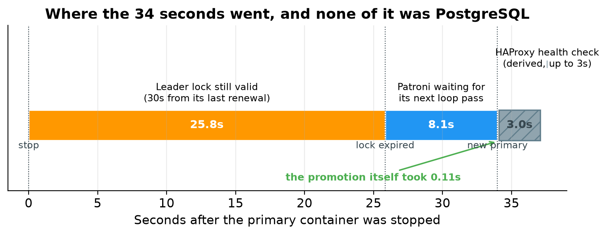{width=6.30in height=2.45in}

The hatched block on the right is the HAProxy check, drawn differently because it is the one segment that was not measured. The captured HAProxy log has no timestamps, so its width comes from the configured three second interval.

Around ninety percent of the outage was the cluster deliberately waiting, and none of it was PostgreSQL being slow. The promotion itself took about a tenth of a second, from acquiring the session lock at 14:52:31.980 to the leader lock being updated at 14:52:32.087. The cluster was waiting to be sure the primary was really gone.

The eight second gap between noticing at 14:52:23.837 and promoting at 14:52:31.980 is the part people do not expect. Patroni had already seen that the cluster was unlocked, but it does not act in the middle of a loop pass. It finished the pass it was in, which included checking the other replica's log position to confirm it was a suitable candidate, and acted on the next one ten seconds later.

### The trade-off if you want it faster

The obvious reaction is to cut the timeout to ten seconds. It is worth resisting that, because this is not a performance setting. It is a choice about which kind of failure you would rather have.

A shorter timeout gives faster failover but makes it more likely that a brief network problem, a long garbage collection pause, or an overloaded etcd is mistaken for a dead primary. A false failover is a real outage. Connections drop, transactions in flight are lost, and a node gets promoted that did not need promoting.

A longer timeout gives fewer false alarms and longer real outages.

Patroni requires the timeout to be comfortably larger than the loop interval plus twice the retry timeout. With the values used here, ten and ten, the minimum workable timeout is thirty, which is exactly why thirty was chosen. If you lower the timeout you have to lower the other two as well, or Patroni will reject the configuration.

A reasonably aggressive but still safe set of values on a reliable network is a timeout of 15 with a loop interval and retry timeout of 5. That brings failover to roughly 15 to 20 seconds. Going lower than that needs a genuinely fast and stable network between the nodes and etcd.

These numbers come from one run on one Docker host. Treat them as an illustration of where the time goes, not as a service level you can promise. Measure your own environment.

---

## 13. Post-Failover Verification

Connecting with the same unchanged connection string, and asking the server to identify itself:

```sql
SELECT inet_server_addr()  AS server,
       pg_is_in_recovery() AS is_replica,
       current_database()  AS db;
```

HAProxy was now routing to a different node:

```
   server   | is_replica
------------+------------
 172.18.0.5 | f
```

The address changed from the old primary to the new one, and the replica flag is still false, meaning this is a primary. The client connection details did not change at all.

All the data written before the failover was present:

```sql
SELECT * FROM ha_test ORDER BY id;
```

Result:

```
 id |             message              |          created_at
----+----------------------------------+-------------------------------
  1 | record-created-before-failover-1 | 2026-08-29 14:50:16.460916+00
  2 | record-created-before-failover-2 | 2026-08-29 14:50:16.460916+00
  3 | record-created-before-failover-3 | 2026-08-29 14:50:16.460916+00
```

The counts were confirmed with:

```sql
SELECT 'customers' AS tbl, count(*) FROM customers
UNION ALL SELECT 'orders',  count(*) FROM orders
UNION ALL SELECT 'ha_test', count(*) FROM ha_test;
```

Row counts were unchanged: five customers, seven orders and three marker rows.

Replication at this point shows the cluster running on two nodes:

```
 pid | application_name | client_addr |   state   | sync_state | sent_lsn  | write_lsn | flush_lsn | replay_lsn
-----+------------------+-------------+-----------+------------+-----------+-----------+-----------+------------
 423 | pg-node-3        | 172.18.0.4  | streaming | async      | 0/4499AB0 | 0/4499AB0 | 0/4499AB0 | 0/4499AB0
(1 row)
```

Only one replica is listed, because pg-node-2 was still stopped. The new primary is streaming to the one replica it has left, with zero lag. This is the degraded state the cluster runs in after a failover and before the failed node is brought back: still serving reads and writes, but with no spare node to fail over to.

A new row was then inserted through HAProxy to prove the new primary accepts writes:

```sql
INSERT INTO ha_test (message) VALUES ('record-created-AFTER-failover');

SELECT * FROM ha_test ORDER BY id;
```

The message text above is the one that is actually in the captured table. The failover script in the repository appends a timestamp to that string, so running it today produces a slightly different value. This is one of the specific divergences noted earlier between the scripts and this run.


```
 id |             message              |          created_at
----+----------------------------------+-------------------------------
  1 | record-created-before-failover-1 | 2026-08-29 14:50:16.460916+00
  2 | record-created-before-failover-2 | 2026-08-29 14:50:16.460916+00
  3 | record-created-before-failover-3 | 2026-08-29 14:50:16.460916+00
 34 | record-created-AFTER-failover    | 2026-08-29 14:57:10.552122+00
```

The write succeeded. The new row has an unexpected identifier, which the next section explains.

---

## 14. Why the Row ID Jumped

The identifier went from 3 to 34. This looks alarming and is not. No rows were lost. The table still holds exactly the three rows from before the failover, plus the new one.

The cause is the way PostgreSQL records sequences in its log. For performance, a sequence does not write a log record every single time it hands out a value. Instead it records a value thirty two increments ahead, then hands out that batch from memory without touching the log again. The constant is named SEQ_LOG_VALS in the PostgreSQL source, and the comment beside it states the consequence plainly: in the event of a crash, as many values as were pre-logged can be skipped over.

So after a crash or a promotion, the sequence carries on from the last value that reached the log, not from the last value actually handed out. The values allocated in memory are abandoned on purpose, because that is what guarantees a restarted server can never hand out an identifier it has already given to somebody else.

The arithmetic lines up exactly. The old primary had recorded ahead to 33, the newly promoted primary carried on from there, and the next value was 34.

The lesson is worth taking away from the failover entirely. **PostgreSQL sequences guarantee that values are unique and roughly increasing. They never guarantee that there are no gaps.** Any application that treats an auto generated identifier as a gapless counter, for example using it for invoice numbers or reading the highest value to count rows, will eventually be wrong, with or without a failover.

---

## 15. Old Primary Recovery

The old primary container was started again about seven minutes after it was stopped. The first Patroni line in the captured log is at 14:58:58.362 UTC.

**What happened is not what most write ups of Patroni would lead you to expect, and it is worth being precise about it.** The node rejoined as a replica without pg_rewind running at all.

The way to watch this is the container log, since Patroni narrates what it decides:

```bash
docker logs pg-node-2
```

This is the captured log, from `test-results/after-recovery/logs-pg-node-2-rejoin.txt`:

```
2026-08-29 14:58:58,362 INFO: Lock owner: pg-node-1; I am pg-node-2
2026-08-29 14:58:58,363 INFO: starting as a secondary
2026-08-29 14:58:58.638 UTC [51] LOG:  redirecting log output to logging collector process
2026-08-29 14:58:58,642 INFO: postmaster pid=51
localhost:5432 - rejecting connections
localhost:5432 - rejecting connections
localhost:5432 - accepting connections
2026-08-29 14:58:59,761 INFO: Lock owner: pg-node-1; I am pg-node-2
2026-08-29 14:58:59,824 INFO: no action. I am (pg-node-2), a secondary, and following a leader (pg-node-1)
```

Reading that in order: Patroni checked etcd, saw that pg-node-1 held the lock, and decided immediately to start as a secondary. PostgreSQL came up, refused connections for a moment while it completed recovery, then began accepting them. By 14:58:59.824 the node was a replica following the new leader.

**The whole rejoin took about 1.5 seconds**, from the first Patroni line to following the leader.

### Why pg_rewind was not needed

The reason is the way the container was stopped. Stopping a container sends a termination signal first, and Patroni handles that signal by shutting PostgreSQL down cleanly. A clean shutdown means the old primary wrote everything it had accepted and recorded a proper shutdown checkpoint. Its log position did not run ahead of the point where the new primary's history branched, which the captured log from pg-node-3 records as 0/4489F20 on timeline 1.

With no divergence to undo, there is nothing for pg_rewind to do. PostgreSQL can simply follow the new timeline from where it left off, which is exactly what it did.

Before starting PostgreSQL, Patroni inspected the local data directory. That inspection appears as a block of settings at the top of the same captured log file, and it is the output of the PostgreSQL control data tool, which you can run yourself:

```bash
docker exec pg-node-2 pg_controldata /var/lib/postgresql/data/pgdata
```

Three lines in it are the ones that matter for recovery:

```
  wal_level setting: replica
  wal_log_hints setting: on
  Data page checksum version: 1
```

Hint logging is on and data checksums are enabled. Those are the two prerequisites for pg_rewind. It was not needed on this occasion, but the cluster was correctly built so that it **could** have run.

### When you would actually see pg_rewind

pg_rewind becomes necessary when the old primary really did diverge, which happens when it accepted a write that the new primary never received and then died without a clean shutdown. Pull the power on the machine, kill the container with an immediate kill rather than a polite stop, or lose the network to a primary that carries on accepting writes for a few seconds, and you get a genuine divergence.

In that case Patroni runs crash recovery on the local data directory, compares timelines, finds the point where the two histories split, and rewinds the data directory back to the last checkpoint both servers still agree on. PostgreSQL then replays forward from the new primary. Any transaction that existed only on the old primary is discarded, because keeping it would mean two conflicting versions of history.

This is the case that makes `wal_log_hints` worth setting from day one. Without it, and without data checksums, pg_rewind refuses to run and the only way to bring the node back is to copy the whole database again.

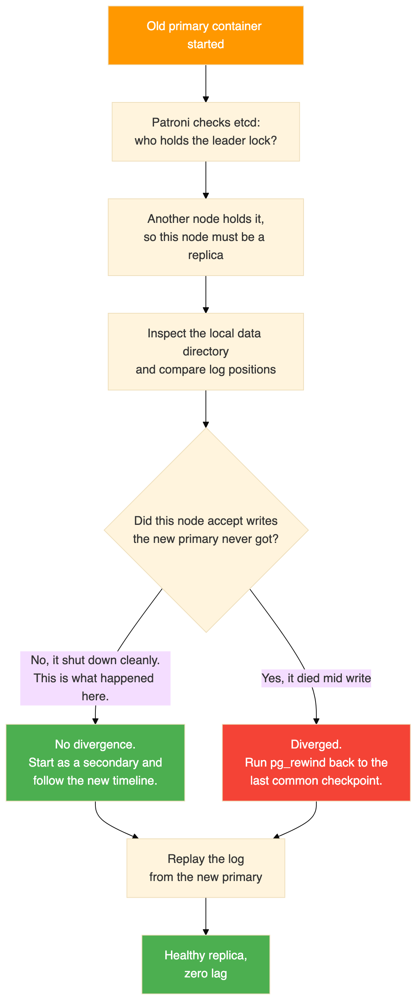{width=3.43in height=8.20in}

### The cluster after recovery

```bash
docker exec pg-node-1 patronictl -c /etc/patroni/patroni.yml list
```

Result:

```
+ Cluster: pg-ha-cluster (7679465736627556386) ----+-----------+
| Member    | Host      | Role    | State     | TL | Lag in MB |
+-----------+-----------+---------+-----------+----+-----------+
| pg-node-1 | pg-node-1 | Leader  | running   |  2 |           |
| pg-node-2 | pg-node-2 | Replica | streaming |  2 |         0 |
| pg-node-3 | pg-node-3 | Replica | streaming |  2 |         0 |
+-----------+-----------+---------+-----------+----+-----------+
```

All three nodes are healthy, all three are on timeline 2, and both replicas have zero lag. Note that the old primary did not take its role back. Patroni does not fail back automatically, and the node that was promoted stays the leader.

Replication from the new primary, now feeding both replicas again. This is the same `pg_stat_replication` query as before, ordered by name:

```sql
SELECT application_name, client_addr, state, sync_state,
       sent_lsn, write_lsn, flush_lsn, replay_lsn
FROM pg_stat_replication
ORDER BY application_name;
```

Result:

```
 pid  | application_name | client_addr |   state   | sync_state | sent_lsn  | write_lsn | flush_lsn | replay_lsn
------+------------------+-------------+-----------+------------+-----------+-----------+-----------+------------
 1210 | pg-node-3        | 172.18.0.4  | streaming | async      | 0/4499E60 | 0/4499E60 | 0/4499E60 | 0/4499E60
 1066 | pg-node-2        | 172.18.0.3  | streaming | async      | 0/4499E60 | 0/4499E60 | 0/4499E60 | 0/4499E60
(2 rows)
```

Both replicas are at the same log position, so the lag is zero. The process identifiers are new because both connections were established after the failover. The address 172.18.0.3 is the node that used to be the primary, now appearing as a client of the node that replaced it.

Querying the rejoined node directly, connecting to the container rather than through HAProxy, confirmed it holds everything including the row written while it was switched off:

```sql
SELECT * FROM ha_test ORDER BY id;
```

Result:

```
 id |             message              |          created_at
----+----------------------------------+-------------------------------
  1 | record-created-before-failover-1 | 2026-08-29 14:50:16.460916+00
  2 | record-created-before-failover-2 | 2026-08-29 14:50:16.460916+00
  3 | record-created-before-failover-3 | 2026-08-29 14:50:16.460916+00
 34 | record-created-AFTER-failover    | 2026-08-29 14:57:10.552122+00
 35 | record-during-replica-failure    | 2026-08-29 15:00:23.081974+00
(5 rows)
```

Row 35 needs a word of explanation, because it was written at 15:00:23, which is after this recovery. The after-recovery snapshot in the repository was taken at the very end of the session, once the replica failure test in the next section had also finished. That is why five rows appear here rather than four. Rows 1 to 34 are the state at the moment of the rejoin.

---

## 16. Replica Failure Test

With all three nodes healthy again, a replica was stopped rather than the primary, to confirm that the two cases behave differently.

Node pg-node-3 was stopped. The primary stayed the primary, no election happened, and the application kept working through HAProxy. A write performed during the outage succeeded:

```sql
INSERT INTO ha_test (message) VALUES ('record-during-replica-failure');

SELECT * FROM ha_test ORDER BY id;
```

Result:

```
 id |             message              |          created_at
----+----------------------------------+-------------------------------
  1 | record-created-before-failover-1 | 2026-08-29 14:50:16.460916+00
  2 | record-created-before-failover-2 | 2026-08-29 14:50:16.460916+00
  3 | record-created-before-failover-3 | 2026-08-29 14:50:16.460916+00
 34 | record-created-AFTER-failover    | 2026-08-29 14:57:10.552122+00
 35 | record-during-replica-failure    | 2026-08-29 15:00:23.081974+00
```

Then the container was started again and the cluster listed once more:

```bash
docker start pg-node-3
docker exec pg-node-1 patronictl -c /etc/patroni/patroni.yml list
```

It rejoined as a replica within seconds:

```
+ Cluster: pg-ha-cluster (7679465736627556386) ----+-----------+
| Member    | Host      | Role    | State     | TL | Lag in MB |
+-----------+-----------+---------+-----------+----+-----------+
| pg-node-1 | pg-node-1 | Leader  | running   |  2 |           |
| pg-node-2 | pg-node-2 | Replica | streaming |  2 |         0 |
| pg-node-3 | pg-node-3 | Replica | streaming |  2 |         0 |
+-----------+-----------+---------+-----------+----+-----------+
```

Note that this recovery needed no pg_rewind either. A replica never accepts writes of its own, so its history cannot diverge. It simply carried on streaming from where it left off.

So neither recovery in this test required a rewind: the replica because it could not diverge, and the old primary because it was shut down cleanly. That is the normal outcome for planned container stops. A rewind is what you get after an unplanned, abrupt loss of a primary.

Losing a replica is a much smaller event than losing a primary. The primary carries on, the other replica carries on, writes are never interrupted, and HAProxy just takes the missing node out of the read pool and puts it back when it returns.

---

## 17. Final Cluster State

After all three tests the cluster was healthy:

- pg-node-1 is the leader, running on timeline 2.
- pg-node-2 is a replica, streaming on timeline 2, with zero lag.
- pg-node-3 is a replica, streaming on timeline 2, with zero lag.
- etcd is healthy.
- HAProxy routes port 5000 to pg-node-1 and port 5001 to the two replicas.

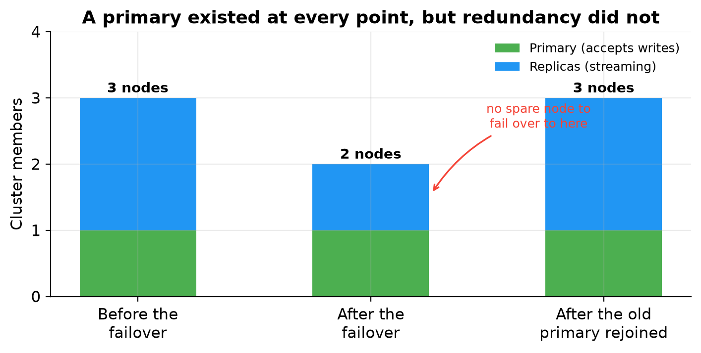{width=6.30in height=3.18in}

The chart is drawn from the three Patroni cluster listings in the captured evidence. A primary existed at every checkpoint, which is why the application kept working. What disappeared in the middle column is not availability but redundancy: for the seven minutes the old primary stayed down, the cluster was one node away from having nothing to fail over to. That is the window you are trying to keep short in production, and it lasts as long as it takes somebody to bring the failed node back.

The data:

| Table | Rows |
|---|---|
| customers | 5 |
| orders | 7 |
| ha_test | 5 |

The marker table holds five rows: three from before the failover, one written after the failover, and one written while a replica was down. Every row is present and consistent on all three nodes.

---

## 18. Connection Path Explained

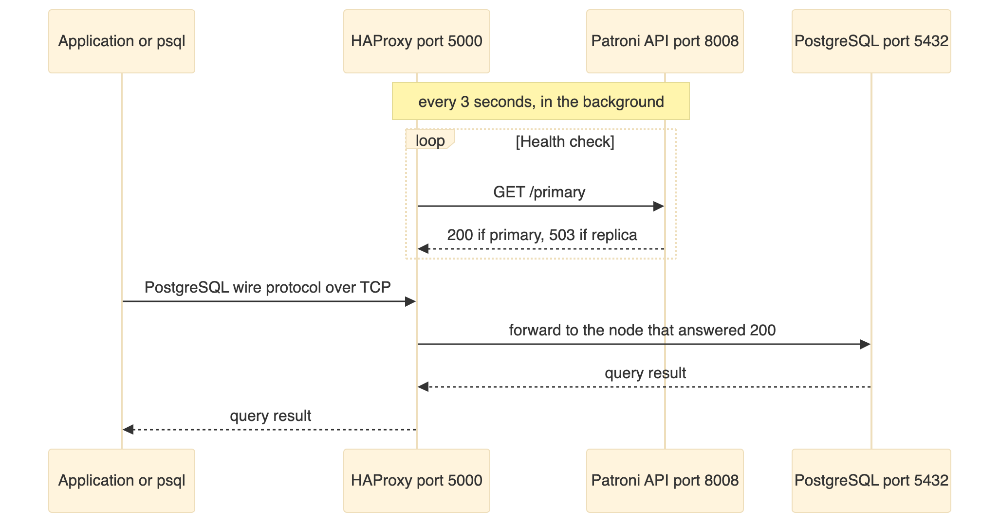{width=6.30in height=3.30in}

The application connects to HAProxy. The application does not connect to Patroni. The Patroni API exists for HAProxy to health check, and nothing else. The application never needs to know which node is the primary.

When the primary changes, the next health check finds out, and new connections go to the new primary.

---

## 19. Failover Internals

### The sequence of events

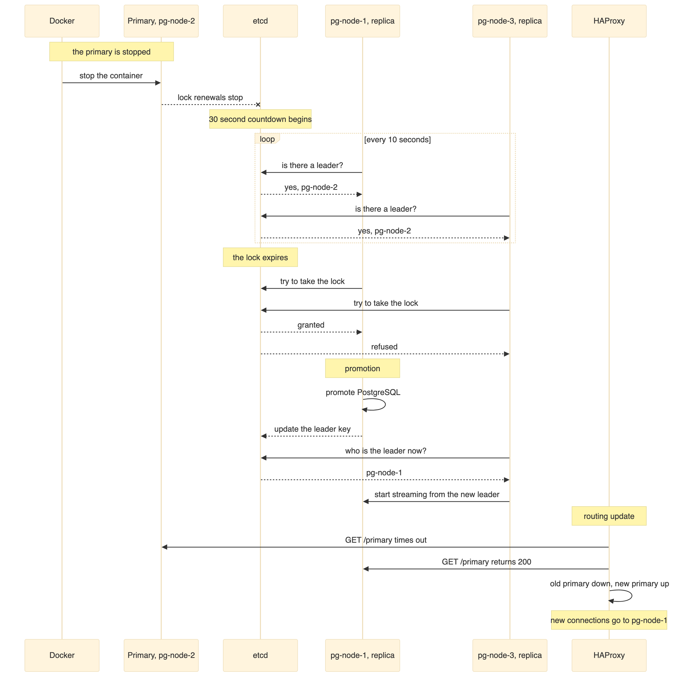{width=6.30in height=6.17in}

### The same thing as a state machine

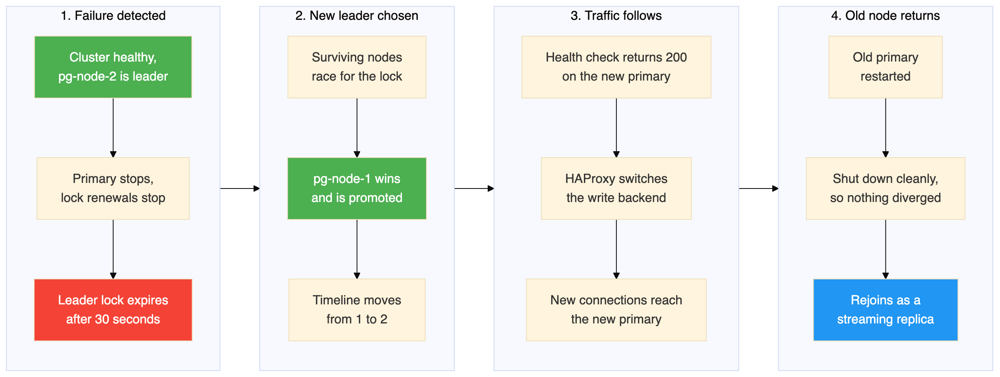{width=6.30in height=2.38in}

Walking through what happened, step by step:

1. **The primary fails.** The PostgreSQL process stops, or the container stops, or the network becomes unreachable.

2. **The failure becomes visible.** On the failed node itself, Patroni can no longer talk to PostgreSQL. What matters to the other nodes, though, is simply that the leader lock in etcd has stopped being renewed.

3. **The lock expires.** With a thirty second timeout and a ten second loop, the lock survives up to three missed renewals before etcd drops it. In this test the key expired around thirty seconds after the primary was stopped. The surviving nodes then noticed on their next pass and the winner held the lock three seconds later. Those extra seconds are the loop interval, not the timeout, because Patroni only acts when its loop next wakes up.

4. **The election happens.** The surviving nodes try to create the leader key. Only one can succeed, because etcd makes that operation atomic. The winner becomes the leader.

5. **The winner is promoted.** Patroni promotes the local PostgreSQL from read only standby to read write primary. PostgreSQL increases the timeline, in this case from 1 to 2.

6. **The loser follows.** The node that lost sees the new leader in etcd and starts streaming from it instead.

7. **HAProxy catches up.** Its health check finds that the old primary no longer answers and the new one does, so it moves the traffic.

8. **New connections work.** Clients connecting to port 5000 reach the new primary. The connection string never changed.

9. **The old primary comes back later.** Patroni sees that somebody else holds the lock, rewinds the diverged data directory, and rejoins as a replica.

---

## 20. Existing Connections During Failover

This is the part that catches people out, so it is worth stating bluntly. **HAProxy does not move existing connections to the new primary.**

When the primary fails:

- Any connection that was already open to the old primary is broken. The client sees an error or a timeout.
- HAProxy closes those broken sessions promptly rather than letting them hang, because of the option that shuts down sessions on a server marked down.
- New connections made after HAProxy has noticed the new primary are routed correctly.
- Transactions that were in progress are lost. They are not replayed. The application has to notice the error and retry.

So applications need connection retry with a backoff, transaction retry so a failed transaction is run again on a new connection, and a connection pool that health checks and discards stale connections.

HAProxy gives you a stable address. It does not give you unbroken sessions. High availability at the infrastructure layer is necessary but not sufficient, and the application has to play its part.

---

## 21. Problems Hit While Building This

These are the failures that actually happened during this build, not a general list of things that might go wrong.

### The etcd version 2 API returned 404

Patroni logged a failure to get the list of machines from the etcd version 2 endpoint, with a response of 404 page not found.

The cause is that etcd 3.5 has the older version 2 API disabled by default, while the plain Patroni etcd package uses that version 2 client.

The fix has two parts. Install the Patroni variant that speaks the version 3 API, and configure the version 3 section in the Patroni configuration rather than the version 2 section. After the fix, Patroni logs that it has selected an etcd server, with no version 2 errors.

### The initialisation step refused to run as root

Creating the data directory failed with an error saying it cannot be run as root, and a hint suggesting logging in as the unprivileged user that will own the server process.

The cause is that the custom image ran as root, and PostgreSQL refuses to create a data directory as root for safety.

The fix is to switch the image to the postgres user, and to make sure the directory holding the Patroni configuration is owned by that user so it remains writable.

### The environment variable quietly overrode the configuration file

Even with the version 3 section present in the configuration file, Patroni still used the version 2 protocol.

The cause is that Patroni reads environment variables whose names map onto configuration sections, and those variables win over the file. A variable naming the version 2 hosts therefore selected the version 2 client no matter what the file said.

The fix is to name the environment variable so that it maps to the version 3 section instead.

This one is worth remembering as a general point. With Patroni, an environment variable will silently beat the configuration file, so if a setting appears to be ignored, check the environment before doubting the file.

---

### Log messages that look like problems and are not

The captured logs contain three recurring messages that will worry you the first time and can be ignored in this environment.

**A watchdog device warning during promotion.** At the exact moment of promotion, Patroni logged that it could not activate a Linux watchdog device, because `/dev/watchdog` does not exist. Patroni can use a hardware watchdog as a last line of defence, so that a node which loses its lock but somehow fails to demote itself gets forcibly rebooted. Containers have no watchdog device, so the feature is unavailable. The promotion went ahead normally. In production on real hardware this is worth configuring, because it closes a genuine gap.

**A watchprefix protocol error against etcd.** Every node logged a broken connection error mentioning an invalid chunk length, at startup and again during the failover. This is Patroni's long lived watch on etcd being cut and re established, which is normal behaviour when the key being watched changes or the connection is recycled. The cluster carried on working through every one of these.

**Connection reset tracebacks from the Patroni API.** Several nodes logged full Python tracebacks ending in a connection reset by peer, for requests coming from the HAProxy container address. This is HAProxy closing a health check connection as soon as it has the status code it needs, before Patroni has finished writing the response body. It is noisy and harmless. If it bothers you, the volume drops if you lengthen the health check interval.

None of these three affected the outcome, and all three appear in a cluster that is working correctly. The reason to know about them is so you do not go looking for a fault that is not there.

---

## 22. Cleanup

Stopping the cluster with the normal Compose command removes the containers and the network but keeps the named volumes, so starting it again brings the data back exactly as it was.

Adding the volume removal flag also deletes the four named volumes holding the etcd state and the three PostgreSQL data directories. That destroys all data and cluster configuration permanently, and the next start creates a completely fresh cluster.

A full rebuild means removing the volumes, rebuilding the image without using the layer cache, and starting again.

The commands are in Section 6.

---

## 23. Production Considerations

This lab demonstrates the mechanics correctly. Several things have to change before anything depends on it.

| In this lab | For production |
|---|---|
| One etcd node | Three or five etcd nodes, so a minority can fail |
| All services on one host | Database nodes on separate physical or virtual machines, ideally in different failure domains |
| Docker bridge network | A dedicated low latency network |
| Credentials in a file | A secrets manager |
| Password authentication allowed from anywhere | Restricted source ranges, and the scram-sha-256 method |
| No encryption in transit | TLS for PostgreSQL, for the Patroni API and for etcd |
| No monitoring | Metrics and alerting, for example Prometheus with Grafana |
| No backups | Base backups plus log archiving, using a tool such as pgBackRest or Barman, with restores actually tested |
| Thirty second timeout | Tuned to balance failover speed against false failovers |
| Asynchronous replication | Consider synchronous replication if you cannot afford to lose recent transactions |
| Every statement logged | Log only slow statements |
| Docker volumes on one disk | Dedicated fast storage per node |

The most important line is the one about backups, and it is the one most often skipped because replication feels like it already covers the problem. It does not. Replication copies mistakes as faithfully as it copies good data.

---

## 24. Questions and Answers

**What is PostgreSQL responsible for?**
Storing and querying the data. It handles SQL, transactions, replication mechanics and data integrity.

**What is Patroni responsible for?**
The cluster lifecycle: first time setup, leader election, promotion, demotion, replication configuration and automatic failover. Patroni decides which node is the primary.

**What is etcd responsible for?**
Holding the leader lock and cluster state in a consistent key value store, and guaranteeing that only one node can hold that lock at a time.

**What is HAProxy responsible for?**
Giving clients one stable address, health checking each node's Patroni API, and routing connections to the current primary on port 5000 or to replicas on port 5001.

**Does the application connect to Patroni?**
No. The application connects to HAProxy, which forwards to PostgreSQL. The Patroni API is only used by HAProxy for health checks.

**Who decides which node is the primary?**
Patroni, through the election mechanism in etcd.

**Where is the leader information kept?**
In etcd, as a key under the prefix for this cluster.

**How does Patroni detect a failure?**
The leader has to renew its lock in etcd inside the timeout. If it stops renewing, because the process died or the container stopped or the network broke, the lock expires.

**How is a replica promoted?**
The winning node promotes its local PostgreSQL from standby to primary, and PostgreSQL advances the timeline.

**How does HAProxy learn about the new primary?**
It polls each node's Patroni API every three seconds. The primary endpoint answers 200 only on the current primary.

**What happens to connections that are already open?**
They break. The old connection cannot be moved. New connections go to the new primary.

**What happens to transactions in progress during a failure?**
They are lost and must be retried by the application.

**What happens to the old primary?**
When it restarts, Patroni notices it is no longer the leader and starts it as a replica. If the node diverged, meaning it accepted writes the new primary never received, Patroni first runs pg_rewind to undo that divergence. If it shut down cleanly and did not diverge, which is what happened in this test, it simply follows the new timeline and no rewind is needed.

**Does pg_rewind always run when a former primary rejoins?**
No, and this is widely misunderstood. It only runs when there is a genuine divergence to undo. Stopping a container gives Patroni time to shut PostgreSQL down cleanly, so nothing diverges. You see pg_rewind after an abrupt loss, such as a power cut or an immediate kill, where the old primary accepted a write that never reached the new one.

**Does the old primary get its role back?**
No. Patroni does not fail back on its own. The promoted node stays the leader until you move the role deliberately.

**What happens if a replica fails?**
Very little. The primary keeps serving writes, the other replica keeps streaming, and HAProxy removes the missing node from the read pool.

**What happens if two database nodes fail?**
If both replicas fail, the primary keeps running, and no failover happens because there is nothing to fail over to. If the primary and one replica fail, the surviving replica may be promoted if it can take the lock, but at that point there is no redundancy left.

**What happens if etcd fails?**
The current primary keeps serving. However, no election can happen, so if the primary then fails there is no failover. In this lab etcd is a single point of failure. Production uses several etcd nodes.

**Why are three database nodes better than two?**
With three, you can lose one and still have a primary and a replica. With two, losing the primary leaves a single node with no redundancy at all.

**Why is one etcd node acceptable here but not in production?**
For learning it is simpler and enough. In production it is a single point of failure, because losing it stops all elections. Production uses three or five nodes so the cluster survives losing a minority.

**Can I run this on a single machine in production?**
No. Every container here shares one host, one kernel and one disk. Losing that machine loses the whole cluster, however many nodes are configured.

---

## 25. Validation Checklist

Every item below was confirmed during the run.

| Check | Result |
|---|---|
| Compose configuration valid | Passed |
| All containers start | Passed |
| etcd healthy | Passed |
| Patroni healthy on all nodes | Passed |
| One primary exists | Passed |
| Two replicas exist | Passed |
| Streaming replication working with zero lag | Passed |
| Application database and sample data present | Passed |
| Client connects through the HAProxy write port | Passed |
| Primary failure tested by stopping the container | Passed |
| New primary elected without intervention | Passed, pg-node-1 after about 34 seconds |
| New primary accepts writes | Passed |
| Data written before the failover survives | Passed |
| HAProxy routes to the new primary | Passed. Order and reason codes confirmed in the log, though that log has no timestamps |
| Old primary rejoins the cluster | Passed, in about 1.5 seconds, without needing pg_rewind |
| Three node cluster restored on timeline 2 | Passed |
| Replica failure tested separately | Passed, no failover and no interruption to writes |
| All figures in this document taken from captured output | Passed |

---

## 26. Closing Notes

### Five things worth taking away

**Each component solves exactly one problem.** PostgreSQL replicates, etcd arbitrates, Patroni decides and acts, HAProxy routes. No component covers for another, and when something breaks that split tells you where to look first.

**Failover time is a policy decision, not a measure of speed.** Thirty of the thirty three seconds were the cluster deliberately waiting out a timeout to be sure the primary was really gone. The promotion took under a second. You can make it faster, but you pay for that speed with a greater risk of failing over when nothing was actually wrong.

**A stable address is not an unbroken session.** The connection string never changed, and every open connection still died. Applications need retry logic.

**How the primary dies changes how it comes back.** The rejoin here took 1.5 seconds and needed no pg_rewind, because stopping the container let Patroni shut PostgreSQL down cleanly. An abrupt loss would have diverged the node and forced a rewind. Hint logging and data checksums were enabled at creation time, so that rewind would have been possible. Neither can be added after an incident, and checksums can only be set when the data directory is first created.

**A cluster you have not deliberately broken is not a tested cluster.** Everything here worked, and that is only known because the primary was actually killed rather than assumed to be survivable.

### Being honest about what this protects

This build defends against exactly one thing: the loss of a single PostgreSQL node. It does nothing about the single etcd node, the single host, disk corruption that replicates to every replica, or a mistaken delete that reaches all three nodes in milliseconds.

Replication keeps three copies of your data in step, including the copy of an accident. A real backup strategy, with restores that have actually been tested, belongs at the top of the production list.

### Reasonable next steps

- Turn on synchronous replication and measure what it costs in write latency against what it buys in durability.
- Replace the single etcd node with three, then break the network to one of them.
- Put a connection pooler in front of HAProxy and watch how pooling changes what the application sees during a failover.
- Run a planned switchover with the Patroni command line tool and compare it with the unplanned failover measured here. It is far quicker, because nothing has to wait for a timeout to expire.

### Repository

The configuration and the test scripts are at **https://github.com/rameshsraj/pgandpatroni**, in the `postgres-patroni-ha` folder. Please change the credentials before you use any of it.
