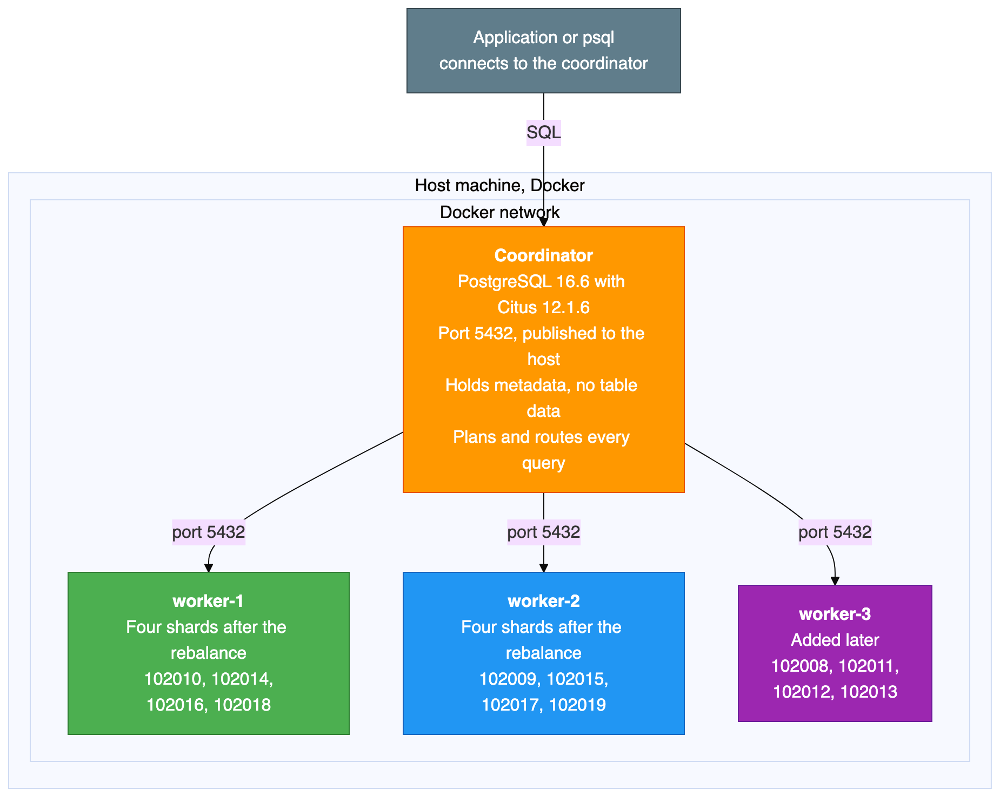
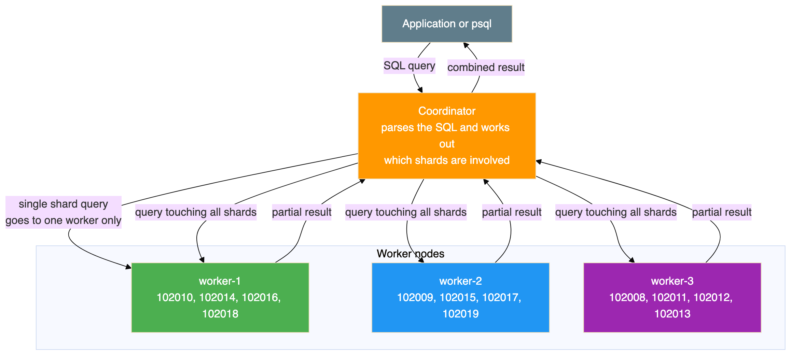
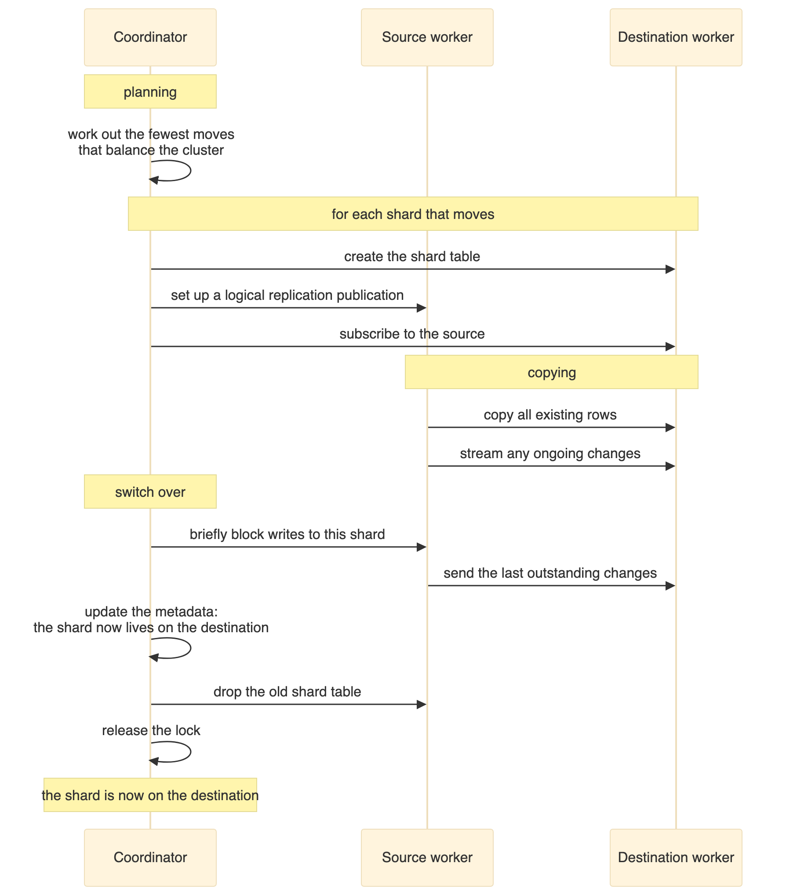

# PostgreSQL Sharding with Citus

## A lab build that was tested by adding a worker and rebalancing live

Vertical scaling runs out eventually. When one PostgreSQL server can no longer hold the data or absorb the writes, the next step is to spread the rows across several machines. That leads straight to the interesting question: can you add a machine to a cluster that is already full of data, without downtime and without losing a row?

This guide answers that by trying it. It builds a Citus cluster with one coordinator and two workers, loads 10,500 rows, adds a third worker to the running cluster, triggers a rebalance, and then audits the result.

Every shard number, row count and query plan in this document comes from a real test run on 31 August 2026. The figures add up, and you can check them yourself. The per shard counts total exactly 500 both before and after the move.

### Source code

All configuration and scripts referred to here are in the public repository:

**https://github.com/rameshsraj/pgandpatroni**

The sharding build is in the `postgres-sharding-lab` folder. This document explains what each step does and what happened when it was tested. It does not reproduce the files themselves, so please read them in the repository if you plan to adapt them.

### What the test showed

| Question | Result from this run |
|---|---|
| Does adding a worker move data automatically? | No. The new worker held zero shards until a rebalance was triggered on purpose. |
| Did the rebalance need downtime? | No. The cluster stayed queryable throughout. |
| How much data moved? | Four of twelve shard groups, which is the least needed for an even split. |
| Were rows lost or duplicated? | Neither. 10,500 rows before, 10,500 after, no orphans and no duplicates. |
| Did query results change? | No. The aggregates and joins returned the same values. |
| How does Citus move a shard? | With logical replication, followed by a brief metadata switch. |

### What this document covers

- The difference between PostgreSQL partitioning and real sharding across nodes. These two are constantly confused and they solve different problems.
- How to choose a shard key, and how to spot a bad one before it becomes a production problem.
- Why co-location is the most important decision in a sharded schema.
- What Citus actually does while it is rebalancing.
- Why this cluster, as built, is less available than a single PostgreSQL server, and what to do about that.

### Who this is for

Engineers who know PostgreSQL and are working out whether to shard. You should be comfortable with SQL, Docker and the general idea of hash partitioning. No previous Citus experience is needed.

### An important limit on scope

This is a laboratory build on one Docker host. It is meant to make the mechanics visible, not to be copied into production. The section on limitations is specific about the gap.

---

## Table of Contents

1. [Overview](#1-overview)
2. [Why Citus](#2-why-citus)
3. [Architecture](#3-architecture)
4. [Prerequisites](#4-prerequisites)
5. [Component Versions](#5-component-versions)
6. [Configuration Summary](#6-configuration-summary)
7. [Starting the Cluster](#7-starting-the-cluster)
8. [Database and Extension Setup](#8-database-and-extension-setup)
9. [Registering the Workers](#9-registering-the-workers)
10. [Schema Design](#10-schema-design)
11. [Choosing the Shard Key](#11-choosing-the-shard-key)
12. [Distributing the Tables](#12-distributing-the-tables)
13. [Loading Sample Data](#13-loading-sample-data)
14. [Where the Data Actually Landed](#14-where-the-data-actually-landed)
15. [How Queries Are Routed](#15-how-queries-are-routed)
16. [How the Rebalance Was Tested](#16-how-the-rebalance-was-tested)
17. [Adding the Third Worker](#17-adding-the-third-worker)
18. [Running the Rebalance](#18-running-the-rebalance)
19. [Before and After](#19-before-and-after)
20. [Data Integrity Validation](#20-data-integrity-validation)
21. [What Happens Inside a Shard Move](#21-what-happens-inside-a-shard-move)
22. [Failure and Availability](#22-failure-and-availability)
23. [Performance Notes](#23-performance-notes)
24. [Day to Day Operations](#24-day-to-day-operations)
25. [Limitations of This Lab](#25-limitations-of-this-lab)
26. [Problems Hit While Building This](#26-problems-hit-while-building-this)
27. [Cleanup](#27-cleanup)
28. [Test Summary](#28-test-summary)
29. [Closing Notes](#29-closing-notes)

---

## 1. Overview

Citus is an open source extension that turns a single PostgreSQL database into a distributed cluster. This lab uses:

- **One coordinator node.** It receives every query, plans the distributed execution, and routes work to the workers.
- **Two worker nodes** to begin with. They hold the actual data and run queries locally.
- **A third worker** added later, to demonstrate a live rebalance.

The lab creates a database with three related tables, distributes them across the workers using the customer identifier as the shard key, loads 10,500 rows, then adds a worker and moves data onto it using logical replication.

---

## 2. Why Citus

PostgreSQL already has table partitioning, where one large table is split into smaller pieces using a declarative partition clause. Partitioning is useful, but every partition still lives on the same PostgreSQL instance, on the same disk, using the same CPU. It does not spread data across machines.

For genuine sharding across nodes, where different rows physically live on different servers, there are three options:

1. Sharding in the application, so the application decides which database to connect to.
2. A proxy or middleware layer in front of several databases.
3. A PostgreSQL extension that handles distribution inside the database.

Citus is the third option. It runs inside PostgreSQL, so you keep standard SQL, standard tools and standard client access, while the data is physically spread across workers.

| Capability | PostgreSQL on its own | PostgreSQL with Citus |
|---|---|---|
| Store data on more than one server | No | Yes |
| Route a query to the right shard | No | Yes, automatically |
| Run one query on many shards in parallel | No | Yes |
| Join co-located tables without a network hop | Not applicable | Yes |
| Add or remove nodes while running | Not applicable | Yes |
| Move data after adding a node | Not applicable | Yes, using logical replication |
| Standard SQL and tools | Yes | Yes |

The honest summary is that partitioning helps you manage a big table on one machine, and sharding helps you use more than one machine. If your problem is that queries scan too much data, partitioning may be enough and is far simpler. If your problem is that one machine is genuinely full, you need sharding.

---

## 3. Architecture

### 3.1 The components

{width=6.30in height=5.03in}

Two structural points shape everything else in this guide.

**The coordinator stores no table data.** It holds only the Citus metadata: which shard lives where, and which range of hash values each shard owns. All 10,500 rows sit on the workers. That makes the coordinator cheap to run, and also makes it a complete single point of failure, as the section on availability explains.

**Workers are ordinary, independent PostgreSQL servers.** They do not replicate to each other and they are not aware of each other. A shard is a normal PostgreSQL table with a number on the end of its name. You can connect to a worker directly and select from a shard table exactly as you would from any other table.

### 3.2 How a query flows

{width=6.30in height=2.83in}

There are two shapes of query here, and the difference matters more than anything else for performance. A query that filters on the shard key goes to exactly one worker. A query that does not filter on the shard key has to be sent to every shard, with each one returning a partial answer for the coordinator to combine.

### 3.3 How rows are assigned to shards

Citus uses hash based sharding. When a table is distributed on the customer identifier:

1. Citus hashes the value of that column.
2. The full range of possible hash values is divided into equal, non overlapping slices, one per shard.
3. Each shard is placed on a worker.
4. When a row is inserted, Citus hashes the value, finds which slice it falls into, and sends the row to the worker holding that shard.
5. When a query filters on that column, the same hash tells the coordinator which single worker to ask.

With twelve shards and three workers, each worker holds four shards. A shard holds a set of customer identifiers that happen to hash into the same slice. It is not a contiguous range of identifiers, which is why customers 100 and 500 can end up on the same shard while 1 and 42 do not.

### 3.4 Co-location

All three tables are distributed on the same column and placed in the same co-location group. This has three consequences:

- Shard number 102008 of the first table sits on the same worker as the matching shards of the other two tables.
- A join between those tables on the shared column runs entirely inside one worker, with no data crossing the network.
- The rebalancer moves whole co-location groups together, so related rows stay together.

Co-location is the single most consequential design decision in a sharded schema. Get it right and most of your queries touch one node. Get it wrong and almost every query becomes a distributed one, and changing it later means redistributing every table.

---

## 4. Prerequisites

| Software | Purpose | Version |
|---|---|---|
| Docker Desktop or Docker Engine | Container runtime | Version 4 or later |
| Docker Compose | Service orchestration | Version 2, which ships with Docker Desktop |
| Git | To clone the repository | Any recent version |
| psql | PostgreSQL client, optional | Any version |

The client is optional, because you can run psql inside the coordinator container instead.

The lab runs three or four containers, so give Docker at least 4 GB of memory.

This build was tested on Docker Desktop on Windows, where Linux containers run inside a small virtual machine and all Docker commands work normally from PowerShell. The same files work on macOS and Linux. The one difference is how you feed a SQL file into a container, because piping a file is written differently in PowerShell than in a Unix shell. The repository README shows both forms.

---

## 5. Component Versions

Tested together on 31 August 2026.

| Component | Version |
|---|---|
| PostgreSQL | 16.6 |
| Citus | 12.1.6 |
| Docker image | citusdata/citus:12.1 |
| Docker Compose | Version 2 |

There is a small versioning trap here. Citus reports two different version numbers, and they answer different questions. The extension catalogue reports the SQL script version, which is 12.1-1 in this build. The Citus version function reports the compiled library version, which is 12.1.6. Both are correct. Only the second one tells you the patch level, so use that one when you are checking whether a fix is present.

---

## 6. Configuration Summary

The repository holds the Compose file. This section explains what it sets up and why.

Four services sit on one Docker bridge network. The coordinator publishes port 5432 to the host, and the workers do not publish anything, so they are reachable only from inside the network. That mirrors how a real deployment works: clients talk to the coordinator and nothing else.

Each node has its own Docker volume. Every node runs a health check using the standard PostgreSQL readiness tool, every five seconds.

The third worker is defined behind a Compose profile, which means it does not start with the normal start command. It only starts when the profile is named explicitly. That is what makes the add a node exercise realistic, because nothing has to be rebuilt or reconfigured to bring it in.

### The settings that matter

| Setting | Applied to | Why it is needed |
|---|---|---|
| Preload the Citus library | All nodes | Citus will not function unless it is loaded at server start |
| Logical write ahead log level | All nodes | The rebalancer moves shards using logical replication, which requires it |
| Twelve shards per distributed table | Coordinator | Twelve divides evenly by both two and three workers, which keeps the example tidy |
| One copy of each shard | Coordinator | No shard level replication in this lab. See the availability section. |
| Raised background worker limit | All nodes | Citus uses background workers for parallel queries and for rebalancing |
| Prepared transactions enabled | All nodes | Citus uses two phase commit across workers, which needs these |
| Trust authentication | All nodes | Passwordless connections inside the Docker network. Suitable for a lab only. |

Two of these are worth calling out.

**The logical log level and prepared transactions are not optional if you intend to rebalance.** Both default to values that make the rebalancer fail, and the failures are not obvious from the error messages. They are the two most common reasons a first attempt at rebalancing does not work.

**Trust authentication means no password is required at all.** It is convenient in a lab and completely unacceptable anywhere else. Nothing in this build should be exposed to a network you do not fully control.

---

## 7. Starting the Cluster

Starting the stack with the normal Compose command brings up three containers: the coordinator and the first two workers. The third worker stays down, because it sits behind a profile.

Wait until all three report themselves as healthy. This is the container status from the test run:

```
NAME                IMAGE                  STATUS                    PORTS
citus-coordinator   citusdata/citus:12.1   Up (healthy)              0.0.0.0:5432->5432/tcp
citus-worker-1      citusdata/citus:12.1   Up (healthy)              5432/tcp
citus-worker-2      citusdata/citus:12.1   Up (healthy)              5432/tcp
```

Note the difference in the ports column. Only the coordinator publishes a port to the host. The workers show a bare port, meaning it is open inside the Docker network but not reachable from your machine.

If port 5432 is already in use on your host, which usually means a locally installed PostgreSQL is running, the coordinator will fail to start. Change the published port in the Compose file and connect on the new one.

---

## 8. Database and Extension Setup

The Citus image creates the extension automatically in the default database. This lab uses a dedicated database instead, which has to be created on every node, with the extension enabled in each one.

The reason every node needs it is worth understanding. Citus keeps its metadata on the coordinator, but the shards themselves are ordinary PostgreSQL tables on the workers. When the coordinator distributes a table, it sends the schema definition to the workers so they can create the shard tables. If a worker does not have the database and the extension, that step fails.

Note that creating a database is not propagated to the workers automatically in this version, which is why it has to be done on each node. The setup script in the repository does this for all nodes in one pass.

Checking the extension afterwards gave this:

```
 extname | extversion
---------+------------
 citus   | 12.1-1
```

As noted in the versions section, this is the SQL script version rather than the library version.

---

## 9. Registering the Workers

The coordinator has to be told which workers exist. It also has to be told its own address, because the rebalancer needs to know about every node in the cluster including the coordinator itself.

After registering the coordinator and the two workers, the node list looked like this:

```
 nodeid |  nodename   | nodeport | noderole | isactive
--------+-------------+----------+----------+----------
      1 | coordinator |     5432 | primary  | t
      2 | worker-1    |     5432 | primary  | t
      3 | worker-2    |     5432 | primary  | t
```

The role column says primary for every row, and that is a naming collision worth clearing up. This is Citus describing its own internal node classification. It has nothing to do with PostgreSQL streaming replication, and it does not mean these nodes have replicas. Each worker here is completely independent, and there is no replication between them.

---

## 10. Schema Design

Three tables were created: customers, orders and order items. Orders reference customers, and order items reference both. The full definitions are in the repository.

There is one design detail that is specific to Citus and that catches everybody the first time.

**Every unique constraint has to include the distribution column.** The customers table is keyed on the customer identifier alone, which is fine because that is the distribution column. The orders table is keyed on the order identifier together with the customer identifier, rather than the order identifier by itself. The order items table does the same thing.

The reason is that uniqueness can only be enforced inside a single shard. There is no global index spanning all the workers, and building one would require coordination on every insert, which is exactly the cost sharding is meant to avoid. By including the distribution column in the key, Citus knows that all rows which could possibly collide are in the same shard, so a local unique index is sufficient.

The practical consequence is that you cannot simply take an existing schema and distribute it. Primary keys and unique constraints usually have to change first, and foreign keys have to line up with the distribution column too. This is normally the largest piece of work in adopting Citus, and it is worth knowing before you start rather than halfway through.

---

## 11. Choosing the Shard Key

The shard key for all three tables is the customer identifier. This was a deliberate choice, and the alternatives were considered.

| Criterion | Customer identifier | Order identifier | City |
|---|---|---|---|
| Number of distinct values | Good, 500 | Good, 2,500 | Poor, only 10 |
| Spreads evenly | Yes, hashing distributes it | Yes | No, 50 customers per city |
| Allows co-located joins | Yes, all three tables have it | No, the customers table does not have it | No, the other tables do not have it |
| Commonly used as a filter | Yes, show me this customer's data | Sometimes | Sometimes |
| Keeps one customer's data together | Yes | No | No |

The customer identifier wins for four reasons:

1. **It exists in all three tables**, so a customer, their orders and their order items all land on the same shard.
2. **Joins on it stay local**, with no data moving between workers.
3. **A lookup for one customer touches one worker**, not all of them.
4. **It spreads reasonably evenly.** Hashing 500 identifiers across twelve shards averages about 42 per shard. The observed spread was 32 to 47, which is normal variation at this size and evens out with more data.

**What a bad shard key looks like.** If the city column had been used, all 50 customers in one city would sit on a single shard. With only ten distinct cities and twelve shards, at least two shards would be permanently empty while the others carried everything. Worse, the imbalance would be invisible in a small test and would only become a problem at scale.

The general rule is that a good shard key has many distinct values, spreads them evenly, appears in most of your queries as a filter, and exists in all the tables you want to join. A tenant or customer identifier usually fits. A status column, a boolean, a country, or anything with a handful of values does not.

---

## 12. Distributing the Tables

The tables were created as ordinary PostgreSQL tables first, then converted into distributed tables, with the second and third explicitly co-located with the first.

What that conversion does:

1. Creates twelve shard tables on the workers, named after the original table with a shard number appended.
2. Gives each shard an equal, non overlapping slice of the hash space, recorded in the Citus metadata.
3. Assigns shards to workers in turn, in shard number order. With two workers that produced a strict alternation: the first shard to worker 1, the second to worker 2, the third to worker 1, and so on.
4. Places the co-located tables' shards on the same workers as the matching shards of the first table.

Confirming the result:

```
 table_name  | partmethod | colocationid | repmodel
-------------+------------+--------------+----------
 customers   | h          |            1 | s
 order_items | h          |            1 | s
 orders      | h          |            1 | s
```

The partition method is hash. All three tables share co-location group 1, which is what makes local joins possible. The replication model column reports the streaming model, meaning a single copy of each shard.

### How the shard numbering works

Citus allocates shard numbers from one counter, in a contiguous block per table, in the order the tables were distributed.

| Table | Shard numbers | Distributed |
|---|---|---|
| customers | 102008 to 102019 | First |
| orders | 102020 to 102031 | Second |
| order_items | 102032 to 102043 | Third |

Co-located shards line up by position within the block, not by having the same number. The first customers shard is co-located with the first orders shard and the first order items shard. This is why a later section shows shard 102008 moving together with 102020 and 102032. They are one co-location group covering the same slice of the hash space, and Citus always moves them as a unit.

It also explains a number that would otherwise look arbitrary. The eleventh customers shard, 102018, pairs with the eleventh orders shard, 102030, which is the pairing the co-located join example relies on.

---

## 13. Loading Sample Data

The data generation script produced:

| Table | Rows | How |
|---|---|---|
| customers | 500 | One per generated number |
| orders | 2,500 | Five per customer |
| order_items | 7,500 | Three per order |
| **Total** | **10,500** | |

Every insert went through the coordinator. The coordinator hashed each row's customer identifier and sent the row to the correct worker, with no involvement from the client. This is the part that makes Citus pleasant to use: the application inserts rows as if into a normal table.

The result:

```
INSERT 0 500
INSERT 0 2500
INSERT 0 7500
 table_name  | row_count
-------------+-----------
 customers   |       500
 order_items |      7500
 orders      |      2500
```

---

## 14. Where the Data Actually Landed

This is where sharding stops being abstract. The shard placement for the customers table, before the third worker was added:

```
 shardid |    shard_name    | table_name | nodename | nodeport | shard_size
---------+------------------+------------+----------+----------+------------
  102008 | customers_102008 | customers  | worker-1 |     5432 |      32768
  102009 | customers_102009 | customers  | worker-2 |     5432 |      32768
  102010 | customers_102010 | customers  | worker-1 |     5432 |      32768
  102011 | customers_102011 | customers  | worker-2 |     5432 |      32768
  102012 | customers_102012 | customers  | worker-1 |     5432 |      32768
  102013 | customers_102013 | customers  | worker-2 |     5432 |      32768
  102014 | customers_102014 | customers  | worker-1 |     5432 |      32768
  102015 | customers_102015 | customers  | worker-2 |     5432 |      32768
  102016 | customers_102016 | customers  | worker-1 |     5432 |      32768
  102017 | customers_102017 | customers  | worker-2 |     5432 |      32768
  102018 | customers_102018 | customers  | worker-1 |     5432 |      32768
  102019 | customers_102019 | customers  | worker-2 |     5432 |      32768
```

Twelve shards alternating between the two workers, six each. Every one is a real PostgreSQL table sitting in a worker's database.

Row counts per worker:

```
 nodename | shard_count | total_rows
----------+-------------+------------
 worker-1 |           6 |        241
 worker-2 |           6 |        259
```

That totals 500. The small imbalance between 241 and 259 is expected, because hashing distributes values approximately rather than exactly.

The same ratio appears in all three tables, because they are co-located:

| Table | worker-1 | worker-2 | Total |
|---|---|---|---|
| customers | 241 | 259 | 500 |
| orders | 1,205 | 1,295 | 2,500 |
| order_items | 3,615 | 3,885 | 7,500 |

A customer with five orders and fifteen order items always lands on one worker, so the proportions follow the customer distribution exactly.

Row counts per individual shard:

```
 shardid | success | row_count
---------+---------+-----------
  102008 | t       | 46
  102009 | t       | 41
  102010 | t       | 32
  102011 | t       | 44
  102012 | t       | 47
  102013 | t       | 47
  102014 | t       | 32
  102015 | t       | 47
  102016 | t       | 39
  102017 | t       | 35
  102018 | t       | 45
  102019 | t       | 45
```

The range is 32 to 47 rows. The variation comes from the hash function, because some slices catch more identifiers than others. With more data the distribution evens out. These twelve numbers are used later to prove that the rebalance did not lose anything.

---

## 15. How Queries Are Routed

### A lookup on the shard key

Asking for one customer by identifier produced a plan with a task count of one, naming a single shard and a single worker. Citus worked out that the identifier hashes to shard 102018, which was on worker 1, and sent the query only there. The other worker was not contacted at all.

This is the best case, and it is the case worth designing for. Adding more workers makes this kind of query no slower, because it always touches exactly one of them.

### A join between co-located tables

Joining customers to orders for one customer also produced a task count of one. Both tables' shards for that customer are on the same worker, so the whole join ran there. No data moved between workers.

The result:

```
    name     | order_id | order_date | total_amount |  status
-------------+----------+------------+--------------+-----------
 Customer-42 |     2415 | 2025-12-13 |        15.10 | shipped
 Customer-42 |     2370 | 2026-01-21 |       258.91 | pending
 Customer-42 |     2460 | 2026-01-31 |       364.85 | delivered
 Customer-42 |     2280 | 2026-03-06 |       130.38 | delivered
 Customer-42 |     2325 | 2026-05-09 |        65.86 | cancelled
```

### An aggregate across every shard

Grouping revenue by city has no filter on the shard key, so it has to touch every shard. Each worker computed a partial result and the coordinator combined them:

```
   city    | customers | orders | total_revenue
-----------+-----------+--------+---------------
 Sydney    |        50 |    250 |      66162.73
 Toronto   |        50 |    250 |      65014.76
 Berlin    |        50 |    250 |      64942.73
 Paris     |        50 |    250 |      64364.26
 São Paulo |        50 |    250 |      63762.02
 Singapore |        50 |    250 |      63306.32
 Tokyo     |        50 |    250 |      62648.80
 New York  |        50 |    250 |      62305.02
 Mumbai    |        50 |    250 |      61182.11
 London    |        50 |    250 |      58398.65
```

Fifty customers in every city, totalling 500, which confirms nothing was missed. This query runs on all shards in parallel, so it is not slow, but it does get more expensive as workers are added rather than less. That is the trade-off of a query that cannot be routed to one shard.

Note the exactly even fifty per city. That is an artefact of how the sample data was generated, not a property of the hashing.

### Which shard owns which customer

Asking Citus directly which shard a given identifier belongs to:

```
 customer_id | shard_id
-------------+----------
           1 |   102008
          42 |   102018
         100 |   102014
         250 |   102011
         500 |   102014
```

Identifiers 100 and 500 both map to shard 102014, while 1 and 42 are on different shards. This is what hash distribution means in practice. Shards hold sets of identifiers that hash together, not contiguous ranges, so you cannot look at a shard and describe its contents as a range.

---

## 16. How the Rebalance Was Tested

This section describes the method, because a result is only as good as the way it was produced.

**The approach.** Rather than starting with three workers, the cluster was deliberately built with two, filled with data, and only then extended. That is the situation people actually face, and it is the one where the interesting question arises, because the existing data has to move.

**What was captured, and when.** A full snapshot of the cluster state was written to files at two points: after the third worker was registered but before any rebalance, and again after the rebalance finished. Each snapshot recorded the container status, the Citus version, the node list, the shard placement, the shard count per worker, the row counts per worker for all three tables, the total row counts, and a sample of rows. The before and after tables later in this document are built from those two snapshots.

**What was checked afterwards.** Row totals for all three tables, duplicate checks on the keys, referential integrity in both directions, spot checks on specific customers, the revenue aggregate compared against its pre-rebalance value, and the range of customer identifiers.

**What would have counted as a failure.** Any change in a row total, any duplicate, any orphan row, or any difference in the revenue figures. None of those occurred.

The scripts that add the worker, run the rebalance, capture the snapshots and validate the data are in the repository.

---

## 17. Adding the Third Worker

The third worker was started using its Compose profile. Only that container started, and the coordinator and existing workers kept running without interruption.

Then the same preparation as any other worker: wait for it to be healthy, create the database, enable the extension, and register it with the coordinator.

The node list afterwards:

```
 nodeid |  nodename   | nodeport | noderole | isactive
--------+-------------+----------+----------+----------
      1 | coordinator |     5432 | primary  | t
      2 | worker-1    |     5432 | primary  | t
      3 | worker-2    |     5432 | primary  | t
      4 | worker-3    |     5432 | primary  | t
```

The shard distribution at that moment is the important part:

```
 nodename | shard_count
----------+-------------
 worker-1 |           6
 worker-2 |           6
```

**The new worker holds nothing.** It does not even appear in the list, because it owns no shards. Adding a node to Citus registers it and nothing more. The existing shards stay exactly where they were.

This is deliberate, and it is the right default. Moving data costs disk reads, network transfer and write ahead log volume on the source workers. Citus separates the decision that a node exists from the decision to pay that cost, so you can add capacity during a quiet period and move data during a quieter one. New distributed tables created from this point would use the new worker straight away, but existing data waits until you ask.

---

## 18. Running the Rebalance

The rebalance was triggered on the coordinator. It reported each move as it happened:

```
NOTICE:  Moving shard 102011 from worker-2:5432 to worker-3:5432 ...
NOTICE:  Moving shard 102008 from worker-1:5432 to worker-3:5432 ...
NOTICE:  Moving shard 102013 from worker-2:5432 to worker-3:5432 ...
NOTICE:  Moving shard 102012 from worker-1:5432 to worker-3:5432 ...
```

Four shard groups moved: two from the first worker and two from the second. Each of those moves carried the co-located shards from all three tables, so moving shard 102008 also moved the matching orders and order items shards.

Notice what the rebalancer chose to do. It moved four shard groups, not twelve. It worked out the smallest set of moves that produces an even spread, and left the other eight groups untouched. That restraint matters on a real cluster, where moving a shard is expensive.

The distribution afterwards:

```
 nodename | shard_count
----------+-------------
 worker-1 |           4
 worker-2 |           4
 worker-3 |           4
```

Twelve shards across three workers, four each.

Row counts afterwards:

```
 nodename | shard_count | total_rows
----------+-------------+------------
 worker-1 |           4 |        148
 worker-2 |           4 |        168
 worker-3 |           4 |        184
```

Those total 500, the same as before.

Note that the row counts are less even than the shard counts. Four shards each, but 148, 168 and 184 rows. Citus balances by shard count and by shard size, not by row count, so a worker that happens to receive the busier shards ends up with more rows. With realistic data volumes this evens out, but it is worth knowing that an even shard count does not guarantee an even row count.

---

## 19. Before and After

Shard placement for the customers table:

| Shard | Before | After | Moved |
|---|---|---|---|
| 102008 | worker-1 | **worker-3** | Yes |
| 102009 | worker-2 | worker-2 | No |
| 102010 | worker-1 | worker-1 | No |
| 102011 | worker-2 | **worker-3** | Yes |
| 102012 | worker-1 | **worker-3** | Yes |
| 102013 | worker-2 | **worker-3** | Yes |
| 102014 | worker-1 | worker-1 | No |
| 102015 | worker-2 | worker-2 | No |
| 102016 | worker-1 | worker-1 | No |
| 102017 | worker-2 | worker-2 | No |
| 102018 | worker-1 | worker-1 | No |
| 102019 | worker-2 | worker-2 | No |

Four of twelve shards moved, two from each existing worker.

Shard count per worker:

| Worker | Before | After | Change |
|---|---|---|---|
| worker-1 | 6 | 4 | Two fewer |
| worker-2 | 6 | 4 | Two fewer |
| worker-3 | 0 | 4 | Four more |

Row count per worker for the customers table:

| Worker | Before | After | Change |
|---|---|---|---|
| worker-1 | 241 | 148 | 93 fewer |
| worker-2 | 259 | 168 | 91 fewer |
| worker-3 | 0 | 184 | 184 more |
| **Total** | **500** | **500** | **No change** |

Total row counts:

| Table | Before | After |
|---|---|---|
| customers | 500 | 500 |
| orders | 2,500 | 2,500 |
| order_items | 7,500 | 7,500 |
| **Total** | **10,500** | **10,500** |

### Checking the arithmetic

The per shard counts from the earlier section reconcile exactly against the per worker totals, which is the strongest evidence available that nothing was lost or duplicated.

| Worker | Shards held | Row counts | Total |
|---|---|---|---|
| worker-1, before | 102008, 102010, 102012, 102014, 102016, 102018 | 46, 32, 47, 32, 39, 45 | **241** |
| worker-2, before | 102009, 102011, 102013, 102015, 102017, 102019 | 41, 44, 47, 47, 35, 45 | **259** |
| worker-1, after | 102010, 102014, 102016, 102018 | 32, 32, 39, 45 | **148** |
| worker-2, after | 102009, 102015, 102017, 102019 | 41, 47, 35, 45 | **168** |
| worker-3, after | 102008, 102011, 102012, 102013 | 46, 44, 47, 47 | **184** |

Both groupings total 500, and every shard arrived holding exactly the rows it started with.

That last point is the important one. **A shard move relocates data. It does not re-hash it.** The distribution column decides which shard a row belongs to, and that never changed. Only the shard's location changed. This is why a rebalance is safe to run on a live cluster: Citus is not recalculating anything, so there is no moment when a row could belong to two shards or to none.

---

## 20. Data Integrity Validation

The validation script was run after the rebalance.

| Check | Expected | Actual | Result |
|---|---|---|---|
| Total customers | 500 | 500 | Passed |
| Total orders | 2,500 | 2,500 | Passed |
| Total order items | 7,500 | 7,500 | Passed |
| Duplicate customer identifiers | 0 | 0 | Passed |
| Duplicate orders | 0 | 0 | Passed |
| Orders with no matching customer | 0 | 0 | Passed |
| Order items with no matching order | 0 | 0 | Passed |
| Order count for a specific customer | 5 | 5 | Passed |
| Another customer, five orders and fifteen items | Yes | Yes | Passed |
| Revenue by city matches the pre-rebalance figures | Yes | Yes | Passed |
| Range of customer identifiers | 1 to 500 | 1 to 500 | Passed |

Co-located joins, three table joins and aggregate queries all returned the same results as before the rebalance.

The referential integrity checks are the ones worth noting. Because the tables are co-located, a customer and their orders moved together. If the rebalancer had moved them independently, a join would have started returning rows with no match, and the orphan checks would have caught it. They returned zero.

---

## 21. What Happens Inside a Shard Move

{width=6.30in height=7.18in}

The points that matter:

**The shard stays readable while it is being copied.** Queries continue to work and are served by the source worker until the switch over happens.

**The copy uses logical replication.** This is why the logical log level is required on every node. Citus creates a temporary publication and subscription, copies the data, then removes them.

**The switch over is brief but it is not free.** Citus locks the shard, waits for replication to catch up, updates the metadata, drops the old copy and releases the lock. For small shards this takes milliseconds. For large shards under write load it takes longer, and writes to that one shard wait during it. Other shards are unaffected.

**Co-located shards move as a group**, which is what keeps related rows together and keeps joins local.

**The coordinator metadata is the authority.** Once the move is recorded, any query hashing to that shard is routed to the new worker.

---

## 22. Failure and Availability

| Situation | What happens |
|---|---|
| A worker fails after the rebalance | The shards on that worker are unavailable. With a single copy of each shard there is no replica, so queries needing those shards fail. |
| The coordinator fails | Everything fails. It is the only entry point. |
| A worker fails during a rebalance | The rebalance stops. The shard stays on the source worker, and no data is lost. |
| The coordinator fails during a rebalance | Incomplete moves are cleaned up, because Citus records the state of each move in its metadata. Leftover tables from an interrupted move can be removed with the Citus cleanup function. |

### The availability problem, stated plainly

This is the part of the guide worth pausing on, because it runs against the intuition that more machines means more resilience.

**As built, this cluster is less available than a single PostgreSQL server.** With one copy of each shard and four containers, there is no redundant copy of anything, and any one of those four failing takes down some or all of the database. The number of things that can break has been multiplied by four and no redundancy has been added.

Sharding is a technique for scale, not for availability. Treating the two as the same thing is a genuinely dangerous mistake, and it is an easy one to make because both are described as distributing the database.

Citus does have a setting for more than one copy of each shard, but it is not the answer here. That mechanism is statement based replication intended for append only workloads, it is deprecated in current Citus, and it does not apply to the hash distributed tables used in this lab.

The correct approach keeps scale and availability as separate layers:

- **Each worker** runs as its own highly available PostgreSQL cluster, with Patroni and streaming replication, exactly as built in the companion guide in this repository. The coordinator is pointed at each worker's load balancer address rather than at one specific PostgreSQL instance, so a failover inside a worker is invisible to Citus.
- **The coordinator** gets the same treatment. It holds no table data, but it holds all the metadata, so losing it loses the cluster.

Combining the two labs in this repository gives you a cluster that both scales out and survives losing a node. Either one on its own gives you half the story.

---

## 23. Performance Notes

| Factor | Effect |
|---|---|
| Number of shards | More shards give finer control when rebalancing, but add overhead to every query that touches all of them. The Citus default is 32. This lab uses 12 to keep the output readable. |
| Distinct values in the shard key | Too few values creates hotspots. Five hundred customer identifiers work well. A boolean would be a terrible choice. |
| Co-located joins | Joins on the shard key run inside one worker with no network cost. Joins on other columns require moving data between workers, which is far more expensive. |
| Network latency | Everything here is on one host. In a real deployment the latency between nodes affects every query that touches more than one shard. |
| Rebalancing under load | The rebalancer adds write ahead log volume and disk activity on the source worker. Schedule it for a quiet period. |

The single largest performance factor is not in this table. It is whether your queries filter on the shard key. A query that does touches one worker. A query that does not touches all of them, and no amount of tuning changes that.

---

## 24. Day to Day Operations

**Adding a worker.** Always the same sequence: start it, create the database and the extension, register it with the coordinator, then rebalance when you are ready to move data.

**Removing a worker.** Drain it first, which moves its shards elsewhere, and only then remove it. Removing a worker that still holds shards loses data.

**Monitoring the distribution.** The Citus shards view shows where every shard lives and how large it is. Grouping it by table and node gives you the balance at a glance. It is worth checking after every rebalance and occasionally in between, because shards grow at different rates.

**Watching a rebalance in progress.** Citus provides a progress function that reports how far each shard move has got. This is more useful than it sounds on a large cluster, where a rebalance can run for a long time.

**Counting rows per shard.** Citus can run the same command on every shard of a table and return the results together, which is how the per shard counts in this document were produced. It is the quickest way to spot a skewed distribution.

The exact queries and functions are in the repository scripts.

---

## 25. Limitations of This Lab

| Limitation | Why it matters | What production needs |
|---|---|---|
| One coordinator | Single point of failure for the whole cluster | Patroni and streaming replication for the coordinator |
| All containers on one host | No real network separation, and one machine to lose | Separate physical or virtual machines |
| Trust authentication | No security at all | TLS with password or certificate authentication |
| No backups | Data loss is permanent | Base backups and log archiving on every node, with restores tested |
| No monitoring | Problems are invisible until they are serious | Metrics collection and query statistics |
| One copy of each shard | No redundancy | Each worker behind its own highly available cluster |
| Twelve shards | Too few to spread across a larger cluster later | Between 32 and 128, depending on how large you expect to grow |
| No connection pooling | Connection overhead on the coordinator | A connection pooler in front of the coordinator |

The shard count deserves a note. Choosing it is more consequential than it looks, because changing it later means redistributing every table. Pick a number with plenty of factors, comfortably larger than the number of workers you expect, so that future rebalances can spread evenly.

---

## 26. Problems Hit While Building This

These are the failures that actually occurred during this build.

### The rebalance function name was wrong

The first attempt called a function that does not exist, and PostgreSQL reported that no such function was available.

The name used was a plausible looking blend of two real ones. Citus exposes two different ways to start a rebalance:

| Function | Behaviour |
|---|---|
| The synchronous rebalance function | Blocks the session until every shard has moved, printing each move as it happens. This is what produced the output shown earlier. It is formally deprecated as of Citus 11.2, but still works in 12.1.6. |
| The background rebalance function | The supported replacement. Schedules the work as a background job and returns immediately. Separate functions report its status, wait for it, and stop it. |

The synchronous form was used here on purpose, because printing each move is what makes the mechanism visible. For production use the background form. The deprecation is not arbitrary: a real rebalance can run for hours, and a synchronous call ties its fate to whoever happened to be logged in.

### Prepared transactions were not enabled

The rebalancer refused to start, reporting that prepared transactions need to be enabled.

The cause is that the relevant PostgreSQL setting defaults to zero, while Citus uses two phase commit across workers during a shard move. The fix is to raise it in the server settings on every node, which the Compose file in the repository now does.

### Logical replication was not available

Shard moves failed because the write ahead log level was not set to logical.

The rebalancer copies data using logical replication, so that level is required on every node, not just the coordinator. This is set in the Compose file for all services.

### Creating a database was not propagated to the workers

Citus emitted a notice explaining that it does not propagate a create database command to the workers.

The consequence is that the database has to be created on each node individually before any table is distributed. The setup scripts handle this.

### Registering a worker was refused

Adding a worker failed with a connection error.

The cause was either that the container was not ready yet, or that the database did not exist on it. The fix is to wait for the readiness check to pass, then create the database and the extension, and only then register the node.

### A helper function had a different name

A query calling a function to find which shard owns a value failed, because the name was slightly wrong. The correct name refers to the distribution column rather than the distribution value. This is easy to get wrong from memory, and the error message names the function that was not found, which makes it quick to spot.

---

## 27. Cleanup

Stopping the cluster with the normal Compose command, including the profile so the third worker is included, removes the containers but keeps the named volumes, so starting again brings the data back.

Adding the volume removal flag deletes all four volumes and every row with them. The next start builds an empty cluster.

Remember to include the profile in the shutdown command. Without it the third worker is not part of the operation and its container and volume are left behind, which is confusing the next time you start up.

The exact commands are in the repository README.

---

## 28. Test Summary

**Phase 1, the initial cluster.** Three containers: coordinator, worker 1 and worker 2. Twelve shards per table, six on each worker. Data loaded: 500 customers, 2,500 orders and 7,500 order items. Customer rows split 241 and 259. All queries working.

**Phase 2, the third worker added.** Four containers. Shards still six and six, with zero on the new worker. The new worker was registered and active but held no data, which is the expected behaviour.

**Phase 3, after the rebalance.** Four shard groups moved to the new worker: 102008, 102011, 102012 and 102013. Shards evenly split four, four and four. Customer rows split 148, 168 and 184. Total rows unchanged at 10,500. No duplicates, no orphan rows. Joins and aggregates returned identical results.

---

## 29. Closing Notes

### Five things worth taking away

**Adding a node does nothing until you rebalance.** The third worker joined and sat empty. Citus keeps the decision that a node exists separate from the decision to move data onto it, so you control when the cost is paid.

**Co-location is the decision you cannot cheaply undo.** Distributing all three tables on the same column is why joins stayed on one worker and why the rebalancer could move related rows as a unit. Getting it wrong makes almost every query distributed, and fixing it later means redistributing everything.

**The shard key has permanent consequences.** It decides which queries are fast, which have to touch every node, and where hotspots form. The city column would have looked acceptable in a small test and failed at scale.

**A rebalance moves shards, it does not re-hash rows.** Every shard arrived holding exactly the rows it left with. That property is what makes an online rebalance trustworthy.

**Sharding is not high availability.** With one copy of each shard, this cluster has four single points of failure. Scale and resilience are different problems and need different solutions.

### When not to shard

Sharding has permanent costs. Queries that do not filter on the shard key get slower. Unique constraints have to include the distribution column, which usually means changing your schema. Foreign keys are constrained. Every operational task multiplies by the number of nodes.

Before reaching for it, exhaust the cheaper options: better indexing, query tuning, connection pooling, read replicas, table partitioning, and simply using a larger machine. Modern hardware runs single node PostgreSQL databases into the multi terabyte range without complaint.

Shard when you have a demonstrated limit on write throughput or data volume that one machine genuinely cannot meet, and when your access patterns have a natural distribution key, usually a tenant or customer. If you cannot name that key with confidence, you are not ready to shard.

### Reasonable next steps

- Deliberately choose a bad shard key on a copy of this schema, load the same data, and watch the skew appear in the per shard counts.
- Add a reference table, which is a small lookup table copied to every worker, and see how it turns previously distributed joins into local ones.
- Drain a worker and remove it, then confirm the row counts still reconcile.
- Combine this lab with the Patroni guide in the same repository: put each worker behind its own highly available cluster, then stop a worker's primary while a query is running.

### Repository

The configuration and the test scripts are at **https://github.com/rameshsraj/pgandpatroni**, in the `postgres-sharding-lab` folder. The authentication settings in this lab are deliberately open, so do not expose any of it to an untrusted network.
