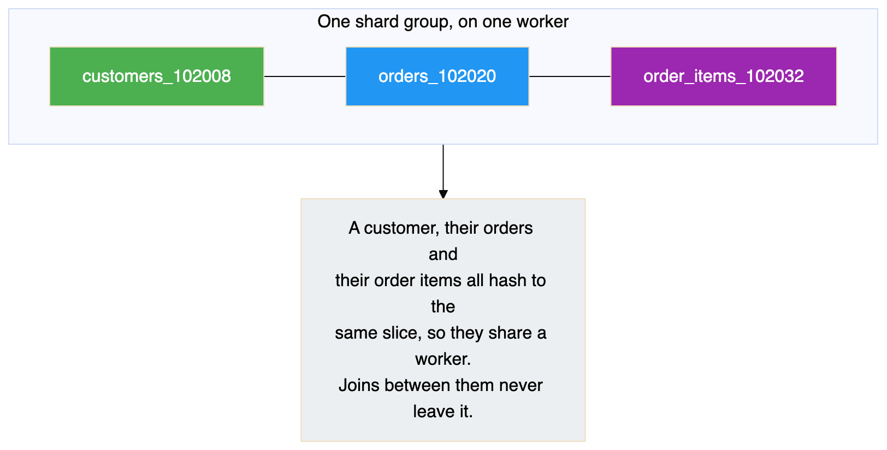
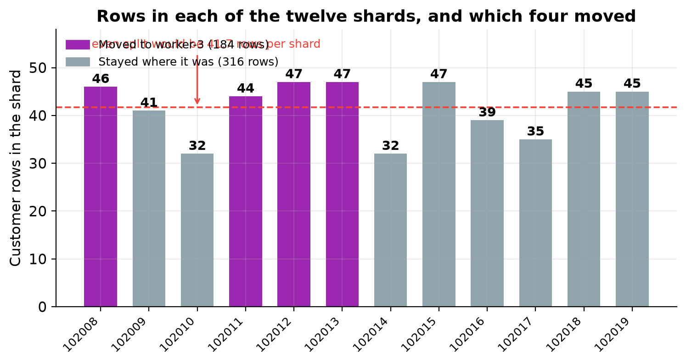
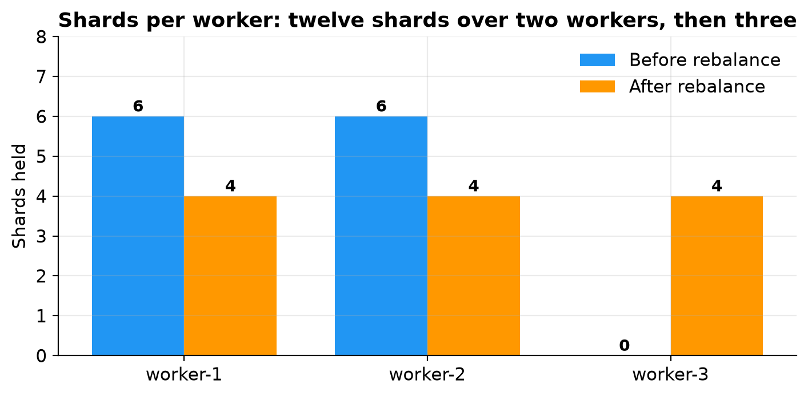
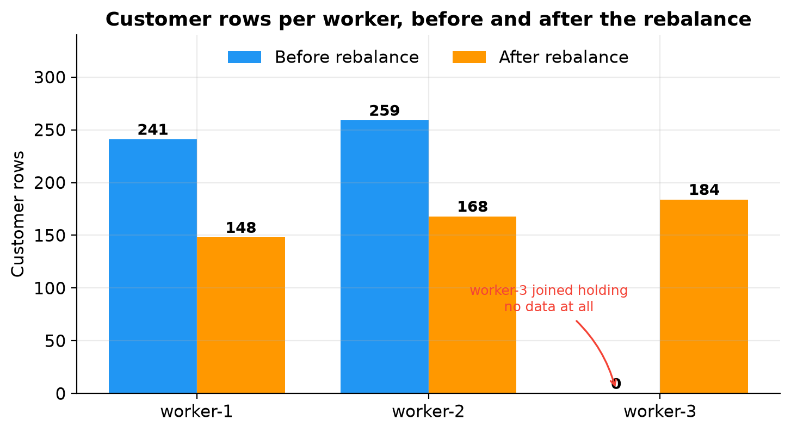
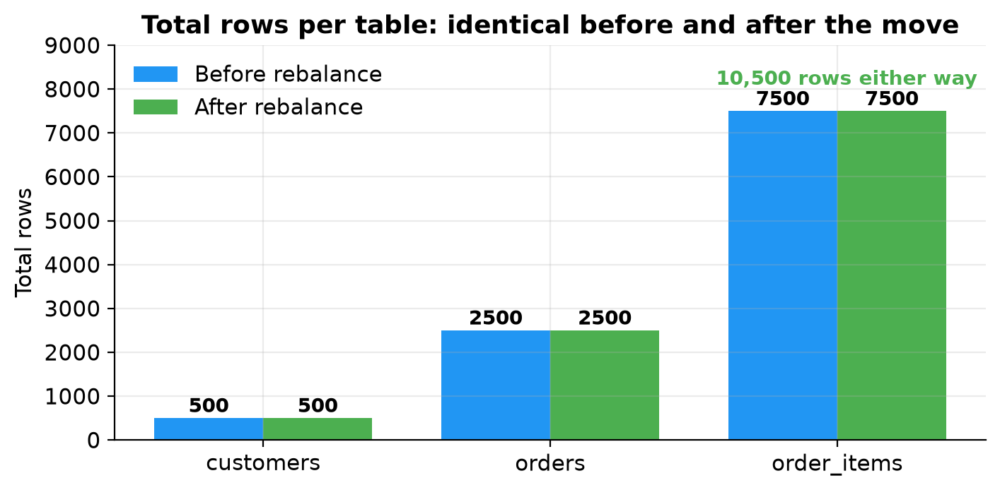
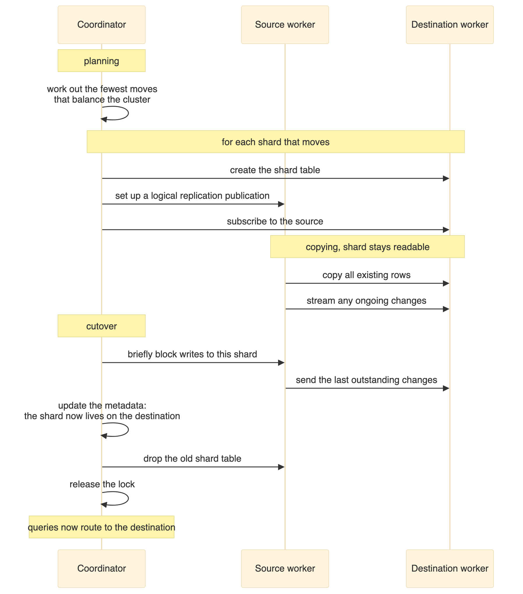
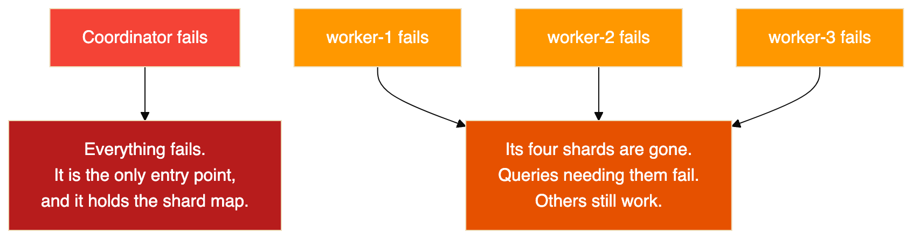
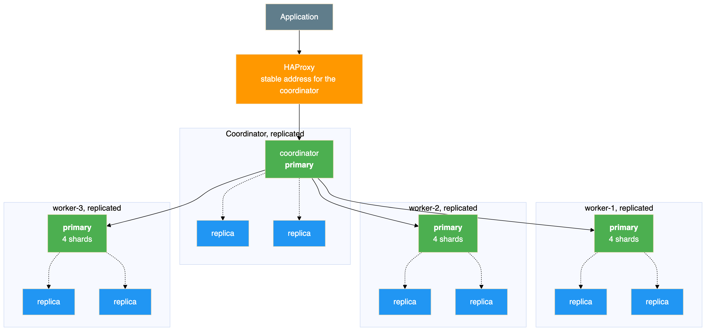

# PostgreSQL Sharding with Citus

## Spreading a database across machines, then adding a machine to it while it runs

Vertical scaling runs out eventually. When one PostgreSQL server can no longer hold the data or absorb the writes, the next step is to spread the rows across several machines. That leads straight to the interesting question: **can you add a machine to a cluster that is already full of data, without downtime and without losing a row?**

This guide answers it by trying it. It builds a Citus cluster with one coordinator and two workers, loads 10,500 rows, adds a third worker to the running cluster, triggers a rebalance, then audits the result.

Every number below comes from a real test run. The per shard counts add up to 500 in five different groupings, so the arithmetic can be checked rather than taken on trust.

### What the test showed

| Question | Result |
|---|---|
| Does adding a worker move data automatically? | No. The new worker held zero shards until a rebalance was triggered. |
| Did the rebalance need downtime? | No. The cluster stayed queryable and no existing container was restarted. |
| How much data moved? | Four of twelve shard groups, the minimum for an even split |
| Were rows lost or duplicated? | Neither. 10,500 before and after, no orphans, no duplicates. |
| Did query results change? | No. Aggregates and joins returned identical values. |
| How does Citus move a shard? | Logical replication, then a brief metadata cutover |

There is one result that matters more than any of those, and it is the uncomfortable one. **As built, this cluster is less available than a single PostgreSQL server.** The last two sections explain why, and what Patroni does about it.

---

## Table of Contents

1. [Partitioning Is Not Sharding](#1-partitioning-is-not-sharding)
2. [Architecture](#2-architecture)
3. [How a Row Finds Its Shard](#3-how-a-row-finds-its-shard)
4. [Versions and Prerequisites](#4-versions-and-prerequisites)
5. [Building the Cluster](#5-building-the-cluster)
6. [The Schema and the Shard Key](#6-the-schema-and-the-shard-key)
7. [Distributing and Loading](#7-distributing-and-loading)
8. [Where the Data Landed](#8-where-the-data-landed)
9. [How Queries Are Routed](#9-how-queries-are-routed)
10. [Adding the Third Worker](#10-adding-the-third-worker)
11. [Rebalancing](#11-rebalancing)
12. [Before and After](#12-before-and-after)
13. [Checking Nothing Was Lost](#13-checking-nothing-was-lost)
14. [What Happens Inside a Shard Move](#14-what-happens-inside-a-shard-move)
15. [The Availability Problem](#15-the-availability-problem)
16. [Fixing It With Patroni](#16-fixing-it-with-patroni)
17. [Problems Worth Knowing About](#17-problems-worth-knowing-about)
18. [Closing Notes](#18-closing-notes)

---

## 1. Partitioning Is Not Sharding

PostgreSQL already has table partitioning, where one large table is split into smaller pieces. Partitioning is useful, but every partition still lives on the same server, on the same disk, using the same CPU. It does not spread data across machines.

Citus is a PostgreSQL extension that does. It runs inside PostgreSQL, so you keep standard SQL and standard tools, while the rows physically live on different servers.

| Capability | PostgreSQL alone | With Citus |
|---|---|---|
| Store data on more than one server | No | Yes |
| Route a query to the right shard | No | Yes, automatically |
| Run one query on many shards in parallel | No | Yes |
| Join related tables without a network hop | Not applicable | Yes, if they share a shard key |
| Add nodes and move data while running | Not applicable | Yes |

The honest summary: partitioning helps you manage a big table on one machine, sharding helps you use more than one machine. If queries are scanning too much data, partitioning may be enough and is far simpler. If one machine is genuinely full, you need sharding.

---

## 2. Architecture

{width=6.30in height=4.64in}

Two structural points shape everything else.

**The coordinator stores no table data.** It holds only the metadata saying which shard lives where and which hash range each shard owns. All 10,500 rows sit on the workers. That makes the coordinator cheap to run and, as Section 15 explains, a total single point of failure.

**Workers are ordinary, independent PostgreSQL servers.** They do not replicate to each other and are not aware of each other. A shard is a normal table with a number appended to its name, and you can read one directly on a worker, bypassing Citus entirely:

```sql
SELECT count(*) FROM customers_102010;
```

That is the query to run if sharding still feels abstract.

### How a query flows

{width=5.39in height=8.20in}

That decision point is the single most important thing for performance. A query that filters on the shard key touches one worker and stays fast as the cluster grows. A query that does not touches all of them, and gets more expensive as you add workers rather than less.

---

## 3. How a Row Finds Its Shard

Citus uses hash based sharding. The full range of 32 bit hash values is divided into equal slices, one per shard, and each shard is placed on a worker.

{width=6.30in height=1.27in}

The same hash runs on the way in and on the way out, which is why an insert and a lookup for the same customer always reach the same worker.

Two consequences catch people out. A shard holds a **set** of identifiers that hash together, not a contiguous range, so customers 100 and 500 can share a shard while 1 and 42 do not. And because hashing scatters values rather than balancing counts, shards end up with slightly different row counts, which Section 8 shows.

### Co-location

All three tables are distributed on the same column and placed in one co-location group.

{width=6.30in height=3.20in}

Co-location is the most consequential design decision in a sharded schema. Get it right and most queries touch one node. Get it wrong and almost every query becomes distributed, and changing it later means redistributing every table.

It also matters for the rebalance: Citus moves whole co-location groups as a unit, so related rows stay together.

---

## 4. Versions and Prerequisites

| Component | Version |
|---|---|
| PostgreSQL | 16.6 |
| Citus | 12.1.6 |
| Docker image | `citusdata/citus:12.1` |

You need Docker with Compose version 2 and about 4 GB of memory. If port 5432 is already in use on your host, usually because of a locally installed PostgreSQL, change the published port.

Citus reports two version numbers and they answer different questions:

```sql
SELECT citus_version();
```

Result:

```
                                     citus_version
----------------------------------------------------------------------------------------
 Citus 12.1.6 on x86_64-pc-linux-gnu, compiled by gcc (Debian 12.2.0-14) 12.2.0, 64-bit
(1 row)
```

The extension catalogue reports `12.1-1`, which is the SQL script version. Only the function above gives the patch level, so use it when checking whether a fix is present.

---

## 5. Building the Cluster

The cluster is four containers on one bridge network: a coordinator with port 5432 published, and three workers reachable only from inside the network. That asymmetry is deliberate and mirrors a real deployment, where clients talk to the coordinator and nothing else.

The third worker starts behind a Compose profile so it stays down until the add-a-node exercise.

Four settings matter, and two of them are the most common reason a first attempt fails:

| Setting | Applied to | Why |
|---|---|---|
| `shared_preload_libraries=citus` | All nodes | Citus will not function unless loaded at server start |
| `wal_level=logical` | All nodes | The rebalancer moves shards using logical replication |
| `max_prepared_transactions=200` | All nodes | Citus uses two phase commit during shard moves |
| `citus.shard_count=12` | Coordinator | Twelve divides evenly by both two and three workers |

The logical log level and prepared transactions both default to values that make the rebalancer fail, with errors that do not obviously point at the cause.

Start the first three containers and wait for them to report healthy:

```bash
docker compose up -d
docker compose ps
```

Result:

```
NAME                IMAGE                  SERVICE       STATUS                  PORTS
citus-coordinator   citusdata/citus:12.1   coordinator   Up 47 hours (healthy)   5432/tcp
citus-worker-1      citusdata/citus:12.1   worker-1      Up 47 hours (healthy)   5432/tcp
citus-worker-2      citusdata/citus:12.1   worker-2      Up 47 hours (healthy)   5432/tcp
```

### The database and extension, on every node

Citus keeps metadata on the coordinator, but the shards are ordinary tables on the workers. When the coordinator distributes a table it sends the schema to the workers, and that fails if a worker lacks the database or the extension. Note also that creating a database is not propagated to workers automatically, so it has to be done on each node:

```bash
for node in citus-coordinator citus-worker-1 citus-worker-2; do
  docker exec $node psql -U postgres -c "CREATE DATABASE customer_orders;"
  docker exec $node psql -U postgres -d customer_orders -c "CREATE EXTENSION IF NOT EXISTS citus;"
done
```

Confirm it:

```sql
SELECT extname, extversion FROM pg_extension WHERE extname = 'citus';
```

Result:

```
 extname | extversion
---------+------------
 citus   | 12.1-1
```

### Registering the workers

The coordinator has to be told its own address as well as the workers, because the rebalancer needs to know about every node including the coordinator:

```sql
SELECT citus_set_coordinator_host('coordinator', 5432);
SELECT citus_add_node('worker-1', 5432);
SELECT citus_add_node('worker-2', 5432);
```

### Where to check the node details

This is the query to know, because it is how you confirm cluster membership at any point:

```sql
SELECT nodeid, nodename, nodeport, noderole, isactive
FROM pg_dist_node
ORDER BY nodeid;
```

Result:

```
 nodeid |  nodename   | nodeport | noderole | isactive
--------+-------------+----------+----------+----------
      1 | coordinator |     5432 | primary  | t
      2 | worker-1    |     5432 | primary  | t
      3 | worker-2    |     5432 | primary  | t
```

The role column says `primary` for every row, which is a naming collision worth clearing up. That is Citus describing its own internal node classification. It has nothing to do with PostgreSQL streaming replication and does not mean these nodes have replicas. Each worker here is completely independent.

---

## 6. The Schema and the Shard Key

```sql
CREATE TABLE customers (
    customer_id BIGSERIAL,
    name        TEXT           NOT NULL,
    email       TEXT           NOT NULL,
    city        TEXT           NOT NULL,
    created_at  TIMESTAMPTZ    NOT NULL DEFAULT now(),
    PRIMARY KEY (customer_id)
);

CREATE TABLE orders (
    order_id     BIGSERIAL,
    customer_id  BIGINT         NOT NULL,
    order_date   DATE           NOT NULL DEFAULT CURRENT_DATE,
    total_amount DECIMAL(10,2)  NOT NULL,
    status       TEXT           NOT NULL DEFAULT 'pending',
    PRIMARY KEY (order_id, customer_id),
    FOREIGN KEY (customer_id) REFERENCES customers (customer_id)
);

CREATE TABLE order_items (
    item_id      BIGSERIAL,
    order_id     BIGINT         NOT NULL,
    customer_id  BIGINT         NOT NULL,
    product_name TEXT           NOT NULL,
    quantity     INT            NOT NULL,
    unit_price   DECIMAL(10,2)  NOT NULL,
    PRIMARY KEY (item_id, customer_id),
    FOREIGN KEY (order_id, customer_id) REFERENCES orders (order_id, customer_id)
);
```

Read the primary keys closely, because that is what differs from a normal schema. **Every unique constraint has to include the distribution column.** `orders` is keyed on `(order_id, customer_id)` rather than `order_id` alone.

The reason is that uniqueness can only be enforced inside a single shard. There is no global index spanning the workers, and building one would need coordination on every insert, which is exactly the cost sharding exists to avoid. Including the distribution column guarantees that all rows which could collide are in the same shard, so a local index is enough.

The practical consequence is that you cannot take an existing schema and simply distribute it. Primary keys, unique constraints and foreign keys usually have to change first. On a real project this is normally the largest piece of the work, and it is better known before you start than halfway through.

### Why customer_id

| Criterion | customer_id | order_id | city |
|---|---|---|---|
| Distinct values | Good, 500 | Good, 2,500 | Poor, only 10 |
| Spreads evenly | Yes | Yes | No, 50 customers per city |
| Allows local joins | Yes, all three tables have it | No | No |
| Common query filter | Yes | Sometimes | Sometimes |

The customer identifier wins because it exists in all three tables, so a customer and all their related rows land together; joins on it stay local; and a lookup for one customer touches one worker.

**A bad shard key would look fine in testing.** Sharding on `city` would put all 50 customers of a city on one shard, and with ten cities and twelve shards at least two shards would sit permanently empty while others carried everything. In a small test that imbalance is invisible.

---

## 7. Distributing and Loading

```sql
SELECT create_distributed_table('customers', 'customer_id');
SELECT create_distributed_table('orders', 'customer_id', colocate_with => 'customers');
SELECT create_distributed_table('order_items', 'customer_id', colocate_with => 'customers');
```

The `colocate_with` argument is the important one, and omitting it is the most consequential mistake available here. Without it Citus may put each table in its own group, and joins between them stop being local. It is worth being explicit even when Citus would guess correctly, so the intent is recorded in the schema.

Confirm the result:

```sql
SELECT logicalrelid::text AS table_name, partmethod, colocationid, repmodel
FROM pg_dist_partition ORDER BY logicalrelid::text;
```

Result:

```
 table_name  | partmethod | colocationid | repmodel
-------------+------------+--------------+----------
 customers   | h          |            1 | s
 order_items | h          |            1 | s
 orders      | h          |            1 | s
```

Hash partitioning, all three in co-location group 1, one copy of each shard.

### The shard numbering

Citus allocates shard numbers from one counter, in a contiguous block per table, in the order the tables were distributed:

| Table | Shard numbers |
|---|---|
| `customers` | 102008 to 102019 |
| `orders` | 102020 to 102031 |
| `order_items` | 102032 to 102043 |

Co-located shards line up by **position** in the block, not by matching number. The first customers shard pairs with the first orders shard and the first order items shard. That is why Section 11 shows shard 102008 moving together with 102020 and 102032.

### Loading data

The data is generated entirely in SQL:

```sql
INSERT INTO customers (name, email, city)
SELECT 'Customer-' || i,
       'customer' || i || '@example.com',
       (ARRAY['New York','London','Tokyo','Paris','Sydney',
              'Berlin','Toronto','Mumbai','São Paulo','Singapore'])[1 + (i % 10)]
FROM generate_series(1, 500) AS s(i);

INSERT INTO orders (customer_id, order_date, total_amount, status)
SELECT c.customer_id,
       CURRENT_DATE - (floor(random() * 365))::int,
       round((random() * 490 + 10)::numeric, 2),
       (ARRAY['pending','shipped','delivered','cancelled'])[1 + floor(random() * 4)::int]
FROM customers c CROSS JOIN generate_series(1, 5) AS s(n);

INSERT INTO order_items (order_id, customer_id, product_name, quantity, unit_price)
SELECT o.order_id, o.customer_id,
       (ARRAY['Widget','Gadget','Gizmo','Doohickey',
              'Thingamajig','Sprocket','Flange','Bracket'])[1 + floor(random() * 8)::int],
       1 + floor(random() * 10)::int,
       round((random() * 99 + 1)::numeric, 2)
FROM orders o CROSS JOIN generate_series(1, 3) AS s(n);
```

Every insert goes through the coordinator, which hashes each row and routes it to the correct worker with no involvement from the client. This is what makes Citus pleasant to use: the application inserts rows as if into a normal table.

Result:

```
INSERT 0 500
INSERT 0 2500
INSERT 0 7500
 table_name  | row_count
-------------+-----------
 customers   |       500
 order_items |      7500
 orders      |      2500
```

Two details follow from how that was written. The city assignment uses the row number modulo ten, which is why every city gets exactly fifty customers rather than an approximate share. The amounts and dates use `random()`, so the revenue figures later cannot be reproduced even though the row counts can.

---

## 8. Where the Data Landed

This is where sharding stops being abstract. The `citus_shards` view lists every shard, which table it belongs to and which node holds it:

```sql
SELECT shardid, shard_name, table_name::text, nodename
FROM citus_shards
WHERE table_name::text = 'customers'
ORDER BY shardid;
```

Result:

```
 shardid |    shard_name    | table_name | nodename
---------+------------------+------------+----------
  102008 | customers_102008 | customers  | worker-1
  102009 | customers_102009 | customers  | worker-2
  102010 | customers_102010 | customers  | worker-1
  102011 | customers_102011 | customers  | worker-2
  102012 | customers_102012 | customers  | worker-1
  102013 | customers_102013 | customers  | worker-2
  102014 | customers_102014 | customers  | worker-1
  102015 | customers_102015 | customers  | worker-2
  102016 | customers_102016 | customers  | worker-1
  102017 | customers_102017 | customers  | worker-2
  102018 | customers_102018 | customers  | worker-1
  102019 | customers_102019 | customers  | worker-2
(12 rows)
```

Twelve shards alternating between the two workers, six each. Shards are assigned round robin in number order, so the alternation is a consequence of that rather than anything about odd and even.

Row counts per worker need `run_command_on_shards`, which sends the same SQL to every shard of a table and returns the results as rows, with `%s` standing in for the shard's real table name:

```sql
SELECT cs.nodename,
       count(*)              AS shard_count,
       sum(r.result::bigint) AS total_rows
FROM run_command_on_shards('customers', $cmd$ SELECT count(*) FROM %s $cmd$) r
JOIN citus_shards cs USING (shardid)
WHERE cs.table_name::text = 'customers'
GROUP BY cs.nodename
ORDER BY cs.nodename;
```

Result:

```
 nodename | shard_count | total_rows
----------+-------------+------------
 worker-1 |           6 |        241
 worker-2 |           6 |        259
(2 rows)
```

That totals 500. The imbalance between 241 and 259 is expected, because hashing distributes values approximately rather than exactly.

Per individual shard:

```sql
SELECT shardid, success, result AS row_count
FROM run_command_on_shards('customers', $cmd$ SELECT count(*) FROM %s $cmd$)
ORDER BY shardid;
```

Result:

```
 shardid | success | row_count
---------+---------+-----------
  102008 | t       | 46
  102009 | t       | 41
  102010 | t       | 32
  102011 | t       | 44
  102012 | t       | 47
  102013 | t       | 47
  102014 | t       | 32
  102015 | t       | 47
  102016 | t       | 39
  102017 | t       | 35
  102018 | t       | 45
  102019 | t       | 45
```

{width=6.30in height=3.35in}

The chart shows two things at once. The bars show how uneven hash distribution really is at this scale: the busiest shard holds 47 rows and the quietest 32, against an even split of 41.7. Nothing is wrong, and no tuning would flatten it, because the hash function scatters values rather than balancing counts.

The four coloured bars are the shards the rebalancer later moved. It did not pick the four largest or the four smallest, because it was not optimising for rows.

---

## 9. How Queries Are Routed

### A lookup on the shard key

```sql
EXPLAIN (VERBOSE) SELECT * FROM customers WHERE customer_id = 42;
```

The plan came back with a task count of one, naming a single shard and a single worker. Citus worked out that the identifier hashes to shard 102018 on worker-1 and sent the query only there. The other worker was never contacted.

This is the case worth designing for. Adding workers makes this kind of query no slower, because it always touches exactly one of them.

### A join between co-located tables

```sql
SELECT c.name, o.order_id, o.order_date, o.total_amount, o.status
FROM customers c
JOIN orders o ON c.customer_id = o.customer_id
WHERE c.customer_id = 42
ORDER BY o.order_date;
```

Also a task count of one. Both tables' shards for that customer are on the same worker, so the whole join ran there with no data crossing the network.

Result:

```
    name     | order_id | order_date | total_amount |  status
-------------+----------+------------+--------------+-----------
 Customer-42 |     2415 | 2025-12-13 |        15.10 | shipped
 Customer-42 |     2370 | 2026-01-21 |       258.91 | pending
 Customer-42 |     2460 | 2026-01-31 |       364.85 | delivered
 Customer-42 |     2280 | 2026-03-06 |       130.38 | delivered
 Customer-42 |     2325 | 2026-05-09 |        65.86 | cancelled
```

### An aggregate across every shard

```sql
SELECT c.city,
       count(DISTINCT c.customer_id) AS customers,
       count(o.order_id)             AS orders,
       round(sum(o.total_amount), 2) AS total_revenue
FROM customers c
JOIN orders o ON c.customer_id = o.customer_id
GROUP BY c.city
ORDER BY total_revenue DESC;
```

No filter on the shard key, so this has to touch every shard. Each worker computed a partial result and the coordinator combined them:

```
   city    | customers | orders | total_revenue
-----------+-----------+--------+---------------
 Sydney    |        50 |    250 |      66162.73
 Toronto   |        50 |    250 |      65014.76
 Berlin    |        50 |    250 |      64942.73
 Paris     |        50 |    250 |      64364.26
 São Paulo |        50 |    250 |      63762.02
 Singapore |        50 |    250 |      63306.32
 Tokyo     |        50 |    250 |      62648.80
 New York  |        50 |    250 |      62305.02
 Mumbai    |        50 |    250 |      61182.11
 London    |        50 |    250 |      58398.65
```

Fifty customers in every city, totalling 500, which confirms nothing was missed. The exactly even fifty is an artefact of the data generator, not a property of the hashing. The revenue values come from `random()` and will differ on your machine.

This runs on all shards in parallel, so it is not slow, but it gets more expensive as workers are added rather than less. That is the trade-off of a query that cannot be routed to one shard.

### Which shard owns which customer

```sql
SELECT 42 AS customer_id, get_shard_id_for_distribution_column('customers', 42) AS shard_id;
```

Asked for several identifiers at once:

```
 customer_id | shard_id
-------------+----------
           1 |   102008
          42 |   102018
         100 |   102014
         250 |   102011
         500 |   102014
```

Identifiers 100 and 500 share a shard while 1 and 42 do not. Shards hold sets of identifiers that hash together, not ranges, so you cannot look at a shard and describe its contents as a range of customers.

---

## 10. Adding the Third Worker

The third worker was started using its Compose profile, so only that container started and everything else kept running:

```bash
docker compose --profile add-shard up -d worker-3
```

Then the same preparation as any other worker, followed by registration:

```sql
SELECT citus_add_node('worker-3', 5432);
```

The node list confirms four nodes:

```sql
SELECT nodeid, nodename, nodeport, noderole, isactive
FROM pg_dist_node ORDER BY nodeid;
```

Result:

```
 nodeid |  nodename   | nodeport | noderole | isactive
--------+-------------+----------+----------+----------
      1 | coordinator |     5432 | primary  | t
      2 | worker-1    |     5432 | primary  | t
      3 | worker-2    |     5432 | primary  | t
      4 | worker-3    |     5432 | primary  | t
```

Now the important part:

```sql
SELECT nodename, count(*) AS shard_count
FROM citus_shards
WHERE table_name::text = 'customers'
GROUP BY nodename
ORDER BY nodename;
```

Result:

```
 nodename | shard_count
----------+-------------
 worker-1 |           6
 worker-2 |           6
```

**The new worker holds nothing.** It does not even appear, because it owns no shards.

This is deliberate and it is the right default. Moving data costs disk reads, network transfer and log volume on the source workers. Citus separates the decision that a node exists from the decision to pay that cost, so you can add capacity in one window and move data in another. New distributed tables created from this point would use the new worker immediately, but existing data waits until you ask.

---

## 11. Rebalancing

```sql
SELECT rebalance_table_shards();
```

It reported each move as it happened:

```
NOTICE:  Moving shard 102011 from worker-2:5432 to worker-3:5432 ...
NOTICE:  Moving shard 102008 from worker-1:5432 to worker-3:5432 ...
NOTICE:  Moving shard 102013 from worker-2:5432 to worker-3:5432 ...
NOTICE:  Moving shard 102012 from worker-1:5432 to worker-3:5432 ...
```

Four shard groups moved, two from each existing worker. Each move carried the co-located shards from all three tables, so moving 102008 also moved 102020 and 102032.

Notice what the rebalancer chose to do. It moved four groups, not twelve. It worked out the smallest set of moves that produces an even spread and left the other eight untouched. That restraint matters on a real cluster, where moving a shard is expensive.

The placement afterwards:

```sql
SELECT shardid, shard_name, nodename
FROM citus_shards
WHERE table_name::text = 'customers'
ORDER BY shardid;
```

Result:

```
 shardid |    shard_name    | table_name | nodename
---------+------------------+------------+----------
  102008 | customers_102008 | customers  | worker-3
  102009 | customers_102009 | customers  | worker-2
  102010 | customers_102010 | customers  | worker-1
  102011 | customers_102011 | customers  | worker-3
  102012 | customers_102012 | customers  | worker-3
  102013 | customers_102013 | customers  | worker-3
  102014 | customers_102014 | customers  | worker-1
  102015 | customers_102015 | customers  | worker-2
  102016 | customers_102016 | customers  | worker-1
  102017 | customers_102017 | customers  | worker-2
  102018 | customers_102018 | customers  | worker-1
  102019 | customers_102019 | customers  | worker-2
(12 rows)
```

Four shards on worker-3, and the remaining eight have not moved.

Container uptime at this point shows what did not happen:

```
NAME                IMAGE                  SERVICE       STATUS
citus-coordinator   citusdata/citus:12.1   coordinator   Up 2 days (healthy)
citus-worker-1      citusdata/citus:12.1   worker-1      Up 2 days (healthy)
citus-worker-2      citusdata/citus:12.1   worker-2      Up 2 days (healthy)
citus-worker-3      citusdata/citus:12.1   worker-3      Up 43 minutes (healthy)
```

The three original containers were never restarted, never reconfigured and never taken offline. Capacity was added and a third of the data moved onto it while they carried on serving.

---

## 12. Before and After

```sql
SELECT nodename, count(*) AS shard_count
FROM citus_shards
WHERE table_name::text = 'customers'
GROUP BY nodename ORDER BY nodename;
```

Result:

```
 nodename | shard_count
----------+-------------
 worker-1 |           4
 worker-2 |           4
 worker-3 |           4
```

{width=6.30in height=3.09in}

Row counts:

```sql
SELECT cs.nodename, count(*) AS shard_count, sum(r.result::bigint) AS total_rows
FROM run_command_on_shards('customers', $cmd$ SELECT count(*) FROM %s $cmd$) r
JOIN citus_shards cs USING (shardid)
WHERE cs.table_name::text = 'customers'
GROUP BY cs.nodename ORDER BY cs.nodename;
```

Result:

```
 nodename | shard_count | total_rows
----------+-------------+------------
 worker-1 |           4 |        148
 worker-2 |           4 |        168
 worker-3 |           4 |        184
(3 rows)
```

{width=6.30in height=3.44in}

The two original workers each gave up roughly a third of their rows, the new worker went from nothing to 184, and the total stayed at 500.

Note that the row counts are less even than the shard counts. Four shards each, but 148, 168 and 184 rows. The rebalancer does not look at row counts at all. It assigns every shard a cost and equalises the total per worker, and in Citus 12.1 the default strategy uses the shard's size on disk as that cost. An older strategy gives every shard a cost of 1, which makes balancing cost the same as balancing shard count. In this lab both would produce the same plan, because every shard reported the same size.

### The arithmetic reconciles

The per shard counts from Section 8 line up exactly against the per worker totals, which is the strongest available evidence that nothing was lost or duplicated:

| Worker | Shards held | Row counts | Total |
|---|---|---|---|
| worker-1, before | 102008, 102010, 102012, 102014, 102016, 102018 | 46, 32, 47, 32, 39, 45 | **241** |
| worker-2, before | 102009, 102011, 102013, 102015, 102017, 102019 | 41, 44, 47, 47, 35, 45 | **259** |
| worker-1, after | 102010, 102014, 102016, 102018 | 32, 32, 39, 45 | **148** |
| worker-2, after | 102009, 102015, 102017, 102019 | 41, 47, 35, 45 | **168** |
| worker-3, after | 102008, 102011, 102012, 102013 | 46, 44, 47, 47 | **184** |

Both groupings total 500, and every shard arrived holding exactly the rows it left with.

That last point is the important one. **A shard move relocates data. It does not re-hash it.** The distribution column decides which shard a row belongs to and that never changed. Only the shard's location did. This is why a rebalance is safe to run on a live cluster: Citus is not recalculating anything, so there is no moment when a row could belong to two shards or none.

---

## 13. Checking Nothing Was Lost

Shard counts alone are not proof. These are the checks worth running after any shard move:

```sql
-- Totals must match what was loaded
SELECT 'customers' AS table_name, count(*) AS total FROM customers
UNION ALL SELECT 'orders',      count(*) FROM orders
UNION ALL SELECT 'order_items', count(*) FROM order_items
ORDER BY table_name;

-- A shard copied twice would show up here
SELECT count(*) AS duplicate_customers
FROM (SELECT customer_id FROM customers
      GROUP BY customer_id HAVING count(*) > 1) dupes;

-- A half moved co-location group would break these two
SELECT count(*) AS orphan_orders
FROM orders o
LEFT JOIN customers c ON o.customer_id = c.customer_id
WHERE c.customer_id IS NULL;

SELECT count(*) AS orphan_items
FROM order_items oi
LEFT JOIN orders o ON oi.order_id = o.order_id AND oi.customer_id = o.customer_id
WHERE o.order_id IS NULL;
```

| Check | Expected | Actual |
|---|---|---|
| Total customers | 500 | 500 |
| Total orders | 2,500 | 2,500 |
| Total order items | 7,500 | 7,500 |
| Duplicate customer identifiers | 0 | 0 |
| Orders with no matching customer | 0 | 0 |
| Order items with no matching order | 0 | 0 |
| Revenue by city | Unchanged | Unchanged |
| Customer identifier range | 1 to 500 | 1 to 500 |

{width=6.30in height=3.09in}

A chart of two identical sets of bars is a dull picture, and that is the point. Physically relocating a third of the data across the network changed nothing the application can observe.

The two orphan checks are the ones that would actually catch a botched rebalance. If Citus had moved a customers shard without its matching orders shard, those joins would start finding rows with no partner. They returned zero.

---

## 14. What Happens Inside a Shard Move

{width=6.30in height=7.15in}

The points that matter:

**The shard stays readable while it is copied.** Queries continue to work, served by the source worker, until the cutover.

**The copy uses logical replication**, which is why the logical log level is required on every node.

**The cutover is brief but not free.** Citus locks the shard, waits for replication to catch up, updates the metadata, drops the old copy and releases the lock. For small shards this is milliseconds. For large shards under write load it takes longer, and writes to that one shard wait. Other shards are unaffected.

**Co-located shards move as a group**, which is what keeps related rows together and joins local.

---

## 15. The Availability Problem

This is the part worth dwelling on, because it runs against the intuition that more machines means more resilience.

**As built, this cluster is less available than a single PostgreSQL server.** With one copy of each shard and four containers, there is no redundant copy of anything. Any one of the four failing takes down part or all of the database.

{width=6.30in height=1.65in}

You have multiplied the number of things that can break by four and added no redundancy whatsoever.

**Sharding is a technique for scale, not for availability.** Conflating the two is a genuinely dangerous mistake, and an easy one to make, because both get described as distributing the database.

Note also the new failure shape. A single server is either up or down. This cluster can be **partly** up: a point lookup for one customer may succeed while an aggregate across all customers fails, because the two touch different numbers of workers. Monitoring and application code both have to cope with that.

One thing that is **not** the answer: Citus does expose a setting for more than one copy of each shard, but that mechanism is statement based replication intended for append only workloads, it is deprecated in current Citus, and it does not apply to the hash distributed tables used here.

---

## 16. Fixing It With Patroni

The correct approach keeps scale and availability as separate layers. Sharding spreads the data sideways. Replication stacks copies underneath each slice. You need both axes.

{width=6.30in height=2.96in}

Every box in that diagram that was a single container in this lab becomes a small replicated cluster managed by Patroni, with its own leader election. Three things change:

**Each worker survives losing a node.** A replica in that group is promoted and keeps serving the same shards.

**The coordinator survives too.** It holds no table data but it holds the shard map, so replicating it is not optional. This is the single most valuable change, because it removes the one failure that takes down everything.

**Something has to keep the shard map current.** When a worker group promotes a replica, the address recorded in `pg_dist_node` is now wrong. Either you put a load balancer in front of each group so the recorded address never changes, or you let the cluster manager write the new address into the metadata itself. Patroni can do the latter, which removes the per group load balancer entirely.

That last point is the only genuinely new problem in combining the two, and it is the subject of the companion article on high availability for sharded clusters.

The cost is node count. Four containers becomes twelve PostgreSQL nodes plus a small consensus cluster. The multiplication is in the workers and cannot be avoided, because every group needs its own replicas.

---

## 17. Problems Worth Knowing About

These all occurred during this build.

| Symptom | Cause | Fix |
|---|---|---|
| `function citus_rebalance_table_shards() does not exist` | No such function. The real names are `rebalance_table_shards()`, which blocks and prints each move, and `citus_rebalance_start()`, which runs in the background. | Use the first for an interactive run, the second in production, since a real rebalance can run for hours and a synchronous call is tied to your session. |
| `prepared transactions need to be enabled for the rebalancer to work` | `max_prepared_transactions` defaults to zero, and Citus uses two phase commit for shard moves. | Raise it on every node. |
| Logical replication fails during a shard move | `wal_level` is not `logical` on every node, not just the coordinator. | Set it everywhere. |
| `Citus does not propagate CREATE DATABASE command to workers` | Expected behaviour in this version. | Create the database on each node before distributing tables. |
| `citus_add_node` refused with a connection error | The worker was not ready, or the database did not exist on it yet. | Wait for the readiness check, create the database and extension, then register. |
| `function get_shard_id_for_distribution_value does not exist` | The name refers to the distribution **column**, not value. | `get_shard_id_for_distribution_column('customers', 42)` |

Note that `rebalance_table_shards()` is formally deprecated as of Citus 11.2 in favour of `citus_rebalance_start()`, though it still works in 12.1.6. It is used here because it prints each move as it happens, which makes the mechanism visible.

---

## 18. Closing Notes

**Adding a node does nothing until you rebalance.** The third worker joined and sat empty. Citus keeps the decision that a node exists separate from the decision to move data onto it, so you control when the cost is paid.

**Co-location is the decision you cannot cheaply undo.** Distributing all three tables on the same column is why joins stayed on one worker and why the rebalancer could move related rows as a unit. Getting it wrong makes almost every query distributed, and fixing it later means redistributing everything.

**The shard key has permanent consequences.** It decides which queries are fast, which have to touch every node, and where hotspots form. Sharding on `city` would have looked acceptable in a small test and failed at scale.

**A rebalance moves shards, it does not re-hash rows.** Every shard arrived holding exactly the rows it left with, which is what makes an online rebalance trustworthy.

**Sharding is not high availability.** With one copy of each shard, this cluster has four single points of failure. Scale and resilience are different problems and need different solutions, which is what Section 16 is about.

### Cleanup

```bash
docker compose --profile add-shard down       # keeps the volumes
docker compose --profile add-shard down -v    # deletes the volumes and all data
```

Include the profile, or the third worker's container and volume are left behind and the next startup is confusing.
