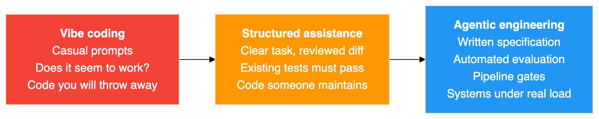
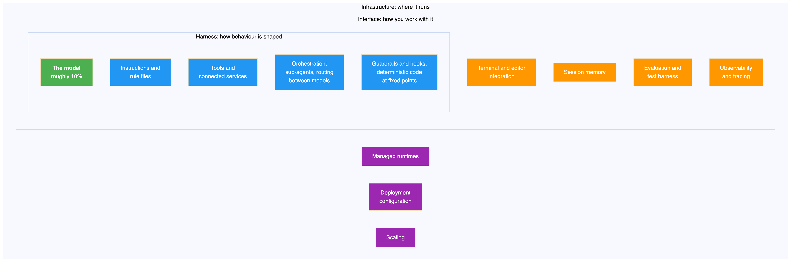
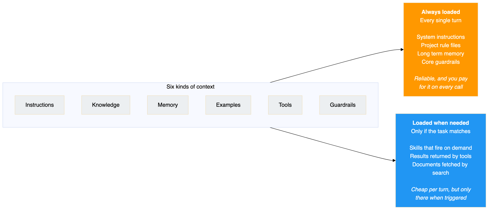
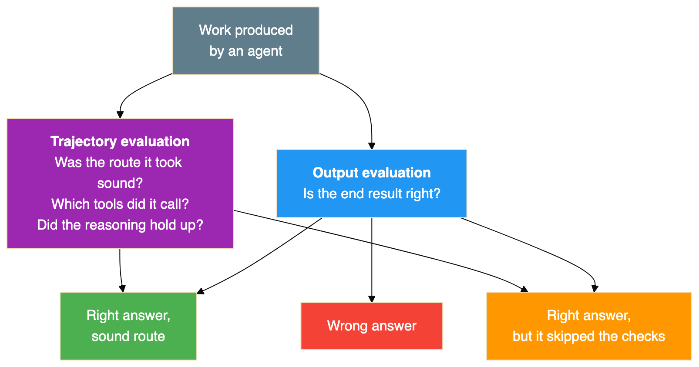
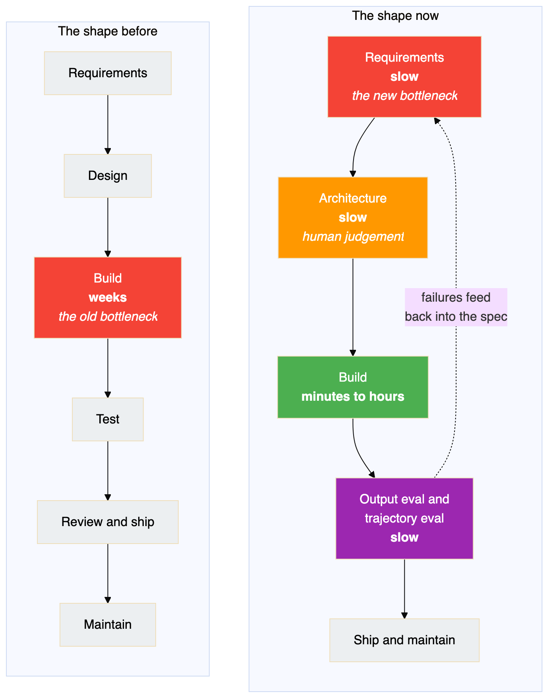
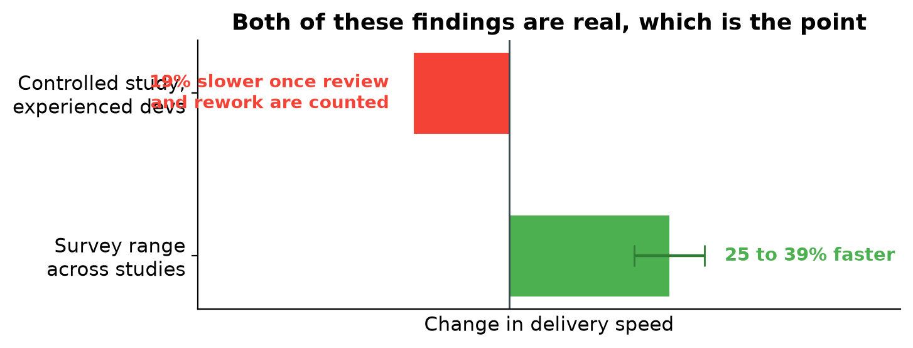
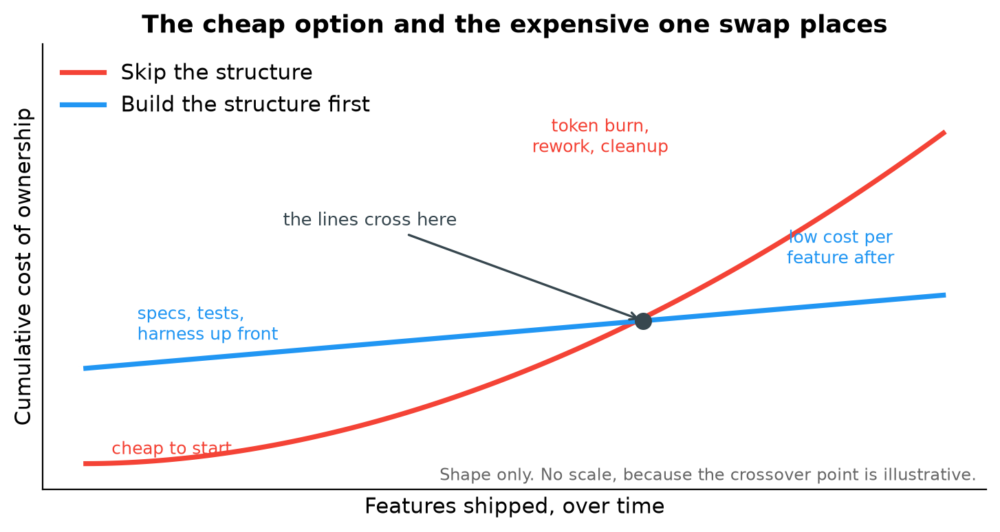
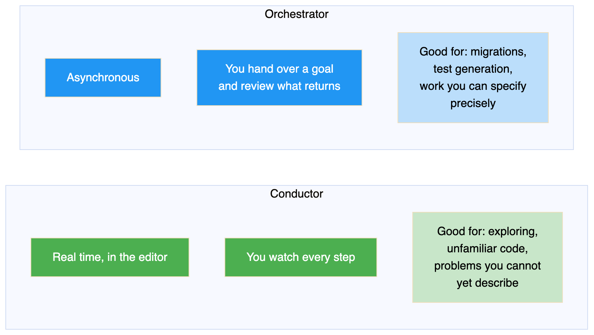
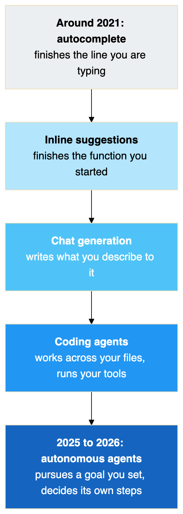
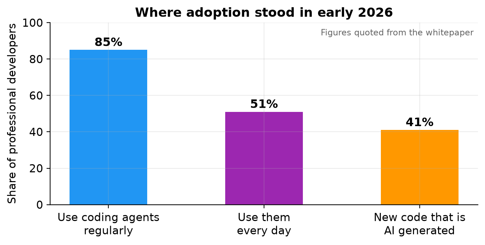

# The Bottleneck Moved

## What Google's paper on vibe coding and agentic engineering actually argues, and which parts are worth your week

Google published a whitepaper in May 2026 arguing that the software lifecycle has not lost any of its phases, but has moved its bottleneck. Writing code is no longer the expensive part. Saying precisely what you want, and then establishing whether you got it, is.

This is my reading of that paper: which parts I think matter, which parts are the sort of thing that sounds profound in a slide deck and evaporates on contact with a real codebase, and what I would actually do differently on Monday. Full citation at the end.

---

## The argument in one paragraph

The software lifecycle keeps all of its phases. What changes is where the expensive part sits. Writing code used to be the bottleneck, and it is not any more. Describing precisely what you want, and then establishing whether the machine actually produced it, is now the slow and difficult part. Everything else in the paper follows from that one relocation.

That is a genuinely useful claim, because it is falsifiable and it has consequences. If it is true, then hiring, tooling, review practice and the way you write a ticket all need to change, and they need to change in a specific direction rather than just becoming vaguely more AI.

---

## Vibe coding has a definition, and it is narrower than you think

The phrase comes from Andrej Karpathy in February 2025. He was describing something deliberately loose: accept every suggestion, never look at the diff, paste the error back at the model until the thing runs. He was talking about weekend projects.

Within months the phrase had stretched to cover any use of AI in programming at all, which drained it of meaning. If a senior engineer implementing a well specified feature with an assistant is vibe coding, and a team running planned migrations through agents is also vibe coding, then the term is doing no work.

The paper narrows it back, and the definition it lands on is the useful one:

> **Vibe coding means you are not reading the code.**

That is the whole test. Not how casual the prompt was. Not whether an agent was involved. Not how many files changed. If you shipped something you did not read, you vibe coded it. If you read it, argued with it and made it pass a test you wrote, you did something else.

By April 2026 Karpathy had drawn a similar line himself, introducing **agentic engineering** for the disciplined end of the practice. The paper is the institutional version of that split.

The distinction I find most useful in practice is about ceilings and floors. Vibe coding raises the floor: people who could not previously build software now can. Agentic engineering raises the ceiling: people who could already build software ship more of it, and more ambitiously. These are different activities serving different people, and conflating them is why so many arguments about AI coding go nowhere.

### It is a spectrum, and you move along it hourly

{width=6.30in height=1.26in}

The point of drawing it as a line rather than three boxes is that nobody lives at one end. A throwaway script to reshape a CSV belongs on the left, and it would be silly to write a specification for it. A change to how money moves belongs on the right. The skill being asked of you is deciding, per task, how far right you need to sit, and that judgement is not something a tool can make for you.

What the paper is careful to say, and what I would underline, is that **the position on this line is not set by which tool you use.** The same agent, the same model, the same terminal can produce either end. What determines where you land is whether anything checks the output.

---

## An agent is a model plus a harness

This is the framing from the paper I keep returning to, and if you take one idea away it should probably be this one.

An agent is not a model. The model is one component, and by the paper's rough accounting it is about ten percent of what makes an agent work. The other ninety percent is the harness: everything you build around the model.

{width=6.30in height=2.09in}

The ten and ninety split sounds like an exaggeration until you have spent a week debugging one of these things. Two public results the paper points at make it concrete. On one coding benchmark, a team lifted an agent from outside the top thirty to inside the top five while leaving the model completely untouched. Everything they changed sat around it. A second experiment on the same benchmark gained a little under fourteen points by reworking only the prompt, the available tools and the layer in between.

In both cases the model was a fixed quantity, and in both cases the gain was large.

### Why this is the most practically useful idea in the paper

Because it tells you where to look when something goes wrong.

When an agent does something stupid, the instinct is to blame the model and wait for a better one. The harness framing says: check your own work first. Usually it is a tool the agent did not have, a rule written too loosely to constrain anything, a guardrail nobody added, or a context window stuffed with irrelevant files.

The paper's phrasing is that most agent failures turn out to be configuration failures, and that matches what I have seen. It is a cheerful conclusion rather than a depressing one, because configuration is the part you can fix this afternoon. The model underneath will be replaced whether you do anything or not.

---

## Context engineering is a budget decision

Inside the harness, the knob that matters most is what the agent knows at any given moment. The paper sorts that into six kinds of context, then makes the point that the interesting question is not what the categories are but **when each one gets loaded.**

{width=6.30in height=2.71in}

Push too much into the always loaded bucket and two things happen. The bill grows, because you are paying for every token on every call. Worse, the signal gets buried: a rule that matters is now sitting in the middle of forty pages of things that do not.

Push too little in and the agent forgets the constraints that were keeping it safe.

The paper's recommendation, which I agree with, is to treat that boundary as an architectural decision rather than a config detail. Put it in a pull request. Version it. Argue about it in review. It is the sort of thing that decays quietly if nobody owns it.

The mechanism that makes the on demand side work is progressive disclosure. The agent sees a short description of each available skill at startup, pulls in the full instructions only when a task matches, and reaches for the heavy reference material only if it actually gets that far. That is how one agent can carry dozens of capabilities without paying for all of them at once.

---

## Verification is the line, and it has two halves

If vibe coding means not reading the code, then the thing that moves you rightward along the spectrum is verification. If I were handing one section of this to a team to read, it would be this one.

There are two mechanisms and they cover different ground.

**Tests** handle everything deterministic. Given this input, expect that output. Nothing about AI changes what a test is for.

**Evaluations** handle everything that is not. The paper cuts these into two kinds, and it is a distinction I had not seen stated so plainly before:

{width=6.30in height=3.31in}

The middle outcome is the one worth staring at. **An answer that looks correct but got there by skipping its checks is more dangerous than an answer that is obviously broken**, because the broken one gets caught and the plausible one gets merged.

I can vouch for this from recent experience rather than theory. I spent a stretch of time producing technical documentation with an agent, working from captured test output. The prose was fluent and the structure was sound, and buried in it was a detailed account of a recovery mechanism that had never run, complete with a log excerpt that did not exist in any captured file. Output evaluation would have passed it: the document read beautifully. Only checking the trajectory, in that case grepping every claim back to a source file, caught it.

That is the failure mode in one sentence. It is not that the machine produces obvious nonsense. It is that it produces confident, well formed, checkable-looking work, and if nothing checks it, nobody finds out.

If I had to pass a manager one sentence from the paper, it would be this one, quoted directly:

> Set the bar at the eval, not the demo.

A demo proves an agent can do a thing once. An evaluation suite with an honest rubric proves it does that thing reliably. These get confused constantly, usually in the direction that is convenient for whoever is presenting.

---

## The phases stay, the proportions change

The paper's central diagram compares the old lifecycle with the new one. The phases are the same. What changes is how long each takes and where the difficulty concentrates.

{width=6.30in height=8.00in}

The compression is real but it is uneven, and the unevenness is the whole story. Building got dramatically faster. Deciding what to build and confirming what got built did not, because both are judgement rather than typing.

Phase by phase, with my own view of each:

**Requirements.** These stop being a document that travels between teams and become a conversation that produces a specification and something runnable at the same time. That is a genuine improvement, and it comes with a trap: a prototype that exists is very persuasive, and it is easy to accept the first shape the machine offers rather than the right one.

**Architecture.** The most stubbornly human phase, and I think the paper is right about this. Choosing between consistency and availability, or deciding which failure you are willing to tolerate, depends on business context the model cannot see. Your job shifts towards making those calls and writing them down clearly enough that an agent can implement against them.

**Implementation.** Here the paper does something I respect: it reports two findings that disagree and refuses to pick one.

{width=6.30in height=2.40in}

Surveys put the gain somewhere between twenty five and thirty nine percent. A controlled study of experienced developers found them nineteen percent **slower** on some tasks once the time spent reviewing and correcting was counted honestly. Both are true, and they are not really in conflict once you accept that the work changed shape. Implementation stopped being writing and became reviewing, and reviewing is not free. Anyone quoting only the flattering number is selling something.

**Testing and quality.** This flips around entirely. Your tests and evals stop being a gate at the end and become the main channel through which you tell the agent what correct means. The loop the paper describes is: run against a benchmark, group the failures, fix whichever prompt or tool caused them, check nothing regressed, then watch production for the ones you did not think of.

**Maintenance.** The most underrated of the lot. Code that was too frightening to touch, because the only people who understood it left, becomes something an agent can read and explain. The tedious migrations and deprecation cleanups that never got done because they were dull and risky start actually getting done. If I were looking for a first serious use of this in an established codebase, I would start here rather than with new features.

### The ceiling nobody has removed yet

Agents get the first eighty percent of a feature quickly. The last twenty percent, the edge cases and the seams where your systems meet each other, still needs context the models generally do not have. That has not changed, and I would treat any pitch that implies otherwise with suspicion.

---

## The economics run the other way round

The number a leader should care about is not how fast a feature ships. It is what the thing costs to own over its life, and the paper makes an argument here that flips the usual intuition about which approach is cheap.

{width=6.30in height=3.35in}

Skipping the structure is cheap to begin with. A subscription, some prompting, and you are moving. Then the costs arrive late, and from several directions at once. Tokens go up in smoke because nobody organised what gets sent, so the model is repeatedly asked to repair its own previous attempt. Someone spends a fortnight months later working out how code nobody designed actually behaves. And there is security remediation, because code produced quickly acquires vulnerabilities at roughly the rate it acquires features.

Building the structure first inverts that. Schemas, tests and organised context cost real time before anything ships, and then the cost per feature stays low because regressions get caught by machinery rather than by customers.

**A caution on that chart.** The paper suggests that past the crossover the unstructured route costs somewhere between three and ten times more per feature. Its own lead author has since said plainly that this figure is illustrative rather than a measured constant. I have drawn the chart with no scale on the vertical axis for exactly that reason. The shape is the argument. The multiplier is a guess, and treating it as data would be the same mistake the paper spends fifty pages warning about.

What survives the caveat is the useful part: **the expected lifespan of the code is what decides which approach is cheaper.** A script you will delete on Friday should never get a specification. A billing system should never be without one. Most of the disagreement about AI coding standards is really people with different answers to that question assuming everyone shares theirs.

The other thing worth internalising is that decisions about context and about which model handles which request are budget decisions as much as engineering ones. Feeding a whole repository into every prompt fails on both counts, quality and cost. Give the hard reasoning to an expensive model and hand the repetitive work, generating tests, first pass review, pipeline checks, to a cheap one. Quality holds and the invoice falls.

---

## Two ways of working, and they need different skills

The paper names two modes, and I found this the most immediately practical distinction in the whole document.

{width=6.30in height=3.57in}

Conducting is the familiar mode: you are present, watching it work, correcting as you go. Orchestrating means describing a goal well enough to walk away, then judging the result when it comes back.

The tooling now supports both, sometimes within the same hour. The harder shift is not the tooling. It is that orchestrating rewards a skill most engineers have never had to practise: writing a description of intent precise enough that someone competent but unfamiliar could execute it without asking you a question. That is not a prompting trick. It is technical writing, and it is the thing I would actually go and get better at.

---

## The prototype is turning into the product

On what happens next, the claim I find most believable is this one: the workflow that produces a throwaway script is becoming the same workflow that produces a deployed service.

Building a real agent, with memory, scoped permissions, evaluation coverage and observability, used to mean a different stack and often a different team. That is folding into the loop you already run. You describe what you want, and the tooling sets up the project structure, writes the implementation, builds a set of evaluations, runs them, pushes the result to a hosted runtime, and tells you how it went. Coordination between agents rides on open standards rather than one vendor's format.

The paper mentions one experiment I keep bringing up in conversation, because it is a better illustration than any diagram: a team pointed a group of agents at the problem of writing a C compiler in Rust and had a working one about a fortnight later. The people involved chose the direction and inspected the results. They did not type the implementation. Whatever you think that proves, it is not autocomplete.

---

## How we got here, for the person who still thinks this is autocomplete

One last picture, and it is not for you. It is for the colleague or executive you are trying to bring along.

{width=2.92in height=8.20in}

The axis running underneath that line goes from syntax to intent, and from mostly human effort to mostly machine autonomy. Each generation kept what came before and lifted the ceiling on what one engineer could get done.

And if the argument still needs settling, the adoption figures tend to do it:

{width=6.30in height=3.18in}

Whether or not this is a good idea is a reasonable conversation. Whether it is happening is not.

---

## What I would actually take from it

Five things, in the order I would act on them.

**Debug the harness before you blame the model.** A missing tool, a vague rule or a context window full of noise explains most bad agent behaviour, and all three are yours to fix today.

**Decide what is always loaded and what is fetched on demand, then review that decision like code.** It is simultaneously your token bill and your safety net, and it rots if nobody owns it.

**Check the route, not just the answer.** Plausible work that skipped its checks is the dangerous failure, because it survives review. This is the one I would build a habit around, having been caught by it.

**Judge the approach by how long the code has to live.** That single question resolves most arguments about whether a given piece of work needs a specification.

**Get good at writing intent down.** As generation stops being the constraint, the constraint becomes how precisely you can say what you want and how rigorously you can tell whether you got it. Both are writing skills.

### The line that stays with me

The paper's closing argument is the one I would keep, and again it is worth quoting rather than paraphrasing:

> AI amplifies whatever engineering culture it lands in, the good parts and the bad parts both.

A team with real tests, honest review and a habit of writing things down gets faster. A team that ships on optimism and fixes it in production gets to do that faster too, and at greater volume. The tooling does not supply the discipline. It scales whatever discipline is already there, which means the interesting question was never about the tools.

---

## Reference

**Primary source**

*The New SDLC With Vibe Coding: From ad-hoc prompting to Agentic Engineering.*
Addy Osmani, Shubham Saboo and Sokratis Kartakis. Published by Google, May 2026.
Contributions from Elia Secchi, Julia Wiesinger and Anant Nawalgaria.
Fifty one pages, thirty two endnotes. Issued as Day 1 reading for Google's five day
AI Agents intensive course, hosted on Kaggle in June 2026.

A condensed companion piece by the lead author, published on his own site in June 2026,
covers the same ground more briefly and is the version most people have read.

**What is borrowed and what is not**

The framings belong to the paper. The model plus harness split, the six categories of
context, the static and dynamic division, the separation of output evaluation from
trajectory evaluation, the spectrum from vibe coding to agentic engineering, the
conductor and orchestrator modes, and the phase by phase account of the lifecycle are
all theirs. So are the cited studies and the adoption figures.

Two sentences are quoted directly and are marked as quotations where they appear. The
rest of the text is written from scratch. The section ordering, the choice of what to
leave out, the caveats about which numbers are measured and which are illustrative, and
all opinions are mine.

**The diagrams and charts**

Every diagram in this article was drawn for it. None is reproduced from the paper. Some
follow a similar layout, because the underlying idea has a natural shape, but the
wording and structure are my own. The lead author has said the original figures may be
reused freely; I chose to redraw instead so that nothing here is lifted.

The three charts were generated from the figures quoted in the paper. The cost of
ownership chart deliberately carries no scale on its vertical axis, because the paper's
own author has stated that the three to ten times crossover is illustrative rather than
a measured constant. Putting numbers on that axis would manufacture precision the source
does not claim.

**Anything I got wrong**

Errors of interpretation are mine, not the authors'. If a claim here matters to a
decision you are making, read the paper rather than trusting this summary of it.
