# Phase 4: A Replica Scaler That Only Believes What It Measures

## Elastic PostgreSQL replicas with Patroni, etcd and HAProxy, and no Kubernetes anywhere

Ask how a database scales itself out these days and the answer usually starts with Kubernetes: a StatefulSet, a horizontal pod autoscaler, an operator, readiness probes, a Service that quietly picks up the new endpoint. It is a good answer. It is also not the only one, and it hides what is actually hard.

This experiment adds and removes real PostgreSQL replicas from a running cluster with no Kubernetes, no operator and no orchestrator of any kind. Four replicas created on demand, verified, put into service, then drained and removed, in six and a half minutes. The whole control plane is Patroni, etcd, HAProxy's runtime API, plain Docker, and about one page of decision logic.

The point is not that you should avoid Kubernetes. The point is that stripping it away shows you which parts of elastic scaling were ever really Kubernetes' job, and which parts belong to the database no matter where it runs. **Kubernetes can schedule a container in seconds. Only something that understands PostgreSQL replication can tell you whether that container is safe to send a query to.** That distinction is the whole article.

### Results from the verified run

| Question | Result |
|---|---|
| Replicas created and admitted | **4**, one at a time |
| Replicas drained and removed | **4**, in reverse order |
| PostgreSQL containers, baseline to peak | **2 to 6**, then back to 2 |
| Which component decided to scale | An external controller. **Not Patroni, which has no concept of demand.** |
| What that decision was based on | Completed pgbench transaction records. Nothing else. |
| What happened to data on scale-in | **Nothing was deleted.** All four volumes retained and verified. |
| Total experiment time | **393.211 seconds** |
| Completed transactions recorded | **10,598**, with **0** invalid records |
| Client error signatures detected | **0**. All three traffic containers exited 0. |
| Acknowledged write tokens | **54**, present on the primary and every replica |
| Fixture rows on every node | **100,000**, MD5 `0f42f18a2baad7f892d29c774a09d284` |
| Docker commands recorded | **794**, of which **18** nonzero and **0** timed out |
| Evidence captured | **144 files, 53,572,758 bytes**, all SHA-256 verified |
| Data volumes deleted | **None.** Every removed replica kept its volume. |

The run identifier is `phase4-20260908T173358240-1efd4a87`. The experiment ran from 17:33:58 to 17:40:31 UTC on 8 September 2026, and an independent verifier started checking it at 17:41:36 UTC.

### One thing to be clear about first

This is a bounded laboratory demonstration. It is **not** an autoscaler you should run in production, and it does not claim that adding replicas improved capacity. It demonstrates lifecycle behaviour, routing behaviour and data preservation. The final section is specific about what it does not show.

---

## Table of Contents

1. [What Is Different About This Phase](#1-what-is-different-about-this-phase)
2. [What Kubernetes Would Have Done, and Who Does It Here](#2-what-kubernetes-would-have-done-and-who-does-it-here)
3. [The Isolation Boundary](#3-the-isolation-boundary)
4. [Topology and Data Flow](#4-topology-and-data-flow)
5. [The Cluster at Each Stage](#5-the-cluster-at-each-stage)
6. [The Environment That Actually Ran](#6-the-environment-that-actually-ran)
7. [The Fixture and Every Query](#7-the-fixture-and-every-query)
8. [How Load Was Generated](#8-how-load-was-generated)
9. [Which Part Decides to Scale, and How](#9-which-part-decides-to-scale-and-how)
10. [The Admission Gate](#10-the-admission-gate)
11. [How the Data Gets There, and How Traffic Follows](#11-how-the-data-gets-there-and-how-traffic-follows)
12. [The Removal Sequence](#12-the-removal-sequence)
13. [What Scale-In Actually Removes](#13-what-scale-in-actually-removes)
14. [The Run, Second by Second](#14-the-run-second-by-second)
15. [Traffic and Latency](#15-traffic-and-latency)
16. [Where the Connections Went](#16-where-the-connections-went)
17. [Proving No Data Moved or Vanished](#17-proving-no-data-moved-or-vanished)
18. [Evidence and Independent Verification](#18-evidence-and-independent-verification)
19. [The Three Runs That Failed First](#19-the-three-runs-that-failed-first)
20. [What This Does Not Prove](#20-what-this-does-not-prove)
21. [Closing Notes](#21-closing-notes)

---

## 1. What Is Different About This Phase

Three things separate this from the earlier scaling work.

**It builds its own cluster from nothing.** No Compose file, no reuse of the existing three or four node stack. The runner creates its own network, its own etcd, its own Patroni scope, its own primary, its own permanent replica and its own HAProxy. Every object it creates is named with a `phase4-` prefix and the run identifier, so nothing it touches can be confused with anything else on the host.

**The replicas are real containers created at runtime.** Not a Compose profile brought up and down. Each elastic replica is an actual `docker run` issued by the controller while traffic is flowing, with its own named volume, cloned from the primary by base backup.

**The controller is not told what stage it is in.** This is the important one. It receives no stage label and no offered request rate. Its only input is the count of completed transactions found in pgbench's own transaction log files inside a time window. If the traffic driver stopped, the controller would not see low demand and scale in. It would fail the run.

That last constraint is what makes the result mean something. A script that scales out because it has reached the line in the script that says scale out has demonstrated nothing.

---

## 2. What Kubernetes Would Have Done, and Who Does It Here

If you built this on Kubernetes, a dozen separate components would each contribute a piece. Take Kubernetes away and every one of those pieces still has to exist. They just have different names.

| The job | On Kubernetes | Here |
|---|---|---|
| Decide that more capacity is needed | Horizontal pod autoscaler | The controller loop, reading completed transaction counts |
| Supply the metric | Metrics server, or a Prometheus adapter | pgbench transaction log files on a shared mount |
| Create the instance | StatefulSet replica count increases; scheduler places a pod | A direct `docker run`, issued while traffic flows |
| Give it durable storage | PersistentVolumeClaim from a volume template | A Docker named volume, one per node |
| Get the data into it | An init container, or an operator's clone step | Patroni runs a base backup from the current leader |
| Decide it is ready | Readiness probe, usually a port check or a shallow HTTP call | A five condition gate ending in a content hash comparison |
| Put it into the load balancer | Endpoints controller updates the Service | Two HAProxy runtime commands on the admin socket |
| Balance traffic across it | kube-proxy rules | HAProxy round robin on the read port |
| Know which node is primary | An operator watching the cluster | Patroni, holding a leader lock in etcd |
| Store cluster membership and roles | The Kubernetes API and its own etcd | The same etcd, used by Patroni directly |
| Protect against removing the wrong thing | Pod disruption budget | An explicit safety recheck, twice, before any stop |
| Shut down gracefully | Termination grace period and a preStop hook | Drain to zero sessions, then maintenance, then SIGTERM with 30 seconds |
| Keep the data after removal | Reclaim policy on the volume | Removal deliberately omits the volume flag, then verifies the volume survived |

Reading down that right hand column, one thing stands out. **Most of the work is not orchestration.** Creating the container is a single command. Everything expensive is about establishing whether the new database is trustworthy, and about not breaking anything on the way out.

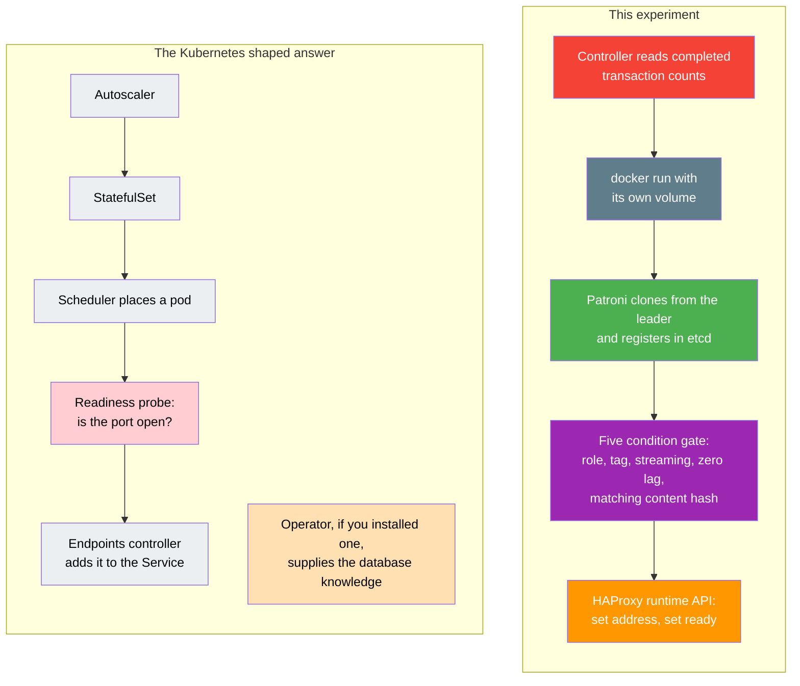
```mermaid
flowchart TD
    subgraph Here["This experiment"]
        direction TB
        H1["Controller reads completed<br/>transaction counts"] --> H2["docker run with<br/>its own volume"]
        H2 --> H3["Patroni clones from the leader<br/>and registers in etcd"]
        H3 --> H4["Five condition gate:<br/>role, tag, streaming, zero lag,<br/>matching content hash"]
        H4 --> H5["HAProxy runtime API:<br/>set address, set ready"]
    end

    subgraph K8s["The Kubernetes shaped answer"]
        direction TB
        K1["Autoscaler"] --> K2["StatefulSet"] --> K3["Scheduler places a pod"]
        K3 --> K4["Readiness probe:<br/>is the port open?"]
        K4 --> K5["Endpoints controller<br/>adds it to the Service"]
        K6["Operator, if you installed one,<br/>supplies the database knowledge"]
    end

    style K1 fill:#ECEFF1,color:#000
    style K2 fill:#ECEFF1,color:#000
    style K3 fill:#ECEFF1,color:#000
    style K4 fill:#FFCDD2,color:#000
    style K5 fill:#ECEFF1,color:#000
    style K6 fill:#FFE0B2,color:#000
    style H1 fill:#F44336,color:#fff
    style H2 fill:#607D8B,color:#fff
    style H3 fill:#4CAF50,color:#fff
    style H4 fill:#9C27B0,color:#fff
    style H5 fill:#FF9800,color:#fff
```

The two boxes shaded differently on the Kubernetes side are the interesting ones. A default readiness probe answers a much weaker question than the gate used here, which is why serious PostgreSQL on Kubernetes always involves an operator, and why those operators nearly all embed Patroni. **Even on Kubernetes, Patroni is the component that knows what ready means.** Take Kubernetes away and you lose the scheduling convenience, not the part that keeps your data correct.

### What each tool actually contributed

| Tool | Its job in this experiment | What it did not do |
|---|---|---|
| **Patroni** | Bootstrapped each new node by base backup from the leader with no manual step, registered it in etcd, reported role, state and byte lag, kept elastic nodes out of elections through a tag, and shut down cleanly on SIGTERM | Decide when to scale. It has no opinion on load. |
| **etcd** | Held the single agreed view of who is a member, who leads, and how far behind each replica is, so the controller and the proxy could both consult one source of truth | Store any data, or route anything |
| **HAProxy** | Health checked each node through Patroni's HTTP endpoints, balanced read connections round robin, and accepted address and state changes at runtime with no reload | Know anything about replication or lag on its own |
| **Docker** | Created and destroyed containers and preserved named volumes | Anything database aware |
| **The controller** | Measured completed throughput, applied hysteresis and cooldown, and enforced the admission and removal gates | Anything the other four already did |

The division is clean, and it is the same division the earlier phases used. What is new here is that the controller drives it dynamically.

---

## 3. The Isolation Boundary

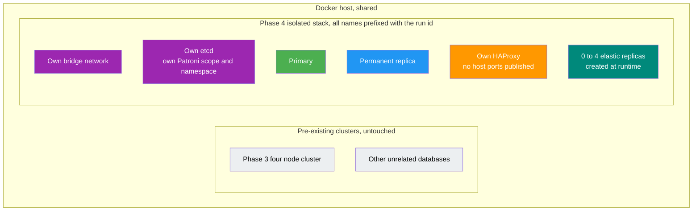
```mermaid
flowchart TD
    subgraph Host["Docker host, shared"]
        subgraph Existing["Pre-existing clusters, untouched"]
            E1["Phase 3 four node cluster"]
            E2["Other unrelated databases"]
        end

        subgraph P4["Phase 4 isolated stack, all names prefixed with the run id"]
            NET["Own bridge network"]
            DCS["Own etcd<br/>own Patroni scope and namespace"]
            PRI["Primary"]
            BASE["Permanent replica"]
            PROXY["Own HAProxy<br/>no host ports published"]
            EL["0 to 4 elastic replicas<br/>created at runtime"]
        end
    end

    style E1 fill:#ECEFF1,color:#000
    style E2 fill:#ECEFF1,color:#000
    style NET fill:#9C27B0,color:#fff
    style DCS fill:#9C27B0,color:#fff
    style PRI fill:#4CAF50,color:#fff
    style BASE fill:#2196F3,color:#fff
    style PROXY fill:#FF9800,color:#fff
    style EL fill:#00897B,color:#fff
```

The isolation is not cosmetic. The Patroni configuration uses a different scope and a different namespace, so the new cluster cannot see or join the existing one:

| Setting | Earlier phases | Phase 4 |
|---|---|---|
| Patroni scope | `pg-ha-cluster` | `phase4-isolated`, overridden per run with the unique prefix |
| Patroni namespace | `/service/` | `/phase4/` |
| Host ports published | 5000, 5001, 7000 | **None** |
| Object naming | Fixed service names | Every name begins with the run identifier |

No host ports are published at all, which means the only way to reach this stack is from inside its own network. The traffic containers join that network deliberately.

The run also confirmed afterwards that the existing clusters were still healthy and had not been stopped, changed or deleted.

### Tuning that differs from the earlier phases

The Patroni template was adjusted for a lab that creates and destroys replicas quickly and needs verbose evidence:

| Setting | Earlier phases | Phase 4 | Reason |
|---|---|---|---|
| `loop_wait` | 10 | **5** | React faster to a joining node |
| `retry_timeout` | 10 | **5** | Matches the shorter loop |
| `max_wal_senders` | 5 | **16** | Six nodes plus base backups need more senders |
| `max_replication_slots` | 5 | **16** | One per replica, with headroom |
| `shared_buffers` | default | **64MB** | Six nodes on a laptop |
| `log_destination` | stderr | **csvlog and stderr** | Machine readable server logs for evidence |
| `log_rotation_age` | not set | **10min** | Bound the log files |
| `log_rotation_size` | not set | **20MB** | Same |
| `log_line_prefix` | default | Full prefix with database, user, application, client, session and transaction | Every server log line is attributable |

The full prefix used is:

```
%m [%p] db=%d user=%u app=%a client=%r session=%c tx=%x
```

---

## 4. Topology and Data Flow

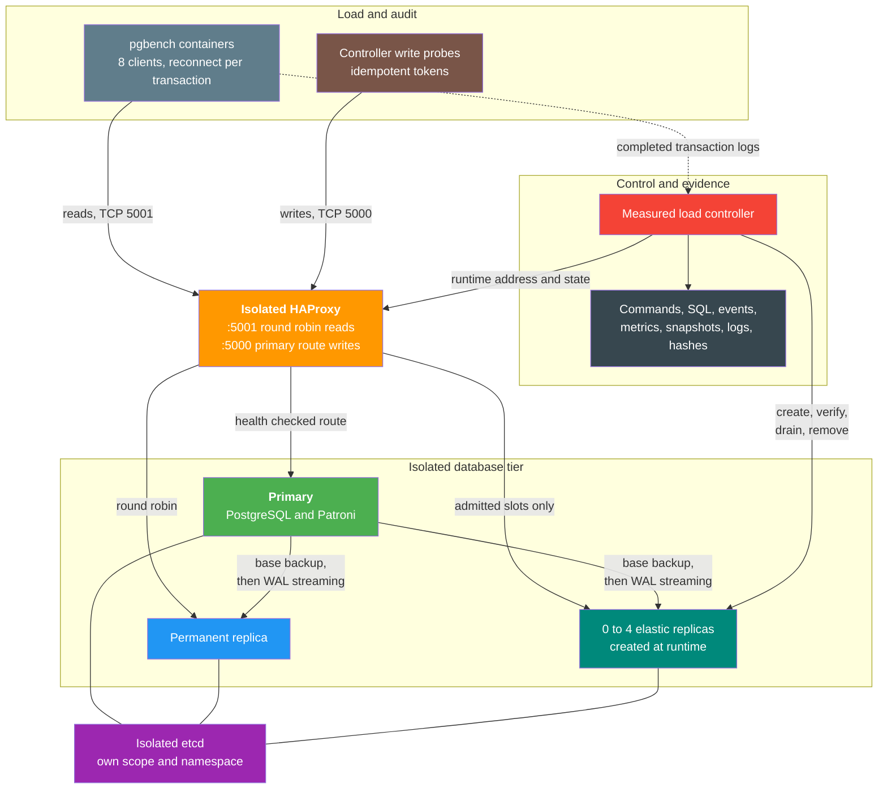
```mermaid
flowchart TD
    subgraph Clients["Load and audit"]
        Bench["pgbench containers<br/>8 clients, reconnect per transaction"]
        Probe["Controller write probes<br/>idempotent tokens"]
    end

    Proxy["<b>Isolated HAProxy</b><br/>:5001 round robin reads<br/>:5000 primary route writes"]

    subgraph DB["Isolated database tier"]
        Primary["<b>Primary</b><br/>PostgreSQL and Patroni"]
        Base["Permanent replica"]
        Elastic["0 to 4 elastic replicas<br/>created at runtime"]
    end

    DCS["Isolated etcd<br/>own scope and namespace"]

    subgraph Control["Control and evidence"]
        Ctl["Measured load controller"]
        Ev["Commands, SQL, events,<br/>metrics, snapshots, logs, hashes"]
    end

    Bench -->|"reads, TCP 5001"| Proxy
    Probe -->|"writes, TCP 5000"| Proxy
    Proxy -->|"health checked route"| Primary
    Proxy -->|"round robin"| Base
    Proxy -->|"admitted slots only"| Elastic
    Primary -->|"base backup,<br/>then WAL streaming"| Base
    Primary -->|"base backup,<br/>then WAL streaming"| Elastic
    Primary --- DCS
    Base --- DCS
    Elastic --- DCS
    Bench -.->|"completed transaction logs"| Ctl
    Ctl -->|"create, verify,<br/>drain, remove"| Elastic
    Ctl -->|"runtime address and state"| Proxy
    Ctl --> Ev

    style Bench fill:#607D8B,color:#fff
    style Probe fill:#795548,color:#fff
    style Proxy fill:#FF9800,color:#fff
    style Primary fill:#4CAF50,color:#fff
    style Base fill:#2196F3,color:#fff
    style Elastic fill:#00897B,color:#fff
    style DCS fill:#9C27B0,color:#fff
    style Ctl fill:#F44336,color:#fff
    style Ev fill:#37474F,color:#fff
```

Note the two separate paths into the proxy. Reads go to port 5001 and are balanced round robin. Writes, which are only ever the controller's own audit probes, go to port 5000 and reach whichever node is primary. **Elastic replicas are never added to the write backend.**

Also note where the controller gets its input: from the pgbench transaction logs, not from the driver and not from the proxy.

### The proxy configuration, and one clever part

```
listen primary_route
    bind :5000
    option httpchk GET /primary
    http-check expect status 200
    default-server inter 1s fall 2 rise 2
    server primary primary:5432 check port 8008
    server base base:5432 check port 8008

listen replicas
    bind :5001
    balance roundrobin
    option httpchk GET /replica
    http-check expect status 200
    default-server inter 1s fall 2 rise 2
    server base base:5432 check port 8008
    server elastic1 127.0.0.1:5432 disabled check port 8008
    server elastic2 127.0.0.1:5432 disabled check port 8008
    server elastic3 127.0.0.1:5432 disabled check port 8008
    server elastic4 127.0.0.1:5432 disabled check port 8008
```

The four elastic slots are declared up front, pointing at a deliberately useless address and marked `disabled`. When a replica is admitted, the controller does not edit this file and does not reload the proxy. It opens the admin stats socket and issues two runtime commands:

```
set server replicas/elastic1 addr <container ip> port 5432
set server replicas/elastic1 state ready
```

The address comes from a narrowly formatted Docker inspect of that container on that network, and is validated as an IPv4 address before use. Not from DNS, and not guessed.

This matters because a proxy reload drops state and can disturb live connections. The health checks are also deliberately aggressive at `inter 1s fall 2 rise 2`, because in a lab that creates a node and wants it serving within seconds, a three second interval is too slow to be interesting.

---

## 5. The Cluster at Each Stage

The topology changed twice during the run. These are the three states, and the thing to watch across them is which boxes exist, which ones the proxy is willing to send traffic to, and what survives at the end.

### Stage one: baseline, two database containers

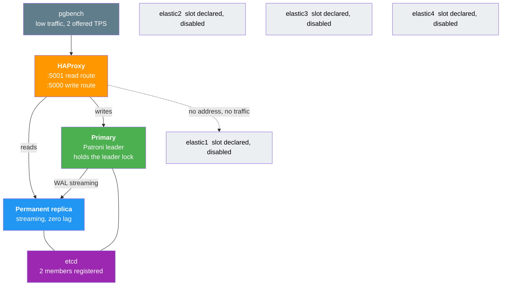
```mermaid
flowchart TD
    Bench["pgbench<br/>low traffic, 2 offered TPS"]
    Proxy["<b>HAProxy</b><br/>:5001 read route<br/>:5000 write route"]
    Primary["<b>Primary</b><br/>Patroni leader<br/>holds the leader lock"]
    Base["<b>Permanent replica</b><br/>streaming, zero lag"]
    S1["elastic1  slot declared, disabled"]
    S2["elastic2  slot declared, disabled"]
    S3["elastic3  slot declared, disabled"]
    S4["elastic4  slot declared, disabled"]
    DCS["etcd<br/>2 members registered"]

    Bench --> Proxy
    Proxy -->|"reads"| Base
    Proxy -->|"writes"| Primary
    Proxy -.->|"no address, no traffic"| S1
    Primary -->|"WAL streaming"| Base
    Primary --- DCS
    Base --- DCS

    style Bench fill:#607D8B,color:#fff
    style Proxy fill:#FF9800,color:#fff
    style Primary fill:#4CAF50,color:#fff
    style Base fill:#2196F3,color:#fff
    style S1 fill:#ECEFF1,color:#000
    style S2 fill:#ECEFF1,color:#000
    style S3 fill:#ECEFF1,color:#000
    style S4 fill:#ECEFF1,color:#000
    style DCS fill:#9C27B0,color:#fff
```

Two PostgreSQL containers. The four elastic slots already exist in the proxy configuration but point at a deliberately useless address and are marked disabled, so they cannot receive anything. Nothing has to be reconfigured later to bring them into play.

### Stage two: peak, six database containers

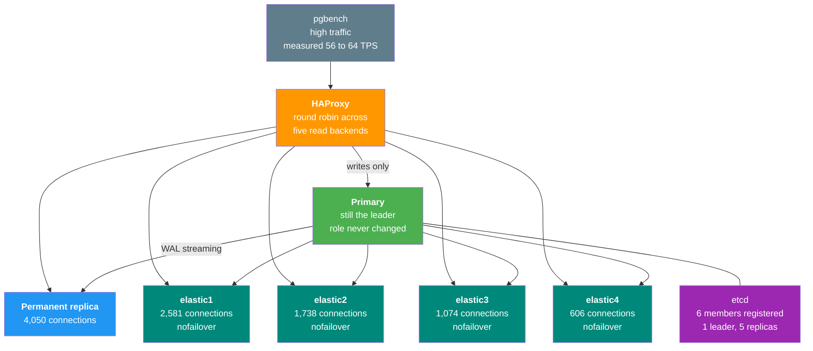
```mermaid
flowchart TD
    Bench["pgbench<br/>high traffic<br/>measured 56 to 64 TPS"]
    Proxy["<b>HAProxy</b><br/>round robin across<br/>five read backends"]
    Primary["<b>Primary</b><br/>still the leader<br/>role never changed"]
    Base["<b>Permanent replica</b><br/>4,050 connections"]
    E1["<b>elastic1</b><br/>2,581 connections<br/>nofailover"]
    E2["<b>elastic2</b><br/>1,738 connections<br/>nofailover"]
    E3["<b>elastic3</b><br/>1,074 connections<br/>nofailover"]
    E4["<b>elastic4</b><br/>606 connections<br/>nofailover"]
    DCS["etcd<br/>6 members registered<br/>1 leader, 5 replicas"]

    Bench --> Proxy
    Proxy --> Base
    Proxy --> E1
    Proxy --> E2
    Proxy --> E3
    Proxy --> E4
    Proxy -->|"writes only"| Primary
    Primary -->|"WAL streaming"| Base
    Primary --> E1
    Primary --> E2
    Primary --> E3
    Primary --> E4
    Primary --- DCS

    style Bench fill:#607D8B,color:#fff
    style Proxy fill:#FF9800,color:#fff
    style Primary fill:#4CAF50,color:#fff
    style Base fill:#2196F3,color:#fff
    style E1 fill:#00897B,color:#fff
    style E2 fill:#00897B,color:#fff
    style E3 fill:#00897B,color:#fff
    style E4 fill:#00897B,color:#fff
    style DCS fill:#9C27B0,color:#fff
```

Six PostgreSQL containers, one primary and five replicas, all five replicas serving reads. Every elastic node carries the nofailover tag, which is a Patroni setting rather than anything the proxy or Docker knows about. It means none of them can ever win an election, so scale-in can never accidentally remove the writable node.

The connection counts differ because the nodes joined at different times, not because the balancing was uneven. Section 16 explains that.

### Stage three: after scale-in, two containers and four retained volumes

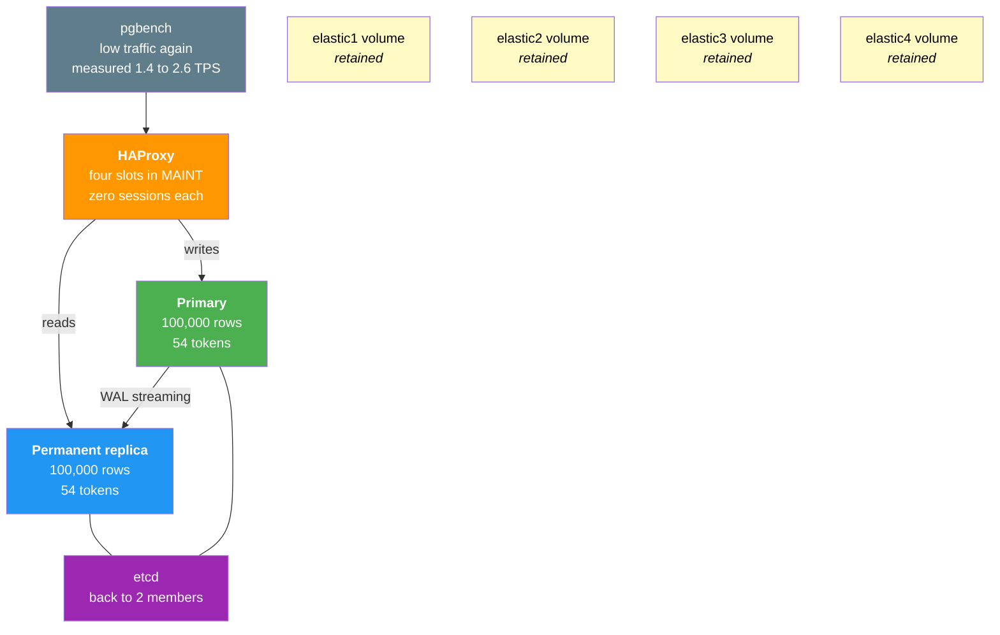
```mermaid
flowchart TD
    Bench["pgbench<br/>low traffic again<br/>measured 1.4 to 2.6 TPS"]
    Proxy["<b>HAProxy</b><br/>four slots in MAINT<br/>zero sessions each"]
    Primary["<b>Primary</b><br/>100,000 rows<br/>54 tokens"]
    Base["<b>Permanent replica</b><br/>100,000 rows<br/>54 tokens"]
    V1["elastic1 volume<br/><i>retained</i>"]
    V2["elastic2 volume<br/><i>retained</i>"]
    V3["elastic3 volume<br/><i>retained</i>"]
    V4["elastic4 volume<br/><i>retained</i>"]
    DCS["etcd<br/>back to 2 members"]

    Bench --> Proxy
    Proxy -->|"reads"| Base
    Proxy -->|"writes"| Primary
    Primary -->|"WAL streaming"| Base
    Primary --- DCS
    Base --- DCS

    style Bench fill:#607D8B,color:#fff
    style Proxy fill:#FF9800,color:#fff
    style Primary fill:#4CAF50,color:#fff
    style Base fill:#2196F3,color:#fff
    style V1 fill:#FFF9C4,color:#000
    style V2 fill:#FFF9C4,color:#000
    style V3 fill:#FFF9C4,color:#000
    style V4 fill:#FFF9C4,color:#000
    style DCS fill:#9C27B0,color:#fff
```

Back to two containers. The four elastic containers are gone, their proxy slots are in maintenance with zero sessions, and etcd is back to two members. **The four data volumes are still there**, deliberately, and the run verified each one after removing its container.

The pale boxes are the point of the whole scale-in design. Removing capacity destroyed no data. If demand rose again, those volumes are a starting point rather than a full base backup, although this run did not test rejoining from them.

### How each tool moved between the stages

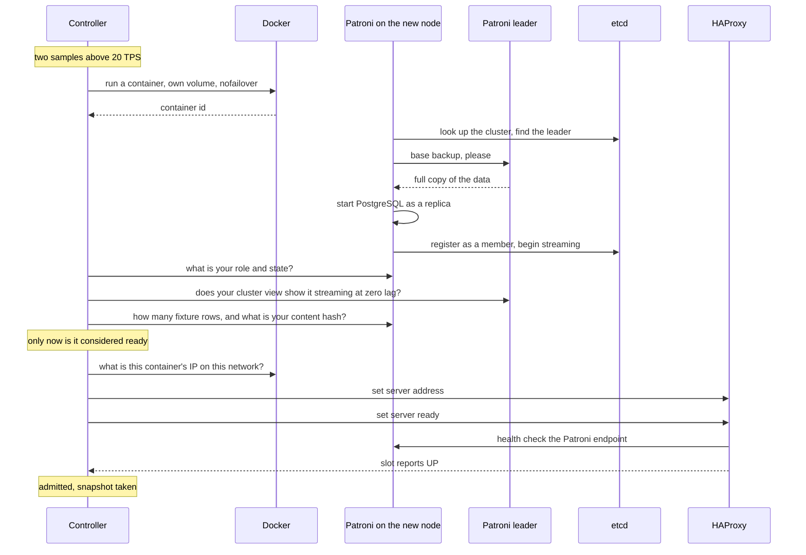
```mermaid
sequenceDiagram
    participant C as Controller
    participant D as Docker
    participant P as Patroni on the new node
    participant L as Patroni leader
    participant E as etcd
    participant H as HAProxy

    Note over C: two samples above 20 TPS
    C->>D: run a container, own volume, nofailover
    D-->>C: container id
    P->>E: look up the cluster, find the leader
    P->>L: base backup, please
    L-->>P: full copy of the data
    P->>P: start PostgreSQL as a replica
    P->>E: register as a member, begin streaming
    C->>P: what is your role and state?
    C->>L: does your cluster view show it streaming at zero lag?
    C->>P: how many fixture rows, and what is your content hash?
    Note over C: only now is it considered ready
    C->>D: what is this container's IP on this network?
    C->>H: set server address
    C->>H: set server ready
    H->>P: health check the Patroni endpoint
    H-->>C: slot reports UP
    Note over C: admitted, snapshot taken
```

Read that sequence and notice how little of it is orchestration. One line creates the container. Two lines put it into service. Everything in the middle is Patroni cloning the data and the controller refusing to believe the node is ready until it has asked three different sources and got consistent answers.

There is no equivalent of a Kubernetes control loop reconciling desired state against actual state. The controller acts once, verifies, and moves on. That is simpler, and it is also why this is a demonstration rather than a production autoscaler: nothing here recovers if the controller dies halfway through.

---

## 6. The Environment That Actually Ran

| Item | Value |
|---|---|
| Host | Windows, PowerShell 7, Linux containers on Docker Desktop |
| CPUs reported at preflight | 8 |
| Docker memory reported at preflight | 8,210,579,456 bytes |
| Node image | Reused local image, ID `db72c0d677a3c6688e960cee809f409080df997bea47058fc1da945249cd4e48` |
| etcd image | ID `0934690612905554eb61ddefb9faaaecb47c2f6931dbb453e694358092ee8990` |
| HAProxy image | ID `3e29449a6beed63262e36104adf531b4e41b359f61937303f5ea8607987b3748` |
| HAProxy version actually reported | **2.9.15** |
| Images pulled or built during the run | None |

That HAProxy line is a small lesson worth keeping. The image was requested as `haproxy:2.9-alpine`, and the version that actually answered was 2.9.15. Tags are not immutable, so the run records image IDs rather than trusting tag names.

### Parameters

| Parameter | Default | Used in this run |
|---|---|---|
| Traffic duration per driver stage | 360s | **900s** (a deadline, not a trigger) |
| Readiness timeout | 180s | 180s |
| Per command timeout | 60s | 60s |
| Cooldown after each action | 15s | 15s |
| Overall lab deadline | 1200s | 1200s |
| Memory per database node | 512 MB | 512 MB |

The traffic duration is a hard upper bound on how long a driver stage may run. It is not a scale trigger, and the controller never sees it. A timeout is treated as a failure, never as a successful scale-in.

Peak memory allocation was six database nodes at 512 MiB, plus 256 MiB for etcd, 128 MiB for HAProxy and 256 MiB for live traffic, on top of Docker overhead and the pre-existing clusters.

---

## 7. The Fixture and Every Query

Everything lives in a schema called `phase4_lab`, inside the isolated stack's own `postgres` database, so it cannot collide with any earlier lab.

### Seeding

```sql
\set ON_ERROR_STOP on
BEGIN;
CREATE SCHEMA phase4_lab;
CREATE TABLE phase4_lab.items (id integer PRIMARY KEY, payload text NOT NULL);
INSERT INTO phase4_lab.items
SELECT i, repeat(md5(i::text), 4) FROM generate_series(1, 100000) AS g(i);
CREATE TABLE phase4_lab.events (token text PRIMARY KEY, created_at timestamptz NOT NULL DEFAULT clock_timestamp());
COMMIT;
ANALYZE phase4_lab.items;
```

Two design choices in nine lines. The fixture is **deterministic**, because `repeat(md5(i::text), 4)` produces the same 128 character payload for a given `id` on any machine. That is what makes a content hash a meaningful equality check between nodes. And the events table has `token` as its primary key, which is what makes the write probes safe to retry.

### The read query

```sql
\set first random(1, 99901)
SELECT inet_server_addr() AS server, pg_is_in_recovery() AS replica,
       count(*), sum(id), sum(length(payload))
FROM phase4_lab.items WHERE id BETWEEN :first AND :first + 99;
```

A random indexed range of exactly 100 rows. It returns the server address and the recovery flag, which means each transaction carries proof of which node served it and whether that node was a replica. The aggregates exist so the query has to actually touch the rows rather than being optimised into a count.

### The write probe

```sql
INSERT INTO phase4_lab.events(token) VALUES ('<token>') ON CONFLICT(token) DO NOTHING;
SELECT json_build_object('token', token, 'replica', pg_is_in_recovery(), 'server', inet_server_addr())
FROM phase4_lab.events WHERE token = '<token>';
```

This is the pattern that makes an ambiguous result safe. If a write times out and the controller does not know whether it landed, it retries **the same token**. The primary key plus the conflict clause make the second attempt a no-op if the first succeeded. The select afterwards confirms the row exists and reports which node answered.

Without this, a controller that retried after a timeout would either double-write or lose the record, and the final count of 54 tokens would prove nothing.

### The agreement check

This is the query that decides whether a replica is trustworthy:

```sql
SELECT json_build_object(
 'server', inet_server_addr(), 'replica', pg_is_in_recovery(),
 'count', (SELECT count(*) FROM phase4_lab.items),
 'hash',  (SELECT md5(string_agg(id::text || ':' || payload, ',' ORDER BY id)) FROM phase4_lab.items),
 'tokens', COALESCE((SELECT json_agg(token ORDER BY token) FROM phase4_lab.events), '[]'::json));
```

It returns four things in one round trip: which node answered, whether it is a replica, how many fixture rows it holds, a content hash over every row in a fixed order, and the complete sorted list of tokens.

The `ORDER BY` clauses are the whole point. Without them the aggregate order would be arbitrary and the hash would differ between nodes that hold identical data.

The MD5 here is an equality check for a deterministic fixture, not a security measure. Artifact integrity uses SHA-256 separately.

---

## 8. How Load Was Generated

The driver runs three stages: low, then high, then low. Each is a container joined to the isolated network, running pgbench against the proxy's read port.

```bash
pgbench --debug --random-seed=42 -n -C -c "$clients" -j 2 \
  -T "$segment" -R "$rate" -P 2 -f /work/read.sql \
  -l --log-prefix="/evidence/tx.$batch"
```

Each flag is doing something specific:

| Flag | Effect | Why it matters here |
|---|---|---|
| `-C` | Reconnect for every transaction | Without this, eight long lived sessions would pin to whichever replicas existed at the start, and a newly admitted node would receive nothing. HAProxy balances connections, not statements. |
| `-R` | Offer a target rate | Makes the load a schedule rather than a flat out benchmark |
| `-n` | Skip vacuum | The fixture is immutable |
| `--random-seed=42` | Fixed seed | Same range selection across runs |
| `-l --log-prefix` | Write per transaction log records | **This is the controller's only input** |
| `--debug` | Verbose trace | Records the expanded SQL, since pgbench discards result rows |
| `-P 2` | Progress every two seconds | Human readable progress in the client log |

The long form `--debug` is deliberate. The short form `-d` means debug in pgbench, not database, which is an easy and confusing mistake.

### Why the traffic runs in ten second batches

The driver loops, running pgbench for a bounded segment of at most ten seconds at a time, and traps the termination signal so it stops **after the current batch has finished and flushed its logs**.

This looks like an odd complication until you learn why it is there. An earlier attempt killed pgbench directly, which left the tail of a transaction log file half written. The verifier correctly rejected the evidence. Batching means every log file is complete, and the runner requires the traffic container to exit 0.

---

## 9. Which Part Decides to Scale, and How

This is the question the architecture answers least intuitively, so it is worth being blunt about it.

### Nothing in the Patroni stack decides to scale

| Component | Has an opinion on load? | What it decides |
|---|---|---|
| **Patroni** | **No** | Who is the leader, when to fail over, how to clone a new member, when a member is streaming |
| **etcd** | **No** | Nothing. It stores what Patroni agrees on. |
| **HAProxy** | **No** | Whether a backend is passing its health check, and which backend gets the next connection |
| **Docker** | **No** | Nothing. It runs what it is told. |
| **The controller** | **Yes, exclusively** | Whether the cluster needs another replica, or one fewer |

Patroni is a high availability tool. It is very good at knowing which node should be primary and at making a replica out of an empty directory. It has **no concept of demand**, and it will never create a node because the system is busy. That is not a gap in Patroni. It is simply a different problem.

So elasticity is not a feature you get from this stack. It is a component you have to write, and in this experiment it is roughly a page of logic sitting outside every other tool.

### Two control planes, deciding different things

This is the sharpest structural point in the whole design. The system contains two independent decision makers, and they work in completely different ways.

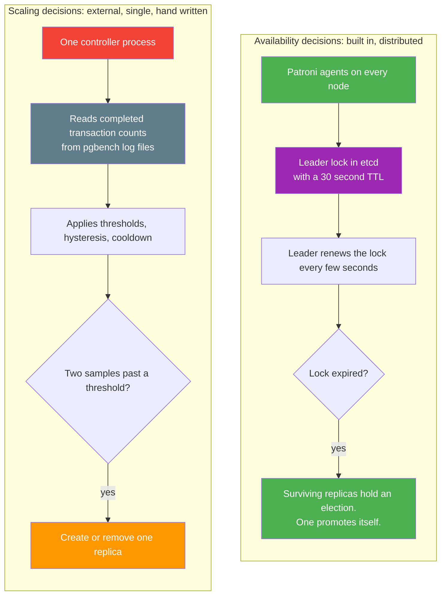
```mermaid
flowchart TD
    subgraph HA["Availability decisions: built in, distributed"]
        direction TB
        A1["Patroni agents on every node"]
        A2["Leader lock in etcd<br/>with a 30 second TTL"]
        A3["Leader renews the lock every few seconds"]
        A4{"Lock expired?"}
        A5["Surviving replicas hold an election.<br/>One promotes itself."]
        A1 --> A2 --> A3 --> A4
        A4 -->|yes| A5
    end

    subgraph SC["Scaling decisions: external, single, hand written"]
        direction TB
        B1["One controller process"]
        B2["Reads completed transaction counts<br/>from pgbench log files"]
        B3["Applies thresholds, hysteresis, cooldown"]
        B4{"Two samples past a threshold?"}
        B5["Create or remove one replica"]
        B1 --> B2 --> B3 --> B4
        B4 -->|yes| B5
    end

    style A1 fill:#4CAF50,color:#fff
    style A2 fill:#9C27B0,color:#fff
    style A5 fill:#4CAF50,color:#fff
    style B1 fill:#F44336,color:#fff
    style B2 fill:#607D8B,color:#fff
    style B5 fill:#FF9800,color:#fff
```

The differences matter:

| | Availability decision | Scaling decision |
|---|---|---|
| Who decides | Patroni, on every node, collectively | One external controller |
| Where the state lives | etcd, agreed by consensus | In the controller's own memory |
| Input | A leader lock and its expiry | Application throughput |
| Survives the decider dying | **Yes.** Any replica can promote. | **No.** If the controller dies mid action, nothing finishes it. |
| Needed Kubernetes? | No | No |

That last row is the reason this experiment exists, and the second to last row is its main weakness. Patroni's failover decision is genuinely fault tolerant, which Phase 1 demonstrated by killing a primary. The scaling decision is a single process with no redundancy and no reconciliation loop. **This is exactly the part Kubernetes would have improved**, not by understanding databases better, but by making the desired replica count durable and continuously reconciled.

### The signal it decides on

The controller could have watched many things. It watches one:

| Candidate signal | Why it was not used |
|---|---|
| CPU utilisation | Measures effort, not delivered work. A node thrashing on I/O looks idle. |
| Connection count | Measures arrivals, not completions. A backlog inflates it. |
| Offered request rate | Measures intent. The driver could offer 100 while the system delivers 56, which is what actually happened. |
| Replication lag | A health signal, not a demand signal. It is used in the admission gate instead. |
| Query latency | A reasonable production choice, and a limitation of this design that it was not used |
| **Completed transactions** | **Chosen.** Counts work that actually finished. |

Counting completions is the strictest of these. Work that was offered but never finished does not inflate it, and effort spent without result does not either. The measured 56 to 64 TPS against an offered 100 is the whole justification: a controller trusting the offered rate would have believed a number the system never achieved.

The mechanics are deliberately narrow. The controller reads pgbench's own transaction log files from a shared mount, counts records whose timestamp falls in a trailing ten second window ending two seconds in the past, and divides by ten. The two second lag exists because pgbench buffers its log writes, so reading right up to the present would systematically undercount the newest completions.

**What the controller is never told:** the stage name, the offered rate, how long the experiment has been running, or anything at all from the traffic driver. If the driver stopped, the controller would not see quiet demand and scale in. It would fail the run. That constraint is what makes the four scale-out events evidence of anything.

### The decision itself

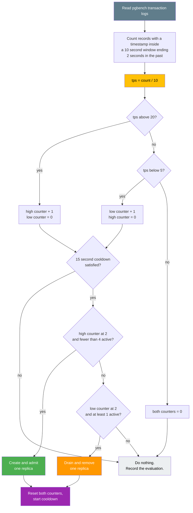
```mermaid
flowchart TD
    A["Read pgbench transaction logs"]
    B["Count records with a timestamp inside<br/>a 10 second window ending<br/>2 seconds in the past"]
    C["tps = count / 10"]
    D{"tps above 20?"}
    E{"tps below 5?"}
    F["high counter + 1<br/>low counter = 0"]
    G["low counter + 1<br/>high counter = 0"]
    H["both counters = 0"]
    I{"15 second cooldown<br/>satisfied?"}
    J{"high counter at 2<br/>and fewer than 4 active?"}
    K{"low counter at 2<br/>and at least 1 active?"}
    L["Create and admit<br/>one replica"]
    M["Drain and remove<br/>one replica"]
    N["Do nothing.<br/>Record the evaluation."]
    O["Reset both counters,<br/>start cooldown"]

    A --> B --> C --> D
    D -->|yes| F
    D -->|no| E
    E -->|yes| G
    E -->|no| H
    F --> I
    G --> I
    H --> N
    I -->|no| N
    I -->|yes| J
    J -->|yes| L
    J -->|no| K
    K -->|yes| M
    K -->|no| N
    L --> O
    M --> O

    style A fill:#607D8B,color:#fff
    style C fill:#FFC107,color:#000
    style L fill:#4CAF50,color:#fff
    style M fill:#FF9800,color:#fff
    style N fill:#ECEFF1,color:#000
    style O fill:#9C27B0,color:#fff
```

In words:

| Rule | Value |
|---|---|
| Sample window | Trailing 10 seconds, ending 2 seconds behind the observation |
| Rate calculation | Completed records divided by 10 |
| Scale out | Two consecutive samples **strictly above 20** completed TPS |
| Scale in | Two consecutive samples **strictly below 5** completed TPS |
| Bounds | Minimum 0 elastic, maximum 4 |
| Cooldown | 15 seconds after each completed action |
| Counter behaviour | A sample that fails a test resets that counter to zero |
| Inputs the controller does **not** receive | Stage name, offered rate, elapsed time, anything from the driver |

Two consecutive samples rather than one is straightforward hysteresis: it stops a single noisy sample from creating or destroying a database server. Note the practical effect in the run: consecutive admissions were about 30 seconds apart even though the cooldown is 15, because after the cooldown the controller still had to accumulate two fresh qualifying samples.

Polling uses a blocking Docker stats call rather than a sleep, so observations are naturally spaced by real work rather than by a timer. A side effect is that the sample cadence is variable, and controller decisions pause while a base backup or a log archive is in progress.

---

## 10. The Admission Gate

A container that is running is not a replica you can send traffic to. Before any node joins the read route, it has to pass five checks, all of which must be true at the same moment.

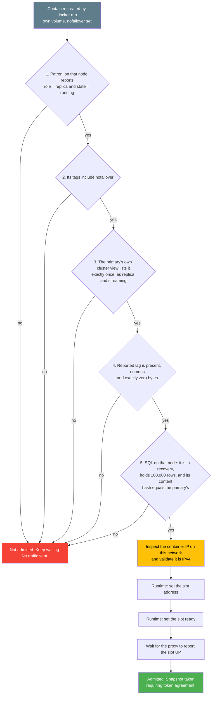
```mermaid
flowchart TD
    S["Container created by docker run<br/>own volume, nofailover set"]
    G1{"1. Patroni on that node reports<br/>role = replica and state = running"}
    G2{"2. Its tags include nofailover"}
    G3{"3. The primary's own cluster view lists it<br/>exactly once, as replica and streaming"}
    G4{"4. Reported lag is present, numeric<br/>and exactly zero bytes"}
    G5{"5. SQL on that node: it is in recovery,<br/>holds 100,000 rows, and its content<br/>hash equals the primary's"}
    IP["Inspect the container IP on this network<br/>and validate it is IPv4"]
    R1["Runtime: set the slot address"]
    R2["Runtime: set the slot ready"]
    W["Wait for the proxy to report the slot UP"]
    OK["Admitted. Snapshot taken<br/>requiring token agreement."]
    NO["Not admitted. Keep waiting.<br/>No traffic sent."]

    S --> G1
    G1 -->|no| NO
    G1 -->|yes| G2
    G2 -->|no| NO
    G2 -->|yes| G3
    G3 -->|no| NO
    G3 -->|yes| G4
    G4 -->|no| NO
    G4 -->|yes| G5
    G5 -->|no| NO
    G5 -->|yes| IP --> R1 --> R2 --> W --> OK

    style S fill:#607D8B,color:#fff
    style OK fill:#4CAF50,color:#fff
    style NO fill:#F44336,color:#fff
    style IP fill:#FFC107,color:#000
```

Check four deserves singling out. The lag value from Patroni is in bytes, and the code refuses to treat a missing or non numeric lag as zero. That is exactly the sort of shortcut that makes a monitoring system report health it has not actually confirmed. Here, unknown means not ready.

Check five is the one that would catch a genuinely broken clone. A node can be streaming and reporting zero lag while its base backup is incomplete, so the gate asks the node directly for a row count and a content hash and compares them against the primary.

Only after all five pass does the controller touch the proxy at all.

---

## 11. How the Data Gets There, and How Traffic Follows

A new container starts with an empty data directory. Before it can answer a single read it needs a complete, consistent copy of the database and then a live connection to keep it that way. Nothing in the controller does this work. Patroni does all of it, from configuration alone.

### The clone, then the stream

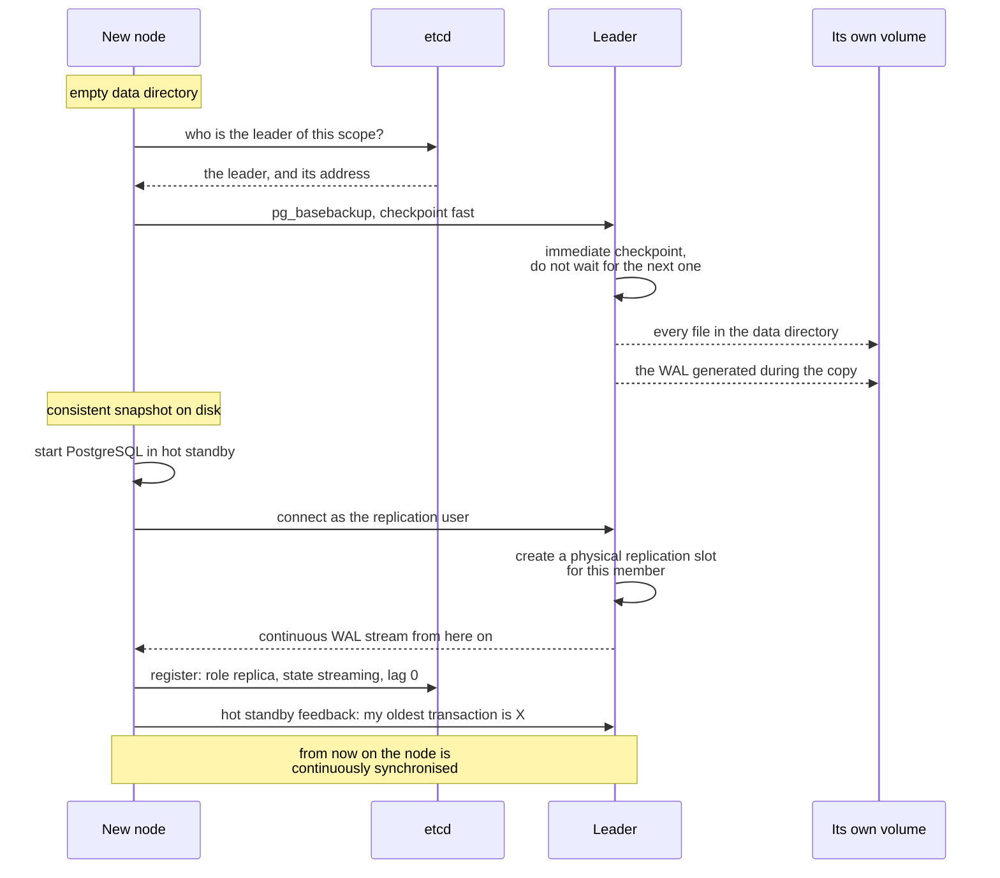
```mermaid
sequenceDiagram
    participant N as New node
    participant E as etcd
    participant L as Leader
    participant D as Its own volume

    Note over N: empty data directory
    N->>E: who is the leader of this scope?
    E-->>N: the leader, and its address
    N->>L: pg_basebackup, checkpoint fast
    L->>L: immediate checkpoint,<br/>do not wait for the next one
    L-->>D: every file in the data directory
    L-->>D: the WAL generated during the copy
    Note over N: consistent snapshot on disk
    N->>N: start PostgreSQL in hot standby
    N->>L: connect as the replication user
    L->>L: create a physical replication slot<br/>for this member
    L-->>N: continuous WAL stream from here on
    N->>E: register: role replica, state streaming, lag 0
    N->>L: hot standby feedback: my oldest transaction is X
    Note over N,L: from now on the node is<br/>continuously synchronised
```

Two phases, and they are quite different in character. The **base backup** is a bulk file copy of the entire data directory. The **stream** that follows is a continuous flow of write ahead log records, applied as they arrive.

The settings that make this happen, all verified in the configuration:

| Setting | Value | What it does |
|---|---|---|
| `create_replica_methods` | `basebackup` | New nodes clone by `pg_basebackup` from the current leader. No archive, no snapshot, no manual step. |
| `basebackup.checkpoint` | `fast` | Forces an immediate checkpoint instead of waiting for the next scheduled one. Without this a new node can sit idle for minutes before the copy even starts. |
| `use_slots` | `true` | Patroni creates a physical replication slot on the leader for each member, so the leader retains the WAL that member still needs |
| `wal_level` | `replica` | Generates enough WAL detail to feed a streaming replica |
| `max_wal_senders` | `16` | Concurrent sender processes. Six nodes plus in progress base backups need headroom. |
| `max_replication_slots` | `16` | One per member, with room to spare |
| `hot_standby` | `on` | The replica can serve read queries while it is still applying WAL |
| `hot_standby_feedback` | `on` | The replica tells the leader which rows it still needs, so the leader does not vacuum them away and break the replica's queries |
| `wal_log_hints` | `on` | Required for `pg_rewind`, which lets a diverged node rejoin without a full re-clone |
| `use_pg_rewind` | `true` | Enables that faster rejoin path |
| `data-checksums` | set at initdb | PostgreSQL detects corrupted pages rather than serving them |
| `maximum_lag_on_failover` | 1,048,576 bytes | A node more than 1 MiB behind is not considered a failover candidate |

The replication slot is worth pausing on, because it explains why the leader never runs out of the WAL a new replica needs. Without a slot, the leader recycles old WAL on its own schedule, and a replica that falls behind can find the records it wants have already been deleted. With `use_slots: true`, Patroni creates a slot per member and the leader holds WAL until that member has consumed it. Section 13 covers the other half of that bargain, which is what has to happen when the member goes away.

### Where the routing decision happens

Data synchronisation and traffic routing are deliberately separate, and the gap between them is the safety margin.

The node is streaming and consistent well before it receives any query, because nothing points at it yet. Its proxy slot still holds the placeholder address from the configuration file. Only after all five admission conditions pass does the controller send two runtime commands:

```
set server replicas/elastic1 addr <the container IP> port 5432
set server replicas/elastic1 state ready
```

Then three things make traffic arrive almost immediately:

**HAProxy health checks it directly.** The slot is checked once per second against Patroni's HTTP endpoint, and needs two consecutive successes to be considered up. The proxy is not taking the controller's word for it. It confirms independently, through Patroni, that the node is a replica.

**Read connections balance round robin.** Once the slot is up it enters the rotation on equal terms with every other replica.

**The load reconnects on every transaction.** This is the part that is easy to miss. pgbench runs with `-C`, so each transaction opens a fresh connection. HAProxy balances connections, not statements, so a newly admitted node starts receiving work within a second. Had the clients held persistent sessions, all eight would have stayed pinned to the replicas that existed when they connected, and the new node would have sat idle while the proxy reported it perfectly healthy.

That is a real trap in production read scaling. Adding a replica behind a connection pooler with long lived sessions moves no traffic at all until something forces a reconnect.

### What the admission timings actually measure

The four admissions took 10.957, 12.633, 14.317 and 16.582 seconds. Almost all of that is the base backup, which means **these numbers are a property of the fixture size, not of the design.**

The fixture is 100,000 rows with a 128 character payload, so roughly 13 MB of row data plus its primary key index, on top of a fresh PostgreSQL cluster. The whole copy is in the region of tens of megabytes. That is why a node went from nonexistent to serving reads in eleven seconds.

A production database of a terabyte would clone in a time proportional to its size and the available disk and network throughput, which could be hours. **Nothing in this experiment demonstrates fast scale-out for a large database.** It demonstrates that the lifecycle is correct. If you wanted this to be quick on real data you would need a different clone strategy, such as a filesystem or volume snapshot, or pre-warmed standbys kept streaming and simply admitted to the routing pool on demand. The retained volumes from Section 13 are a hint at that second approach.

The steady increase across the four admissions is consistent with contention: each new base backup reads from the same leader while more replicas stream from it, on one laptop, alongside the earlier phases' containers.

---

## 12. The Removal Sequence

Removal is more dangerous than admission, because a mistake here destroys data rather than merely failing to help. The sequence has thirteen steps, in three stages, and **either of the two decision points aborts the whole removal rather than continuing.** An abort keeps the container in place for inspection by hand.

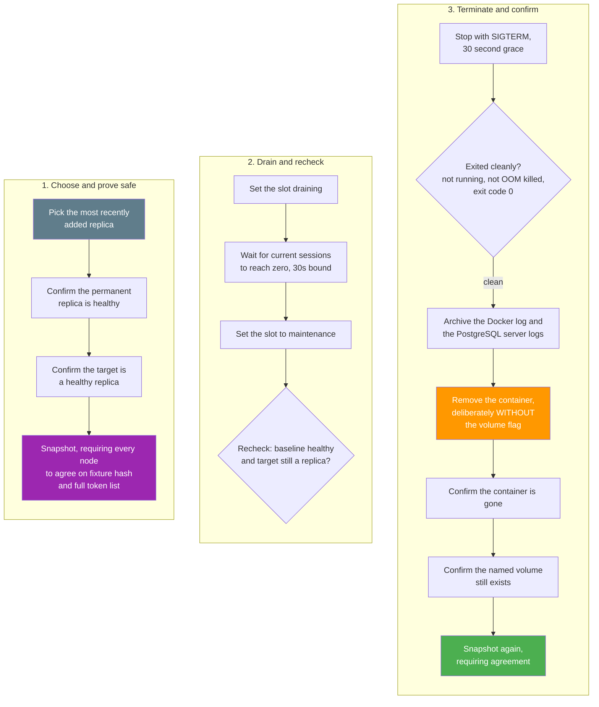
```mermaid
graph TB
    subgraph S3["3. Terminate and confirm"]
        direction TB
        I["Stop with SIGTERM,<br/>30 second grace"]
        J{"Exited cleanly?<br/>not running, not OOM killed,<br/>exit code 0"}
        K["Archive the Docker log and<br/>the PostgreSQL server logs"]
        L["Remove the container,<br/>deliberately WITHOUT<br/>the volume flag"]
        M["Confirm the container is gone"]
        N["Confirm the named volume<br/>still exists"]
        O["Snapshot again,<br/>requiring agreement"]
        I --> J
        J -->|clean| K --> L --> M --> N --> O
    end

    subgraph S2["2. Drain and recheck"]
        direction TB
        E["Set the slot draining"]
        F["Wait for current sessions<br/>to reach zero, 30s bound"]
        G["Set the slot to maintenance"]
        H{"Recheck: baseline healthy<br/>and target still a replica?"}
        E --> F --> G --> H
    end

    subgraph S1["1. Choose and prove safe"]
        direction TB
        A["Pick the most recently<br/>added replica"]
        B["Confirm the permanent<br/>replica is healthy"]
        C["Confirm the target is<br/>a healthy replica"]
        D["Snapshot, requiring every node<br/>to agree on fixture hash<br/>and full token list"]
        A --> B --> C --> D
    end

    style A fill:#607D8B,color:#fff
    style D fill:#9C27B0,color:#fff
    style L fill:#FF9800,color:#fff
    style O fill:#4CAF50,color:#fff
```

Four details in that flow are worth calling out.

**The safety check happens twice**, once before draining and again immediately before the stop. Between those two moments the cluster could in principle have promoted the target. The second check is what prevents the controller from stopping a node that has become the primary.

**Draining waits for zero current sessions.** Setting a slot to maintenance immediately would cut live connections. Draining stops new ones and waits for existing ones to finish.

**The logs are archived before the container is removed**, not after. Once the container is gone the logs are gone with it. Because the shutdown was graceful, these archives are complete right through shutdown, unlike the live copies taken from the still running baseline nodes.

**The removal command deliberately omits the volume flag**, and the next two steps verify both halves of the intended outcome: the container is absent and the named volume is still there. All four volumes were confirmed present after the run.

---

## 13. What Scale-In Actually Removes

There is a natural assumption that scaling in deletes data. It is worth stating plainly that **it does not, and that this is the single most important design decision in the removal path.**

A replica holds a complete copy of the database. Deleting it removes a copy, not the data. The primary is untouched, the permanent replica is untouched, and in this design even the departing replica's own copy survives on disk.

### Removed, versus deliberately kept

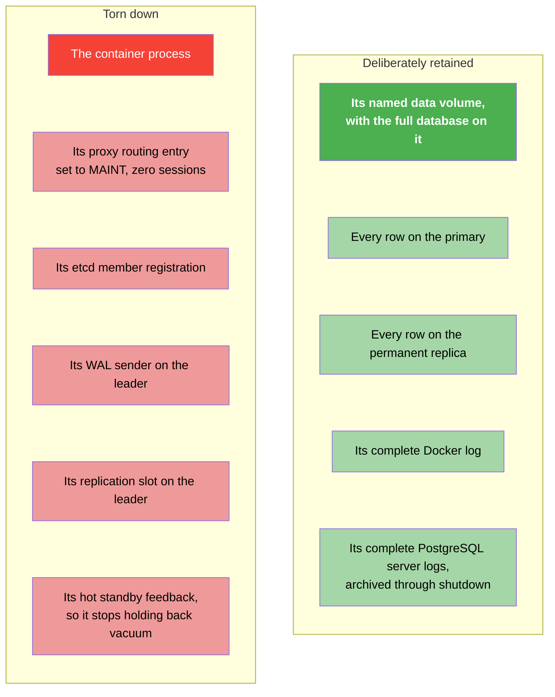
```mermaid
flowchart TD
    subgraph Kept["Deliberately retained"]
        direction TB
        K1["<b>Its named data volume,<br/>with the full database on it</b>"]
        K2["Every row on the primary"]
        K3["Every row on the permanent replica"]
        K4["Its complete Docker log"]
        K5["Its complete PostgreSQL server logs,<br/>archived through shutdown"]
        K1 ~~~ K2 ~~~ K3 ~~~ K4 ~~~ K5
    end

    subgraph Gone["Torn down"]
        direction TB
        R1["The container process"]
        R2["Its proxy routing entry<br/>set to MAINT, zero sessions"]
        R3["Its etcd member registration"]
        R4["Its WAL sender on the leader"]
        R5["Its replication slot on the leader"]
        R6["Its hot standby feedback,<br/>so it stops holding back vacuum"]
        R1 ~~~ R2 ~~~ R3 ~~~ R4 ~~~ R5 ~~~ R6
    end

    style R1 fill:#F44336,color:#fff
    style R2 fill:#EF9A9A,color:#000
    style R3 fill:#EF9A9A,color:#000
    style R4 fill:#EF9A9A,color:#000
    style R5 fill:#EF9A9A,color:#000
    style R6 fill:#EF9A9A,color:#000
    style K1 fill:#4CAF50,color:#fff
    style K2 fill:#A5D6A7,color:#000
    style K3 fill:#A5D6A7,color:#000
    style K4 fill:#A5D6A7,color:#000
    style K5 fill:#A5D6A7,color:#000
```

The removal command omits the volume flag on purpose, and the two steps that follow verify both halves of the intended result: the container is absent, and the named volume still exists. All four volumes were confirmed present after the run, and the final live inspection confirmed them again from outside.

### The replication slot is the part that bites

This is the detail that separates a clean scale-in from one that quietly breaks the primary days later.

Because `use_slots` is true, the leader holds a physical replication slot for every member, and it retains write ahead log that the slot's owner has not yet consumed. That is exactly what you want while the replica is alive. It is the reason a replica can pause, or fall behind, and still catch up.

It becomes a hazard the moment the replica goes away and the slot does not.

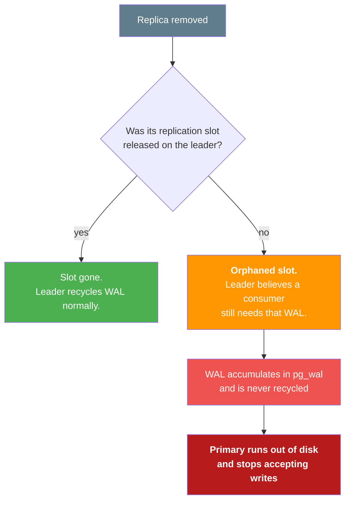
```mermaid
flowchart TD
    A["Replica removed"]
    B{"Was its replication slot<br/>released on the leader?"}
    C["Slot gone.<br/>Leader recycles WAL normally."]
    D["<b>Orphaned slot.</b><br/>Leader believes a consumer<br/>still needs that WAL."]
    E["WAL accumulates in pg_wal<br/>and is never recycled"]
    F["<b>Primary runs out of disk<br/>and stops accepting writes</b>"]

    A --> B
    B -->|yes| C
    B -->|no| D --> E --> F

    style A fill:#607D8B,color:#fff
    style C fill:#4CAF50,color:#fff
    style D fill:#FF9800,color:#fff
    style E fill:#EF5350,color:#fff
    style F fill:#B71C1C,color:#fff
```

An orphaned physical slot is one of the more common ways a healthy looking PostgreSQL primary fills its disk. Nothing complains at the time. The WAL simply stops being recycled, and the failure arrives later as a full volume and a database that will not accept writes.

Patroni owns this lifecycle. It maintains slots for the members it knows about from etcd, so when a node shuts down gracefully and its registration goes away, the slot it owned is cleaned up rather than left behind. This is a strong argument for letting Patroni remove members rather than stopping containers behind its back.

**An honest gap.** This run did not capture replication slot state as evidence. The mechanism is confirmed in the configuration, and the graceful shutdown path is exactly the one Patroni expects, but no snapshot in the evidence records `pg_replication_slots` before and after each removal. If I extended this lab, that query would be the first thing I added, because it is the check that would prove the cleanup rather than assume it.

### Why the order and the tags matter

**Removal is last in, first out.** elastic4 went first, then 3, 2 and 1. There is no data reason for this. It keeps the bookkeeping simple, so the slot names in use are always a prefix of the four and the controller never has to reason about gaps.

**Every elastic node carries `nofailover: true`.** This is a Patroni tag, and it is what makes the whole scale-in path safe. A node with that tag can never win an election, so the pool of removable nodes and the pool of nodes that could become primary are disjoint **by construction**. The removal path still rechecks the target's role twice, but the tag means the dangerous case was never possible in the first place.

That is a better kind of safety than a check. A check can be wrong. A node that is structurally ineligible to be primary cannot be the primary you accidentally deleted.

### Proving nothing was lost, before losing the ability to check

The sequencing here is deliberate. Both data comparisons happen **while the node is still alive and reachable**, because once it stops there is nothing left to interrogate.

Before each removal, every active replica had to report a fixture count of exactly 100,000, a content hash equal to the primary's `0f42f18a2baad7f892d29c774a09d284`, and a token list exactly equal to the primary's full set. Not a superset, not a subset. After the container was gone, the surviving nodes were checked again.

The final independent verification, run from outside against the live system, returned:

```
{"replica" : false, "rows" : 100000, "events" : 54}     -- the primary
{"replica" : true,  "rows" : 100000, "events" : 54}     -- the permanent replica
```

Four replicas were created and destroyed between those two nodes being seeded and being checked, and both still held all 100,000 fixture rows and all 54 acknowledged tokens.

### What retained volumes are for

Keeping the volumes costs disk and buys an option. A replica rebuilt from a retained volume would not need a full base backup. It would start from data that is stale by however long it was gone and catch up by streaming the difference, which is what `pg_rewind` and `wal_log_hints` are configured to support.

That would turn an eleven second admission on a tiny fixture into something that stays fast on a database where a full clone is measured in hours. **This run did not test it.** No node was ever rebuilt from a retained volume, so the volumes are a deliberate opportunity rather than a demonstrated capability, and Section 20 lists it among the gaps.

---

## 14. The Run, Second by Second

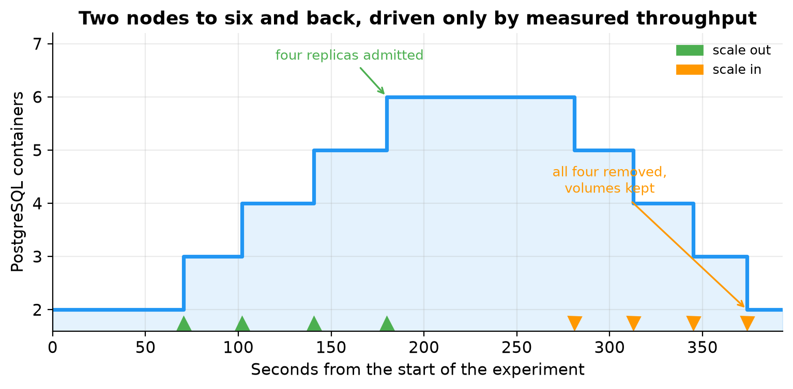

Every one of the eight actions, with the measurement that triggered it:

| Action | Slot | Decision UTC | Completed UTC | Measured TPS | Seconds |
|---|---|---|---|---:|---:|
| Admit | elastic1 | 17:34:57.776 | 17:35:08.733 | 60.0 | 10.957 |
| Admit | elastic2 | 17:35:27.424 | 17:35:40.057 | 56.5 | 12.633 |
| Admit | elastic3 | 17:36:04.485 | 17:36:18.802 | 63.8 | 14.317 |
| Admit | elastic4 | 17:36:41.666 | 17:36:58.248 | 56.0 | 16.582 |
| Remove | elastic4 | 17:38:25.701 | 17:38:39.226 | 1.4 | 13.525 |
| Remove | elastic3 | 17:38:59.762 | 17:39:11.028 | 2.4 | 11.266 |
| Remove | elastic2 | 17:39:33.061 | 17:39:43.290 | 2.6 | 10.229 |
| Remove | elastic1 | 17:40:02.071 | 17:40:12.249 | 2.6 | 10.178 |

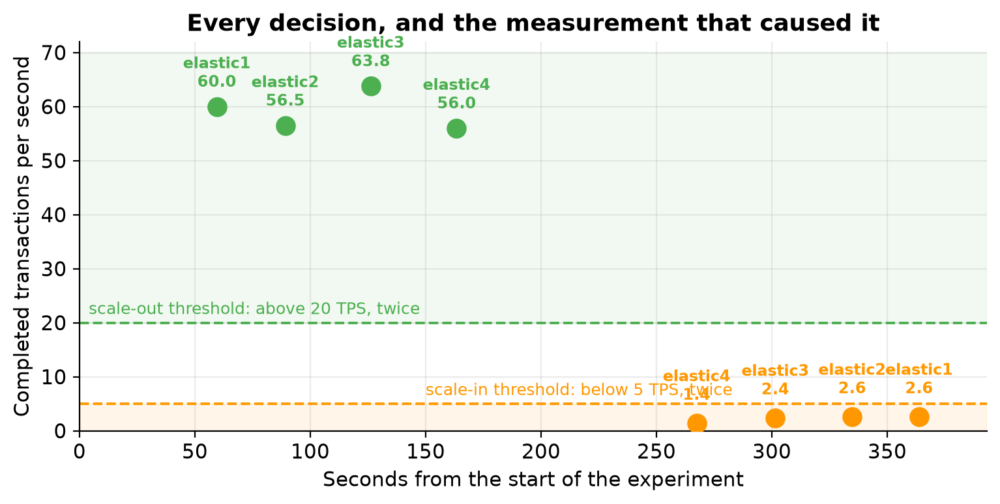

Every scale-out decision was taken at between 56.0 and 63.8 measured TPS, comfortably above the threshold of 20. Every scale-in decision was taken at between 1.4 and 2.6, comfortably below 5. Nothing was borderline, which is what you want from a first demonstration: the thresholds were not being teased.

Note the gaps between actions. The cooldown is 15 seconds, but consecutive admissions are roughly 30 seconds apart, because after the cooldown the controller still needs two fresh consecutive samples before it will act again.

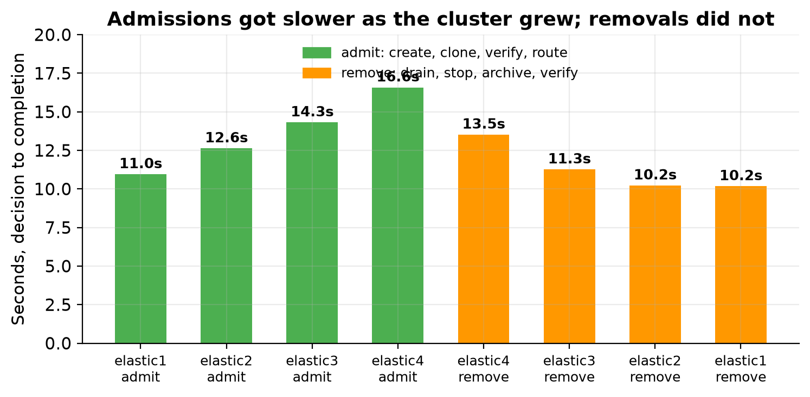

Admission time grew steadily with each replica: 10.957, then 12.633, then 14.317, then 16.582 seconds. That is a 51 percent increase from the first to the fourth. The likely explanation is contention: each new base backup reads from the same primary while more replicas stream from it, on one laptop, with the earlier phases' containers still running. Removals showed no such trend, staying between 10.178 and 13.525 seconds, which fits, because a removal does not copy any data.

### Watching the read traffic spread

As each replica is admitted, the round robin balancer starts including it. The animation below shows connections spreading across the read route as slots come into service and then leave again.

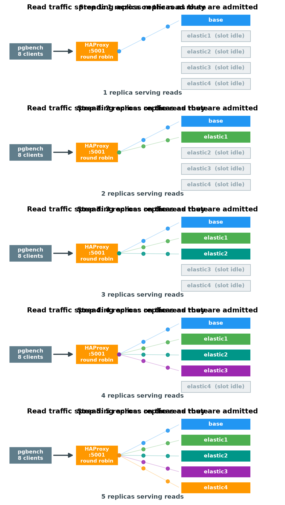

An animated version of this is provided as a separate file, `dataflow-scaleout.gif`, for use on the web. Word documents display only the first frame of an animated GIF, which is why the printed version above is a labelled sequence of stills instead.

---

## 15. Traffic and Latency

| Stage | Offered TPS | Complete records | Invalid | Observed span | Mean scheduled latency |
|---|---:|---:|---:|---:|---:|
| Low baseline | 2 | 52 | 0 | 17.175s | 23.874 ms |
| High | 100 | 10,182 | 0 | 193.153s | 2,210.003 ms |
| Low final | 2 | 364 | 0 | 132.991s | 33.197 ms |
| **Total** | | **10,598** | **0** | | |

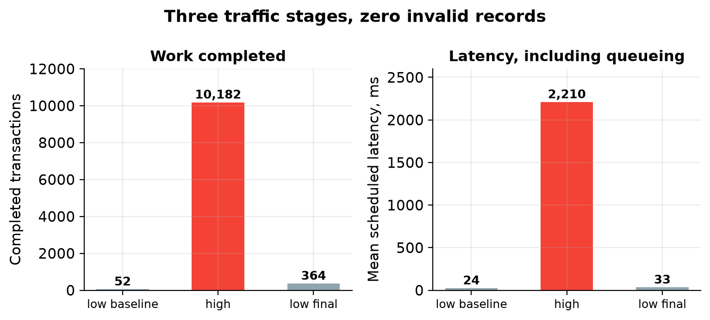

**The high stage latency needs an honest reading.** A mean of 2,210 milliseconds looks alarming next to 23.9 at low load, and it is not a measure of how long the database took to answer. It is pgbench's scheduled latency, which includes the time a transaction sat waiting for its slot in the offered rate schedule. Ask for 100 transactions per second from eight clients that reconnect every time, on a laptop already running several other clusters, and the schedule falls behind. The queueing shows up in this number.

So the honest summary is that the offered rate of 100 was not achieved, the measured rate settled around 56 to 64, and the latency figure mostly reflects the resulting backlog.

**What this does not show is that adding replicas increased capacity.** Nobody measured a before and after at a fixed load. The experiment demonstrates that the lifecycle works and that routing follows, not that throughput improved.

Zero invalid records across 10,598 transactions, and zero client error signatures, is the more meaningful result. All three traffic containers exited 0.

---

## 16. Where the Connections Went

At the steady state with all four elastic replicas active, cumulative connections on the read route were:

| Slot | Connections | Status | Connection errors | Response errors |
|---|---:|---|---:|---:|
| base | 4,050 | UP | 0 | 0 |
| elastic1 | 2,581 | UP | 0 | 0 |
| elastic2 | 1,738 | UP | 0 | 0 |
| elastic3 | 1,074 | UP | 0 | 0 |
| elastic4 | 606 | UP | 0 | 0 |

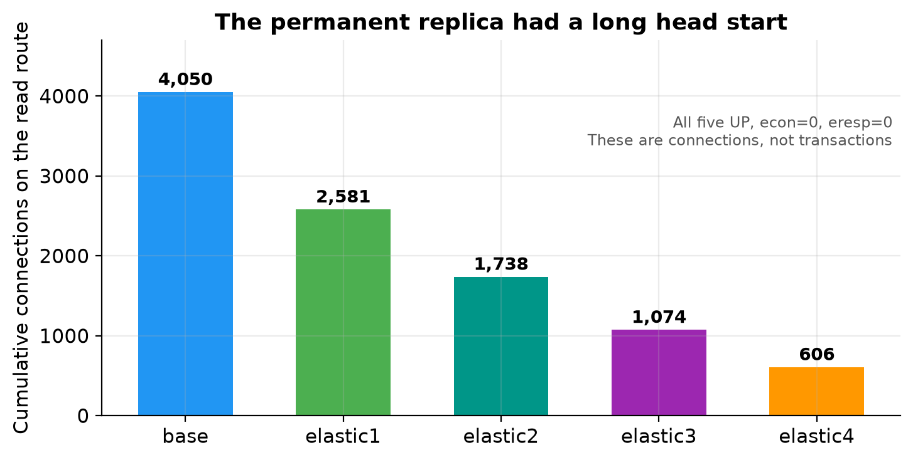

The descending pattern is exactly what you would expect and is worth explaining, because at first glance it looks like the balancing is unfair.

These are **cumulative** counters, not a rate. The permanent replica was serving from the first second. elastic1 joined at 70 seconds, elastic2 at 102, elastic3 at 141, elastic4 at 180. Each one had less time in service than the one before it, so each accumulated fewer connections. Round robin was dividing new connections evenly; the totals differ because the nodes started at different times.

The zeros in the last two columns are the important part. No connection errors and no response errors on any slot, including the four that were created while traffic was flowing and later drained while traffic was still flowing.

---

## 17. Proving No Data Moved or Vanished

Three separate mechanisms establish this.

**Fixture equality.** Every node was asked for a count and a content hash over all 100,000 rows in a fixed order. The primary and the permanent replica both reported 100,000 rows and the hash `0f42f18a2baad7f892d29c774a09d284`. Every elastic replica had to match that hash before admission and again before removal.

**Token completeness.** The controller wrote 54 idempotent tokens through the primary route over the course of the run. Before any replica was removed, and again at final validation, every active replica had to contain **exactly** the primary's complete token set. Not a superset, not a subset.

**Volume retention.** Each removal verified two things separately: that the container was gone, and that its named volume still existed. All four volumes were confirmed present.

The snapshot routine also refuses to proceed if the primary itself has changed underneath it. It rechecks that the primary is still not in recovery, still holds 100,000 rows, still matches the fixture hash, and contains exactly the expected token list. If any of that has drifted, the run fails rather than reporting success against a moved goalpost.

---

## 18. Evidence and Independent Verification

| Measure | Value |
|---|---|
| Docker commands recorded | 794 |
| Commands with a nonzero exit | 18, all retained |
| Command timeouts | 0 |
| Files in the evidence manifest | 144 |
| Bytes verified | 53,572,758 |
| Manifest SHA-256 | `B875BCEB...9F35B38A` |
| Unmanifested extra files found | None |

Every command is recorded with its timestamp, its exact argument list, its standard input, its standard output, its standard error, its exit code, a timeout flag and its duration. Standard output and error are read concurrently, which avoids the pipe deadlock that otherwise happens when a command produces a lot of output.

### The eighteen nonzero commands

This is the part I find most reassuring, because failures were not hidden by being retried until they looked clean:

| Count | What | Why it is expected |
|---|---|---|
| 6 | Patroni REST probes refused | The API is not listening yet in the first seconds of a node's life |
| 4 | Container inspect immediately after removal | Confirming absence, which requires the command to fail |
| 4 | Container inspect during archive inventory | Same, later |
| 4 | Container inspect during final inventory | Same, at the end |

A readiness probe that fails while a node starts up is a normal event, and recording it as such is more honest than sanitising it.

### Live verification, after the fact

An independent verifier ran at 17:41:36 UTC against the completed evidence, checking every manifest hash and length, scanning for credential patterns, rechecking that the recorded actions actually satisfied the stated thresholds, and confirming the drain and maintenance events. It also inspected the live system. Fourteen live commands, all exit 0:

```
{"replica" : false, "rows" : 100000, "events" : 54}     -- the primary
{"replica" : true,  "rows" : 100000, "events" : 54}     -- the permanent replica
```

Both nodes independently reconfirmed the row count, the token count and their expected roles. The primary, permanent replica, etcd and proxy were all still running. All four elastic volumes were confirmed retained. All three traffic containers had exited 0.

### On credentials

Lab passwords are generated randomly per run and exist only in process memory and Docker container metadata. Every evidence file has exact password values replaced, including inside copied SQL logs, and no rendered password bearing configuration is ever copied into evidence. The verifier separately confirmed no credential shaped strings remained.

That said, the documentation is direct about the limits: anyone with Docker or host access can retrieve credentials from container metadata, and the retained database volumes sit outside the redaction boundary. This is an evidence hygiene measure, not a secret management design.

---

## 19. The Three Runs That Failed First

This section exists because the failures are more instructive than the success, and because they were preserved rather than quietly deleted.

| Attempt | What happened | The fix |
|---|---|---|
| `...172223670-814f618f` | Primary and permanent replica started, but HAProxy rejected its configuration because the captured copy was missing a final line feed. No replica was ever admitted. | Normalise captured source and configuration to end with a line feed. |
| `...172330223-7440cd0b` | Traffic ran, elastic1 was created and became ready, and then the runner rejected HAProxy's **positive** acknowledgement of the address change. Zero admissions recorded. | Accept the exact expected success response, while still rejecting anything unexpected. |
| `...172559675-6d1659c7` | The runner completed all four admissions and all four removals and flagged itself successful. Independent validation then **rejected it**, because killing pgbench directly had left transaction log tails truncated. | Replace direct termination with bounded batches that flush, and require the traffic container to exit 0. |
| `...173358240-1efd4a87` | Four admissions, four removals, complete transaction logs, all manifest, data and live checks passed. | This is the run reported above. |

The third attempt is the one worth dwelling on. **The runner said it succeeded and it had not.** All eight lifecycle actions completed correctly, but the evidence was incomplete, and only a separate verifier looking at the raw artifacts caught it. Had the runner been the only judge of its own work, that run would have been written up as a success.

There is a fourth failure recorded, and it is of the same species. The first attempt to verify the final run crashed on a strict mode bug in the verifier's own regular expression handling. The verifier was fixed and rerun **against unchanged raw evidence**, which is the only way that correction is legitimate. Fixing the verifier and rerunning the experiment would have proved nothing.

The general lesson is one this series keeps arriving at from different directions: the thing that produces the work cannot be the only thing that judges it.

---

## 20. What This Does Not Prove

The documentation is unusually candid about its own limits, and those limits are worth restating rather than glossing.

**It is not a capacity result.** No fixed load was measured before and after adding replicas. Adding nodes was not shown to improve throughput or latency.

**The measurement method is demonstrative, not rigorous.** Samples use overlapping trailing windows, pgbench buffering can undercount recent completions at low rates, and the verbose logging that makes the evidence good also costs performance. There is deliberately no fallback to the offered rate, so a stalled driver fails the run instead of looking like idle demand.

**No failure was injected.** Unlike Phase 1, nothing was killed. The experiment expects the original primary to stay writable and aborts if its role changes. Automatic failover is not demonstrated here.

**Single points of failure remain.** One etcd, one proxy. HAProxy runtime state is not durable, so the slot addresses set at runtime would be lost if the proxy restarted.

**The controller is a demonstration.** It is synchronous, bounded to one up and down cycle and four slots. It has no restart or adoption logic, no concurrency control if two controllers ran at once, no reusable volume rejoin path, and no CPU or latency based policy.

**Replication slot cleanup was not captured.** Section 13 explains why an orphaned slot on the leader is the main hazard when a replica is removed. Patroni is configured to manage slots and the shutdowns were graceful, but no evidence snapshot records slot state before and after each removal.

**No node was rebuilt from a retained volume.** The four volumes survived and were verified, but the faster rejoin path they enable was never exercised.

**Resource accounting is shared.** Earlier retained stacks were still running during the verified run, so all timings include their influence.

**One consequence of the retention policy is worth planning for.** Every invocation creates a fresh isolated stack and nothing is cleaned up automatically, so repeated runs accumulate containers and volumes. The documentation warns specifically against using broad prune commands or Compose project labels to clean up, because some images inherit labels from the earlier phases. Clean up by exact run name or by the run label, and inspect before deleting.

---

## 21. Closing Notes

### The Kubernetes shaped conclusion

Doing this without an orchestrator was not hard, and that is the finding worth carrying away. Creating a database container is one command. Putting it into the load balancer is two. If elastic PostgreSQL felt like it needed Kubernetes, the reason was never the scheduling.

What is hard is the middle: getting a complete copy of the data onto the new node, and then establishing beyond doubt that it is a streaming replica with no lag holding byte identical content. **Patroni did the first part with no instruction beyond its own configuration, and the second part is the five condition gate.** Neither of those becomes easier on Kubernetes. A default readiness probe would have admitted a node the moment its port opened, which is exactly the mistake this design is built to avoid.

So the honest summary is that Kubernetes would have given this experiment a scheduler, a declarative replica count and a reconciliation loop that survives the controller dying. Those are real benefits and this lab has none of them. What Kubernetes would **not** have given it is any idea of what a healthy PostgreSQL replica looks like. That has to come from Patroni either way, which is why the serious Kubernetes operators for PostgreSQL are mostly Patroni with a control loop wrapped around it.

If you want the same behaviour in production, the question to ask is not whether to use Kubernetes. It is which component owns the readiness decision, and whether it is asking the database or just checking a port.

### Seven more things worth taking from this

**Elasticity is not something Patroni gives you.** Patroni decides who leads and how to build a replica. It has no notion of demand and will never add a node because the system is busy. The scaling decision was a separate component that had to be written, and it is the one part of this system with no fault tolerance at all.

**A controller should only believe what it measures.** Giving this one no stage label and no offered rate is what makes the result meaningful. It could not scale out because it knew scale-out came next, because it did not know.

**Running is not ready.** Five separate conditions had to hold simultaneously before a node received a single connection: Patroni role and state, the nofailover tag, streaming membership in the primary's own view, a numeric zero lag, and a content hash matching the primary. Any monitoring that treats a started container as a healthy backend is guessing.

**Unknown is not zero.** The refusal to coerce a missing lag value into zero is a small piece of code with a large effect. It is the difference between confirming health and assuming it.

**Scaling in removes a copy, not the data.** The container goes, the volume stays, and the real hazard is the replication slot left behind on the leader, which quietly stops WAL from being recycled until the primary fills its disk.

**Removal deserves more care than creation.** Thirteen steps, two safety checks at different moments, drain before maintenance, archive before removal, and explicit verification that the volume survived. A failed admission wastes a container. A careless removal loses data.

**The runner cannot be the only judge.** One attempt reported success with incomplete evidence, and only an independent verifier reading the raw artifacts caught it.

### What I would want next

The obvious gap is that Phase 1 killed a primary and Phase 4 does not. Combining them, so that a primary fails while the scaler is mid admission, is the interesting and uncomfortable test. The current controller explicitly aborts on a primary role change, so that experiment needs a different design rather than a longer run.

After that, the honest capacity question: hold a fixed offered load, measure completed throughput and latency at two replicas, then at six, and find out whether the extra nodes actually bought anything for this workload. That is the measurement this run deliberately did not claim to have made.
