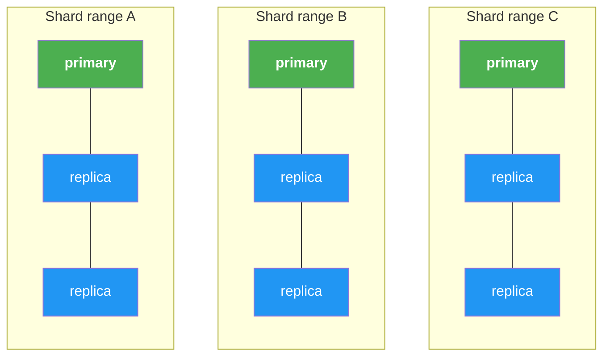
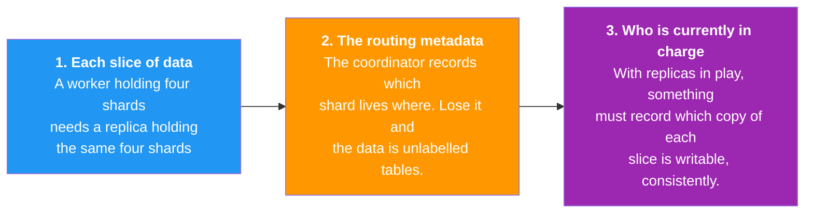
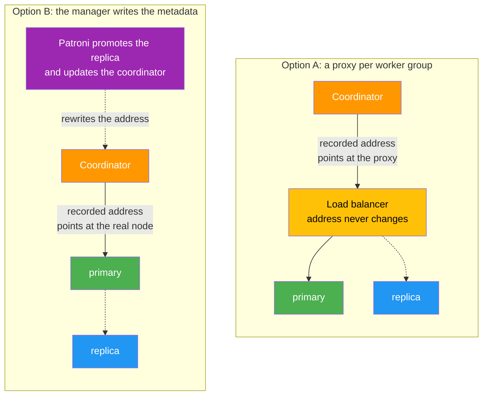
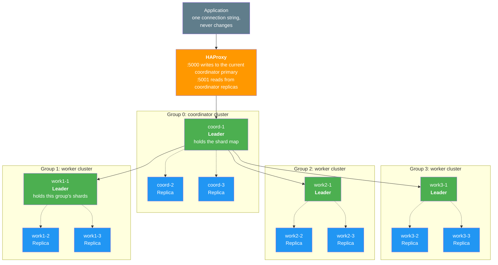
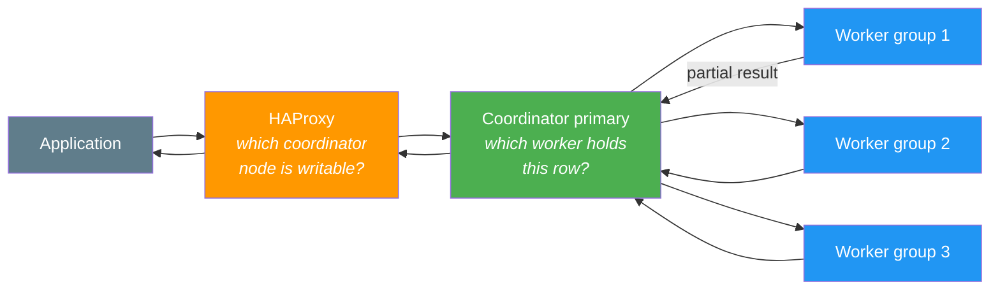
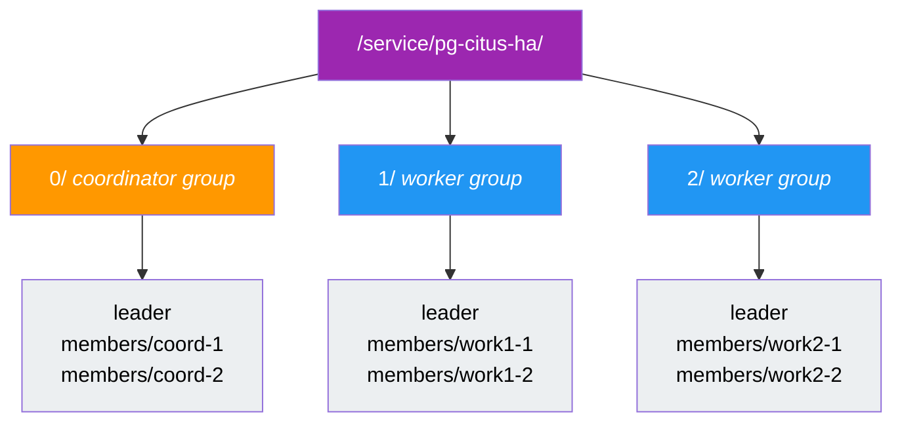
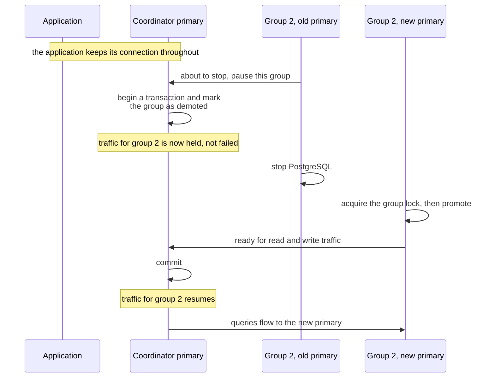
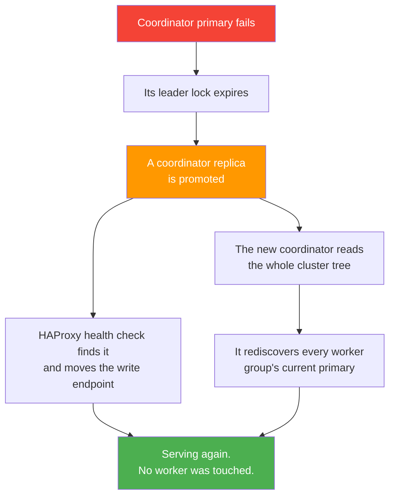
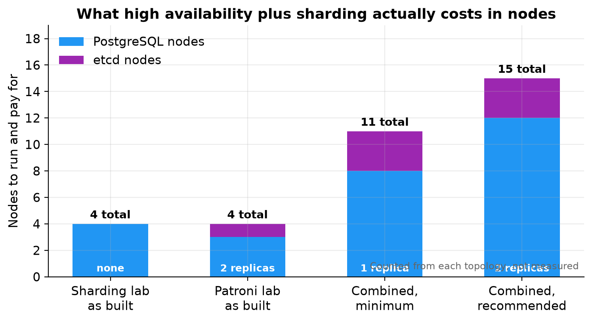

# High Availability for a Sharded PostgreSQL Cluster

## Using Patroni to make a Citus cluster survive losing a node

A sharded database spreads rows across machines so that no single machine has to hold everything. That solves scale. It does nothing at all for availability, and in fact makes it worse: where you once had one server to lose, you now have several, and losing any one of them takes away the slice of data it was holding.

This article is about closing that gap with Patroni, so the cluster both spreads its data and survives node loss.

### What is designed here and what is measured

The two component pieces were built and tested separately. A three node Patroni cluster was broken on purpose and recovered on its own in about 34 seconds. A Citus cluster had a worker added and its shards rebalanced with no downtime and no rows lost. Figures from those runs are quoted below and are measured.

**The combined architecture described here has not been built or measured.** It is a design, assembled from the behaviour observed in those two labs and from the documented behaviour of Patroni's Citus support. Where a number appears, the text says where it came from. Nothing here should be read as a measured result of the combined design.

---

## Table of Contents

1. [The Two Axes](#1-the-two-axes)
2. [What Has to Be Protected](#2-what-has-to-be-protected)
3. [The One New Problem](#3-the-one-new-problem)
4. [How Patroni Models a Sharded Cluster](#4-how-patroni-models-a-sharded-cluster)
5. [The Architecture](#5-the-architecture)
6. [Where the Cluster State Lives](#6-where-the-cluster-state-lives)
7. [What Patroni Sets Up For You](#7-what-patroni-sets-up-for-you)
8. [What You Have to Get Right](#8-what-you-have-to-get-right)
9. [Losing a Worker](#9-losing-a-worker)
10. [Losing the Coordinator](#10-losing-the-coordinator)
11. [What It Costs](#11-what-it-costs)
12. [Operating It](#12-operating-it)
13. [Closing Notes](#13-closing-notes)

---

## 1. The Two Axes

Sharding and replication solve different problems, and the clearest way to see it is as a grid. Sharding divides the data sideways. Replication stacks copies underneath each division.



Sharding divides the data left to right, into shard ranges. Replication stacks copies top to bottom, within each range.

A sharded cluster with no replication is the top row on its own. Every column is a single point of failure. A replicated cluster with no sharding is one column on its own: it survives losing a node but can only ever hold what one machine holds.

Neither is a subset of the other, which is the point. Having one gives you no progress towards the other.

| Capability | Replication alone | Sharding alone | Both |
|---|---|---|---|
| Survive losing a node | Yes | No | Yes |
| Hold more than one machine's data | No | Yes | Yes |
| Spread write load | No | Yes | Yes |
| Stable address for the application | Yes | Only a fragile one | Yes |
| Add capacity while running | No | Yes | Yes |

---

## 2. What Has to Be Protected

Three things, and it is worth separating them because they are protected differently.



The first two are solved the same way: run each of them as its own replicated cluster. A worker becomes a small Patroni cluster. The coordinator becomes another.

The coordinator is the one people skip, because it holds no table data and feels unimportant. It is the opposite. It is the only entry point and it holds the shard map, so losing it takes down the whole cluster even though every row is safe on the workers. Replicating it is the single most valuable change you can make, and it is cheap precisely because it stores no data.

The third item is the interesting one, and Section 3 is about it.

---

## 3. The One New Problem

The coordinator records the address of each worker. Replicating a worker means that address can change, because a promotion makes a different machine the writable one.

So every combined design has to answer one question: **when a worker's primary changes, how does the coordinator find out?**

There are two established answers. Both work, and they differ in where the indirection sits.



**Option A** puts a load balancer in front of each worker group and records the proxy address. When the primary changes, the proxy follows it and the coordinator never notices. The appeal is that it reuses exactly the pattern the Patroni lab already proved.

**Option B** removes the proxy and has the thing that performs the failover also update the metadata. Patroni is what promotes the replica, so it already knows the new address and can write it in.

| Consideration | Option A | Option B |
|---|---|---|
| Extra components per worker group | One load balancer | None |
| What the metadata records | A proxy address | The real primary address |
| Detection delay | Manager plus proxy health check | Manager only |
| Behaviour on planned switchover | Connections break | Traffic can be paused instead |
| Coupling between coordinator and workers | Loose | Shared cluster name and credentials |

Option A suits you if worker groups are run by different teams or tooling, or if you already operate a proxy tier. Option B suits you if you want fewer moving parts.

The rest of this article works through Option B, because it has fewer components to describe. Where something applies only to that route, the text says so.

---

## 4. How Patroni Models a Sharded Cluster

Patroni has supported Citus natively since version 3.0. The model is that a sharded formation is **a set of independent Patroni clusters sharing one cluster name**, distinguished by a group number. The coordinator is group 0. Workers are groups 1, 2, 3 and so on.

Configuration on each node is two lines:

```yaml
citus:
  group: 0        # 0 for the coordinator, 1, 2, 3 and so on for workers
  database: citus # must be identical on every node
```

The same values can be given as the environment variables `PATRONI_CITUS_GROUP` and `PATRONI_CITUS_DATABASE`.

That is the whole configuration. Everything else follows from it, and the important behaviour is this: **the coordinator's primary discovers each worker group's current primary and registers it in the shard map itself, then keeps doing so as groups fail over.**

That is what removes the need for a proxy in front of the workers. The metadata is maintained by the thing that performs the failover.

Two version requirements come with it. Citus 10.0 is the minimum, and 11.2 or later is recommended, because the near transparent switchover in Section 9 depends on it.

---

## 5. The Architecture

A three node coordinator group and three worker groups of three. This is the shape to aim for rather than the minimum.



Solid arrows are query traffic, dotted arrows are streaming replication inside a group. Every one of those twelve nodes runs its own Patroni process, and all of them talk to the same consensus store, which is left out here and shown in Section 6.

There is no load balancer in front of any worker group, because this is the Option B route. If you take Option A, add one per group between the coordinator and that group's nodes and everything else stays the same. Either way the proxy in front of the coordinator stays, because that is the one place an external client needs an address that never changes.

### Two levels of routing



The two layers answer different questions and neither knows about the other. HAProxy uses the Patroni health endpoint, exactly as measured in the Patroni lab. The coordinator uses the hash of the distribution column, exactly as measured in the sharding lab. Keeping them distinct is what makes the design tractable.

---

## 6. Where the Cluster State Lives

The grouping is visible in the key layout, and understanding it makes the failure behaviour obvious.



Three things follow.

**Every group has its own leader lock.** Group 1 electing a new leader has no effect on group 2, because those are different keys. Failures are contained to a group.

**One recursive read fetches the whole formation.** This is why the hierarchy exists. The coordinator needs every group's current primary and can get it in a single request.

**Reads are asymmetric.** Only coordinator nodes read the whole tree, because only they need to discover workers. A worker reads its own subtree. Adding groups therefore does not multiply consensus traffic the way it might appear.

---

## 7. What Patroni Sets Up For You

Once the group setting is present, Patroni does all of this without being asked, which removes most of the manual setup a plain Citus cluster needs.

| What it does | Why it matters |
|---|---|
| Adds the Citus library to the preload list | Otherwise the extension does not function |
| Creates the database and the extension | Otherwise this is a script looping over every node |
| Sets prepared transactions to twice the connection limit | This defaults to zero and makes the rebalancer fail with an unclear error |
| Sets synchronous replication to quorum mode | Changes the durability guarantee, discussed below |
| Corrects the local hostname setting | The default assumes localhost, which is often wrong |
| Writes the superuser credentials into the cross node authentication table | This is what lets nodes authenticate to each other |
| Registers each worker group's primary in the shard map | Replaces manual node registration entirely |
| Keeps the shard map correct across every failover | This is the whole point of the design |

Two of those defaults deserve attention.

**Quorum synchronous replication is a real change.** The Patroni lab ran asynchronous replication, which is why its results note that a transaction committed in the final milliseconds before a crash can be lost. Quorum mode means a commit is not acknowledged until enough replicas confirm it. That is a stronger guarantee and it costs write latency. This article cannot quote a number, because it was never measured and it depends heavily on the network between nodes. It is the first thing to measure in a real deployment.

**The prepared transactions default closes a real trap.** The sharding lab hit this: the setting defaults to zero, Citus needs it for two phase commit during shard moves, and the error does not obviously point at the cause.

---

## 8. What You Have to Get Right

Four things are your responsibility, and getting any of them wrong produces confusing failures rather than clear ones.

**The cluster name must be identical on every node.** Coordinator and workers share one name, and the group number distinguishes them. Giving a worker its own name produces a separate cluster that the coordinator will never discover, and nothing reports an error.

**The extension must be installed on every node**, including replicas that will never serve a query until promoted. A replica missing it is a promotion that fails at the worst possible moment.

**Superuser credentials must match across all nodes, and host based authentication must permit access between them.** This is how cross node queries authenticate. Those credentials get written into the cross node authentication table, so rotating the password later means updating that table too. A rotation that misses it breaks cross node communication at some later, apparently unrelated moment.

**The Patroni API must be reachable from workers to the coordinator.** Worker nodes notify the coordinator during a switchover, and that is the mechanism that makes the switch nearly transparent. If a firewall blocks it the cluster still works, but you quietly lose the transparency and get the abrupt behaviour instead.

That last one passes every test in a lab, where everything sits on one network, and then fails in a production environment with real segmentation. Verify it explicitly.

---

## 9. Losing a Worker

A worker group losing its primary is the failure this whole architecture exists to handle. The planned and unplanned cases behave very differently.

### A planned switchover

The coordinator can hold traffic destined for one worker group while that group changes primary, then release it.



The sequence is from the worked example in the Patroni documentation, where the pause lasted a little under three seconds. **That is their figure from their environment, not a measurement of this design.** Your own depends on how long the old primary takes to stop and the new one to promote.

The important word is *paused*, not *failed*. Queries that would have gone to that group wait rather than erroring. Contrast that with the Patroni lab, where a failover broke every open connection and the application had to retry.

This matters because most primary changes in a healthy system are planned ones: patching, resizing, moving a node between hosts. If your maintenance windows are frequent, it is worth weighing when choosing between the two routes.

### An unplanned failure

That transparency depends on the old primary being able to announce its intent. A machine that loses power announces nothing.

Then the sequence is the familiar one from the Patroni lab. The group's lock stops being renewed, expires, the surviving replicas compete, one is promoted, and the shard map is updated so the coordinator learns the new address. Queries in flight to the dead worker fail and must be retried.

The Patroni lab measured about 34 seconds for that cycle with a 30 second lock timeout, and established a more useful lesson: **the delay is not fixed.** The lock expires 30 seconds after its **last renewal**, not 30 seconds after the failure, so where in the renewal cycle the machine died changes the answer. In that run the lock had about 25 seconds left when the node stopped.

The tuning trade-off carries over and now applies per group. A shorter timeout speeds every group's recovery and raises the chance that a transient network problem is mistaken for a dead worker. A false failover on a worker group is a real outage for the shards it holds.

---

## 10. Losing the Coordinator

The coordinator group is an ordinary Patroni cluster, so it behaves exactly as measured in the Patroni lab.



Two things worth drawing out.

**The workers are unaffected.** They keep their data and their locks. The coordinator holds metadata, not table data, so what is being recovered is the map rather than the territory.

**The new coordinator rebuilds its view from the consensus store.** It reads the tree, finds each group's primary and reconciles the shard map. This is the same discovery it does at startup, which is why the recovery needs no special handling.

---

## 11. What It Costs



Counted from the topology rather than measured:

| Topology | PostgreSQL nodes | Consensus nodes | Total |
|---|---|---|---|
| Sharded, no replication | 4 | 0 | 4 |
| Replicated, no sharding | 3 | 1 | 4 |
| Both, minimum | 8 | 3 | 11 |
| Both, recommended | 12 | 3 | 15 |

The multiplication is in the workers and cannot be avoided, because every group needs its own replicas. Adding a shard group later adds a whole group, not a node.

Two nodes per group tolerates one failure, and while that failure is unrepaired the group has no redundancy at all. The Patroni lab showed this exactly: after its failover and before the old primary rejoined, it ran for about seven minutes with a primary and a single replica, which is a working cluster with nothing left to fall back on. Three per group gives you room to lose one and still be safe.

---

## 12. Operating It

The day to day experience changes in one important way: **the coordinator and each worker group are separate clusters** and cannot generally be managed as one thing.

The Patroni command line reflects this. Listing the cluster shows every group at once with a group column, so one command gives the whole picture. Most other commands need to be told which group they apply to, and switchover and member removal require it explicitly, because doing either to the wrong group would be an unpleasant surprise.

The pattern to internalise is **one view, many control surfaces**. You can see everything in one place, and you act on one group at a time.

A few consequences worth planning for.

**Rebalancing and failover should not overlap.** A rebalance moves data using logical replication and takes a lock at cutover, while a failover changes which node is primary underneath it. The sharding lab established that a worker failing during a rebalance causes the rebalance to abort with the shard left on the source and no data lost, which is the safe outcome. Even so, running a long rebalance when failovers are likely invites aborted work. Prefer the background form of the rebalance so the job is not tied to your session.

**Adding capacity is now two steps.** Provision a whole new group, let the coordinator discover it, then rebalance. The rebalance itself is unchanged: the sharding lab measured four of twelve shard groups moving with no rows lost and no downtime.

**Major version upgrades are per group.** Each cluster is upgraded independently, so an upgrade becomes a sequence of operations rather than one. Restarts should go through Patroni rather than the service manager, so it does not interpret the restart as a failure.

**Failure is no longer all or nothing.** Three groups healthy and one unavailable means queries touching the missing group's shards fail while queries confined to other groups succeed. A point lookup for one customer may work while an aggregate across all customers does not. Monitoring and application code both need to handle partial availability.

---

## 13. Closing Notes

**The building block is a group, not a node.** A sharded, highly available cluster is a set of independent replicated clusters: one for the coordinator and one per shard range. Thinking in groups makes the failure behaviour, the node count and the operational model all easier to reason about.

**Keeping the routing metadata correct is the central problem.** Everything else is two familiar mechanisms side by side. The one genuinely new question is how the coordinator learns that a worker group has a new primary, and the two answers are a proxy per group or a manager that writes the metadata itself. Pick one deliberately.

**Replicate the coordinator.** It holds no table data, which is exactly why it gets forgotten, and it is the one failure that takes down everything.

**Planned and unplanned failures differ a lot.** A deliberate switchover can pause traffic rather than break it, making routine maintenance nearly invisible. An abrupt loss still costs a lock timeout and broken connections. Designing maintenance to use the first path is a real operational win.

**Sharding and high availability stay separate concerns even when combined.** One layer answers which coordinator is writable, the other answers which worker holds a row, and neither knows about the other.

### Being honest about this

This is a design grounded in two tested labs and in documented behaviour, not a tested architecture. No cluster was built and no timing was captured. The one figure quoted for combined behaviour, the sub three second switchover pause, comes from published documentation rather than any run of ours.

The two most likely places for reality to differ are the write latency under quorum synchronous replication, which depends entirely on the network between nodes, and the behaviour when a coordinator failover and a worker failover overlap. Both deserve measuring before anyone depends on this.

### Where to start

Build the coordinator group first and confirm it elects a leader. Then add a single worker group and check that the coordinator discovers it with no manual registration. That is the step that proves the whole design works. If the shard map populates itself, everything else is repetition. If it does not, the usual causes are a mismatched cluster name, missing credentials, or a blocked path from worker to coordinator.
