# PostgreSQL + Patroni HA — Complete Guide

## From Empty Docker Desktop to Working Failover-Tested PostgreSQL HA Cluster

This document covers every step from initial setup through failover testing, old primary recovery, and final validation. All timestamps, log excerpts, and test results come from an actual test run performed on 29 August 2026.

---

## Table of Contents

1. [Overview](#1-overview)
2. [Architecture](#2-architecture)
3. [Prerequisites](#3-prerequisites)
4. [Component Versions](#4-component-versions)
5. [Project Structure](#5-project-structure)
6. [Environment Configuration](#6-environment-configuration)
7. [Configuration Deep Dive](#7-configuration-deep-dive)
8. [Cluster Initialization](#8-cluster-initialization)
9. [Database Setup](#9-database-setup)
10. [Replication Validation](#10-replication-validation)
11. [Pre-Failover Cluster Snapshot](#11-pre-failover-cluster-snapshot)
12. [Failover Test](#12-failover-test)
13. [Failover Event Timeline](#13-failover-event-timeline)
14. [Post-Failover Verification](#14-post-failover-verification)
15. [Old Primary Recovery](#15-old-primary-recovery)
16. [Replica Failure Test](#16-replica-failure-test)
17. [Final Cluster State](#17-final-cluster-state)
18. [Connection Path Explained](#18-connection-path-explained)
19. [Failover Internals](#19-failover-internals)
20. [Existing Connections During Failover](#20-existing-connections-during-failover)
21. [Troubleshooting](#21-troubleshooting)
22. [Cleanup](#22-cleanup)
23. [Production Considerations](#23-production-considerations)
24. [Frequently Asked Questions](#24-frequently-asked-questions)

---

## 1. Overview

This project builds a PostgreSQL High Availability environment using four components:

- **PostgreSQL 16.4** — the database engine.
- **Patroni 3.3.2** — the HA manager that controls PostgreSQL, handles leader election, promotion, demotion, and replica management.
- **etcd 3.5.15** — the distributed configuration store (DCS) where Patroni maintains the leader lock and cluster state.
- **HAProxy 2.9** — the load balancer that provides a stable client endpoint, routing connections to whichever PostgreSQL node is currently the primary.

The environment runs entirely on Docker Desktop using Docker Compose. It is a laboratory setup intended for learning and testing. The single-node etcd and the lack of host-level redundancy make it unsuitable for production as-is.

---

## 2. Architecture

This section covers the full architecture — components, ports, communication paths, and how they fit together. Worth reading through before jumping into configuration or operations.

---

### 2.1 The Problem This Architecture Solves

A single PostgreSQL server is a single point of failure. If it crashes, the database is unavailable until someone manually restarts it, and any writes that were not flushed to disk may be lost. There is no automatic recovery.

This architecture eliminates that single point of failure. Multiple copies of the database stay in sync. If the primary goes down, one of the copies takes over automatically — no manual intervention, no connection string changes on the application side.

There are four distinct problems to solve:

1. **Data redundancy**: Keep multiple copies of the data in sync (PostgreSQL streaming replication).
2. **Failure detection and leader election**: Detect when the primary is down and decide which replica should take over (Patroni + etcd).
3. **Automated promotion**: Actually promote the chosen replica to become the new primary (Patroni).
4. **Connection routing**: Route application traffic to whichever node is currently the primary, without the application needing to know (HAProxy).

Each component handles one of these problems. There is no overlap.

---

### 2.2 Component Overview

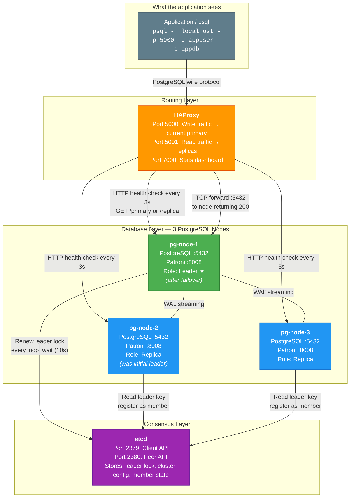

---

### 2.3 Detailed Component Descriptions

#### 2.3.1 PostgreSQL — The Database Engine

PostgreSQL is the database itself — tables, indexes, data, SQL processing, transactions, constraints, ACID. It runs on all three nodes, but only one node is writable at any given time (the primary). The other two are read-only replicas.

**What PostgreSQL does in this setup:**

- Stores all application data (customers, orders, ha_test tables).
- Processes SQL queries from the application.
- Maintains the Write-Ahead Log (WAL) — a sequential record of every change made to the database.
- Ships WAL records to replicas via streaming replication. This is how replicas stay in sync.
- On replicas, replays incoming WAL records to apply changes made on the primary.
- Supports `hot_standby` mode, meaning replicas can serve read-only queries while receiving replication data.

**What PostgreSQL does NOT do:**

- PostgreSQL does not decide who is the primary. It has no awareness of the cluster topology.
- PostgreSQL does not perform automatic failover. If the primary crashes, PostgreSQL on the replicas just keeps waiting for more WAL data. It does not promote itself.
- PostgreSQL does not route connections. It listens on port 5432 and serves whatever connects to it.

**Ports:**
| Port | Protocol | Purpose |
|------|----------|---------|
| 5432 | PostgreSQL wire protocol (TCP) | Database connections |

**Key PostgreSQL concepts in this architecture:**

- **WAL (Write-Ahead Log)**: Every INSERT, UPDATE, DELETE, and DDL change is first written to the WAL before being applied to the data files. This log is the basis for replication — replicas receive and replay the same WAL records.
- **Timeline**: A counter that increments every time a replica is promoted to primary. Timeline 1 means the original primary. Timeline 2 means a promotion occurred. This test went from timeline 1 to timeline 2 during failover.
- **LSN (Log Sequence Number)**: A pointer into the WAL stream. Comparing sent_lsn, write_lsn, flush_lsn, and replay_lsn between primary and replica reveals replication lag.
- **pg_is_in_recovery()**: Returns `true` on replicas, `false` on the primary. This is how you programmatically verify a node's role.
- **pg_stat_replication**: A system view on the primary that shows every connected replica, its state, and how far behind it is.
- **pg_rewind**: A tool that can "rewind" a former primary's data directory to a point before it diverged from the current primary. This allows a failed primary to rejoin as a replica without a full base backup.

---

#### 2.3.2 Patroni — The HA Manager

Patroni is a Python daemon that runs alongside PostgreSQL on every node. It does not store data and does not process SQL. Its job is managing the PostgreSQL instances — starting them, stopping them, promoting, demoting, and coordinating everything through etcd.

**What Patroni does:**

- **Initial bootstrap**: When the cluster starts for the first time, one Patroni instance wins a lock in etcd and runs `initdb` to create the PostgreSQL data directory. The other instances detect that a leader exists and run `pg_basebackup` to clone the leader's data, then start PostgreSQL in replica mode.
- **Leader lock management**: The current leader must renew its lock in etcd every `loop_wait` (10 seconds). If it fails to renew before the TTL (30 seconds) expires, the lock becomes available for other nodes.
- **Health monitoring**: Patroni continuously monitors the local PostgreSQL process. If PostgreSQL crashes, Patroni attempts to restart it. If it cannot restart, it releases the leader lock.
- **Failover / Election**: When the leader lock expires, surviving Patroni instances compete to acquire it. The winner promotes its local PostgreSQL from replica to primary using `pg_ctl promote`.
- **Demotion and recovery**: When a former primary comes back online, Patroni detects that another node holds the leader lock. It uses `pg_rewind` to resynchronize the local data directory, then starts PostgreSQL as a replica following the new leader.
- **REST API**: Patroni exposes an HTTP API on port 8008 that reports the node's current role. HAProxy uses this API for health checking.
- **Configuration management**: Patroni manages PostgreSQL's `postgresql.conf`, `pg_hba.conf`, and `recovery.conf` / `standby.signal`. You do not manually edit these files — Patroni writes them.

**What Patroni does NOT do:**

- Patroni does not store application data. It is a management process, not a database.
- Patroni does not route connections. Applications do not connect to Patroni.
- Patroni does not provide distributed consensus itself. It relies on etcd for that.

**Ports:**
| Port | Protocol | Purpose |
|------|----------|---------|
| 8008 | HTTP (REST API) | Health check endpoint for HAProxy, cluster status |

**Key Patroni REST API endpoints:**

| Endpoint | Returns 200 when... | Returns 503 when... | Used by |
|----------|---------------------|---------------------|---------|
| `GET /primary` | This node is the primary | This node is a replica | HAProxy `pg-primary` backend |
| `GET /replica` | This node is a replica | This node is the primary | HAProxy `pg-replicas` backend |
| `GET /health` | PostgreSQL is running and healthy | PostgreSQL is down | Docker health check |
| `GET /patroni` | Always (returns full node state as JSON) | — | Diagnostics |

**Key Patroni configuration parameters:**

| Parameter | Value | Description |
|-----------|-------|-------------|
| `scope` | `pg-ha-cluster` | Cluster name. All Patroni instances with the same scope belong to the same cluster. |
| `name` | `pg-node-1` / `pg-node-2` / `pg-node-3` | Unique identifier for each node within the cluster. Must be different on every node. |
| `ttl` | 30 seconds | How long the leader lock is valid. If the leader fails to renew within this window, the lock expires and other nodes can compete for it. Lower values mean faster failover but higher risk of false failovers. |
| `loop_wait` | 10 seconds | How often Patroni's main loop runs. Each cycle, Patroni checks PostgreSQL health, renews the leader lock (if leader), and checks the DCS for state changes. |
| `retry_timeout` | 10 seconds | How long Patroni retries DCS and PostgreSQL operations before giving up. |
| `maximum_lag_on_failover` | 1048576 (1 MB) | A replica must be within this many bytes of the primary's WAL position to be eligible for promotion. Prevents promoting a severely lagging replica that would lose data. |
| `use_pg_rewind` | true | When a former primary rejoins, use `pg_rewind` to resynchronize it instead of requiring a full `pg_basebackup`. Much faster recovery. |
| `use_slots` | true | Use PostgreSQL replication slots. Slots prevent the primary from discarding WAL segments that a replica still needs, even if the replica is temporarily disconnected. |

---

#### 2.3.3 etcd — The Distributed Configuration Store (DCS)

etcd is a distributed key-value store with strong consistency guarantees. In this setup, etcd answers one critical question: **who is the leader?**

Patroni nodes do not talk to each other directly to elect a leader. They all talk to etcd instead. etcd's atomic compare-and-swap operations guarantee that only one node can hold the leader lock at any given time.

**What etcd stores for Patroni:**

| Key (under `/service/pg-ha-cluster/`) | Content | Purpose |
|----------------------------------------|---------|---------|
| `leader` | Node name of current leader (e.g., `pg-node-1`) | The leader lock. Whoever created this key is the primary. Expires after TTL. |
| `initialize` | Cluster initialization token | Prevents multiple nodes from running `initdb` simultaneously during first bootstrap. |
| `config` | Cluster-wide PostgreSQL configuration | Patroni stores shared config here so all nodes use the same settings. |
| `members/pg-node-1` | JSON with node's connection info, state, timeline, LSN | Each node registers itself so other nodes know how to reach it. |
| `members/pg-node-2` | (same) | |
| `members/pg-node-3` | (same) | |

**How leader ownership works:**

1. When a Patroni node starts, it checks etcd for an existing leader key.
2. If no leader key exists (or it has expired), the node attempts to create one with its own name and a TTL of 30 seconds.
3. etcd guarantees that only one `create` will succeed (atomic operation). The node that succeeds becomes the leader.
4. The leader must renew the key before the TTL expires. It does this every `loop_wait` (10 seconds), giving it 3 chances (10s, 20s, 30s) before the key expires.
5. If the leader fails to renew (because it crashed, lost network, or PostgreSQL died), the key expires at the 30-second mark.
6. Other nodes detect the missing key on their next loop iteration and compete to create a new one.

**What happens when a node loses the leader lock:**

- If the current leader loses its lock (e.g., due to etcd connectivity issues), Patroni on that node immediately demotes PostgreSQL. It does not continue serving writes without a valid lock. This is a safety mechanism — it prevents split-brain scenarios where two nodes both think they are the primary.

**Why production uses an odd-numbered etcd cluster:**

etcd uses the Raft consensus algorithm, which requires a majority (quorum) of nodes to agree on any write. With 3 etcd nodes, the cluster tolerates 1 failure. With 5 nodes, it tolerates 2 failures. An even number provides no advantage — 4 nodes still only tolerates 1 failure (quorum = 3). A single etcd node has zero fault tolerance: if it fails, no leader elections can occur, and the PostgreSQL cluster is frozen in its current state. This lab uses a single etcd node for simplicity, accepting that limitation.

**Ports:**
| Port | Protocol | Purpose |
|------|----------|---------|
| 2379 | HTTP (gRPC gateway) | Client API — Patroni connects here |
| 2380 | HTTP | Peer API — for etcd cluster internal communication (unused in single-node setup) |

---

#### 2.3.4 HAProxy — The Connection Router

HAProxy is a TCP/HTTP load balancer. It gives the application a single stable address to connect to — `localhost:5000` for writes, `localhost:5001` for reads. HAProxy figures out which PostgreSQL node is currently the right one and forwards the TCP connection there.

**What HAProxy does:**

- Listens on port 5000 for write (primary) traffic and port 5001 for read (replica) traffic.
- Every 3 seconds, sends an HTTP health check to each node's Patroni REST API (port 8008).
- For the `pg-primary` backend: calls `GET /primary`. Only the current primary returns 200. HAProxy routes write traffic to that node.
- For the `pg-replicas` backend: calls `GET /replica`. Only replicas return 200. HAProxy load-balances read traffic across them.
- When a failover occurs, HAProxy's next health check detects that the old primary no longer returns 200 on `/primary` and a different node now does. HAProxy updates its routing accordingly — typically within 3–6 seconds.
- When HAProxy marks a backend server as DOWN, the `on-marked-down shutdown-sessions` directive terminates any existing TCP connections to that server immediately.

**What HAProxy does NOT do:**

- HAProxy does not decide who is the primary. It only observes what Patroni reports.
- HAProxy does not preserve existing connections during failover. TCP connections to the old primary are broken.
- HAProxy does not replicate data, manage PostgreSQL, or interact with etcd.
- HAProxy does not understand SQL. It forwards raw TCP bytes. From PostgreSQL's perspective, the connection appears to come from HAProxy's IP, not the application's IP.

**Ports:**
| Port | Protocol | Exposed to Host | Purpose |
|------|----------|-----------------|---------|
| 5000 | TCP (PostgreSQL wire protocol) | Yes | Primary / read-write endpoint |
| 5001 | TCP (PostgreSQL wire protocol) | Yes | Replicas / read-only endpoint |
| 7000 | HTTP | Yes | HAProxy statistics dashboard (http://localhost:7000) |

**Understanding HAProxy backend status:**

HAProxy has two independent backend pools. Each pool performs its own health check against a different Patroni endpoint. A node being marked "DOWN" in one pool does not mean the node is broken — it means that node is not serving the role that pool checks for.

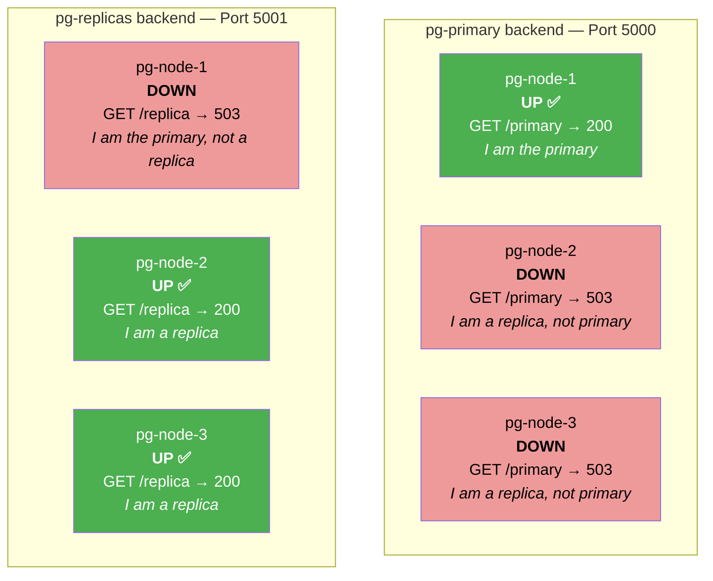

In a healthy 3-node cluster, you will always see exactly **1 UP + 2 DOWN** in `pg-primary` and **2 UP + 1 DOWN** in `pg-replicas`. The DOWN entries are not errors — they confirm that the role-based routing is working correctly.

---

### 2.4 Internal Communication Map

This diagram shows every communication path between the components, with port numbers and protocols:

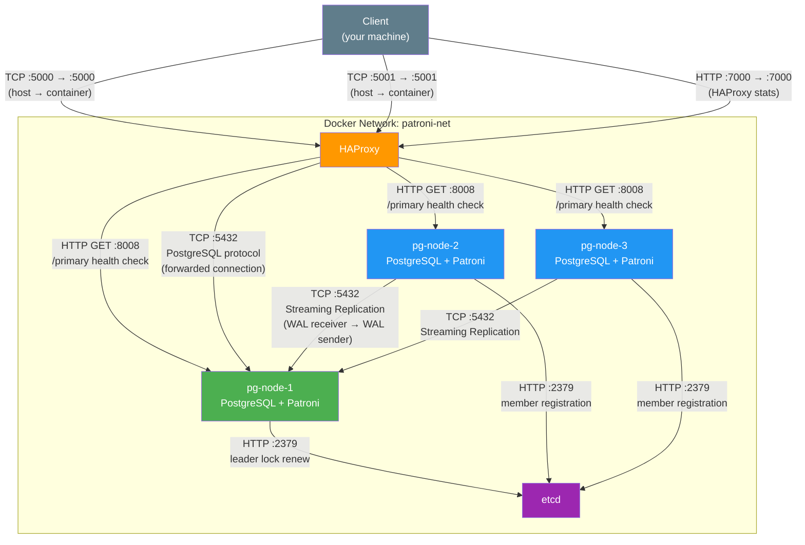

**Port summary across the entire architecture:**

| Port | Listener | Protocol | Who connects to it | Exposed to host? |
|------|----------|----------|--------------------|-------------------|
| 5000 | HAProxy | TCP (PG wire) | Application / psql | **Yes** — this is the write endpoint |
| 5001 | HAProxy | TCP (PG wire) | Application / psql | **Yes** — this is the read endpoint |
| 7000 | HAProxy | HTTP | Browser (stats dashboard) | **Yes** |
| 5432 | PostgreSQL (on each node) | TCP (PG wire) | HAProxy (forwarded connections), other PG nodes (replication) | **No** — internal only |
| 8008 | Patroni (on each node) | HTTP (REST) | HAProxy (health checks), `patronictl` commands | **No** — internal only |
| 2379 | etcd | HTTP (gRPC gateway) | Patroni (on all three nodes) | **No** — internal only |
| 2380 | etcd | HTTP | etcd peers (unused in single-node) | **No** — internal only |

---

### 2.5 What Each Node Looks Like Internally

Every PostgreSQL node container runs two processes side-by-side: Patroni and PostgreSQL. Patroni is the parent process — it starts PostgreSQL and manages it.

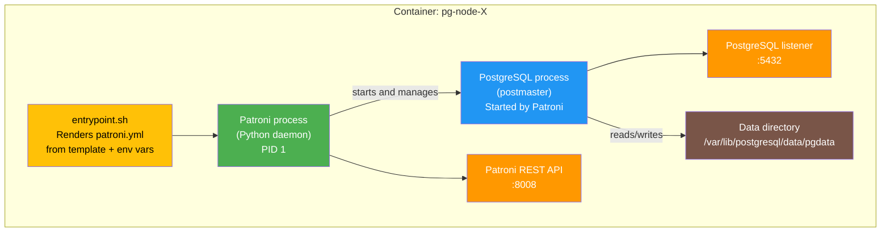

When the container starts:
1. `entrypoint.sh` runs and renders `patroni.yml` from the template, substituting environment variables.
2. Patroni starts as the main process.
3. Patroni checks etcd: Is there a leader? Is there initialized data?
4. If this is the first node to start: Patroni runs `initdb`, starts PostgreSQL, and acquires the leader lock in etcd.
5. If another node is already the leader: Patroni runs `pg_basebackup` to clone the leader's data, then starts PostgreSQL in replica mode.
6. Patroni enters its main loop: every 10 seconds, it checks PostgreSQL health, renews the leader lock (if leader), and checks etcd for state changes.

---

### 2.6 Streaming Replication — How Data Stays in Sync

PostgreSQL streaming replication is the mechanism that keeps replicas synchronized with the primary. It operates at the WAL (Write-Ahead Log) level, not at the SQL level — replicas receive and replay the exact same sequence of low-level changes that the primary makes.

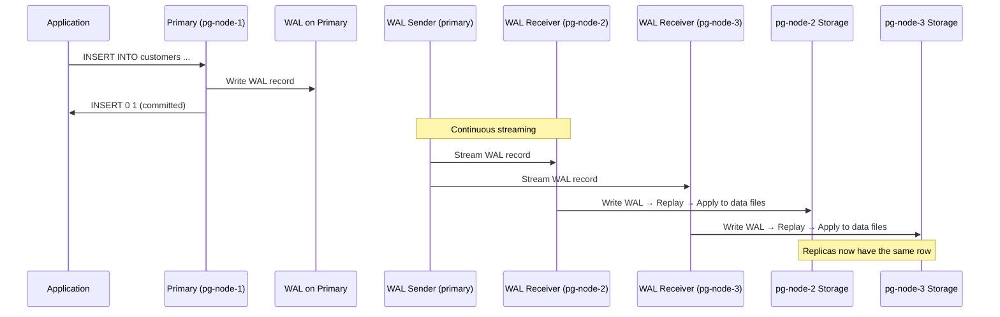

**Replication modes in this setup:**

This cluster uses **asynchronous replication** (`sync_state = async` in `pg_stat_replication`). This means:

- The primary commits a transaction and returns success to the client immediately.
- WAL records are streamed to replicas in the background.
- There is a tiny window (usually milliseconds) where the primary has committed a transaction but the replicas have not yet received it.
- If the primary crashes during this window, the transaction is lost because the replicas did not receive it.

Synchronous replication is possible (Patroni supports it), but it adds latency to every write because the primary must wait for at least one replica to confirm receipt before committing. This lab uses async for simplicity.

**Replication health indicators:**

| Metric | Meaning | Healthy value |
|--------|---------|---------------|
| `sent_lsn` | WAL position sent by the primary to this replica | Should match primary's current LSN |
| `write_lsn` | WAL position written to disk on the replica | Should match `sent_lsn` |
| `flush_lsn` | WAL position flushed (synced) to disk on the replica | Should match `write_lsn` |
| `replay_lsn` | WAL position applied to the data files on the replica | Should match `flush_lsn` |
| `state` | Connection state | `streaming` = healthy |
| `sync_state` | Synchronization mode | `async` in this setup |

When all four LSN values match across primary and replicas, replication lag is zero.

---

### 2.7 Architecture State Transitions

The cluster goes through several states during its lifecycle. This state diagram shows the transitions that were actually observed during the test:

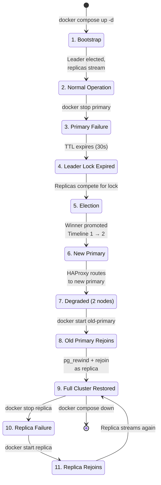

---

### 2.8 What This Architecture Does NOT Protect Against

This HA setup has real limits. Be clear about what it does and does not cover:

| Scenario | Protected? | Why |
|----------|-----------|-----|
| Single PostgreSQL node failure | ✅ Yes | Patroni promotes a replica |
| Application connection string changes | ✅ Yes | HAProxy provides stable endpoint |
| Data loss from committed transactions | ✅ Mostly | Replicas are nearly real-time. Tiny window of async lag |
| All nodes on same host fail simultaneously | ❌ No | All containers run on one Docker Desktop host |
| etcd failure | ❌ No | Single etcd — no failover possible if etcd goes down |
| Disk corruption | ❌ No | Corruption replicates to all replicas |
| Accidental DROP TABLE | ❌ No | DDL replicates to all replicas instantly |
| Data center failure | ❌ No | Everything is on one machine |
| Network partition (split brain) | ✅ Partially | Patroni's DCS-based locking prevents two primaries, but the partitioned primary demotes itself |

---

## 3. Prerequisites

### Required Software

| Software | Purpose | Minimum Version |
|---|---|---|
| Docker Desktop | Container runtime | 4.x |
| Docker Compose | Service orchestration | v2 (bundled with Docker Desktop) |
| Git | Version control | Any recent version |
| psql | PostgreSQL client (optional for host-side queries) | Any |
| Terminal | PowerShell (Windows), bash (Linux/macOS) | — |

### Windows Considerations

Docker Desktop on Windows runs Linux containers inside a lightweight VM. All Docker commands work natively from PowerShell. The `psql` client can be installed via the PostgreSQL installer or via `winget install PostgreSQL.PostgreSQL` if you want to connect from the host. Alternatively, you can exec into any container and run `psql` from there.

### Resource Requirements

The environment runs five containers (etcd, three PostgreSQL nodes, HAProxy). On Docker Desktop, allocate at least 4 GB of RAM. The default allocation is usually sufficient.

---

## 4. Component Versions

These versions were tested together on 29 August 2026 and confirmed to be compatible:

| Component | Version | Image |
|---|---|---|
| PostgreSQL | 16.4 | `postgres:16.4-bookworm` |
| Patroni | 3.3.2 | Installed via pip in custom image |
| etcd | 3.5.15 | `quay.io/coreos/etcd:v3.5.15` |
| HAProxy | 2.9 | `haproxy:2.9-alpine` |
| Python | 3.11 | Included in Debian Bookworm base |

### Why These Versions

PostgreSQL 16.4 is the latest stable release in the 16.x line. Patroni 3.3.2 fully supports PostgreSQL 16 and includes the etcd3 protocol client. etcd 3.5.15 is a stable release with the v3 API that Patroni's etcd3 client requires. HAProxy 2.9 is a stable LTS-track release.

**Important**: etcd 3.5.x has the v2 API disabled by default. Patroni must be configured with the `etcd3` protocol (not `etcd`) to use the v3 gRPC gateway. This was an actual issue encountered during this build — see Troubleshooting for details.

---

## 5. Project Structure

```
postgres-patroni-ha/
├── docker-compose.yml          # All services: etcd, 3 pg nodes, haproxy
├── Dockerfile                  # Custom image: PostgreSQL 16.4 + Patroni 3.3.2
├── .env.example                # Template for environment variables
├── .env                        # Actual credentials (git-ignored)
├── .gitignore
├── README.md
│
├── patroni/
│   ├── patroni-template.yml    # Patroni config template (placeholders)
│   └── entrypoint.sh           # Renders config and starts Patroni
│
├── haproxy/
│   └── haproxy.cfg             # HAProxy config with Patroni health checks
│
├── scripts/
│   ├── cluster-status.sh       # Quick cluster status check
│   ├── database-test.sh        # Create sample database and data
│   ├── failover-test.sh        # Automated failover test
│   ├── capture-state.sh        # Snapshot cluster state to files
│   └── recovery-test.sh        # Bring back failed node
│
├── test-results/               # Captured evidence from tests
│   ├── before-failover/
│   ├── failover-events/
│   ├── after-failover/
│   └── after-recovery/
│
└── docs/
    └── POSTGRES_PATRONI_HA_COMPLETE_GUIDE.md  (this file)
```

---

## 6. Environment Configuration

### Step 1: Copy the environment template

```bash
cp .env.example .env
```

### Step 2: Review and optionally modify credentials

Open `.env` in a text editor. The defaults are lab-only credentials:

```
POSTGRES_SUPERUSER=postgres
POSTGRES_SUPERUSER_PASSWORD=postgres-ha-lab-2024
POSTGRES_REPLICATION_USER=replicator
POSTGRES_REPLICATION_PASSWORD=replicator-ha-lab-2024
POSTGRES_APP_USER=appuser
POSTGRES_APP_PASSWORD=appuser-ha-lab-2024
POSTGRES_APP_DATABASE=appdb
```

These are simple on purpose — this is a local lab. For production, generate strong random passwords and use a secrets manager.

### Step 3: Verify .env is git-ignored

```bash
cat .gitignore
```

The `.gitignore` file includes `.env`. Credentials are never committed to version control.

### What Each Variable Controls

| Variable | Used By | Purpose |
|---|---|---|
| `POSTGRES_SUPERUSER` | Patroni | PostgreSQL superuser for cluster management |
| `POSTGRES_SUPERUSER_PASSWORD` | Patroni | Superuser password |
| `POSTGRES_REPLICATION_USER` | Patroni, PostgreSQL | Streaming replication authentication |
| `POSTGRES_REPLICATION_PASSWORD` | Patroni, PostgreSQL | Replication user password |
| `POSTGRES_APP_USER` | Application | Application-level database user |
| `POSTGRES_APP_PASSWORD` | Application | Application user password |
| `POSTGRES_APP_DATABASE` | Application | Application database name |

---

## 7. Configuration Deep Dive

### 7.1 Docker Compose

The `docker-compose.yml` defines five services on a single bridge network (`patroni-net`). All inter-service communication uses Docker DNS service names — no hardcoded IP addresses.

**etcd** starts first. The three PostgreSQL nodes depend on etcd being healthy (health check on the etcd endpoint). HAProxy depends on the three PostgreSQL nodes being started (though not necessarily healthy, since HAProxy performs its own health checks).

Each PostgreSQL node has its own named Docker volume for persistent data. Volumes are not shared between nodes.

**Exposed ports**:
- `5000` — HAProxy primary (read-write) endpoint
- `5001` — HAProxy replica (read-only) endpoint
- `7000` — HAProxy stats UI (browser: http://localhost:7000)

PostgreSQL port 5432 and Patroni REST API port 8008 are intentionally not exposed to the host. All client access goes through HAProxy.

### 7.2 Patroni Configuration

A single template (`patroni/patroni-template.yml`) is used for all three nodes. The `entrypoint.sh` script renders it with node-specific values at container startup by substituting placeholders with environment variables.

Key Patroni settings:

| Parameter | Value | Meaning |
|---|---|---|
| `scope` | `pg-ha-cluster` | Cluster name — all nodes with the same scope form one cluster |
| `ttl` | 30 | Leader lock time-to-live in seconds. If not renewed within 30s, the lock expires |
| `loop_wait` | 10 | Seconds between Patroni's main loop iterations |
| `retry_timeout` | 10 | How long Patroni retries DCS operations before giving up |
| `maximum_lag_on_failover` | 1048576 | Maximum WAL lag (bytes) a replica can have to be eligible for promotion. 1 MB |
| `use_pg_rewind` | true | Use pg_rewind to resync a former primary that diverged |
| `use_slots` | true | Use replication slots to prevent WAL segment removal while replicas need them |
| `wal_level` | replica | Required for streaming replication |
| `hot_standby` | on | Allow read queries on replicas |
| `wal_log_hints` | on | Required for pg_rewind to work |
| `max_wal_senders` | 5 | Maximum concurrent WAL sender processes (replication connections) |
| `max_replication_slots` | 5 | Maximum replication slots |

The `bootstrap.users` section creates the application user (`appuser`) during the initial cluster bootstrap. The `pg_hba` section permits password-authenticated connections from any address — appropriate for a Docker network lab, not for production.

### 7.3 etcd Configuration

etcd is configured as a single-node cluster. The `ETCD_INITIAL_CLUSTER_STATE: new` setting tells etcd this is a fresh cluster, not joining an existing one.

**Why Patroni needs a DCS**: Patroni uses etcd to maintain a distributed leader lock. Only one Patroni node can hold this lock at a time, and that node's PostgreSQL instance is the primary. When the lock holder fails to renew within the TTL, the lock expires and another node can claim it — triggering a leader election.

**What Patroni stores in etcd**:
- The leader key (which node holds the lock)
- The cluster initialization state
- The cluster configuration
- Member registration (each node's connection info and state)

**Why a single etcd is not production-ready**: If etcd fails, Patroni cannot perform leader elections or confirm the current leader. The PostgreSQL cluster continues running, but no failover can occur. Production deployments use an odd-numbered etcd cluster (typically 3 or 5 nodes) for quorum-based consensus.

### 7.4 HAProxy Configuration

HAProxy is configured with two listener sections:

**`pg-primary` (port 5000)**: Routes to whichever node Patroni reports as the primary. The health check queries Patroni's REST API at `GET /primary` on port 8008. Only the node returning HTTP 200 receives traffic. This is not a simple TCP port check — it verifies the actual Patroni-managed role.

**`pg-replicas` (port 5001)**: Routes to nodes that Patroni reports as replicas, using `GET /replica`. Load-balanced across healthy replicas for read-only workloads.

The `on-marked-down shutdown-sessions` directive ensures that when HAProxy marks a backend as down, existing sessions to that backend are immediately terminated rather than hanging.

---

## 8. Cluster Initialization

### Step 1: Build the Docker images

```bash
docker compose build
```

This builds a custom image on top of `postgres:16.4-bookworm`, adding Patroni 3.3.2 via pip.

### Step 2: Start the cluster

```bash
docker compose up -d
```

### Step 3: Wait for initialization

The cluster needs approximately 15–30 seconds to fully initialize. During this time:

1. etcd starts and becomes healthy.
2. The three PostgreSQL/Patroni containers start.
3. One node wins the leader election and initializes PostgreSQL with `initdb`.
4. The other two nodes bootstrap from the leader using `pg_basebackup`.
5. Streaming replication begins.
6. HAProxy detects the healthy backends.

### Step 4: Verify cluster status

```bash
docker exec pg-node-1 patronictl -c /etc/patroni/patroni.yml list
```

**Actual output from this test:**

```
+ Cluster: pg-ha-cluster (7679465736627556386) ----+-----------+
| Member    | Host      | Role    | State     | TL | Lag in MB |
+-----------+-----------+---------+-----------+----+-----------+
| pg-node-1 | pg-node-1 | Replica | streaming |  1 |         0 |
| pg-node-2 | pg-node-2 | Leader  | running   |  1 |           |
| pg-node-3 | pg-node-3 | Replica | streaming |  1 |         0 |
+-----------+-----------+---------+-----------+----+-----------+
```

pg-node-2 won the initial election and became the leader. pg-node-1 and pg-node-3 bootstrapped from it and are streaming replicas with zero lag on timeline 1.

### What if the cluster doesn't start?

Check container logs:

```bash
docker logs pg-node-1
docker logs etcd
```

Common issues and their solutions are documented in the Troubleshooting section below.

---

## 9. Database Setup

With the cluster healthy, the application database was created on the primary through HAProxy.

### Create the database

```sql
CREATE DATABASE appdb;
```

### Create tables

Three tables were created:

- **customers** — sample customer data
- **orders** — sample orders linked to customers
- **ha_test** — markers for failover testing

### Insert sample data

```
5 customers
7 orders
3 ha_test records (labelled 'record-created-before-failover-1' through '-3')
```

### Verify data through HAProxy

Connecting through HAProxy (`localhost:5000`) confirmed:

```
   server   | port | is_replica |  db
------------+------+------------+-------
 172.18.0.3 | 5432 | f          | appdb
```

`is_replica = f` confirms the connection reached the primary. The server IP corresponds to pg-node-2's container IP on the Docker network.

---

## 10. Replication Validation

Replication was verified by querying `pg_stat_replication` on the primary:

```
 pid | application_name | client_addr |   state   | sync_state | sent_lsn  | write_lsn | flush_lsn | replay_lsn
-----+------------------+-------------+-----------+------------+-----------+-----------+-----------+------------
  75 | pg-node-1        | 172.18.0.5  | streaming | async      | 0/443A6F0 | 0/443A6F0 | 0/443A6F0 | 0/443A6F0
  76 | pg-node-3        | 172.18.0.4  | streaming | async      | 0/443A6F0 | 0/443A6F0 | 0/443A6F0 | 0/443A6F0
```

Both replicas are in `streaming` state with `async` synchronization. All LSN values match (`sent = write = flush = replay`), meaning there is zero replication lag.

Each replica was verified individually:

```
pg-node-1: pg_is_in_recovery = t, ha_test_count = 3
pg-node-3: pg_is_in_recovery = t, ha_test_count = 3
```

Both replicas are in recovery mode and have all the data that was inserted on the primary.

---

## 11. Pre-Failover Cluster Snapshot

Before performing the failover, a complete cluster snapshot was captured to `test-results/before-failover/`. This includes:

- Docker Compose service status
- Patroni cluster list
- etcd health
- pg_stat_replication output
- Database row counts and sample records
- Container logs for all five services

---

## 12. Failover Test

### Identifying the Primary

The current primary was identified dynamically from Patroni:

```
pg-node-2 = Leader
```

### Performing the Failure

The primary container was stopped at **14:51:58 UTC** (20:21:58 local):

```bash
docker stop pg-node-2
```

`docker stop` sends SIGTERM first, then SIGKILL after a grace period. From Patroni's perspective on the surviving nodes, the primary simply vanished.

### What Happened During Failover

Patroni on the surviving nodes (pg-node-1 and pg-node-3) detected that the leader lock in etcd was no longer being renewed. After the TTL expired, both nodes attempted to acquire the leader lock.

**pg-node-1 won the election** and was promoted at **14:52:31 UTC**.

The Patroni cluster after failover:

```
+ Cluster: pg-ha-cluster (7679465736627556386) ----+-----------+
| Member    | Host      | Role    | State     | TL | Lag in MB |
+-----------+-----------+---------+-----------+----+-----------+
| pg-node-1 | pg-node-1 | Leader  | running   |  2 |           |
| pg-node-3 | pg-node-3 | Replica | streaming |  2 |         0 |
+-----------+-----------+---------+-----------+----+-----------+
```

Timeline advanced from 1 to 2, which is normal PostgreSQL behavior during promotion.

---

## 13. Failover Event Timeline

Every event below is from actual container logs captured during the test.

| Time (UTC) | Component | Event | Evidence |
|---|---|---|---|
| 14:51:58 | Docker | `docker stop pg-node-2` executed | Command output |
| 14:52:03 | Patroni (pg-node-1) | Still following pg-node-2 as leader | `no action. I am (pg-node-1), a secondary, and following a leader (pg-node-2)` |
| 14:52:13 | Patroni (pg-node-1) | Still following pg-node-2 | Same log line |
| 14:52:23 | Patroni (pg-node-1) | Detected cluster is unlocked, queried pg-node-3 state | `cluster_unlocked: true` in response from pg-node-3 |
| 14:52:31 | Patroni (pg-node-1) | Failed to resolve pg-node-2 hostname | `WARNING: failed to resolve host pg-node-2: Temporary failure in name resolution` |
| 14:52:31 | Patroni (pg-node-1) | **Promoted self to leader** | `promoted self to leader by acquiring session lock` |
| 14:52:31 | Patroni (pg-node-3) | Could not take out TTL lock | `Could not take out TTL lock` |
| 14:52:31 | Patroni (pg-node-3) | Following new leader | `following new leader after trying and failing to obtain lock` |
| 14:52:31 | Patroni (pg-node-3) | Acknowledged new leader | `Lock owner: pg-node-1; I am pg-node-3` |
| 14:52:32 | Patroni (pg-node-1) | Updated leader lock | `updated leader lock during promote` |
| 14:52:32 | PostgreSQL (pg-node-1) | Promotion completed | `server promoting` |
| ~14:52:34 | HAProxy | pg-node-2 marked DOWN | `Server pg-primary/pg-node-2 is DOWN, reason: Layer4 timeout, check duration: 3003ms` |
| ~14:52:34 | HAProxy | pg-node-1 marked UP as primary | `Server pg-primary/pg-node-1 is UP, reason: Layer7 check passed, code: 200` |
| ~14:52:34 | HAProxy | pg-node-1 removed from replica pool | `Server pg-replicas/pg-node-1 is DOWN, reason: Layer7 wrong status, code: 503` (correct — it's now a primary, not a replica) |

### Failover Timing

| Measurement | Value |
|---|---|
| T0 (primary stopped) | 14:51:58 UTC |
| T1 (new leader lock acquired) | 14:52:31 UTC |
| T1 - T0 | **~33 seconds** |
| T2 (HAProxy routes to new primary) | ~14:52:34 UTC |
| T2 - T0 | **~36 seconds** |

Most of that 33 seconds is the TTL expiry window. The lock has a 30-second TTL, and Patroni will not start an election until it expires. You can lower the TTL for faster failover, but that increases the chance of a false failover from a transient network glitch.

**These measurements are specific to this Docker Desktop environment and are not production SLAs.**

---

## 14. Post-Failover Verification

### HAProxy Connectivity

Connecting through HAProxy with the same connection string (`localhost:5000`) confirmed it now routes to the new primary:

```
   server   | is_replica
------------+------------
 172.18.0.5 | f
```

The server IP changed from 172.18.0.3 (pg-node-2) to 172.18.0.5 (pg-node-1). The client connection string remained unchanged.

### Data Verification

All data created before the failover was present:

```
 id |             message              |          created_at
----+----------------------------------+-------------------------------
  1 | record-created-before-failover-1 | 2026-08-29 14:50:16.460916+00
  2 | record-created-before-failover-2 | 2026-08-29 14:50:16.460916+00
  3 | record-created-before-failover-3 | 2026-08-29 14:50:16.460916+00
```

Row counts: customers=5, orders=7, ha_test=3 — all intact.

### Post-Failover Write

A new record was inserted through HAProxy to confirm the new primary accepts writes:

```sql
INSERT INTO ha_test (message) VALUES ('record-created-AFTER-failover');
```

Result:

```
 id |             message              |          created_at
----+----------------------------------+-------------------------------
  1 | record-created-before-failover-1 | 2026-08-29 14:50:16.460916+00
  2 | record-created-before-failover-2 | 2026-08-29 14:50:16.460916+00
  3 | record-created-before-failover-3 | 2026-08-29 14:50:16.460916+00
 34 | record-created-AFTER-failover    | 2026-08-29 14:57:10.552122+00
```

The ID jumped from 3 to 34 because the sequence was advanced during the base backup and recovery process. This is normal PostgreSQL sequence behavior and does not indicate data loss.

---

## 15. Old Primary Recovery

### Restarting pg-node-2

The old primary was restarted at **14:58:56 UTC** (20:28:55 local):

```bash
docker start pg-node-2
```

### What Patroni Did

Patroni on pg-node-2 detected that:

1. PostgreSQL was not running.
2. Another node (pg-node-1) holds the leader lock.
3. The local data directory is from timeline 1, but the cluster is now on timeline 2.

Patroni automatically performed **pg_rewind** to resynchronize the data directory:

```
14:58:56 INFO: Lock owner: pg-node-1; I am pg-node-2
14:58:56 INFO: doing crash recovery in a single user mode
14:58:57 INFO: Local timeline=1 lsn=0/5000028
14:58:57 INFO: primary_timeline=2
14:58:57 INFO: running pg_rewind from pg-node-1
14:58:58 INFO: pg_rewind exit code=0
14:58:58 INFO: stderr=pg_rewind: servers diverged at WAL location 0/4489F20 on timeline 1
                pg_rewind: rewinding from last common checkpoint at 0/2000110 on timeline 1
                pg_rewind: Done!
14:58:59 INFO: no action. I am (pg-node-2), a secondary, and following a leader (pg-node-1)
```

pg_rewind found the divergence point (`0/4489F20` on timeline 1), rewound to the last common checkpoint (`0/2000110`), and PostgreSQL replayed the WAL from the current primary to catch up. The whole thing took about 3 seconds from container start to healthy streaming replica.

### Cluster After Recovery

```
+ Cluster: pg-ha-cluster (7679465736627556386) ----+-----------+
| Member    | Host      | Role    | State     | TL | Lag in MB |
+-----------+-----------+---------+-----------+----+-----------+
| pg-node-1 | pg-node-1 | Leader  | running   |  2 |           |
| pg-node-2 | pg-node-2 | Replica | streaming |  2 |         0 |
| pg-node-3 | pg-node-3 | Replica | streaming |  2 |         0 |
+-----------+-----------+---------+-----------+----+-----------+
```

All three nodes healthy. pg-node-2 is now a replica on timeline 2 with zero lag.

### Data on Rejoined Node

Querying pg-node-2 directly confirmed it has all data, including the record inserted after failover:

```
 pg_is_in_recovery
-------------------
 t

 id |             message              |          created_at
----+----------------------------------+-------------------------------
  1 | record-created-before-failover-1 | 2026-08-29 14:50:16.460916+00
  2 | record-created-before-failover-2 | 2026-08-29 14:50:16.460916+00
  3 | record-created-before-failover-3 | 2026-08-29 14:50:16.460916+00
 34 | record-created-AFTER-failover    | 2026-08-29 14:57:10.552122+00
```

---

## 16. Replica Failure Test

With the cluster fully restored to three nodes, a replica failure was tested.

### Stopping pg-node-3

```bash
docker stop pg-node-3
```

### Result

The primary (pg-node-1) remained the leader. Application connectivity through HAProxy was unaffected. A write was successfully performed during the replica outage:

```sql
INSERT INTO ha_test (message) VALUES ('record-during-replica-failure');
```

```
 id |             message              |          created_at
----+----------------------------------+-------------------------------
  1 | record-created-before-failover-1 | 2026-08-29 14:50:16.460916+00
  2 | record-created-before-failover-2 | 2026-08-29 14:50:16.460916+00
  3 | record-created-before-failover-3 | 2026-08-29 14:50:16.460916+00
 34 | record-created-AFTER-failover    | 2026-08-29 14:57:10.552122+00
 35 | record-during-replica-failure    | 2026-08-29 15:00:23.081974+00
```

### Restarting pg-node-3

```bash
docker start pg-node-3
```

pg-node-3 rejoined the cluster as a replica within seconds:

```
+ Cluster: pg-ha-cluster (7679465736627556386) ----+-----------+
| Member    | Host      | Role    | State     | TL | Lag in MB |
+-----------+-----------+---------+-----------+----+-----------+
| pg-node-1 | pg-node-1 | Leader  | running   |  2 |           |
| pg-node-2 | pg-node-2 | Replica | streaming |  2 |         0 |
| pg-node-3 | pg-node-3 | Replica | streaming |  2 |         0 |
+-----------+-----------+---------+-----------+----+-----------+
```

A replica going down does not trigger a failover — the primary keeps running, the other replica keeps streaming, and writes continue through HAProxy without interruption. HAProxy removes the dead replica from the read-only pool and adds it back when it recovers.

---

## 17. Final Cluster State

After all tests, the cluster is in a healthy state:

- **pg-node-1**: Leader, running, timeline 2
- **pg-node-2**: Replica, streaming, timeline 2, lag 0 MB
- **pg-node-3**: Replica, streaming, timeline 2, lag 0 MB
- **etcd**: Healthy
- **HAProxy**: Port 5000 routes to pg-node-1 (primary), port 5001 routes to pg-node-2 and pg-node-3 (replicas)

Database state:

| Table | Row Count |
|---|---|
| customers | 5 |
| orders | 7 |
| ha_test | 5 |

All data from before failover, after failover, and during replica failure is present and consistent across all nodes.

---

## 18. Connection Path Explained

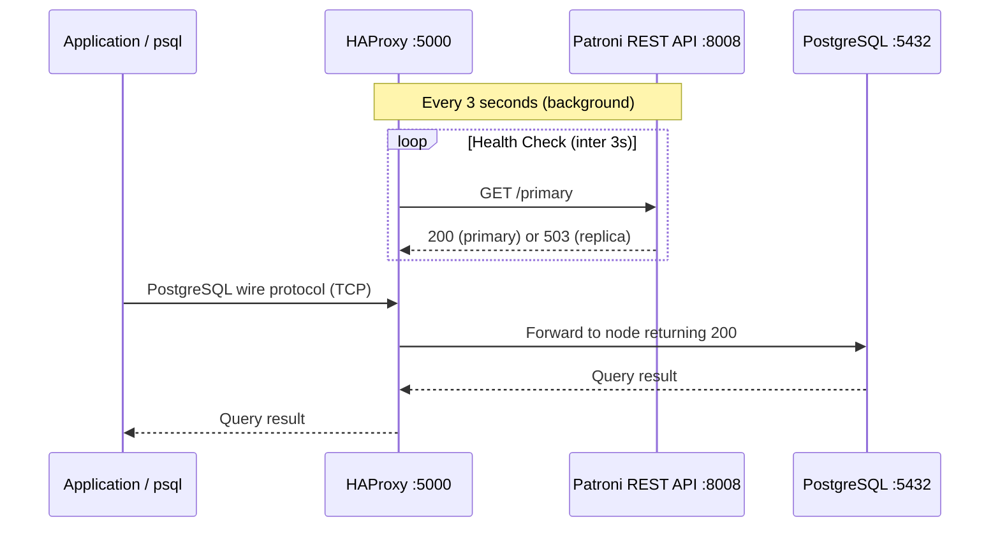

The application connects to HAProxy. The application does **not** connect to Patroni. Patroni's REST API is used only by HAProxy for health checking. The application never needs to know which node is primary.

When the primary changes, HAProxy's next health check detects the change (within the `inter 3s` check interval) and routes new connections to the new primary.

### HAProxy Backend Status — What "DOWN" Means

HAProxy maintains two separate backend pools. A node being "DOWN" in one pool does not mean it is broken — it means that node is not serving the role that pool checks for:

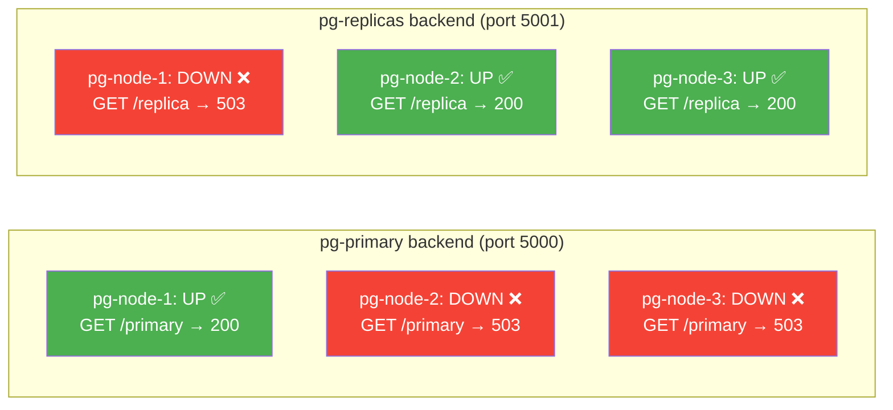

pg-node-2 and pg-node-3 show "DOWN" in `pg-primary` because they return 503 to `/primary` — they are replicas, not primaries. This is correct, healthy behavior.

---

## 19. Failover Internals

### Failover Sequence Diagram

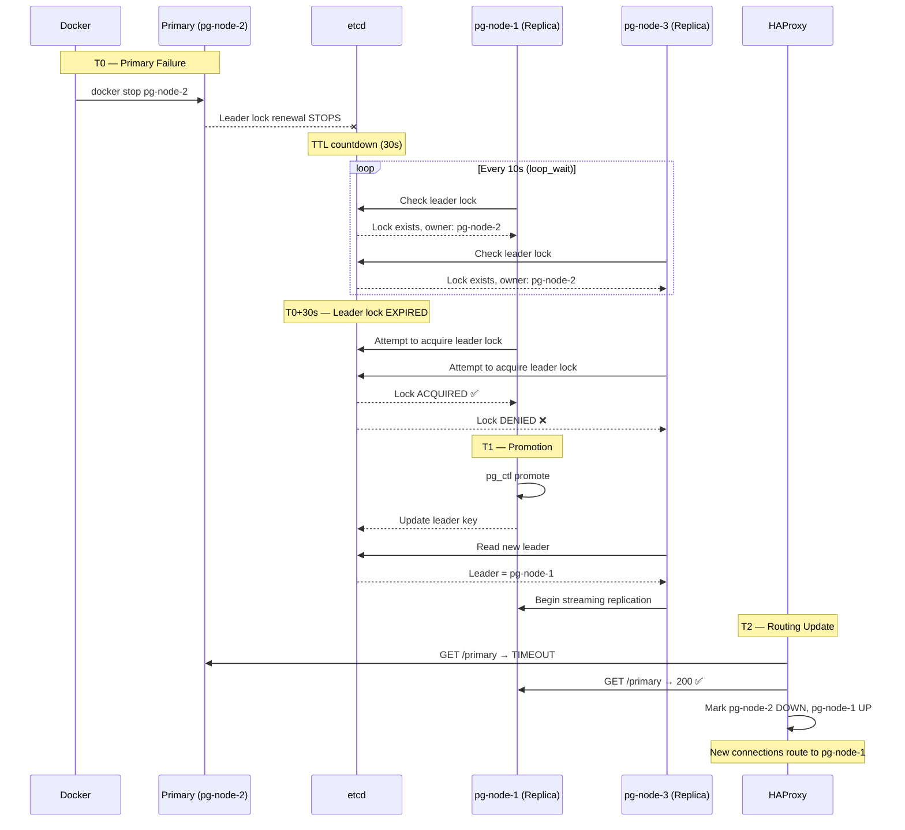

### Failover State Machine

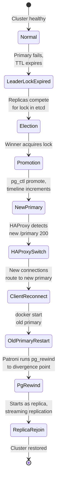

Walking through the actual sequence:

1. **Primary fails**: The PostgreSQL process on the primary stops (or the container stops, or the network becomes unreachable).

2. **Patroni detects failure**: On the primary node, Patroni can no longer communicate with PostgreSQL. But from the surviving nodes' perspective, what matters is that the leader lock in etcd stops being renewed.

3. **Leader lock expires**: The TTL on the leader key in etcd counts down. With a 30-second TTL and 10-second loop_wait, the lock expires after the primary misses enough renewal cycles. In this test, the lock expired approximately 33 seconds after the primary was stopped.

4. **Election**: Surviving Patroni nodes attempt to acquire the leader lock in etcd. Only one can succeed because etcd provides atomic compare-and-swap operations. The node that wins the lock becomes the new leader.

5. **Promotion**: The winning node runs `pg_ctl promote` on its PostgreSQL instance, which transitions it from a read-only hot standby to a read-write primary. PostgreSQL increments the timeline (from 1 to 2 in this test).

6. **Losers follow**: Nodes that lost the election see the new leader in etcd and begin following it. They update their `primary_conninfo` to point to the new primary.

7. **HAProxy detects the change**: HAProxy's periodic health check (`GET /primary` every 3 seconds) sees that the old primary no longer responds (Layer4 timeout) and the new primary returns 200. HAProxy marks the old backend down and the new backend up.

8. **New connections work**: Clients connecting to HAProxy port 5000 are now routed to the new primary. The connection string does not change.

9. **Old primary recovery**: When the old primary comes back, Patroni detects that another node holds the leader lock. It uses `pg_rewind` to rewind its data directory to the divergence point, then starts PostgreSQL as a replica following the new leader.

---

## 20. Existing Connections During Failover

**HAProxy does not provide transparent failover for existing TCP connections.** This is an important point that trips people up.

When the primary fails:

- Any **existing TCP connection** to the old primary through HAProxy will be broken. The client will see a connection error or timeout.
- The `on-marked-down shutdown-sessions` directive in HAProxy ensures these broken sessions are terminated promptly rather than hanging.
- **New connections** established after HAProxy detects the new primary will be routed correctly.
- **Transactions in progress** at the time of failure are lost. They will not be automatically replayed. The application must detect the error and retry.

Applications should implement:

- Connection retry logic with backoff.
- Transaction retry logic (re-execute the failed transaction on the new connection).
- Connection pool health checks that detect stale connections.

HAProxy provides **endpoint stability** (the address doesn't change) but not **session continuity** (existing connections are not migrated).

---

## 21. Troubleshooting

### Issue 1: etcd v2 API — "404 page not found"

**Symptoms**: Patroni logs show:
```
ERROR - Failed to get list of machines from http://etcd:2379/v2: EtcdException('Bad response : 404 page not found\n')
```

**Root cause**: etcd 3.5.x has the v2 API disabled by default. The `patroni[etcd]` pip package uses the v2 API client.

**Fix**: Use `patroni[etcd3]` instead of `patroni[etcd]` in the Dockerfile, and configure `etcd3:` instead of `etcd:` in the Patroni YAML config. Also use `PATRONI_ETCD3_HOSTS` instead of `PATRONI_ETCD_HOSTS` as the environment variable name, because the env var name determines which protocol Patroni uses regardless of the YAML config.

**Verification**: Patroni logs should show `Selected new etcd server http://etcd:2379` without v2 errors.

### Issue 2: "initdb: error: cannot be run as root"

**Symptoms**: Patroni fails during bootstrap with:
```
initdb: error: cannot be run as root
initdb: hint: Please log in (using, e.g., "su") as the (unprivileged) user that will own the server process.
```

**Root cause**: The Dockerfile's default user was root. PostgreSQL refuses to initialize a data directory as root for security reasons.

**Fix**: Add `USER postgres` to the Dockerfile after creating the Patroni config directory. Ensure `/etc/patroni` is owned by the postgres user: `RUN mkdir -p /etc/patroni && chown postgres:postgres /etc/patroni`.

**Verification**: Patroni should bootstrap successfully without permission errors.

### Issue 3: Environment variable overriding YAML config

**Symptoms**: Despite the YAML config containing `etcd3:`, Patroni still uses the v2 protocol.

**Root cause**: Patroni reads environment variables in the format `PATRONI_<SECTION>_<KEY>`. The environment variable `PATRONI_ETCD_HOSTS` maps to `etcd.hosts`, which tells Patroni to use the etcd v2 client, overriding the `etcd3` section in the YAML file.

**Fix**: Rename the environment variable to `PATRONI_ETCD3_HOSTS` so it maps to `etcd3.hosts`.

**Verification**: Check the Patroni log for `Selected new etcd server` without v2 errors.

---

## 22. Cleanup

### Stop the cluster (preserve data)

```bash
docker compose down
```

This stops and removes containers and networks, but preserves the named volumes. You can restart with `docker compose up -d` and all data will be intact.

### Stop the cluster and destroy all data

```bash
docker compose down -v
```

The `-v` flag removes the named volumes (`etcd-data`, `pg-node-1-data`, `pg-node-2-data`, `pg-node-3-data`). All PostgreSQL data, the etcd state, and the cluster configuration are permanently deleted. The next `docker compose up -d` will bootstrap a completely fresh cluster.

### Complete rebuild from scratch

```bash
docker compose down -v
docker compose build --no-cache
docker compose up -d
```

This removes everything, rebuilds the images without layer caching, and starts fresh.

---

## 23. Production Considerations

This Docker Desktop lab demonstrates the HA concepts, but several changes are required for production:

| Lab Setting | Production Requirement |
|---|---|
| Single etcd node | 3 or 5 etcd nodes for quorum |
| All services on one host | PostgreSQL nodes on separate physical/virtual servers |
| Docker bridge network | Dedicated low-latency network |
| Simple passwords in `.env` | Secrets manager (Vault, AWS Secrets Manager, etc.) |
| `host all all 0.0.0.0/0 md5` | Restrict `pg_hba.conf` to specific CIDRs |
| No TLS | TLS for PostgreSQL, Patroni REST API, and etcd |
| No monitoring | Prometheus + Grafana or equivalent |
| No backup | pg_basebackup + WAL archiving (pgBackRest, Barman) |
| 30s TTL | Tune TTL/loop_wait for acceptable failover time vs. false-failover risk |
| Async replication | Consider synchronous replication for zero data loss |
| Docker volumes | Dedicated high-performance storage (SSD/NVMe) |

---

## 24. Frequently Asked Questions

**1. What is PostgreSQL responsible for?**
Storing and querying data. It handles SQL, transactions, replication, and data integrity.

**2. What is Patroni responsible for?**
Managing the PostgreSQL cluster lifecycle: bootstrap, leader election, promotion, demotion, replication configuration, and automatic failover. Patroni decides who is primary.

**3. What is etcd responsible for?**
Providing a distributed, consistent key-value store for Patroni's leader lock and cluster state. etcd ensures that only one node can be the leader at any time through atomic operations.

**4. What is HAProxy responsible for?**
Providing a stable client endpoint. HAProxy health-checks each node's Patroni REST API and routes connections to the current primary (port 5000) or replicas (port 5001).

**5. Does the application connect directly to Patroni?**
No. The application connects to HAProxy, which forwards the connection to PostgreSQL. Patroni's REST API is used only by HAProxy for health checks.

**6. Where does the application connect?**
`psql -h localhost -p 5000 -U appuser -d appdb` — always through HAProxy.

**7. Who decides who is primary?**
Patroni, through the leader election mechanism in etcd.

**8. Where is the leader information maintained?**
In etcd, as a key under `/service/pg-ha-cluster/`.

**9. How does Patroni detect failure?**
The primary must renew its leader lock in etcd within the TTL period. If it fails to renew (because the process crashed, the container stopped, or the network is partitioned), the lock expires.

**10. How is a replica promoted?**
The winning node calls `pg_ctl promote` on PostgreSQL, transitioning it from hot standby to primary. PostgreSQL advances the timeline.

**11. How does HAProxy know about the new primary?**
HAProxy polls each node's Patroni REST API every 3 seconds (`inter 3s`). The `/primary` endpoint returns 200 only on the current primary. When the primary changes, the next health check detects it.

**12. What happens to existing connections?**
They break. The old TCP connection to the failed primary cannot be migrated. New connections are routed to the new primary.

**13. What happens to transactions during failure?**
Any uncommitted transaction at the time of failure is lost. The application must retry.

**14. What happens to the old primary?**
When restarted, Patroni detects it is no longer the leader and uses pg_rewind to resynchronize it. It then joins the cluster as a replica.

**15. How does the old primary rejoin?**
Patroni uses pg_rewind to rewind the data directory to the divergence point, then starts PostgreSQL in recovery mode following the new leader.

**16. What happens if a replica fails?**
Nothing critical. The primary continues serving writes. The other replica(s) continue streaming. HAProxy marks the down replica as unavailable in the read-only pool.

**17. What happens if two PostgreSQL nodes fail?**
If both replicas fail, the primary continues running. No failover occurs (there is nobody to fail over to). If the primary and one replica fail, the surviving replica may be promoted if it can acquire the leader lock — but with only one node, there is no redundancy left.

**18. What happens if etcd fails?**
The current primary continues running PostgreSQL. However, no new leader elections can occur. If the primary then fails, no failover happens. etcd is a single point of failure in this lab setup. Production uses a multi-node etcd cluster.

**19. What is the role of PostgreSQL streaming replication?**
Streaming replication continuously ships WAL (Write-Ahead Log) records from the primary to replicas. This keeps replicas up-to-date with the primary's data changes, enabling them to take over if the primary fails.

**20. Why are three PostgreSQL nodes useful?**
With three nodes, you can lose one node and still have a primary and a replica. With two nodes, losing the primary leaves only one node with no further redundancy.

**21. Why is a single etcd instance acceptable for this lab but not for production?**
For learning and testing, a single etcd is simpler and sufficient. In production, a single etcd is a single point of failure — if it goes down, no leader elections can happen. Production uses 3 or 5 etcd nodes with Raft consensus so that the cluster can tolerate the loss of a minority of nodes.

**22. What does this setup NOT protect against?**
- Data center failure (all containers are on one host)
- etcd failure (single node)
- Data corruption (replication replicates corruption)
- Application-level errors (deleting data is replicated to all nodes)
- Storage failure (Docker volumes are on the same disk)

**23. What would need to change for production?**
See the Production Considerations section above. The main changes are: multi-node etcd, separate physical hosts, TLS everywhere, proper monitoring, backup strategy, and network-level security.

---

## Architecture Diagrams

These diagrams cover the four key flows in the system: how writes reach replicas, how reads get load-balanced, how a failed primary rejoins the cluster, and how Docker Compose orders the startup.

### Data Flow — Write Path

A write query (`INSERT`, `UPDATE`, `DELETE`) enters through HAProxy on port 5000. HAProxy forwards the raw TCP connection to whichever node is currently the primary. PostgreSQL on the primary writes the change to the WAL first, then applies it to the data files. The WAL records are streamed continuously to both replicas, which replay them locally. The primary sends the commit acknowledgement back through HAProxy to the application. The replicas receive and apply the change asynchronously — the primary does not wait for them before confirming the commit.

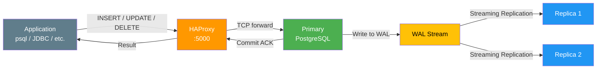

### Data Flow — Read Path (via replica pool)

Read-only queries (`SELECT`) can be sent to HAProxy on port 5001, which load-balances them round-robin across the two replicas. The primary is excluded from this pool — it returns 503 to `/replica` health checks. This offloads read traffic from the primary and makes use of the replica nodes that would otherwise sit idle between failovers. The data on replicas lags behind the primary by milliseconds under normal load, so reads are near-real-time but not guaranteed to reflect the very latest committed write.

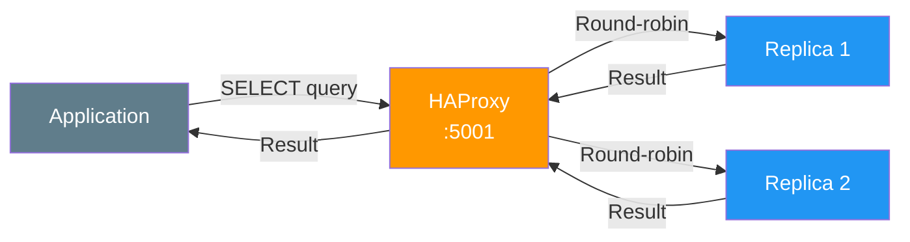

### Old Primary Recovery Flow

When the old primary (pg-node-2) is restarted after a failover, Patroni handles the entire recovery automatically. It checks etcd, discovers that pg-node-1 now holds the leader lock, and compares the local PostgreSQL timeline against the primary's. Since the local data diverged at WAL position `0/4489F20` on timeline 1 (because it was still primary when it went down), Patroni runs `pg_rewind` to roll back to the last common checkpoint (`0/2000110`). PostgreSQL then starts in recovery mode, replays the WAL from the new primary to catch up, and establishes streaming replication. The node is a healthy zero-lag replica within seconds.

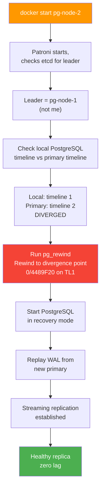

### Docker Compose Service Dependency

Docker Compose enforces a startup order through `depends_on` with health check conditions. etcd starts first and must pass its health check before any PostgreSQL node begins. The three PostgreSQL/Patroni nodes start in parallel once etcd is healthy — the first one to acquire the leader lock in etcd runs `initdb`, and the other two bootstrap from it via `pg_basebackup`. HAProxy starts last, after all three PostgreSQL containers have been created (though HAProxy performs its own Patroni REST API health checks to determine which backends are actually ready).

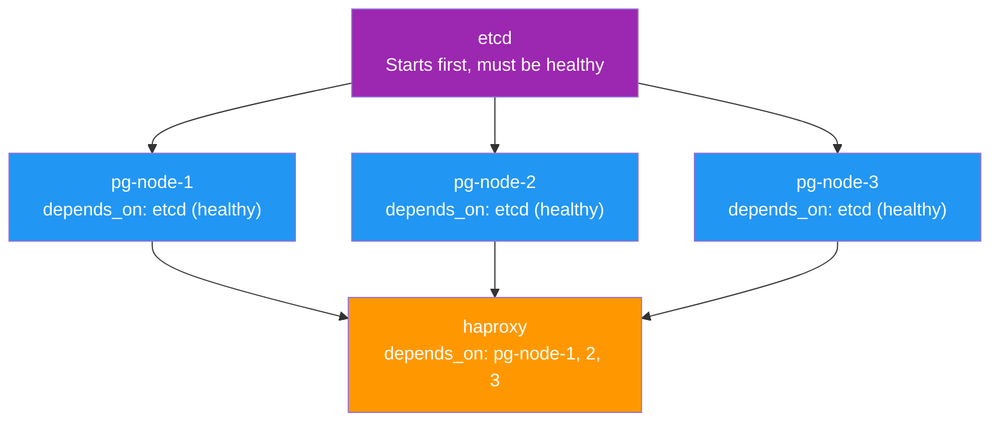

---

## Validation Checklist

| Check | Status |
|---|---|
| Docker Compose configuration valid | ✅ |
| All containers start | ✅ |
| etcd healthy | ✅ |
| Patroni healthy | ✅ |
| PostgreSQL node 1 healthy | ✅ |
| PostgreSQL node 2 healthy | ✅ |
| PostgreSQL node 3 healthy | ✅ |
| One primary exists | ✅ |
| Two replicas exist | ✅ |
| Streaming replication works | ✅ |
| Application database exists | ✅ |
| Sample data exists | ✅ |
| HAProxy works | ✅ |
| Client connects through localhost:5000 | ✅ |
| Primary failure tested | ✅ |
| New primary elected | ✅ (pg-node-1, 33s) |
| New primary accepts writes | ✅ |
| Existing data survives failover | ✅ |
| HAProxy routes to new primary | ✅ |
| Old primary successfully rejoins | ✅ (via pg_rewind) |
| Three-node cluster restored | ✅ |
| Replica failure tested | ✅ |
| Documentation from actual results | ✅ |
