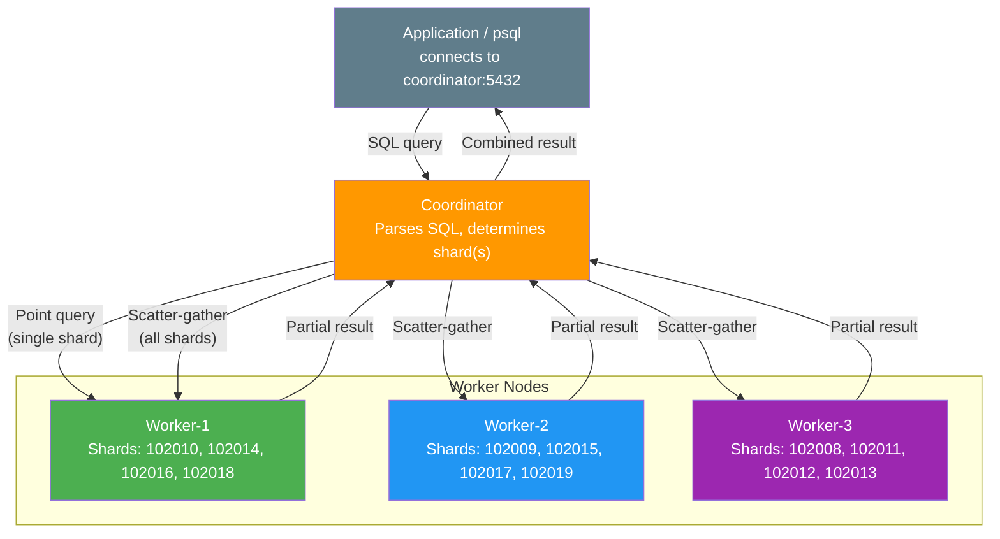
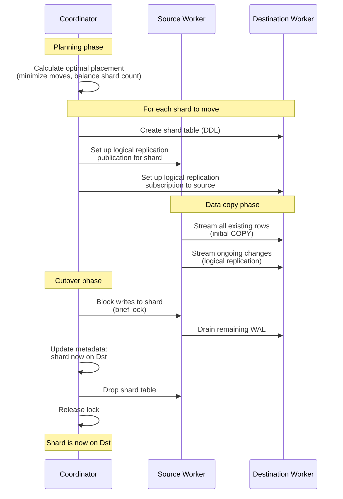

# PostgreSQL Sharding with Citus — Complete Lab Guide

## From Empty Docker Desktop to Working Sharded Cluster with Live Shard Rebalancing

This document covers every step from initial setup through data loading, shard distribution verification, adding a new worker node, rebalancing data across all nodes, and validating that nothing was lost. All outputs and evidence come from an actual test run performed on 31 August 2026.

---

## Table of Contents

1. [Overview](#1-overview)
2. [Why Citus](#2-why-citus)
3. [Architecture](#3-architecture)
4. [Prerequisites](#4-prerequisites)
5. [Component Versions](#5-component-versions)
6. [Project Structure](#6-project-structure)
7. [Docker Compose Configuration](#7-docker-compose-configuration)
8. [Cluster Startup](#8-cluster-startup)
9. [Database and Extension Setup](#9-database-and-extension-setup)
10. [Worker Node Registration](#10-worker-node-registration)
11. [Schema Design](#11-schema-design)
12. [Shard Key Selection](#12-shard-key-selection)
13. [Table Distribution](#13-table-distribution)
14. [Sample Data Generation](#14-sample-data-generation)
15. [Inspecting Shard Distribution](#15-inspecting-shard-distribution)
16. [Query Routing Demonstration](#16-query-routing-demonstration)
17. [Adding the Third Worker Node](#17-adding-the-third-worker-node)
18. [Shard Rebalancing](#18-shard-rebalancing)
19. [Before and After Comparison](#19-before-and-after-comparison)
20. [Data Integrity Validation](#20-data-integrity-validation)
21. [What Happens Internally During Rebalancing](#21-what-happens-internally-during-rebalancing)
22. [Failure and Recovery Considerations](#22-failure-and-recovery-considerations)
23. [Performance Considerations](#23-performance-considerations)
24. [Operational Considerations](#24-operational-considerations)
25. [Limitations of This Lab](#25-limitations-of-this-lab)
26. [Troubleshooting](#26-troubleshooting)
27. [Cleanup](#27-cleanup)

---

## 1. Overview

This project demonstrates PostgreSQL horizontal sharding using **Citus**, an open-source extension that turns a single PostgreSQL database into a distributed cluster. The cluster consists of:

- **1 Coordinator node** — receives all queries, plans distributed execution, routes to workers.
- **2 Worker nodes** (initially) — store the actual data shards, execute queries locally.
- **1 additional Worker node** (added later) — demonstrates live shard rebalancing.

The lab creates a `customer_orders` database with three tables (`customers`, `orders`, `order_items`), distributes them across workers using `customer_id` as the shard key, loads 10,500 rows of sample data, then adds a third worker and triggers a shard rebalance that physically moves data between nodes using logical replication.

---

## 2. Why Citus

PostgreSQL has built-in **table partitioning** (declarative partitioning with `PARTITION BY`), but partitioning alone keeps all partitions on the same PostgreSQL instance — the same disk, the same CPU. It does not distribute data across multiple servers.

For true cross-node sharding — where different rows physically reside on different servers — you need either:

1. Application-level sharding (the application decides which database to connect to).
2. A sharding middleware/proxy (e.g., PgBouncer + custom routing, ProxySQL).
3. A PostgreSQL extension that handles distribution natively.

Citus is option 3. It runs inside PostgreSQL as an extension, so you get standard SQL, standard PostgreSQL tools, and standard `psql` access — but the data is physically distributed across worker nodes.

**What Citus adds to PostgreSQL:**

| Capability | PostgreSQL Alone | PostgreSQL + Citus |
|---|---|---|
| Store data on multiple servers | No | Yes |
| Route queries to correct shard | No | Yes (automatic) |
| Parallel query across shards | No | Yes |
| Co-located JOINs (same shard key) | N/A | Yes, no network hop |
| Add/remove nodes at runtime | N/A | Yes |
| Rebalance data after adding nodes | N/A | Yes (logical replication) |
| Standard SQL and tools | Yes | Yes |

---

## 3. Architecture

### 3.1 Component Diagram

```
┌──────────────────────────────────────────────────────────────┐
│                        Host Machine                          │
│                     (Docker Desktop)                         │
│                                                              │
│  ┌─────────────────────────────────────────────────────────┐ │
│  │               Docker Network: citus-net                 │ │
│  │                                                         │ │
│  │  ┌───────────────────┐                                  │ │
│  │  │    Coordinator    │  Port 5432 (exposed to host)     │ │
│  │  │  PostgreSQL 16.6  │  Receives all client queries     │ │
│  │  │  Citus 12.1.6     │  Routes to appropriate workers   │ │
│  │  │                   │  Combines partial results         │ │
│  │  └─────────┬─────────┘                                  │ │
│  │            │                                             │ │
│  │     ┌──────┼──────┬──────────────┐                      │ │
│  │     │      │      │              │                      │ │
│  │     ▼      ▼      ▼              ▼                      │ │
│  │  ┌──────┐ ┌──────┐ ┌──────┐  ┌──────┐                  │ │
│  │  │ W-1  │ │ W-2  │ │ W-3  │  │ ...  │                  │ │
│  │  │Shard │ │Shard │ │Shard │  │      │                  │ │
│  │  │1,3,5 │ │2,4,6 │ │(after│  │      │                  │ │
│  │  │      │ │      │ │rebal)│  │      │                  │ │
│  │  └──────┘ └──────┘ └──────┘  └──────┘                  │ │
│  │                                                         │ │
│  └─────────────────────────────────────────────────────────┘ │
└──────────────────────────────────────────────────────────────┘
```

### 3.2 How Queries Flow



### 3.3 Data Distribution

Citus uses **hash-based sharding**. When a table is distributed on `customer_id`:

1. Citus hashes `customer_id` using a consistent hash function.
2. The hash space is divided into ranges — one range per shard.
3. Each shard is assigned to a worker node.
4. When you INSERT a row, Citus hashes the `customer_id` value, determines which shard's hash range it falls into, and sends the row to the worker that holds that shard.
5. When you SELECT by `customer_id`, the same hash determines which worker to query.

With 12 shards and 3 workers, each worker holds 4 shards. Each shard contains a subset of customer IDs — not a contiguous range, but a set of IDs that hash to the same bucket.

### 3.4 Co-location

All three tables (`customers`, `orders`, `order_items`) are distributed on `customer_id` and placed in the same **co-location group**. This means:

- Shard 102008 of `customers` is on the same worker as shard 102008 of `orders` and shard 102008 of `order_items`.
- A JOIN between `customers` and `orders` on `customer_id` executes **locally** on each worker — no cross-network data movement.
- The rebalancer moves entire co-location groups together, keeping related data co-located.

---

## 4. Prerequisites

| Software | Purpose | Minimum Version |
|---|---|---|
| Docker Desktop | Container runtime | 4.x |
| Docker Compose | Service orchestration | v2 (bundled with Docker Desktop) |
| Terminal | PowerShell (Windows), bash (Linux/macOS) | — |
| psql | PostgreSQL client (optional, can use docker exec) | Any |

Docker Desktop on Windows runs Linux containers via a lightweight VM. All `docker` and `docker compose` commands work natively from PowerShell.

**Resource requirements**: The lab runs 3–4 containers (coordinator + 2–3 workers). Allocate at least 4 GB RAM in Docker Desktop settings.

---

## 5. Component Versions

Tested together on 31 August 2026:

| Component | Version |
|---|---|
| PostgreSQL | 16.6 (Debian 16.6-1.pgdg120+1) |
| Citus | 12.1.6 |
| Docker Image | `citusdata/citus:12.1` |
| Docker Compose | v2 |

---

## 6. Project Structure

```
postgres-sharding-lab/
├── docker-compose.yml              # Coordinator + 3 workers (worker-3 via profile)
├── .gitignore
│
├── scripts/
│   ├── 01-init-databases.sh        # Create customer_orders DB on all nodes
│   ├── 02-setup-cluster.sh         # Register workers with coordinator
│   ├── 03-create-schema.sql        # Table DDL (customers, orders, order_items)
│   ├── 04-distribute-tables.sql    # Distribute tables on customer_id
│   ├── 05-generate-data.sql        # Insert 500+2500+7500 sample rows
│   ├── 06-inspect-distribution.sql # Shard placement, row counts per worker
│   ├── 07-query-routing-demo.sql   # EXPLAIN plans showing query routing
│   ├── 08-add-shard3.sh            # Start worker-3, register with coordinator
│   ├── 09-rebalance.sh             # Trigger shard rebalancing
│   ├── 10-validate.sql             # Data integrity checks
│   └── capture-evidence.sh         # Save cluster state to evidence/ dir
│
├── evidence/                       # Captured test output
│   ├── 01-before-shard3/
│   └── 02-after-rebalance/
│
└── docs/
    └── SHARDING_COMPLETE_GUIDE.md  # (this file)
```

---

## 7. Docker Compose Configuration

The `docker-compose.yml` defines four services on a single bridge network (`citus-net`):

- **coordinator** — the Citus coordinator node. Port 5432 exposed to the host.
- **worker-1** — first worker node. Internal only.
- **worker-2** — second worker node. Internal only.
- **worker-3** — third worker node. Uses the `add-shard` Docker Compose profile, so it does not start with the initial `docker compose up -d`.

### Key Settings

| Setting | Value | Why |
|---|---|---|
| `shared_preload_libraries=citus` | All nodes | Required for Citus extension to function |
| `wal_level=logical` | All nodes | Required for the shard rebalancer (uses logical replication internally) |
| `citus.shard_count=12` | Coordinator only | Number of shards per distributed table. 12 gives a clean split across 2 or 3 workers |
| `citus.shard_replication_factor=1` | Coordinator only | Each shard has one copy (no shard-level replication). Citus community edition does not support shard replication |
| `max_worker_processes=32` | All nodes | Citus uses background workers for parallel queries and rebalancing |
| `max_prepared_transactions=200` | All nodes | Required by Citus for 2PC (two-phase commit) across workers |
| `POSTGRES_HOST_AUTH_METHOD=trust` | All nodes | Passwordless connections within the Docker network. Lab only |

### Why worker-3 Uses a Docker Compose Profile

Worker-3 is defined with `profiles: ["add-shard"]`. This means it does not start when you run `docker compose up -d`. It only starts when you explicitly include the profile:

```bash
docker compose --profile add-shard up -d worker-3
```

This lets us demonstrate the "add a node to an existing cluster" workflow without rebuilding anything.

---

## 8. Cluster Startup

### Step 1: Start the initial cluster

```bash
docker compose up -d
```

This starts three containers: coordinator, worker-1, worker-2.

### Step 2: Verify all containers are healthy

```bash
docker compose ps
```

Expected output:

```
NAME                IMAGE                  STATUS                    PORTS
citus-coordinator   citusdata/citus:12.1   Up (healthy)              5432/tcp
citus-worker-1      citusdata/citus:12.1   Up (healthy)              5432/tcp
citus-worker-2      citusdata/citus:12.1   Up (healthy)              5432/tcp
```

Wait until all three show `(healthy)`. The health check runs `pg_isready` every 5 seconds.

---

## 9. Database and Extension Setup

The `citusdata/citus` image creates the `citus` extension automatically in the default `postgres` database. For this lab, we use a dedicated `customer_orders` database. It must be created manually on every node, with the citus extension enabled in each.

### Step 1: Create the database on all nodes

```bash
docker exec citus-coordinator psql -U postgres -c "CREATE DATABASE customer_orders;"
docker exec citus-worker-1   psql -U postgres -c "CREATE DATABASE customer_orders;"
docker exec citus-worker-2   psql -U postgres -c "CREATE DATABASE customer_orders;"
```

### Step 2: Enable the Citus extension on all nodes

```bash
docker exec citus-coordinator psql -U postgres -d customer_orders -c "CREATE EXTENSION IF NOT EXISTS citus;"
docker exec citus-worker-1   psql -U postgres -d customer_orders -c "CREATE EXTENSION IF NOT EXISTS citus;"
docker exec citus-worker-2   psql -U postgres -d customer_orders -c "CREATE EXTENSION IF NOT EXISTS citus;"
```

### Step 3: Verify

```bash
docker exec citus-coordinator psql -U postgres -d customer_orders -c \
    "SELECT extname, extversion FROM pg_extension WHERE extname = 'citus';"
```

```
 extname | extversion
---------+------------
 citus   | 12.1-1
```

### Why every node needs the database and extension

Citus stores metadata on the coordinator, but the actual data shards are PostgreSQL tables on the workers. When the coordinator creates a distributed table, it sends DDL to the workers to create the corresponding shard tables. The workers must have the `customer_orders` database and the `citus` extension for this to work.

---

## 10. Worker Node Registration

The coordinator needs to know about its workers. This is done with `citus_add_node()`.

### Step 1: Register the coordinator itself

```bash
docker exec citus-coordinator psql -U postgres -d customer_orders -c \
    "SELECT citus_set_coordinator_host('coordinator', 5432);"
```

This tells Citus which node is the coordinator. It is needed for the shard rebalancer to know about all nodes in the cluster.

### Step 2: Add worker nodes

```bash
docker exec citus-coordinator psql -U postgres -d customer_orders -c \
    "SELECT citus_add_node('worker-1', 5432);"

docker exec citus-coordinator psql -U postgres -d customer_orders -c \
    "SELECT citus_add_node('worker-2', 5432);"
```

### Step 3: Verify

```bash
docker exec citus-coordinator psql -U postgres -d customer_orders -c \
    "SELECT nodeid, nodename, nodeport, noderole, isactive
     FROM pg_dist_node ORDER BY nodeid;"
```

**Actual output:**

```
 nodeid |  nodename   | nodeport | noderole | isactive
--------+-------------+----------+----------+----------
      1 | coordinator |     5432 | primary  | t
      2 | worker-1    |     5432 | primary  | t
      3 | worker-2    |     5432 | primary  | t
```

The `noderole = primary` here refers to Citus's internal role classification, not PostgreSQL streaming replication roles. Each worker is independent — there is no replication between workers.

---

## 11. Schema Design

Three tables are created on the coordinator. Citus will propagate the DDL to workers when the tables are distributed.

```sql
CREATE TABLE customers (
    customer_id BIGSERIAL,
    name        TEXT           NOT NULL,
    email       TEXT           NOT NULL,
    city        TEXT           NOT NULL,
    created_at  TIMESTAMPTZ    NOT NULL DEFAULT now(),
    PRIMARY KEY (customer_id)
);

CREATE TABLE orders (
    order_id     BIGSERIAL,
    customer_id  BIGINT         NOT NULL,
    order_date   DATE           NOT NULL DEFAULT CURRENT_DATE,
    total_amount DECIMAL(10,2)  NOT NULL,
    status       TEXT           NOT NULL DEFAULT 'pending',
    PRIMARY KEY (order_id, customer_id),
    FOREIGN KEY (customer_id) REFERENCES customers (customer_id)
);

CREATE TABLE order_items (
    item_id      BIGSERIAL,
    order_id     BIGINT         NOT NULL,
    customer_id  BIGINT         NOT NULL,
    product_name TEXT           NOT NULL,
    quantity     INT            NOT NULL,
    unit_price   DECIMAL(10,2)  NOT NULL,
    PRIMARY KEY (item_id, customer_id),
    FOREIGN KEY (customer_id) REFERENCES customers (customer_id),
    FOREIGN KEY (order_id, customer_id) REFERENCES orders (order_id, customer_id)
);
```

Run:

```bash
Get-Content scripts/03-create-schema.sql | docker exec -i citus-coordinator psql -U postgres -d customer_orders
```

### Why the primary keys include customer_id

Citus requires the distribution column to be part of every unique constraint (primary keys, unique indexes). This is because uniqueness can only be enforced per-shard — there is no global unique index across shards. If the distribution column is in the primary key, Citus can guarantee uniqueness within each shard, which is sufficient because the same `customer_id` always maps to the same shard.

---

## 12. Shard Key Selection

The shard key (distribution column) is **`customer_id`** for all three tables.

### Why customer_id

| Criterion | customer_id | order_id | city |
|---|---|---|---|
| High cardinality | ✅ 500 distinct values | ✅ 2500 values | ❌ 10 values |
| Even distribution | ✅ Hash distributes evenly | ✅ | ❌ Skewed (50 per city) |
| Co-located JOINs | ✅ All tables share it | ❌ Not in customers table | ❌ Not in orders/items |
| Common filter in queries | ✅ "Show me customer X's data" | Partial | Partial |
| Tenant isolation | ✅ One customer's data on one shard | ❌ | ❌ |

`customer_id` wins because:

1. **It exists in all three tables** — so all related data (customer + their orders + their order items) lands on the same shard.
2. **JOINs on customer_id are local** — no cross-shard data movement.
3. **Point queries by customer are single-shard** — `WHERE customer_id = 42` touches exactly one worker.
4. **Even distribution** — hashing 500 customer IDs across 12 shards gives roughly 40 per shard.

### What a bad shard key looks like

If we sharded on `city`, all 50 customers in "New York" would be on the same shard. With only 10 distinct cities and 12 shards, some shards would be empty and others would be overloaded.

---

## 13. Table Distribution

After creating the tables, distribute them across the workers:

```sql
SELECT create_distributed_table('customers', 'customer_id');
SELECT create_distributed_table('orders', 'customer_id', colocate_with => 'customers');
SELECT create_distributed_table('order_items', 'customer_id', colocate_with => 'customers');
```

Run:

```bash
Get-Content scripts/04-distribute-tables.sql | docker exec -i citus-coordinator psql -U postgres -d customer_orders
```

**What `create_distributed_table` does:**

1. Creates 12 shard tables on the workers (e.g., `customers_102008`, `customers_102009`, ..., `customers_102019`).
2. Each shard covers a range of hash values.
3. Shards are assigned to workers in a round-robin pattern: odd shards to worker-1, even to worker-2 (roughly).
4. The `colocate_with` parameter ensures orders and order_items shards are placed on the same workers as the corresponding customers shards.

**Verification:**

```
 table_name  | partmethod | colocationid | repmodel
-------------+------------+--------------+----------
 customers   | h          |            1 | s
 order_items | h          |            1 | s
 orders      | h          |            1 | s
```

- `partmethod = h` — hash partitioning.
- `colocationid = 1` — all three tables share the same co-location group.
- `repmodel = s` — streaming replication model (single copy per shard).

---

## 14. Sample Data Generation

```bash
Get-Content scripts/05-generate-data.sql | docker exec -i citus-coordinator psql -U postgres -d customer_orders
```

The script generates:

| Table | Rows | Method |
|---|---|---|
| customers | 500 | `generate_series(1, 500)` — one per iteration |
| orders | 2,500 | 5 per customer, CROSS JOIN with `generate_series(1, 5)` |
| order_items | 7,500 | 3 per order, CROSS JOIN with `generate_series(1, 3)` |
| **Total** | **10,500** | |

All INSERTs go through the coordinator. The coordinator hashes each row's `customer_id` and routes it to the correct worker/shard automatically. The application (or psql session) does not need to know which worker holds which data.

**Actual output:**

```
INSERT 0 500
INSERT 0 2500
INSERT 0 7500
 table_name  | row_count
-------------+-----------
 customers   |       500
 order_items |      7500
 orders      |      2500
```

---

## 15. Inspecting Shard Distribution

```bash
Get-Content scripts/06-inspect-distribution.sql | docker exec -i citus-coordinator psql -U postgres -d customer_orders
```

### Shard Placement (customers table)

```
 shardid |    shard_name    | table_name | nodename | nodeport | shard_size
---------+------------------+------------+----------+----------+------------
  102008 | customers_102008 | customers  | worker-1 |     5432 |      32768
  102009 | customers_102009 | customers  | worker-2 |     5432 |      32768
  102010 | customers_102010 | customers  | worker-1 |     5432 |      32768
  102011 | customers_102011 | customers  | worker-2 |     5432 |      32768
  102012 | customers_102012 | customers  | worker-1 |     5432 |      32768
  102013 | customers_102013 | customers  | worker-2 |     5432 |      32768
  102014 | customers_102014 | customers  | worker-1 |     5432 |      32768
  102015 | customers_102015 | customers  | worker-2 |     5432 |      32768
  102016 | customers_102016 | customers  | worker-1 |     5432 |      32768
  102017 | customers_102017 | customers  | worker-2 |     5432 |      32768
  102018 | customers_102018 | customers  | worker-1 |     5432 |      32768
  102019 | customers_102019 | customers  | worker-2 |     5432 |      32768
```

12 shards, alternating between worker-1 and worker-2. Each shard is a real PostgreSQL table on the worker (e.g., `customers_102008` on worker-1's `customer_orders` database).

### Shard Count per Worker

```
 nodename | shard_count
----------+-------------
 worker-1 |           6
 worker-2 |           6
```

Perfectly balanced: 6 shards each.

### Row Count per Worker (customers)

```
 nodename | shard_count | total_rows
----------+-------------+------------
 worker-1 |           6 |        241
 worker-2 |           6 |        259
```

241 + 259 = 500. The slight imbalance (241 vs 259) is normal — hash distribution does not guarantee exactly equal row counts, just approximately equal.

### Row Count per Worker (all tables)

| Table | worker-1 | worker-2 | Total |
|---|---|---|---|
| customers | 241 | 259 | 500 |
| orders | 1,205 | 1,295 | 2,500 |
| order_items | 3,615 | 3,885 | 7,500 |

The ratio is consistent across tables because co-located tables distribute on the same key. A customer with 5 orders and 15 order_items always lands on the same worker.

### Row Count per Shard

```
 shardid | success | row_count
---------+---------+-----------
  102008 | t       | 46
  102009 | t       | 41
  102010 | t       | 32
  102011 | t       | 44
  102012 | t       | 47
  102013 | t       | 47
  102014 | t       | 32
  102015 | t       | 47
  102016 | t       | 39
  102017 | t       | 35
  102018 | t       | 45
  102019 | t       | 45
```

Rows per shard range from 32 to 47. The variation comes from the hash function — some hash buckets get more customer IDs than others. With more data, the distribution becomes more even.

---

## 16. Query Routing Demonstration

### Point Lookup (Single-Shard Query)

```sql
EXPLAIN (VERBOSE) SELECT * FROM customers WHERE customer_id = 42;
```

```
 Custom Scan (Citus Adaptive)
   Task Count: 1
   ->  Task
         Query: SELECT ... FROM public.customers_102018 customers
                WHERE (customer_id = 42)
         Node: host=worker-1 port=5432 dbname=customer_orders
```

Citus determined that `customer_id = 42` hashes to shard `102018`, which lives on `worker-1`. It sends the query to exactly one worker. The coordinator does not touch worker-2 at all.

### Co-located JOIN

```sql
SELECT c.name, o.order_id, o.order_date, o.total_amount, o.status
FROM customers c
JOIN orders o ON c.customer_id = o.customer_id
WHERE c.customer_id = 42;
```

```
    name     | order_id | order_date | total_amount |  status
-------------+----------+------------+--------------+-----------
 Customer-42 |     2415 | 2025-12-13 |        15.10 | shipped
 Customer-42 |     2370 | 2026-01-21 |       258.91 | pending
 Customer-42 |     2460 | 2026-01-31 |       364.85 | delivered
 Customer-42 |     2280 | 2026-03-06 |       130.38 | delivered
 Customer-42 |     2325 | 2026-05-09 |        65.86 | cancelled
```

The EXPLAIN shows `Task Count: 1` — the JOIN ran on a single worker because both `customers_102018` and `orders_102030` are co-located on worker-1. No data was moved between workers.

### Scatter-Gather Aggregate

```sql
SELECT c.city, count(DISTINCT c.customer_id) AS customers,
       count(o.order_id) AS orders,
       round(sum(o.total_amount), 2) AS total_revenue
FROM customers c JOIN orders o ON c.customer_id = o.customer_id
GROUP BY c.city ORDER BY total_revenue DESC;
```

```
   city    | customers | orders | total_revenue
-----------+-----------+--------+---------------
 Sydney    |        50 |    250 |      66162.73
 Toronto   |        50 |    250 |      65014.76
 Berlin    |        50 |    250 |      64942.73
 Paris     |        50 |    250 |      64364.26
 São Paulo |        50 |    250 |      63762.02
 Singapore |        50 |    250 |      63306.32
 Tokyo     |        50 |    250 |      62648.80
 New York  |        50 |    250 |      62305.02
 Mumbai    |        50 |    250 |      61182.11
 London    |        50 |    250 |      58398.65
```

This query runs on all shards in parallel. Each worker computes its partial aggregate, and the coordinator combines the results. The 50-per-city count confirms all 500 customers are accounted for.

### Shard Ownership Lookup

```sql
SELECT 1::bigint AS customer_id, get_shard_id_for_distribution_column('customers', 1) AS shard_id
UNION ALL SELECT 42, get_shard_id_for_distribution_column('customers', 42)
UNION ALL SELECT 100, get_shard_id_for_distribution_column('customers', 100)
UNION ALL SELECT 250, get_shard_id_for_distribution_column('customers', 250)
UNION ALL SELECT 500, get_shard_id_for_distribution_column('customers', 500);
```

```
 customer_id | shard_id
-------------+----------
           1 |   102008
          42 |   102018
         100 |   102014
         250 |   102011
         500 |   102014
```

Customer IDs 100 and 500 both hash to shard 102014 — they are not contiguous ranges but hash buckets. This is expected behavior for hash-based sharding.

---

## 17. Adding the Third Worker Node

This is the core of the lab: demonstrating what happens when you add capacity to a running sharded cluster.

### Step 1: Start worker-3

```bash
docker compose --profile add-shard up -d worker-3
```

This starts only the `worker-3` container. The coordinator and existing workers continue running with no interruption.

### Step 2: Wait for worker-3 to be healthy

```bash
docker compose --profile add-shard ps
```

Wait until `citus-worker-3` shows `(healthy)`.

### Step 3: Create the database and extension on worker-3

```bash
docker exec citus-worker-3 psql -U postgres -c "CREATE DATABASE customer_orders;"
docker exec citus-worker-3 psql -U postgres -d customer_orders -c "CREATE EXTENSION IF NOT EXISTS citus;"
```

### Step 4: Register worker-3 with the coordinator

```bash
docker exec citus-coordinator psql -U postgres -d customer_orders -c \
    "SELECT citus_add_node('worker-3', 5432);"
```

### Step 5: Verify

```bash
docker exec citus-coordinator psql -U postgres -d customer_orders -c \
    "SELECT nodeid, nodename, nodeport, noderole, isactive
     FROM pg_dist_node ORDER BY nodeid;"
```

```
 nodeid |  nodename   | nodeport | noderole | isactive
--------+-------------+----------+----------+----------
      1 | coordinator |     5432 | primary  | t
      2 | worker-1    |     5432 | primary  | t
      3 | worker-2    |     5432 | primary  | t
      4 | worker-3    |     5432 | primary  | t
```

### Step 6: Check shard distribution (before rebalance)

```bash
docker exec citus-coordinator psql -U postgres -d customer_orders -c \
    "SELECT nodename, count(*) AS shard_count
     FROM citus_shards WHERE table_name::text = 'customers'
     GROUP BY nodename ORDER BY nodename;"
```

```
 nodename | shard_count
----------+-------------
 worker-1 |           6
 worker-2 |           6
```

**Worker-3 has zero shards.** Adding a node does not automatically move data. Citus registers the node but the existing shards stay where they are. New distributed tables created after this point would use worker-3 for some of their shards, but existing data does not move until you explicitly trigger rebalancing.

---

## 18. Shard Rebalancing

### Triggering the Rebalance

```bash
docker exec citus-coordinator psql -U postgres -d customer_orders -c \
    "SELECT rebalance_table_shards();"
```

**Actual output:**

```
NOTICE:  Moving shard 102011 from worker-2:5432 to worker-3:5432 ...
NOTICE:  Moving shard 102008 from worker-1:5432 to worker-3:5432 ...
NOTICE:  Moving shard 102013 from worker-2:5432 to worker-3:5432 ...
NOTICE:  Moving shard 102012 from worker-1:5432 to worker-3:5432 ...
```

Four shard groups were moved:
- **From worker-1 to worker-3**: shards 102008, 102012
- **From worker-2 to worker-3**: shards 102011, 102013

Each shard group includes the co-located shards from all three tables (customers, orders, order_items). So moving shard 102008 actually moves `customers_102008`, `orders_102020`, and `order_items_102032` together.

### Distribution After Rebalance

```
 nodename | shard_count
----------+-------------
 worker-1 |           4
 worker-2 |           4
 worker-3 |           4
```

12 shards ÷ 3 workers = 4 shards each. Perfectly balanced.

### Row Counts After Rebalance

```
 nodename | shard_count | total_rows
----------+-------------+------------
 worker-1 |           4 |        148
 worker-2 |           4 |        168
 worker-3 |           4 |        184
```

148 + 168 + 184 = 500. All rows accounted for.

---

## 19. Before and After Comparison

### Shard Placement: Before vs After

| Shard ID | Before | After | Moved? |
|---|---|---|---|
| 102008 | worker-1 | **worker-3** | ✅ Yes |
| 102009 | worker-2 | worker-2 | No |
| 102010 | worker-1 | worker-1 | No |
| 102011 | worker-2 | **worker-3** | ✅ Yes |
| 102012 | worker-1 | **worker-3** | ✅ Yes |
| 102013 | worker-2 | **worker-3** | ✅ Yes |
| 102014 | worker-1 | worker-1 | No |
| 102015 | worker-2 | worker-2 | No |
| 102016 | worker-1 | worker-1 | No |
| 102017 | worker-2 | worker-2 | No |
| 102018 | worker-1 | worker-1 | No |
| 102019 | worker-2 | worker-2 | No |

4 out of 12 shards moved. The rebalancer moved 2 from worker-1 and 2 from worker-2 to achieve a 4-4-4 split.

### Shard Count per Worker: Before vs After

| Worker | Before | After | Change |
|---|---|---|---|
| worker-1 | 6 | 4 | -2 |
| worker-2 | 6 | 4 | -2 |
| worker-3 | 0 | 4 | +4 |

### Row Count per Worker (customers): Before vs After

| Worker | Before | After | Change |
|---|---|---|---|
| worker-1 | 241 | 148 | -93 |
| worker-2 | 259 | 168 | -91 |
| worker-3 | 0 | 184 | +184 |
| **Total** | **500** | **500** | **0** |

### Total Row Counts: Before vs After

| Table | Before | After |
|---|---|---|
| customers | 500 | 500 |
| orders | 2,500 | 2,500 |
| order_items | 7,500 | 7,500 |
| **Total** | **10,500** | **10,500** |

No rows lost, no duplicates.

---

## 20. Data Integrity Validation

After rebalancing, a comprehensive validation was run:

```bash
Get-Content scripts/10-validate.sql | docker exec -i citus-coordinator psql -U postgres -d customer_orders
```

| Check | Expected | Actual | Status |
|---|---|---|---|
| Total customers | 500 | 500 | ✅ |
| Total orders | 2,500 | 2,500 | ✅ |
| Total order_items | 7,500 | 7,500 | ✅ |
| Duplicate customer_ids | 0 | 0 | ✅ |
| Duplicate orders | 0 | 0 | ✅ |
| Orphan orders (no matching customer) | 0 | 0 | ✅ |
| Orphan order_items (no matching order) | 0 | 0 | ✅ |
| Customer 42 order count | 5 | 5 | ✅ |
| Customer 100: 5 orders, 15 items | Yes | Yes | ✅ |
| Revenue by city matches pre-rebalance | Yes | Yes | ✅ |
| Customer ID range | 1–500 | 1–500 | ✅ |

Co-located JOINs, three-table JOINs, and aggregate queries all return the same results as before rebalancing.

---

## 21. What Happens Internally During Rebalancing

When you call `rebalance_table_shards()`, the following happens for each shard that needs to move:



Key points:

1. **The source shard remains readable during the copy.** Queries to the coordinator continue to work — they hit the source worker until the cutover.

2. **The data is copied using logical replication.** This is why `wal_level=logical` is required on all nodes. Citus creates a temporary publication and subscription, copies the data, then tears them down.

3. **The cutover is brief.** Citus acquires a lock on the shard, waits for the replication to catch up, updates the metadata, drops the old shard, and releases the lock. This happens in milliseconds for small shards.

4. **Co-located shards move together.** When shard 102008 of `customers` moves, shard 102020 of `orders` and shard 102032 of `order_items` move with it. They stay on the same worker.

5. **The coordinator metadata is the source of truth.** After the move, `citus_shards` reflects the new placement. Any query that hashes to the moved shard is now routed to the new worker.

---

## 22. Failure and Recovery Considerations

| Scenario | What Happens |
|---|---|
| Worker fails after rebalance | Data on that worker's shards is unavailable. With `shard_replication_factor=1`, there is no replica. Queries that need those shards will fail. |
| Coordinator fails | All queries fail — the coordinator is the only entry point. In production, use Citus with a Patroni-managed coordinator for HA. |
| Worker fails during rebalance | The rebalancer detects the failure and aborts. The shard stays on the source worker. No data loss. |
| Coordinator fails during rebalance | Incomplete moves are rolled back or cleaned up on restart. Citus tracks move state in metadata. |

This lab uses `shard_replication_factor=1`. In the Citus community edition, shard-level replication is not supported (it was a Citus Enterprise feature). For production resilience, run each worker behind its own Patroni + streaming replication cluster.

---

## 23. Performance Considerations

| Factor | Impact |
|---|---|
| Shard count | More shards = finer granularity for rebalancing, but more overhead per query. 32 is a common default. This lab uses 12 for readability. |
| Shard key cardinality | Low cardinality leads to hotspots. `customer_id` with 500 values works well. A boolean column would be a terrible shard key. |
| Co-located JOINs | JOINs on the shard key are local to each worker — no network overhead. JOINs on non-shard-key columns require cross-shard data movement (repartition joins). |
| Network latency | In this lab, everything is on one host. In production, inter-node latency affects query time, especially for scatter-gather queries. |
| Rebalancing during load | The rebalancer uses logical replication, which adds WAL overhead on the source worker. Schedule rebalancing during low-traffic periods in production. |

---

## 24. Operational Considerations

### Adding more workers

The process is always the same: start the worker, create the database + extension, `citus_add_node()`, then `rebalance_table_shards()`.

### Removing a worker

Use `citus_drain_node('worker-name', 5432)` to move all shards off a worker before removing it. Then `citus_remove_node('worker-name', 5432)`.

### Monitoring shard distribution

```sql
SELECT table_name::text, nodename, count(*) AS shard_count
FROM citus_shards
GROUP BY table_name::text, nodename
ORDER BY table_name::text, nodename;
```

### Checking rebalance progress

During a rebalance:

```sql
SELECT * FROM get_rebalance_progress();
```

### Shard-level row counts

```sql
SELECT shardid, success, result AS row_count
FROM run_command_on_shards('customers', 'SELECT count(*) FROM %s')
ORDER BY shardid;
```

---

## 25. Limitations of This Lab

| Limitation | Why | Production Solution |
|---|---|---|
| Single coordinator | Single point of failure | Patroni + streaming replication for the coordinator |
| All containers on one host | No real network distribution | Separate physical/virtual servers |
| Trust authentication | No security | TLS + password/certificate authentication |
| No backup | Data loss risk | pg_basebackup + WAL archiving on each worker |
| No monitoring | Blind to performance issues | Prometheus + pg_stat_statements |
| `shard_replication_factor=1` | No shard-level redundancy | Each worker runs behind its own HA cluster |
| 12 shards | Too few for production | 32–128 depending on expected cluster size |
| No connection pooling | Coordinator connection overhead | PgBouncer in front of the coordinator |

---

## 26. Troubleshooting

### Issue 1: `citus_rebalance_table_shards()` does not exist

**Symptom**: `ERROR: function citus_rebalance_table_shards() does not exist`

**Cause**: In Citus 12.1.6, the function is named `rebalance_table_shards()` (without the `citus_` prefix).

**Fix**: Use `SELECT rebalance_table_shards();`

### Issue 2: `max_prepared_transactions` error during rebalance

**Symptom**: `ERROR: prepared transactions need to be enabled for the rebalancer to work`

**Cause**: `max_prepared_transactions` defaults to 0 in PostgreSQL. Citus uses two-phase commit during shard moves.

**Fix**: Set `max_prepared_transactions=200` in the postgres command arguments (already set in our docker-compose.yml).

### Issue 3: Rebalance fails with `wal_level` error

**Symptom**: Logical replication fails during shard move.

**Cause**: `wal_level` must be `logical` on all nodes for the rebalancer to work.

**Fix**: Set `-c wal_level=logical` in the docker-compose command for every service.

### Issue 4: `CREATE DATABASE` not propagated to workers

**Symptom**: `NOTICE: Citus does not propagate CREATE DATABASE command to workers`

**Cause**: Citus community edition does not automatically propagate `CREATE DATABASE` to workers.

**Fix**: Create the database manually on each worker before distributing tables. The scripts in this project handle this.

### Issue 5: Worker connection refused

**Symptom**: `citus_add_node` fails with connection refused.

**Cause**: Worker container is not ready, or the database does not exist on the worker.

**Fix**: Wait for the worker's health check to pass (`pg_isready`), then create the database and citus extension before adding the node.

### Issue 6: `get_shard_id_for_distribution_value` does not exist

**Symptom**: `ERROR: function get_shard_id_for_distribution_value does not exist`

**Cause**: In Citus 12.1.6, the function is named `get_shard_id_for_distribution_column`.

**Fix**: Use `SELECT get_shard_id_for_distribution_column('customers', 42);`

---

## 27. Cleanup

### Stop the cluster (preserve data)

```bash
docker compose --profile add-shard down
```

Named volumes are preserved. `docker compose --profile add-shard up -d` restarts with all data intact.

### Stop the cluster and destroy all data

```bash
docker compose --profile add-shard down -v
```

The `-v` flag removes all named volumes. The next startup bootstraps from scratch.

### Complete rebuild

```bash
docker compose --profile add-shard down -v
docker compose up -d
```

---

## Test Summary

```
Phase 1: Initial Cluster (Coordinator + Worker-1 + Worker-2)
├── Containers: 3 (coordinator, worker-1, worker-2)
├── Shards per table: 12 (6 per worker)
├── Data: 500 customers, 2500 orders, 7500 order_items
├── Row split: worker-1=241, worker-2=259 (customers)
└── Status: ✅ All queries working

Phase 2: Add Worker-3 (before rebalance)
├── Containers: 4 (added worker-3)
├── Shards: worker-1=6, worker-2=6, worker-3=0
└── Status: ✅ worker-3 registered but has no data

Phase 3: After Rebalance
├── Containers: 4
├── Shards: worker-1=4, worker-2=4, worker-3=4
├── Moved shards: 102008, 102011, 102012, 102013 → worker-3
├── Row split: worker-1=148, worker-2=168, worker-3=184 (customers)
├── Total rows: 500 + 2500 + 7500 = 10,500 (unchanged)
├── Duplicates: 0
├── Orphan records: 0
├── JOINs: ✅ All return correct results
├── Aggregates: ✅ Revenue figures unchanged
└── Status: ✅ Fully validated
```
